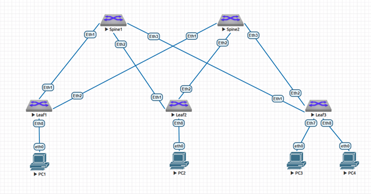

### Построение Underlay сети с использованием протокола динамической маршрутизации OSPF

### Задание:
- 1: Спроектировать и настроить сегмент Underlay сети на базе протокола динамической маршрутизации OSPF

### В среде виртуализации EVE-NG cобрана и настроена топология Underlay сети Spine-Leaf с использованием протокола динамической маршрутизации OSPF на базе L3-коммутаторов Arista с подключенными к ней устройствами "PC" имитирующими потребителей сервиса:

### IP план:
Device|Interface|IP Address|Subnet Mask
---|---|---|---
Spine1|Loopback0|10.52.0.1|/32
-|Ethernet1|10.52.1.0|/31
-|Ethernet2|10.52.1.2|/31
-|Ethernet3|10.52.1.4|/31
Spine2|Loopback0|10.52.0.2|/32
-|Ethernet1|10.52.2.0|/31
-|Ethernet2|10.52.2.2|/31
-|Ethernet3|10.52.2.4|/31
Leaf1|Loopback0|10.52.0.11|/32
-|Ethernet1|10.52.1.1|/31
-|Ethernet2|10.52.2.1|/31
-|Ethernet8|10.52.11.1|/30
Leaf2|Loopback0|10.52.0.12|/32
-|Ethernet1|10.52.1.3|/31
-|Ethernet2|10.52.2.3|/31
-|Ethernet8|10.52.12.1|/30
Leaf3|Loopback0|10.52.0.13|/32
-|Ethernet1|10.52.1.5|/31
-|Ethernet2|10.52.2.5|/31
-|Ethernet8|10.52.12.5|/30
PC1|eth0|10.52.11.2|/30
PC2|eth0|10.52.12.2|/30
PC3|eth0|10.52.13.2|/30
PC4|eth0|10.52.13.6|/30

### Конфигурация оборудования

 Spine1 

Spine1#sh run 
! Command: show running-config 
! device: Spine1 (vEOS-lab, EOS-4.29.2F) 
! 
! boot system flash:/vEOS-lab.swi 
! no aaa root 
! transceiver qsfp default-mode 4x10G 
! service routing protocols model multi-agent 
! hostname Spine1 
! spanning-tree mode mstp 
! interface Ethernet1 
   description to Eth1 Leaf1 
   mtu 9214 
   no switchport 
   ip address 10.52.1.0/31 
   ip ospf network point-to-point 
   ip ospf area 0.0.0.0 
! interface Ethernet2 
   description to Eth1 Leaf2 
   mtu 9214 
   no switchport 
   ip address 10.52.1.2/31 
   ip ospf network point-to-point 
   ip ospf area 0.0.0.0 
! interface Ethernet3 
   description to Eth1 Leaf3 
   mtu 9214 
   no switchport 
   ip address 10.52.1.4/31 
   ip ospf network point-to-point 
   ip ospf area 0.0.0.0 
! interface Ethernet4 
! interface Ethernet5 
! interface Ethernet6 
! interface Ethernet7 
! interface Ethernet8 
! interface Loopback0 
   ip address 10.52.0.1/32 
   ip ospf area 0.0.0.0 
! interface Management1 
! ip routing 
! router ospf 1 
   router-id 10.52.0.1 
   max-lsa 12000 
! end 

 Spine2 

Spine2#sh run 
! Command: show running-config 
! device: Spine2 (vEOS-lab, EOS-4.29.2F) 
! 
! boot system flash:/vEOS-lab.swi 
! no aaa root 
! transceiver qsfp default-mode 4x10G 
! service routing protocols model multi-agent 
! hostname Spine2 
! spanning-tree mode mstp 
! interface Ethernet1 
   description to Eth2 Leaf1 
   mtu 9214 
   no switchport 
   ip address 10.52.2.0/31 
   ip ospf network point-to-point 
   ip ospf area 0.0.0.0 
! interface Ethernet2 
   description to Eth2 Leaf2 
   mtu 9214 
   no switchport 
   ip address 10.52.2.2/31 
   ip ospf network point-to-point 
   ip ospf area 0.0.0.0 
! interface Ethernet3 
   description to Eth2 Leaf3 
   mtu 9214 
   no switchport 
   ip address 10.52.2.4/31 
   ip ospf network point-to-point 
   ip ospf area 0.0.0.0 
! interface Ethernet4 
! interface Ethernet5 
! interface Ethernet6 
! interface Ethernet7 
! interface Ethernet8 
! interface Loopback0 
   ip address 10.52.0.2/32 
   ip ospf area 0.0.0.0 
! interface Management1 
! ip routing 
! router ospf 1 
   router-id 10.52.0.2 
   max-lsa 12000 
! end 

 Leaf1 

Leaf1#sh run 
! Command: show running-config 
! device: Leaf1 (vEOS-lab, EOS-4.29.2F) 
! 
! boot system flash:/vEOS-lab.swi 
! no aaa root 
! transceiver qsfp default-mode 4x10G 
! service routing protocols model multi-agent 
! hostname Leaf1 
! spanning-tree mode mstp 
! interface Ethernet1 
   description to Eth1 Spine1 
   mtu 9214 
   no switchport 
   ip address 10.52.1.1/31 
   ip ospf network point-to-point 
   ip ospf area 0.0.0.0 
! interface Ethernet2 
   description to Eth1 Spine2 
   mtu 9214 
   no switchport 
   ip address 10.52.2.1/31 
   ip ospf network point-to-point 
   ip ospf area 0.0.0.0 
! interface Ethernet3 
! interface Ethernet4 
! interface Ethernet5 
! interface Ethernet6 
! interface Ethernet7 
! interface Ethernet8 
   description to PC1 
   no switchport 
   ip address 10.52.11.1/30 
! interface Loopback0 
   ip address 10.52.0.11/32 
   ip ospf area 0.0.0.0 
! interface Management1 
! ip routing 
! router ospf 1 
   router-id 10.52.0.11 
   redistribute connected 
   max-lsa 12000 
! end 

 Leaf2 

Leaf2#sh run 
! Command: show running-config 
! device: Leaf2 (vEOS-lab, EOS-4.29.2F) 
! 
! boot system flash:/vEOS-lab.swi 
! no aaa root 
! transceiver qsfp default-mode 4x10G 
! service routing protocols model multi-agent 
! hostname Leaf2 
! spanning-tree mode mstp 
! interface Ethernet1 
   description to Eth2 Spine1 
   mtu 9214 
   no switchport 
   ip address 10.52.1.3/31 
   ip ospf network point-to-point 
   ip ospf area 0.0.0.0 
! interface Ethernet2 
   description to Eth2 Spine2 
   mtu 9214 
   no switchport 
   ip address 10.52.2.3/31 
   ip ospf network point-to-point 
   ip ospf area 0.0.0.0 
! interface Ethernet3 
! interface Ethernet4 
! interface Ethernet5 
! interface Ethernet6 
! interface Ethernet7 
! interface Ethernet8 
   description to PC2 
   no switchport 
   ip address 10.52.12.1/30 
! interface Loopback0 
   ip address 10.52.0.12/32 
   ip ospf area 0.0.0.0 
! interface Management1 
! ip routing 
! router ospf 1 
   router-id 10.52.0.12 
   redistribute connected 
   max-lsa 12000 
! end 

 Leaf3 

Leaf3#sh run 
! Command: show running-config 
! device: Leaf3 (vEOS-lab, EOS-4.29.2F) 
! 
! boot system flash:/vEOS-lab.swi 
! no aaa root 
! transceiver qsfp default-mode 4x10G 
! service routing protocols model multi-agent 
! hostname Leaf3 
! spanning-tree mode mstp 
! interface Ethernet1 
   description to Eth3 Spine1 
   mtu 9214 
   no switchport 
   ip address 10.52.1.5/31 
   ip ospf network point-to-point 
   ip ospf area 0.0.0.0 
! interface Ethernet2 
   description to Eth3 Spine2 
   mtu 9214 
   no switchport 
   ip address 10.52.2.5/31 
   ip ospf network point-to-point 
   ip ospf area 0.0.0.0 
! interface Ethernet3 
! interface Ethernet4 
! interface Ethernet5 
! interface Ethernet6 
! interface Ethernet7 
   description to PC3 
   no switchport 
   ip address 10.52.13.1/30 
! interface Ethernet8 
   description to PC4 
   no switchport 
   ip address 10.52.13.5/30 
! interface Loopback0 
   ip address 10.52.0.13/32 
   ip ospf area 0.0.0.0 
! interface Management1 
! ip routing 
! router ospf 1 
   router-id 10.52.0.13 
   redistribute connected 
   max-lsa 12000 
! end 

 PC1 

PC1> sh ip 
 
NAME        : PC1[1] 
IP/MASK     : 10.52.11.2/30 
GATEWAY     : 10.52.11.1 
DNS         : 
MAC         : 00:50:79:66:68:06 
LPORT       : 20000 
RHOST:PORT  : 127.0.0.1:30000 
MTU         : 1500 

 PC2 

PC2> sh ip 
 
NAME        : PC2[1] 
IP/MASK     : 10.52.12.2/30 
GATEWAY     : 10.52.12.1 
DNS         : 
MAC         : 00:50:79:66:68:07 
LPORT       : 20000 
RHOST:PORT  : 127.0.0.1:30000 
MTU         : 1500 

 PC3 

PC3> sh ip 
 
NAME        : PC3[1] 
IP/MASK     : 10.52.13.2/30 
GATEWAY     : 10.52.13.1 
DNS         : 
MAC         : 00:50:79:66:68:08 
LPORT       : 20000 
RHOST:PORT  : 127.0.0.1:30000 
MTU         : 1500 

 PC4 

PC4> sh ip 
 
NAME        : PC4[1] 
IP/MASK     : 10.52.13.6/30 
GATEWAY     : 10.52.13.5 
DNS         : 
MAC         : 00:50:79:66:68:09 
LPORT       : 20000 
RHOST:PORT  : 127.0.0.1:30000 
MTU         : 1500 
