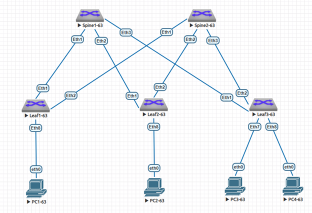

### Построение Underlay сети с использованием протокола динамической маршрутизации ISIS

### Задание:
- 1: Спроектировать и настроить сегмент Underlay сети на базе протокола динамической маршрутизации ISIS

- ### В среде виртуализации EVE-NG cобрана и настроена топология Underlay сети Spine-Leaf с использованием протокола динамической маршрутизации ISIS на базе L3-коммутаторов Arista с подключенными к ним устройствами "PC" имитирующими потребителей сервиса:


### IP план:
Device|Interface|IP Address|Subnet Mask
---|---|---|---
Spine1-63|Loopback0|10.63.0.1|/32
-|Ethernet1|10.63.1.0|/31
-|Ethernet2|10.63.1.2|/31
-|Ethernet3|10.63.1.4|/31
Spine2-63|Loopback0|10.63.0.2|/32
-|Ethernet1|10.63.2.0|/31
-|Ethernet2|10.63.2.2|/31
-|Ethernet3|10.63.2.4|/31
Leaf1-63|Loopback0|10.63.0.11|/32
-|Ethernet1|10.63.1.1|/31
-|Ethernet2|10.63.2.1|/31
-|Ethernet8|10.63.11.1|/30
Leaf2-63|Loopback0|10.63.0.12|/32
-|Ethernet1|10.63.1.3|/31
-|Ethernet2|10.63.2.3|/31
-|Ethernet8|10.63.12.1|/30
Leaf3-63|Loopback0|10.63.0.13|/32
-|Ethernet1|10.63.1.5|/31
-|Ethernet2|10.63.2.5|/31
-|Ethernet8|10.63.12.5|/30
PC1-63|eth0|10.63.11.2|/30
PC2-63|eth0|10.63.12.2|/30
PC3-63|eth0|10.63.13.2|/30
PC4-63|eth0|10.63.13.6|/30
</details>
<details>
<summary> Spine1-63 </summary>

 ```
Spine1-63#sh run
! Command: show running-config
! device: Spine1-63 (vEOS-lab, EOS-4.29.2F)
!
! boot system flash:/vEOS-lab.swi
!
no aaa root
!
transceiver qsfp default-mode 4x10G
!
service routing protocols model ribd
!
hostname Spine1-63
!
spanning-tree mode mstp
!
interface Ethernet1
   description to Eth1 Leaf1-63
   no switchport
   ip address 10.63.1.0/31
   bfd interval 100 min-rx 100 multiplier 3
   isis enable UNDERLAY
   isis network point-to-point
   isis authentication mode text
   isis authentication key 7 WkfPNQfla08=
!
interface Ethernet2
   description to Eth1 Leaf2-63
   no switchport
   ip address 10.63.1.2/31
   bfd interval 100 min-rx 100 multiplier 3
   isis enable UNDERLAY
   isis network point-to-point
   isis authentication mode text
   isis authentication key 7 WkfPNQfla08=
!
interface Ethernet3
   description to Eth1 Leaf3-63
   no switchport
   ip address 10.63.1.4/31
   bfd interval 100 min-rx 100 multiplier 3
   isis enable UNDERLAY
   isis network point-to-point
   isis authentication mode text
   isis authentication key 7 WkfPNQfla08=
!
interface Ethernet4
!
interface Ethernet5
!
interface Ethernet6
!
interface Ethernet7
!
interface Ethernet8
!
interface Loopback0
   ip address 10.63.0.1/32
   isis enable UNDERLAY
!
interface Management1
!
ip routing
!
router isis UNDERLAY
   net 49.0001.0100.6300.0001.00
   router-id ipv4 10.63.0.1
   !
   address-family ipv4 unicast
!
end
```
</details>
<details>
<summary> Spine2-63 </summary>
   
 ```
Spine2-63#sh run
! Command: show running-config
! device: Spine2-63 (vEOS-lab, EOS-4.29.2F)
!
! boot system flash:/vEOS-lab.swi
!
no aaa root
!
transceiver qsfp default-mode 4x10G
!
service routing protocols model ribd
!
hostname Spine2-63
!
spanning-tree mode mstp
!
interface Ethernet1
   description to Eth2 Leaf1-63
   no switchport
   ip address 10.63.2.0/31
   bfd interval 100 min-rx 100 multiplier 3
   isis enable UNDERLAY
   isis network point-to-point
   isis authentication mode text
   isis authentication key 7 WkfPNQfla08=
!
interface Ethernet2
   description to Eth2 Leaf2-63
   no switchport
   ip address 10.63.2.2/31
   bfd interval 100 min-rx 100 multiplier 3
   isis enable UNDERLAY
   isis network point-to-point
   isis authentication mode text
   isis authentication key 7 WkfPNQfla08=
!
interface Ethernet3
   description to Eth2 Leaf3-63
   no switchport
   ip address 10.63.2.4/31
   bfd interval 100 min-rx 100 multiplier 3
   isis enable UNDERLAY
   isis network point-to-point
   isis authentication mode text
   isis authentication key 7 WkfPNQfla08=
!
interface Ethernet4
!
interface Ethernet5
!
interface Ethernet6
!
interface Ethernet7
!
interface Ethernet8
!
interface Loopback0
   ip address 10.63.0.2/32
   isis enable UNDERLAY
!
interface Management1
!
ip routing
!
router isis UNDERLAY
   net 49.0001.0100.6300.0002.00
   router-id ipv4 10.63.0.2
   !
   address-family ipv4 unicast
!
end
```
</details>
<details>
<summary> Leaf1-63 </summary>
   
 ```
Leaf1-63#sh run
! Command: show running-config
! device: Leaf1-63 (vEOS-lab, EOS-4.29.2F)
!
! boot system flash:/vEOS-lab.swi
!
no aaa root
!
transceiver qsfp default-mode 4x10G
!
service routing protocols model ribd
!
hostname Leaf1-63
!
spanning-tree mode mstp
!
interface Ethernet1
   description to Eth1 Spine1-63
   no switchport
   ip address 10.63.1.1/31
   bfd interval 100 min-rx 100 multiplier 3
   isis enable UNDERLAY
   isis network point-to-point
   isis authentication mode text
   isis authentication key 7 WkfPNQfla08=
!
interface Ethernet2
   description to Eth1 Spine2-63
   no switchport
   ip address 10.63.2.1/31
   bfd interval 100 min-rx 100 multiplier 3
   isis enable UNDERLAY
   isis network point-to-point
   isis authentication mode text
   isis authentication key 7 WkfPNQfla08=
!
interface Ethernet3
!
interface Ethernet4
!
interface Ethernet5
!
interface Ethernet6
!
interface Ethernet7
!
interface Ethernet8
   description to PC1-63
   no switchport
   ip address 10.63.11.1/30
!
interface Loopback0
   ip address 10.63.0.11/32
   isis enable UNDERLAY
!
interface Management1
!
ip routing
!
router isis UNDERLAY
   net 49.0001.0100.6300.0011.00
   router-id ipv4 10.63.0.11
   redistribute connected
   !
   address-family ipv4 unicast
!
end
```
</details>
<details>
<summary> Leaf2-63 </summary>
   
 ```
Leaf2-63#sh run
! Command: show running-config
! device: Leaf2-63 (vEOS-lab, EOS-4.29.2F)
!
! boot system flash:/vEOS-lab.swi
!
no aaa root
!
transceiver qsfp default-mode 4x10G
!
service routing protocols model ribd
!
hostname Leaf2-63
!
spanning-tree mode mstp
!
interface Ethernet1
   description to Eth2 Spine1-63
   no switchport
   ip address 10.63.1.3/31
   bfd interval 100 min-rx 100 multiplier 3
   isis enable UNDERLAY
   isis network point-to-point
   isis authentication mode text
   isis authentication key 7 WkfPNQfla08=
!
interface Ethernet2
   description to Eth2 Spine2-63
   no switchport
   ip address 10.63.2.3/31
   bfd interval 100 min-rx 100 multiplier 3
   isis enable UNDERLAY
   isis network point-to-point
   isis authentication mode text
   isis authentication key 7 WkfPNQfla08=
!
interface Ethernet3
!
interface Ethernet4
!
interface Ethernet5
!
interface Ethernet6
!
interface Ethernet7
!
interface Ethernet8
   description to PC2-63
   no switchport
   ip address 10.63.12.1/30
!
interface Loopback0
   ip address 10.63.0.12/32
   isis enable UNDERLAY
!
interface Management1
!
ip routing
!
router isis UNDERLAY
   net 49.0001.0100.6300.0012.00
   router-id ipv4 10.63.0.12
   redistribute connected
   !
   address-family ipv4 unicast
!
end
```
</details>
<details>
<summary> Leaf3-63 </summary>
   
 ```
Leaf3-63#sh run
! Command: show running-config
! device: Leaf3-63 (vEOS-lab, EOS-4.29.2F)
!
! boot system flash:/vEOS-lab.swi
!
no aaa root
!
transceiver qsfp default-mode 4x10G
!
service routing protocols model ribd
!
hostname Leaf3-63
!
spanning-tree mode mstp
!
interface Ethernet1
   description to Eth3 Spine1-63
   no switchport
   ip address 10.63.1.5/31
   bfd interval 100 min-rx 100 multiplier 3
   isis enable UNDERLAY
   isis network point-to-point
   isis authentication mode text
   isis authentication key 7 WkfPNQfla08=
!
interface Ethernet2
   description to Eth3 Spine2-63
   no switchport
   ip address 10.63.2.5/31
   bfd interval 100 min-rx 100 multiplier 3
   isis enable UNDERLAY
   isis network point-to-point
   isis authentication mode text
   isis authentication key 7 WkfPNQfla08=
!
interface Ethernet3
!
interface Ethernet4
!
interface Ethernet5
!
interface Ethernet6
!
interface Ethernet7
   description to PC3-63
   no switchport
   ip address 10.63.13.1/30
!
interface Ethernet8
   description to PC4-63
   no switchport
   ip address 10.63.13.5/30
!
interface Loopback0
   ip address 10.63.0.13/32
   isis enable UNDERLAY
!
interface Management1
!
ip routing
!
router isis UNDERLAY
   net 49.0001.0100.6300.0013.00
   router-id ipv4 10.63.0.13
   redistribute connected
   !
   address-family ipv4 unicast
!
end
```
</details>
<details>
<summary> PC1-63 </summary>
   
 ```
PC1-63> sh ip

NAME        : PC1-63[1]
IP/MASK     : 10.63.11.2/30
GATEWAY     : 10.63.11.1
DNS         :
MAC         : 00:50:79:66:68:0f
LPORT       : 20000
RHOST:PORT  : 127.0.0.1:30000
MTU         : 1500
```
</details>
<details>
<summary> PC2-63 </summary>
   
 ```
PC2-63> sh ip

NAME        : PC2-63[1]
IP/MASK     : 10.63.12.2/30
GATEWAY     : 10.63.12.1
DNS         :
MAC         : 00:50:79:66:68:10
LPORT       : 20000
RHOST:PORT  : 127.0.0.1:30000
MTU         : 1500
```
</details>
<details>
<summary> PC3-63 </summary>
   
 ```
PC3-63> sh ip

NAME        : PC3-63[1]
IP/MASK     : 10.63.13.2/30
GATEWAY     : 10.63.13.1
DNS         :
MAC         : 00:50:79:66:68:11
LPORT       : 20000
RHOST:PORT  : 127.0.0.1:30000
MTU         : 1500
```
</details>
<details>
<summary> PC4-63 </summary>
   
 ```
PC3-63> sh ip

NAME        : PC4-63[1]
IP/MASK     : 10.63.13.6/30
GATEWAY     : 10.63.13.5
DNS         :
MAC         : 00:50:79:66:68:12
LPORT       : 20000
RHOST:PORT  : 127.0.0.1:30000
MTU         : 1500
