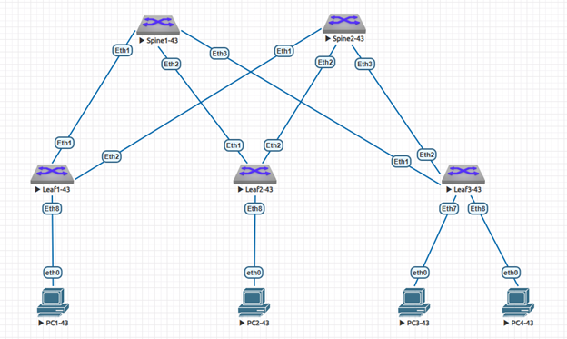

### Построение Underlay сети с использованием протокола динамической маршрутизации eBGP

### Задание:
- 1: Спроектировать и настроить сегмент Underlay сети на базе протокола динамической маршрутизации eBGP

- ### В среде виртуализации EVE-NG cобрана и настроена топология Underlay сети Spine-Leaf с использованием протокола динамической маршрутизации eBGP на базе L3-коммутаторов Arista с подключенными к ним устройствами "PC" имитирующими потребителей сервиса:


### IP план:
Device|Interface|IP Address|Subnet Mask
---|---|---|---
Spine1-43|Loopback0|10.43.0.1|/32
-|Ethernet1|10.43.1.0|/31
-|Ethernet2|10.43.1.2|/31
-|Ethernet3|10.43.1.4|/31
Spine2-43|Loopback0|10.43.0.2|/32
-|Ethernet1|10.43.2.0|/31
-|Ethernet2|10.43.2.2|/31
-|Ethernet3|10.43.2.4|/31
Leaf1-43|Loopback0|10.43.0.11|/32
-|Ethernet1|10.43.1.1|/31
-|Ethernet2|10.43.2.1|/31
-|Ethernet8|10.43.11.1|/30
Leaf2-43|Loopback0|10.43.0.12|/32
-|Ethernet1|10.43.1.3|/31
-|Ethernet2|10.43.2.3|/31
-|Ethernet8|10.43.12.1|/30
Leaf3-43|Loopback0|10.43.0.13|/32
-|Ethernet1|10.43.1.5|/31
-|Ethernet2|10.43.2.5|/31
-|Ethernet7|10.43.13.1|/30
-|Ethernet8|10.43.13.5|/30
PC1-43|eth0|10.43.11.2|/30
PC2-43|eth0|10.43.12.2|/30
PC3-43|eth0|10.43.13.2|/30
PC4-43|eth0|10.43.13.6|/30

### Конфигурация оборудования
</details>
<details>
<summary> Spine1-43 </summary>

 ```
Spine1-43#sh run
! Command: show running-config
! device: Spine1-43 (vEOS-lab, EOS-4.29.2F)
!
! boot system flash:/vEOS-lab.swi
!
no aaa root
!
transceiver qsfp default-mode 4x10G
!
service routing protocols model ribd
!
hostname Spine1-43
!
spanning-tree mode mstp
!
interface Ethernet1
   description to Eth1 Leaf1-43
   mtu 9214
   no switchport
   ip address 10.43.1.0/31
   bfd interval 100 min-rx 100 multiplier 3
!
interface Ethernet2
   description to Eth1 Leaf2-43
   mtu 9214
   no switchport
   ip address 10.43.1.2/31
   bfd interval 100 min-rx 100 multiplier 3
!
interface Ethernet3
   description to Eth1 Leaf3-43
   mtu 9214
   no switchport
   ip address 10.43.1.4/31
   bfd interval 100 min-rx 100 multiplier 3
!
interface Ethernet4
!
interface Ethernet5
!
interface Ethernet6
!
interface Ethernet7
!
interface Ethernet8
!
interface Loopback0
   ip address 10.43.0.1/32
!
interface Management1
!
ip routing
!
router bgp 4200043001
   router-id 10.43.0.1
   maximum-paths 4 ecmp 4
   neighbor 10.43.1.1 remote-as 4200043011
   neighbor 10.43.1.1 description Leaf1-43
   neighbor 10.43.1.1 timers 1 3
   neighbor 10.43.1.3 remote-as 4200043012
   neighbor 10.43.1.3 description Leaf2-43
   neighbor 10.43.1.3 timers 1 3
   neighbor 10.43.1.5 remote-as 4200043013
   neighbor 10.43.1.5 description Leaf3-43
   neighbor 10.43.1.5 timers 1 3
   redistribute connected
!
end
```
</details>
<details>
<summary> Spine2-43 </summary>
   
 ```
Spine2-43#sh run
! Command: show running-config
! device: Spine2-43 (vEOS-lab, EOS-4.29.2F)
!
! boot system flash:/vEOS-lab.swi
!
no aaa root
!
transceiver qsfp default-mode 4x10G
!
service routing protocols model ribd
!
hostname Spine2-43
!
spanning-tree mode mstp
!
interface Ethernet1
   description to Eth2 Leaf1-43
   mtu 9214
   no switchport
   ip address 10.43.2.0/31
   bfd interval 100 min-rx 100 multiplier 3
!
interface Ethernet2
   description to Eth2 Leaf2-43
   mtu 9214
   no switchport
   ip address 10.43.2.2/31
   bfd interval 100 min-rx 100 multiplier 3
!
interface Ethernet3
   description to Eth2 Leaf3-43
   mtu 9214
   no switchport
   ip address 10.43.2.4/31
   bfd interval 100 min-rx 100 multiplier 3
!
interface Ethernet4
!
interface Ethernet5
!
interface Ethernet6
!
interface Ethernet7
!
interface Ethernet8
!
interface Loopback0
   ip address 10.43.0.2/32
!
interface Management1
!
ip routing
!
router bgp 4200043001
   router-id 10.43.0.2
   maximum-paths 4 ecmp 4
   neighbor 10.43.2.1 remote-as 4200043011
   neighbor 10.43.2.1 description Leaf1-43
   neighbor 10.43.2.1 timers 1 3
   neighbor 10.43.2.3 remote-as 4200043012
   neighbor 10.43.2.3 description Leaf2-43
   neighbor 10.43.2.3 timers 1 3
   neighbor 10.43.2.5 remote-as 4200043013
   neighbor 10.43.2.5 description Leaf3-43
   neighbor 10.43.2.5 timers 1 3
   redistribute connected
!
end
```
</details>
<details>
<summary> Leaf1-43 </summary>
   
 ```
Leaf1-43#sh run
! Command: show running-config
! device: Leaf1-43 (vEOS-lab, EOS-4.29.2F)
!
! boot system flash:/vEOS-lab.swi
!
no aaa root
!
transceiver qsfp default-mode 4x10G
!
service routing protocols model ribd
!
hostname Leaf1-43
!
spanning-tree mode mstp
!
interface Ethernet1
   description to Eth1 Spine1-43
   mtu 9214
   no switchport
   ip address 10.43.1.1/31
   bfd interval 100 min-rx 100 multiplier 3
!
interface Ethernet2
   description to Eth1 Spine2-43
   mtu 9214
   no switchport
   ip address 10.43.2.1/31
   bfd interval 100 min-rx 100 multiplier 3
!
interface Ethernet3
!
interface Ethernet4
!
interface Ethernet5
!
interface Ethernet6
!
interface Ethernet7
!
interface Ethernet8
   description to PC1-43
   no switchport
   ip address 10.43.11.1/30
!
interface Loopback0
   ip address 10.43.0.11/32
!
interface Management1
!
ip routing
!
router bgp 4200043011
   router-id 10.43.0.11
   maximum-paths 4 ecmp 4
   neighbor SPINE-43 peer group
   neighbor SPINES-43 peer group
   neighbor SPINES-43 remote-as 4200043001
   neighbor SPINES-43 timers 1 3
   neighbor 10.43.1.0 peer group SPINES-43
   neighbor 10.43.1.0 description Spine1-43
   neighbor 10.43.2.0 peer group SPINES-43
   neighbor 10.43.2.0 description Spine2-43
   redistribute connected
   !
   address-family ipv4
      neighbor SPINE-43 activate
!
end
```
</details>
<details>
<summary> Leaf2-43 </summary>
   
 ```
Leaf2-43#sh run
! Command: show running-config
! device: Leaf2-43 (vEOS-lab, EOS-4.29.2F)
!
! boot system flash:/vEOS-lab.swi
!
no aaa root
!
transceiver qsfp default-mode 4x10G
!
service routing protocols model ribd
!
hostname Leaf2-43
!
spanning-tree mode mstp
!
interface Ethernet1
   description to Eth2 Spine1-43
   mtu 9214
   no switchport
   ip address 10.43.1.3/31
   bfd interval 100 min-rx 100 multiplier 3
!
interface Ethernet2
   description to Eth2 Spine2-43
   mtu 9214
   no switchport
   ip address 10.43.2.3/31
   bfd interval 100 min-rx 100 multiplier 3
!
interface Ethernet3
!
interface Ethernet4
!
interface Ethernet5
!
interface Ethernet6
!
interface Ethernet7
!
interface Ethernet8
   description to PC2-43
   no switchport
   ip address 10.43.12.1/30
!
interface Loopback0
   ip address 10.43.0.12/32
!
interface Management1
!
ip routing
!
router bgp 4200043012
   router-id 10.43.0.12
   maximum-paths 4 ecmp 4
   neighbor SPINE-43 peer group
   neighbor SPINES-43 peer group
   neighbor SPINES-43 remote-as 4200043001
   neighbor SPINES-43 timers 1 3
   neighbor 10.43.1.2 peer group SPINES-43
   neighbor 10.43.1.2 description Spine1-43
   neighbor 10.43.2.2 peer group SPINES-43
   neighbor 10.43.2.2 description Spine2-43
   redistribute connected
   !
   address-family ipv4
      neighbor SPINE-43 activate
!
end
```
</details>
<details>
<summary> Leaf3-43 </summary>
   
 ```
Leaf3-43#sh run
! Command: show running-config
! device: Leaf3-43 (vEOS-lab, EOS-4.29.2F)
!
! boot system flash:/vEOS-lab.swi
!
no aaa root
!
transceiver qsfp default-mode 4x10G
!
service routing protocols model ribd
!
hostname Leaf3-43
!
spanning-tree mode mstp
!
interface Ethernet1
   description to Eth3 Spine1-43
   mtu 9214
   no switchport
   ip address 10.43.1.5/31
   bfd interval 100 min-rx 100 multiplier 3
!
interface Ethernet2
   description to Eth3 Spine2-43
   mtu 9214
   no switchport
   ip address 10.43.2.5/31
   bfd interval 100 min-rx 100 multiplier 3
!
interface Ethernet3
!
interface Ethernet4
!
interface Ethernet5
!
interface Ethernet6
!
interface Ethernet7
   description to PC3-43
   no switchport
   ip address 10.43.13.1/30
!
interface Ethernet8
   description to PC4-43
   no switchport
   ip address 10.43.13.5/30
!
interface Loopback0
   ip address 10.43.0.13/32
!
interface Management1
!
ip routing
!
router bgp 4200043013
   router-id 10.43.0.13
   maximum-paths 4 ecmp 4
   neighbor SPINE-43 peer group
   neighbor SPINES-43 peer group
   neighbor SPINES-43 remote-as 4200043001
   neighbor SPINES-43 timers 1 3
   neighbor 10.43.1.4 peer group SPINES-43
   neighbor 10.43.1.4 description Spine1-43
   neighbor 10.43.2.4 peer group SPINES-43
   neighbor 10.43.2.4 description Spine2-43
   redistribute connected
   !
   address-family ipv4
      neighbor SPINE-43 activate
!
end
```
</details>
<details>
<summary> PC1-43 </summary>
   
 ```
PC1-43> sh ip

NAME        : PC1-43[1]
IP/MASK     : 10.43.11.2/30
GATEWAY     : 10.43.11.1
DNS         :
MAC         : 00:50:79:66:68:18
LPORT       : 20000
RHOST:PORT  : 127.0.0.1:30000
MTU         : 1500
```
</details>
<details>
<summary> PC2-43 </summary>
   
 ```
PC2-43> sh ip

NAME        : PC2-43[1]
IP/MASK     : 10.43.12.2/30
GATEWAY     : 10.43.12.1
DNS         :
MAC         : 00:50:79:66:68:19
LPORT       : 20000
RHOST:PORT  : 127.0.0.1:30000
MTU         : 1500
```
</details>
<details>
<summary> PC3-43 </summary>
   
 ```
PC3-43> sh ip

NAME        : PC3-43[1]
IP/MASK     : 10.43.13.2/30
GATEWAY     : 10.43.13.1
DNS         :
MAC         : 00:50:79:66:68:1a
LPORT       : 20000
RHOST:PORT  : 127.0.0.1:30000
MTU         : 1500
```
</details>
<details>
<summary> PC4-43 </summary>
   
 ```
PC4-43> sh ip

NAME        : PC4-43[1]
IP/MASK     : 10.43.13.6/30
GATEWAY     : 10.43.13.5
DNS         :
MAC         : 00:50:79:66:68:1b
LPORT       : 20000
RHOST:PORT  : 127.0.0.1:30000
MTU         : 1500
```
</details>

#### Диагностика Spine/Leaf

<details>
<summary> Spine1-43 diag </summary>
 
 ```
Spine1-43#sh ip bgp
BGP routing table information for VRF default
Router identifier 10.43.0.1, local AS number 4200043001
Route status codes: * - valid, > - active, # - not installed, E - ECMP head, e - ECMP
                    S - Stale, c - Contributing to ECMP, b - backup, L - labeled-unicast
Origin codes: i - IGP, e - EGP, ? - incomplete
AS Path Attributes: Or-ID - Originator ID, C-LST - Cluster List, LL Nexthop - Link Local Nexthop

         Network                Next Hop            Metric  LocPref Weight  Path
 * >     10.43.0.1/32           -                     0       0       -       i
 * >     10.43.0.11/32          10.43.1.1             0       100     0       4200043011 i
 * >     10.43.0.12/32          10.43.1.3             0       100     0       4200043012 i
 * >     10.43.0.13/32          10.43.1.5             0       100     0       4200043013 i
 * >     10.43.1.0/31           -                     1       0       -       i
 *       10.43.1.0/31           10.43.1.1             0       100     0       4200043011 i
 * >     10.43.1.2/31           -                     1       0       -       i
 *       10.43.1.2/31           10.43.1.3             0       100     0       4200043012 i
 * >     10.43.1.4/31           -                     1       0       -       i
 *       10.43.1.4/31           10.43.1.5             0       100     0       4200043013 i
 * >     10.43.2.0/31           10.43.1.1             0       100     0       4200043011 i
 * >     10.43.2.2/31           10.43.1.3             0       100     0       4200043012 i
 * >     10.43.2.4/31           10.43.1.5             0       100     0       4200043013 i
 * >     10.43.11.0/30          10.43.1.1             0       100     0       4200043011 i
 * >     10.43.12.0/30          10.43.1.3             0       100     0       4200043012 i
 * >     10.43.13.0/30          10.43.1.5             0       100     0       4200043013 i
 * >     10.43.13.4/30          10.43.1.5             0       100     0       4200043013 i

Spine1-43#sh ip bgp sum
BGP summary information for VRF default
Router identifier 10.43.0.1, local AS number 4200043001
Neighbor Status Codes: m - Under maintenance
  Description              Neighbor         V  AS           MsgRcvd   MsgSent  InQ OutQ  Up/Down State   PfxRcd PfxAcc
  Leaf1-43                 10.43.1.1        4  4200043011       293       291    0    0 00:04:44 Estab   4      4
  Leaf2-43                 10.43.1.3        4  4200043012       291       289    0    0 00:04:42 Estab   4      4
  Leaf3-43                 10.43.1.5        4  4200043013       289       287    0    0 00:04:40 Estab   5      5

Spine1-43#sh ip bgp neighbors
BGP neighbor is 10.43.1.1, remote AS 4200043011, external link
  Description: Leaf1-43
  BGP version 4, remote router ID 10.43.0.11, VRF default
  Negotiated BGP version 4
  Member of update group 2
  Last read never, last write 00:00:01
  Hold time is 3, keepalive interval is 1 seconds
  Configured hold time is 3, keepalive interval is 1 seconds
  Connect timer is inactive
  Idle-restart timer is inactive
  BGP state is Established, up for 01:02:30
  Number of transitions to established: 1
  Last state was OpenConfirm
  Last event was RecvKeepAlive
  Neighbor Capabilities:
    Multiprotocol IPv4 Unicast: advertised and received and negotiated
    Four Octet ASN: advertised and received and negotiated
    Route Refresh: advertised and received and negotiated
    Send End-of-RIB messages: advertised and received and negotiated
    Additional-paths recv capability:
      IPv4 Unicast: advertised
    Additional-paths send capability:
      IPv4 Unicast: received
  Restart timer is inactive
  End of rib timer is inactive
  Message Statistics:
    InQ depth is 0
    OutQ depth is 0
                         Sent      Rcvd
    Opens:                  1         1
    Notifications:          0         0
    Updates:                4         6
    Keepalives:          3752      3752
    Route-Refresh:          0         0
    Total messages:      3757      3759
  Prefix Statistics:
                         Sent      Rcvd     Best Paths     Best ECMP Paths
    IPv4 Unicast:          11         4              4                   0
    IPv6 Unicast:           0         0              0                   0
    IPv4 SR-TE:             0         0              0                   0
    IPv6 SR-TE:             0         0              0                   0
  Inbound updates dropped by reason:
    AS path loop detection: 3
    Enforced First AS: 0
    Originator ID matches local router ID: 0
    Nexthop matches local IP address: 0
    Unexpected IPv6 nexthop for IPv4 routes: 0
    Nexthop invalid for single hop eBGP: 0
  Inbound updates with attribute errors:
    Resulting in removal of all paths in update (treat-as-withdraw): 0
    Resulting in AFI/SAFI disable: 0
    Resulting in attribute ignore: 0
  Inbound paths dropped by reason:
    IPv4 labeled-unicast NLRIs dropped due to excessive labels: 0
    IPv6 labeled-unicast NLRIs dropped due to excessive labels: 0
  Outbound paths dropped by reason:
    IPv4 local address not available: 0
    IPv6 local address not available: 0
    Inbound policy
    Outbound policy
Local AS is 4200043001, local router ID 10.43.0.1
TTL is 1
Local TCP address is 10.43.1.0, local port is 44557
Remote TCP address is 10.43.1.1, remote port is 179
Auto-Local-Addr is disabled
Private AS numbers removed from outbound updates to this neighbor if only private AS numbers are present
TCP Socket Information:
  TCP state is ESTABLISHED
  Recv-Q: 0/32768
  Send-Q: 0/32768
  Outgoing Maximum Segment Size (MSS): 9162
  Total Number of TCP retransmissions: 0
  Options:
    Timestamps enabled: yes
    Selective Acknowledgments enabled: yes
    Window Scale enabled: yes
    Explicit Congestion Notification (ECN) enabled: no
  Socket Statistics:
    Window Scale (wscale): 7,7
    Retransmission Timeout (rto): 216.0ms
    Round-trip Time (rtt/rtvar): 13.7ms/2.7ms
    Delayed Ack Timeout (ato): 40.0ms
    Congestion Window (cwnd): 10
    TCP Throughput: 53.36 Mbps
    Recv Round-trip Time (rcv_rtt): 142782.2ms
    Advertised Recv Window (rcv_space): 64327


BGP neighbor is 10.43.1.3, remote AS 4200043012, external link
  Description: Leaf2-43
  BGP version 4, remote router ID 10.43.0.12, VRF default
  Negotiated BGP version 4
  Member of update group 2
  Last read never, last write never
  Hold time is 3, keepalive interval is 1 seconds
  Configured hold time is 3, keepalive interval is 1 seconds
  Connect timer is inactive
  Idle-restart timer is inactive
  BGP state is Established, up for 01:02:28
  Number of transitions to established: 1
  Last state was OpenConfirm
  Last event was RecvKeepAlive
  Neighbor Capabilities:
    Multiprotocol IPv4 Unicast: advertised and received and negotiated
    Four Octet ASN: advertised and received and negotiated
    Route Refresh: advertised and received and negotiated
    Send End-of-RIB messages: advertised and received and negotiated
    Additional-paths recv capability:
      IPv4 Unicast: advertised
    Additional-paths send capability:
      IPv4 Unicast: received
  Restart timer is inactive
  End of rib timer is inactive
  Message Statistics:
    InQ depth is 0
    OutQ depth is 0
                         Sent      Rcvd
    Opens:                  1         1
    Notifications:          0         0
    Updates:                4         6
    Keepalives:          3750      3750
    Route-Refresh:          0         0
    Total messages:      3755      3757
  Prefix Statistics:
                         Sent      Rcvd     Best Paths     Best ECMP Paths
    IPv4 Unicast:          11         4              4                   0
    IPv6 Unicast:           0         0              0                   0
    IPv4 SR-TE:             0         0              0                   0
    IPv6 SR-TE:             0         0              0                   0
  Inbound updates dropped by reason:
    AS path loop detection: 3
    Enforced First AS: 0
    Originator ID matches local router ID: 0
    Nexthop matches local IP address: 0
    Unexpected IPv6 nexthop for IPv4 routes: 0
    Nexthop invalid for single hop eBGP: 0
  Inbound updates with attribute errors:
    Resulting in removal of all paths in update (treat-as-withdraw): 0
    Resulting in AFI/SAFI disable: 0
    Resulting in attribute ignore: 0
  Inbound paths dropped by reason:
    IPv4 labeled-unicast NLRIs dropped due to excessive labels: 0
    IPv6 labeled-unicast NLRIs dropped due to excessive labels: 0
  Outbound paths dropped by reason:
    IPv4 local address not available: 0
    IPv6 local address not available: 0
    Inbound policy
    Outbound policy
Local AS is 4200043001, local router ID 10.43.0.1
TTL is 1
Local TCP address is 10.43.1.2, local port is 36607
Remote TCP address is 10.43.1.3, remote port is 179
Auto-Local-Addr is disabled
Private AS numbers removed from outbound updates to this neighbor if only private AS numbers are present
TCP Socket Information:
  TCP state is ESTABLISHED
  Recv-Q: 0/32768
  Send-Q: 0/32768
  Outgoing Maximum Segment Size (MSS): 9162
  Total Number of TCP retransmissions: 0
  Options:
    Timestamps enabled: yes
    Selective Acknowledgments enabled: yes
    Window Scale enabled: yes
    Explicit Congestion Notification (ECN) enabled: no
  Socket Statistics:
    Window Scale (wscale): 7,7
    Retransmission Timeout (rto): 216.0ms
    Round-trip Time (rtt/rtvar): 12.4ms/1.7ms
    Delayed Ack Timeout (ato): 40.0ms
    Congestion Window (cwnd): 10
    TCP Throughput: 59.13 Mbps
    Recv Round-trip Time (rcv_rtt): 142774.4ms
    Advertised Recv Window (rcv_space): 64327


BGP neighbor is 10.43.1.5, remote AS 4200043013, external link
  Description: Leaf3-43
  BGP version 4, remote router ID 10.43.0.13, VRF default
  Negotiated BGP version 4
  Member of update group 2
  Last read never, last write never
  Hold time is 3, keepalive interval is 1 seconds
  Configured hold time is 3, keepalive interval is 1 seconds
  Connect timer is inactive
  Idle-restart timer is inactive
  BGP state is Established, up for 01:02:26
  Number of transitions to established: 1
  Last state was OpenConfirm
  Last event was RecvKeepAlive
  Neighbor Capabilities:
    Multiprotocol IPv4 Unicast: advertised and received and negotiated
    Four Octet ASN: advertised and received and negotiated
    Route Refresh: advertised and received and negotiated
    Send End-of-RIB messages: advertised and received and negotiated
    Additional-paths recv capability:
      IPv4 Unicast: advertised
    Additional-paths send capability:
      IPv4 Unicast: received
  Restart timer is inactive
  End of rib timer is inactive
  Message Statistics:
    InQ depth is 0
    OutQ depth is 0
                         Sent      Rcvd
    Opens:                  1         1
    Notifications:          0         0
    Updates:                4         6
    Keepalives:          3748      3748
    Route-Refresh:          0         0
    Total messages:      3753      3755
  Prefix Statistics:
                         Sent      Rcvd     Best Paths     Best ECMP Paths
    IPv4 Unicast:          10         5              5                   0
    IPv6 Unicast:           0         0              0                   0
    IPv4 SR-TE:             0         0              0                   0
    IPv6 SR-TE:             0         0              0                   0
  Inbound updates dropped by reason:
    AS path loop detection: 3
    Enforced First AS: 0
    Originator ID matches local router ID: 0
    Nexthop matches local IP address: 0
    Unexpected IPv6 nexthop for IPv4 routes: 0
    Nexthop invalid for single hop eBGP: 0
  Inbound updates with attribute errors:
    Resulting in removal of all paths in update (treat-as-withdraw): 0
    Resulting in AFI/SAFI disable: 0
    Resulting in attribute ignore: 0
  Inbound paths dropped by reason:
    IPv4 labeled-unicast NLRIs dropped due to excessive labels: 0
    IPv6 labeled-unicast NLRIs dropped due to excessive labels: 0
  Outbound paths dropped by reason:
    IPv4 local address not available: 0
    IPv6 local address not available: 0
    Inbound policy
    Outbound policy
Local AS is 4200043001, local router ID 10.43.0.1
TTL is 1
Local TCP address is 10.43.1.4, local port is 37783
Remote TCP address is 10.43.1.5, remote port is 179
Auto-Local-Addr is disabled
Private AS numbers removed from outbound updates to this neighbor if only private AS numbers are present
TCP Socket Information:
  TCP state is ESTABLISHED
  Recv-Q: 0/32768
  Send-Q: 0/32768
  Outgoing Maximum Segment Size (MSS): 9162
  Total Number of TCP retransmissions: 0
  Options:
    Timestamps enabled: yes
    Selective Acknowledgments enabled: yes
    Window Scale enabled: yes
    Explicit Congestion Notification (ECN) enabled: no
  Socket Statistics:
    Window Scale (wscale): 7,7
    Retransmission Timeout (rto): 216.0ms
    Round-trip Time (rtt/rtvar): 15.6ms/5.3ms
    Delayed Ack Timeout (ato): 40.0ms
    Congestion Window (cwnd): 10
    TCP Throughput: 46.88 Mbps
    Recv Round-trip Time (rcv_rtt): 142778.3ms
    Advertised Recv Window (rcv_space): 64327
```
</details>
<details>
<summary> Spine2-43 diag </summary>
 
 ```
Spine2-43#sh ip bgp
BGP routing table information for VRF default
Router identifier 10.43.0.2, local AS number 4200043001
Route status codes: * - valid, > - active, # - not installed, E - ECMP head, e - ECMP
                    S - Stale, c - Contributing to ECMP, b - backup, L - labeled-unicast
Origin codes: i - IGP, e - EGP, ? - incomplete
AS Path Attributes: Or-ID - Originator ID, C-LST - Cluster List, LL Nexthop - Link Local Nexthop

         Network                Next Hop            Metric  LocPref Weight  Path
 * >     10.43.0.2/32           -                     0       0       -       i
 * >     10.43.0.11/32          10.43.2.1             0       100     0       4200043011 i
 * >     10.43.0.12/32          10.43.2.3             0       100     0       4200043012 i
 * >     10.43.0.13/32          10.43.2.5             0       100     0       4200043013 i
 * >     10.43.1.0/31           10.43.2.1             0       100     0       4200043011 i
 * >     10.43.1.2/31           10.43.2.3             0       100     0       4200043012 i
 * >     10.43.1.4/31           10.43.2.5             0       100     0       4200043013 i
 * >     10.43.2.0/31           -                     1       0       -       i
 *       10.43.2.0/31           10.43.2.1             0       100     0       4200043011 i
 * >     10.43.2.2/31           -                     1       0       -       i
 *       10.43.2.2/31           10.43.2.3             0       100     0       4200043012 i
 * >     10.43.2.4/31           -                     1       0       -       i
 *       10.43.2.4/31           10.43.2.5             0       100     0       4200043013 i
 * >     10.43.11.0/30          10.43.2.1             0       100     0       4200043011 i
 * >     10.43.12.0/30          10.43.2.3             0       100     0       4200043012 i
 * >     10.43.13.0/30          10.43.2.5             0       100     0       4200043013 i
 * >     10.43.13.4/30          10.43.2.5             0       100     0       4200043013 i

Spine2-43#sh ip bgp sum
BGP summary information for VRF default
Router identifier 10.43.0.2, local AS number 4200043001
Neighbor Status Codes: m - Under maintenance
  Description              Neighbor         V  AS           MsgRcvd   MsgSent  InQ OutQ  Up/Down State   PfxRcd PfxAcc
  Leaf1-43                 10.43.2.1        4  4200043011      2388      2389    0    0 00:39:38 Estab   4      4
  Leaf2-43                 10.43.2.3        4  4200043012      1783      1777    0    0 00:29:31 Estab   4      4
  Leaf3-43                 10.43.2.5        4  4200043013      1784      1777    0    0 00:29:30 Estab   5      5

Spine2-43#sh ip bgp nei
BGP neighbor is 10.43.2.1, remote AS 4200043011, external link
  Description: Leaf1-43
  BGP version 4, remote router ID 10.43.0.11, VRF default
  Negotiated BGP version 4
  Member of update group 2
  Last read never, last write never
  Hold time is 3, keepalive interval is 1 seconds
  Configured hold time is 3, keepalive interval is 1 seconds
  Connect timer is inactive
  Idle-restart timer is inactive
  BGP state is Established, up for 01:39:07
  Number of transitions to established: 1
  Last state was OpenConfirm
  Last event was RecvKeepAlive
  Neighbor Capabilities:
    Multiprotocol IPv4 Unicast: advertised and received and negotiated
    Four Octet ASN: advertised and received and negotiated
    Route Refresh: advertised and received and negotiated
    Send End-of-RIB messages: advertised and received and negotiated
    Additional-paths recv capability:
      IPv4 Unicast: advertised
    Additional-paths send capability:
      IPv4 Unicast: received
  Restart timer is inactive
  End of rib timer is inactive
  Message Statistics:
    InQ depth is 0
    OutQ depth is 0
                         Sent      Rcvd
    Opens:                  1         1
    Notifications:          0         0
    Updates:                8         9
    Keepalives:          5949      5948
    Route-Refresh:          0         0
    Total messages:      5958      5958
  Prefix Statistics:
                         Sent      Rcvd     Best Paths     Best ECMP Paths
    IPv4 Unicast:          11         4              4                   0
    IPv6 Unicast:           0         0              0                   0
    IPv4 SR-TE:             0         0              0                   0
    IPv6 SR-TE:             0         0              0                   0
  Inbound updates dropped by reason:
    AS path loop detection: 4
    Enforced First AS: 0
    Originator ID matches local router ID: 0
    Nexthop matches local IP address: 0
    Unexpected IPv6 nexthop for IPv4 routes: 0
    Nexthop invalid for single hop eBGP: 0
  Inbound updates with attribute errors:
    Resulting in removal of all paths in update (treat-as-withdraw): 0
    Resulting in AFI/SAFI disable: 0
    Resulting in attribute ignore: 0
  Inbound paths dropped by reason:
    IPv4 labeled-unicast NLRIs dropped due to excessive labels: 0
    IPv6 labeled-unicast NLRIs dropped due to excessive labels: 0
  Outbound paths dropped by reason:
    IPv4 local address not available: 0
    IPv6 local address not available: 0
    Inbound policy
    Outbound policy
Local AS is 4200043001, local router ID 10.43.0.2
TTL is 1
Local TCP address is 10.43.2.0, local port is 45947
Remote TCP address is 10.43.2.1, remote port is 179
Auto-Local-Addr is disabled
Private AS numbers removed from outbound updates to this neighbor if only private AS numbers are present
TCP Socket Information:
  TCP state is ESTABLISHED
  Recv-Q: 0/32768
  Send-Q: 0/32768
  Outgoing Maximum Segment Size (MSS): 9162
  Total Number of TCP retransmissions: 0
  Options:
    Timestamps enabled: yes
    Selective Acknowledgments enabled: yes
    Window Scale enabled: yes
    Explicit Congestion Notification (ECN) enabled: no
  Socket Statistics:
    Window Scale (wscale): 7,7
    Retransmission Timeout (rto): 216.0ms
    Round-trip Time (rtt/rtvar): 16.0ms/4.9ms
    Delayed Ack Timeout (ato): 40.0ms
    Congestion Window (cwnd): 10
    TCP Throughput: 45.91 Mbps
    Recv Round-trip Time (rcv_rtt): 135774.9ms
    Advertised Recv Window (rcv_space): 64323


BGP neighbor is 10.43.2.3, remote AS 4200043012, external link
  Description: Leaf2-43
  BGP version 4, remote router ID 10.43.0.12, VRF default
  Negotiated BGP version 4
  Member of update group 2
  Last read 00:00:01, last write 00:00:01
  Hold time is 3, keepalive interval is 1 seconds
  Configured hold time is 3, keepalive interval is 1 seconds
  Connect timer is inactive
  Idle-restart timer is inactive
  BGP state is Established, up for 01:29:00
  Number of transitions to established: 1
  Last state was OpenConfirm
  Last event was RecvKeepAlive
  Neighbor Capabilities:
    Multiprotocol IPv4 Unicast: advertised and received and negotiated
    Four Octet ASN: advertised and received and negotiated
    Route Refresh: advertised and received and negotiated
    Send End-of-RIB messages: advertised and received and negotiated
    Additional-paths recv capability:
      IPv4 Unicast: advertised
    Additional-paths send capability:
      IPv4 Unicast: received
  Restart timer is inactive
  End of rib timer is inactive
  Message Statistics:
    InQ depth is 0
    OutQ depth is 0
                         Sent      Rcvd
    Opens:                  1         1
    Notifications:          0         0
    Updates:                4        10
    Keepalives:          5341      5341
    Route-Refresh:          0         0
    Total messages:      5346      5352
  Prefix Statistics:
                         Sent      Rcvd     Best Paths     Best ECMP Paths
    IPv4 Unicast:          11         4              4                   0
    IPv6 Unicast:           0         0              0                   0
    IPv4 SR-TE:             0         0              0                   0
    IPv6 SR-TE:             0         0              0                   0
  Inbound updates dropped by reason:
    AS path loop detection: 4
    Enforced First AS: 0
    Originator ID matches local router ID: 0
    Nexthop matches local IP address: 0
    Unexpected IPv6 nexthop for IPv4 routes: 0
    Nexthop invalid for single hop eBGP: 0
  Inbound updates with attribute errors:
    Resulting in removal of all paths in update (treat-as-withdraw): 0
    Resulting in AFI/SAFI disable: 0
    Resulting in attribute ignore: 0
  Inbound paths dropped by reason:
    IPv4 labeled-unicast NLRIs dropped due to excessive labels: 0
    IPv6 labeled-unicast NLRIs dropped due to excessive labels: 0
  Outbound paths dropped by reason:
    IPv4 local address not available: 0
    IPv6 local address not available: 0
    Inbound policy
    Outbound policy
Local AS is 4200043001, local router ID 10.43.0.2
TTL is 1
Local TCP address is 10.43.2.2, local port is 39277
Remote TCP address is 10.43.2.3, remote port is 179
Auto-Local-Addr is disabled
Private AS numbers removed from outbound updates to this neighbor if only private AS numbers are present
TCP Socket Information:
  TCP state is ESTABLISHED
  Recv-Q: 0/32768
  Send-Q: 0/32768
  Outgoing Maximum Segment Size (MSS): 9162
  Total Number of TCP retransmissions: 0
  Options:
    Timestamps enabled: yes
    Selective Acknowledgments enabled: yes
    Window Scale enabled: yes
    Explicit Congestion Notification (ECN) enabled: no
  Socket Statistics:
    Window Scale (wscale): 7,7
    Retransmission Timeout (rto): 232.0ms
    Round-trip Time (rtt/rtvar): 29.8ms/24.7ms
    Delayed Ack Timeout (ato): 40.0ms
    Congestion Window (cwnd): 10
    TCP Throughput: 24.63 Mbps
    Recv Round-trip Time (rcv_rtt): 133754.6ms
    Advertised Recv Window (rcv_space): 64327


BGP neighbor is 10.43.2.5, remote AS 4200043013, external link
  Description: Leaf3-43
  BGP version 4, remote router ID 10.43.0.13, VRF default
  Negotiated BGP version 4
  Member of update group 2
  Last read never, last write never
  Hold time is 3, keepalive interval is 1 seconds
  Configured hold time is 3, keepalive interval is 1 seconds
  Connect timer is inactive
  Idle-restart timer is inactive
  BGP state is Established, up for 01:28:59
  Number of transitions to established: 1
  Last state was OpenConfirm
  Last event was RecvKeepAlive
  Neighbor Capabilities:
    Multiprotocol IPv4 Unicast: advertised and received and negotiated
    Four Octet ASN: advertised and received and negotiated
    Route Refresh: advertised and received and negotiated
    Send End-of-RIB messages: advertised and received and negotiated
    Additional-paths recv capability:
      IPv4 Unicast: advertised
    Additional-paths send capability:
      IPv4 Unicast: received
  Restart timer is inactive
  End of rib timer is inactive
  Message Statistics:
    InQ depth is 0
    OutQ depth is 0
                         Sent      Rcvd
    Opens:                  1         1
    Notifications:          0         0
    Updates:                4        11
    Keepalives:          5341      5341
    Route-Refresh:          0         0
    Total messages:      5346      5353
  Prefix Statistics:
                         Sent      Rcvd     Best Paths     Best ECMP Paths
    IPv4 Unicast:          10         5              5                   0
    IPv6 Unicast:           0         0              0                   0
    IPv4 SR-TE:             0         0              0                   0
    IPv6 SR-TE:             0         0              0                   0
  Inbound updates dropped by reason:
    AS path loop detection: 4
    Enforced First AS: 0
    Originator ID matches local router ID: 0
    Nexthop matches local IP address: 0
    Unexpected IPv6 nexthop for IPv4 routes: 0
    Nexthop invalid for single hop eBGP: 0
  Inbound updates with attribute errors:
    Resulting in removal of all paths in update (treat-as-withdraw): 0
    Resulting in AFI/SAFI disable: 0
    Resulting in attribute ignore: 0
  Inbound paths dropped by reason:
    IPv4 labeled-unicast NLRIs dropped due to excessive labels: 0
    IPv6 labeled-unicast NLRIs dropped due to excessive labels: 0
  Outbound paths dropped by reason:
    IPv4 local address not available: 0
    IPv6 local address not available: 0
    Inbound policy
    Outbound policy
Local AS is 4200043001, local router ID 10.43.0.2
TTL is 1
Local TCP address is 10.43.2.4, local port is 179
Remote TCP address is 10.43.2.5, remote port is 39365
Auto-Local-Addr is disabled
Private AS numbers removed from outbound updates to this neighbor if only private AS numbers are present
TCP Socket Information:
  TCP state is ESTABLISHED
  Recv-Q: 0/32768
  Send-Q: 0/32768
  Outgoing Maximum Segment Size (MSS): 9162
  Total Number of TCP retransmissions: 0
  Options:
    Timestamps enabled: yes
    Selective Acknowledgments enabled: yes
    Window Scale enabled: yes
    Explicit Congestion Notification (ECN) enabled: no
  Socket Statistics:
    Window Scale (wscale): 7,7
    Retransmission Timeout (rto): 236.0ms
    Round-trip Time (rtt/rtvar): 32.2ms/14.9ms
    Delayed Ack Timeout (ato): 40.0ms
    Congestion Window (cwnd): 10
    TCP Throughput: 22.73 Mbps
    Recv Round-trip Time (rcv_rtt): 125798.3ms
    Advertised Recv Window (rcv_space): 64193
```
</details>
<details>
<summary> Leaf1-43 diag </summary>
 
 ```
Leaf1-43#sh ip bgp
BGP routing table information for VRF default
Router identifier 10.43.0.11, local AS number 4200043011
Route status codes: * - valid, > - active, # - not installed, E - ECMP head, e - ECMP
                    S - Stale, c - Contributing to ECMP, b - backup, L - labeled-unicast
Origin codes: i - IGP, e - EGP, ? - incomplete
AS Path Attributes: Or-ID - Originator ID, C-LST - Cluster List, LL Nexthop - Link Local Nexthop

         Network                Next Hop            Metric  LocPref Weight  Path
 * >     10.43.0.1/32           10.43.1.0             0       100     0       4200043001 i
 * >     10.43.0.2/32           10.43.2.0             0       100     0       4200043001 i
 * >     10.43.0.11/32          -                     0       0       -       i
 * >Ec   10.43.0.12/32          10.43.2.0             0       100     0       4200043001 4200043012 i
 *  ec   10.43.0.12/32          10.43.1.0             0       100     0       4200043001 4200043012 i
 * >Ec   10.43.0.13/32          10.43.2.0             0       100     0       4200043001 4200043013 i
 *  ec   10.43.0.13/32          10.43.1.0             0       100     0       4200043001 4200043013 i
 * >     10.43.1.0/31           -                     1       0       -       i
 *       10.43.1.0/31           10.43.1.0             0       100     0       4200043001 i
 * >     10.43.1.2/31           10.43.1.0             0       100     0       4200043001 i
 *       10.43.1.2/31           10.43.2.0             0       100     0       4200043001 4200043012 i
 * >     10.43.1.4/31           10.43.1.0             0       100     0       4200043001 i
 *       10.43.1.4/31           10.43.2.0             0       100     0       4200043001 4200043013 i
 * >     10.43.2.0/31           -                     1       0       -       i
 *       10.43.2.0/31           10.43.2.0             0       100     0       4200043001 i
 * >     10.43.2.2/31           10.43.2.0             0       100     0       4200043001 i
 *       10.43.2.2/31           10.43.1.0             0       100     0       4200043001 4200043012 i
 * >     10.43.2.4/31           10.43.2.0             0       100     0       4200043001 i
 *       10.43.2.4/31           10.43.1.0             0       100     0       4200043001 4200043013 i
 * >     10.43.11.0/30          -                     1       0       -       i
 * >Ec   10.43.12.0/30          10.43.2.0             0       100     0       4200043001 4200043012 i
 *  ec   10.43.12.0/30          10.43.1.0             0       100     0       4200043001 4200043012 i
 * >Ec   10.43.13.0/30          10.43.2.0             0       100     0       4200043001 4200043013 i
 *  ec   10.43.13.0/30          10.43.1.0             0       100     0       4200043001 4200043013 i
 * >Ec   10.43.13.4/30          10.43.2.0             0       100     0       4200043001 4200043013 i
 *  ec   10.43.13.4/30          10.43.1.0             0       100     0       4200043001 4200043013 i

Leaf1-43#sh ip bgp sum
BGP summary information for VRF default
Router identifier 10.43.0.11, local AS number 4200043011
Neighbor Status Codes: m - Under maintenance
  Description              Neighbor         V  AS           MsgRcvd   MsgSent  InQ OutQ  Up/Down State   PfxRcd PfxAcc
  Spine1-43                10.43.1.0        4  4200043001     11441     11445    0    0 00:07:34 Estab   11     11
  Spine2-43                10.43.2.0        4  4200043001     11558     11558    0    0 00:40:46 Estab   11     11

Leaf1-43#sh ip bgp nei
BGP neighbor is 10.43.1.0, remote AS 4200043001, external link
  Description: Spine1-43
  BGP version 4, remote router ID 10.43.0.1, VRF default
  Inherits configuration from and member of peer-group SPINES-43
  Negotiated BGP version 4
  Member of update group 2
  Last read 00:00:01, last write 00:00:01
  Hold time is 3, keepalive interval is 1 seconds
  Configured hold time is 3, keepalive interval is 1 seconds
  Connect timer is inactive
  Idle-restart timer is inactive
  BGP state is Established, up for 01:06:41
  Number of transitions to established: 2
  Last state was OpenConfirm
  Last event was RecvKeepAlive
  Last rcvd notification:Cease/peer de-configured, Last time 01:08:37
  Neighbor Capabilities:
    Multiprotocol IPv4 Unicast: advertised and received and negotiated
    Four Octet ASN: advertised and received and negotiated
    Route Refresh: advertised and received and negotiated
    Send End-of-RIB messages: advertised and received and negotiated
    Additional-paths recv capability:
      IPv4 Unicast: advertised
    Additional-paths send capability:
      IPv4 Unicast: received
  Restart timer is inactive
  End of rib timer is inactive
  Message Statistics:
    InQ depth is 0
    OutQ depth is 0
                         Sent      Rcvd
    Opens:                  2         2
    Notifications:          0         1
    Updates:               12         8
    Keepalives:         14977     14977
    Route-Refresh:          0         0
    Total messages:     14991     14988
  Prefix Statistics:
                         Sent      Rcvd     Best Paths     Best ECMP Paths
    IPv4 Unicast:          12        11              4                   5
    IPv6 Unicast:           0         0              0                   0
    IPv4 SR-TE:             0         0              0                   0
    IPv6 SR-TE:             0         0              0                   0
  Inbound updates dropped by reason:
    AS path loop detection: 0
    Enforced First AS: 0
    Originator ID matches local router ID: 0
    Nexthop matches local IP address: 0
    Unexpected IPv6 nexthop for IPv4 routes: 0
    Nexthop invalid for single hop eBGP: 0
  Inbound updates with attribute errors:
    Resulting in removal of all paths in update (treat-as-withdraw): 0
    Resulting in AFI/SAFI disable: 0
    Resulting in attribute ignore: 0
  Inbound paths dropped by reason:
    IPv4 labeled-unicast NLRIs dropped due to excessive labels: 0
    IPv6 labeled-unicast NLRIs dropped due to excessive labels: 0
  Outbound paths dropped by reason:
    IPv4 local address not available: 0
    IPv6 local address not available: 0
    Inbound policy
    Outbound policy
Local AS is 4200043011, local router ID 10.43.0.11
TTL is 1
Local TCP address is 10.43.1.1, local port is 179
Remote TCP address is 10.43.1.0, remote port is 44557
Auto-Local-Addr is disabled
Private AS numbers removed from outbound updates to this neighbor if only private AS numbers are present
TCP Socket Information:
  TCP state is ESTABLISHED
  Recv-Q: 0/32768
  Send-Q: 0/32768
  Outgoing Maximum Segment Size (MSS): 9162
  Total Number of TCP retransmissions: 0
  Options:
    Timestamps enabled: yes
    Selective Acknowledgments enabled: yes
    Window Scale enabled: yes
    Explicit Congestion Notification (ECN) enabled: no
  Socket Statistics:
    Window Scale (wscale): 7,7
    Retransmission Timeout (rto): 220.0ms
    Round-trip Time (rtt/rtvar): 16.8ms/8.4ms
    Delayed Ack Timeout (ato): 40.0ms
    Congestion Window (cwnd): 10
    TCP Throughput: 43.72 Mbps
    Recv Round-trip Time (rcv_rtt): 141802.9ms
    Advertised Recv Window (rcv_space): 64205


BGP neighbor is 10.43.2.0, remote AS 4200043001, external link
  Description: Spine2-43
  BGP version 4, remote router ID 10.43.0.2, VRF default
  Inherits configuration from and member of peer-group SPINES-43
  Negotiated BGP version 4
  Member of update group 2
  Last read never, last write 00:00:01
  Hold time is 3, keepalive interval is 1 seconds
  Configured hold time is 3, keepalive interval is 1 seconds
  Connect timer is inactive
  Idle-restart timer is inactive
  BGP state is Established, up for 01:39:53
  Number of transitions to established: 2
  Last state was OpenConfirm
  Last event was RecvKeepAlive
  Last rcvd notification:Cease/peer de-configured, Last time 01:39:54
  Neighbor Capabilities:
    Multiprotocol IPv4 Unicast: advertised and received and negotiated
    Four Octet ASN: advertised and received and negotiated
    Route Refresh: advertised and received and negotiated
    Send End-of-RIB messages: advertised and received and negotiated
    Additional-paths recv capability:
      IPv4 Unicast: advertised
    Additional-paths send capability:
      IPv4 Unicast: received
  Restart timer is inactive
  End of rib timer is inactive
  Message Statistics:
    InQ depth is 0
    OutQ depth is 0
                         Sent      Rcvd
    Opens:                  2         2
    Notifications:          0         1
    Updates:               14        12
    Keepalives:         15089     15090
    Route-Refresh:          0         0
    Total messages:     15105     15105
  Prefix Statistics:
                         Sent      Rcvd     Best Paths     Best ECMP Paths
    IPv4 Unicast:           7        11              9                   5
    IPv6 Unicast:           0         0              0                   0
    IPv4 SR-TE:             0         0              0                   0
    IPv6 SR-TE:             0         0              0                   0
  Inbound updates dropped by reason:
    AS path loop detection: 0
    Enforced First AS: 0
    Originator ID matches local router ID: 0
    Nexthop matches local IP address: 0
    Unexpected IPv6 nexthop for IPv4 routes: 0
    Nexthop invalid for single hop eBGP: 0
  Inbound updates with attribute errors:
    Resulting in removal of all paths in update (treat-as-withdraw): 0
    Resulting in AFI/SAFI disable: 0
    Resulting in attribute ignore: 0
  Inbound paths dropped by reason:
    IPv4 labeled-unicast NLRIs dropped due to excessive labels: 0
    IPv6 labeled-unicast NLRIs dropped due to excessive labels: 0
  Outbound paths dropped by reason:
    IPv4 local address not available: 0
    IPv6 local address not available: 0
    Inbound policy
    Outbound policy
Local AS is 4200043011, local router ID 10.43.0.11
TTL is 1
Local TCP address is 10.43.2.1, local port is 179
Remote TCP address is 10.43.2.0, remote port is 45947
Auto-Local-Addr is disabled
Private AS numbers removed from outbound updates to this neighbor if only private AS numbers are present
TCP Socket Information:
  TCP state is ESTABLISHED
  Recv-Q: 0/32768
  Send-Q: 0/32768
  Outgoing Maximum Segment Size (MSS): 9162
  Total Number of TCP retransmissions: 0
  Options:
    Timestamps enabled: yes
    Selective Acknowledgments enabled: yes
    Window Scale enabled: yes
    Explicit Congestion Notification (ECN) enabled: no
  Socket Statistics:
    Window Scale (wscale): 7,7
    Retransmission Timeout (rto): 224.0ms
    Round-trip Time (rtt/rtvar): 23.1ms/16.1ms
    Delayed Ack Timeout (ato): 40.0ms
    Congestion Window (cwnd): 10
    TCP Throughput: 31.78 Mbps
    Recv Round-trip Time (rcv_rtt): 130794.9ms
    Advertised Recv Window (rcv_space): 64206
```
</details>
<details>
<summary> Leaf2-43 diag </summary>
 
 ```
Leaf2-43#sh ip bgp
BGP routing table information for VRF default
Router identifier 10.43.0.12, local AS number 4200043012
Route status codes: * - valid, > - active, # - not installed, E - ECMP head, e - ECMP
                    S - Stale, c - Contributing to ECMP, b - backup, L - labeled-unicast
Origin codes: i - IGP, e - EGP, ? - incomplete
AS Path Attributes: Or-ID - Originator ID, C-LST - Cluster List, LL Nexthop - Link Local Nexthop

         Network                Next Hop            Metric  LocPref Weight  Path
 * >     10.43.0.1/32           10.43.1.2             0       100     0       4200043001 i
 * >     10.43.0.2/32           10.43.2.2             0       100     0       4200043001 i
 * >Ec   10.43.0.11/32          10.43.2.2             0       100     0       4200043001 4200043011 i
 *  ec   10.43.0.11/32          10.43.1.2             0       100     0       4200043001 4200043011 i
 * >     10.43.0.12/32          -                     0       0       -       i
 * >Ec   10.43.0.13/32          10.43.2.2             0       100     0       4200043001 4200043013 i
 *  ec   10.43.0.13/32          10.43.1.2             0       100     0       4200043001 4200043013 i
 * >     10.43.1.0/31           10.43.1.2             0       100     0       4200043001 i
 *       10.43.1.0/31           10.43.2.2             0       100     0       4200043001 4200043011 i
 * >     10.43.1.2/31           -                     1       0       -       i
 *       10.43.1.2/31           10.43.1.2             0       100     0       4200043001 i
 * >     10.43.1.4/31           10.43.1.2             0       100     0       4200043001 i
 *       10.43.1.4/31           10.43.2.2             0       100     0       4200043001 4200043013 i
 * >     10.43.2.0/31           10.43.2.2             0       100     0       4200043001 i
 *       10.43.2.0/31           10.43.1.2             0       100     0       4200043001 4200043011 i
 * >     10.43.2.2/31           -                     1       0       -       i
 *       10.43.2.2/31           10.43.2.2             0       100     0       4200043001 i
 * >     10.43.2.4/31           10.43.2.2             0       100     0       4200043001 i
 *       10.43.2.4/31           10.43.1.2             0       100     0       4200043001 4200043013 i
 * >Ec   10.43.11.0/30          10.43.2.2             0       100     0       4200043001 4200043011 i
 *  ec   10.43.11.0/30          10.43.1.2             0       100     0       4200043001 4200043011 i
 * >     10.43.12.0/30          -                     1       0       -       i
 * >Ec   10.43.13.0/30          10.43.2.2             0       100     0       4200043001 4200043013 i
 *  ec   10.43.13.0/30          10.43.1.2             0       100     0       4200043001 4200043013 i
 * >Ec   10.43.13.4/30          10.43.2.2             0       100     0       4200043001 4200043013 i
 *  ec   10.43.13.4/30          10.43.1.2             0       100     0       4200043001 4200043013 i

Leaf2-43#sh ip bgp sum
BGP summary information for VRF default
Router identifier 10.43.0.12, local AS number 4200043012
Neighbor Status Codes: m - Under maintenance
  Description              Neighbor         V  AS           MsgRcvd   MsgSent  InQ OutQ  Up/Down State   PfxRcd PfxAcc
  Spine1-43                10.43.1.2        4  4200043001     11258     11261    0    0 00:08:28 Estab   11     11
  Spine2-43                10.43.2.2        4  4200043001     11172     11179    0    0 00:31:34 Estab   11     11

Leaf2-43#sh ip bgp nei
BGP neighbor is 10.43.1.2, remote AS 4200043001, external link
  Description: Spine1-43
  BGP version 4, remote router ID 10.43.0.1, VRF default
  Inherits configuration from and member of peer-group SPINES-43
  Negotiated BGP version 4
  Member of update group 2
  Last read never, last write never
  Hold time is 3, keepalive interval is 1 seconds
  Configured hold time is 3, keepalive interval is 1 seconds
  Connect timer is inactive
  Idle-restart timer is inactive
  BGP state is Established, up for 01:07:18
  Number of transitions to established: 2
  Last state was OpenConfirm
  Last event was RecvKeepAlive
  Last rcvd notification:Cease/peer de-configured, Last time 01:09:16
  Neighbor Capabilities:
    Multiprotocol IPv4 Unicast: advertised and received and negotiated
    Four Octet ASN: advertised and received and negotiated
    Route Refresh: advertised and received and negotiated
    Send End-of-RIB messages: advertised and received and negotiated
    Additional-paths recv capability:
      IPv4 Unicast: advertised
    Additional-paths send capability:
      IPv4 Unicast: received
  Restart timer is inactive
  End of rib timer is inactive
  Message Statistics:
    InQ depth is 0
    OutQ depth is 0
                         Sent      Rcvd
    Opens:                  2         2
    Notifications:          0         1
    Updates:               13         9
    Keepalives:         14776     14776
    Route-Refresh:          0         0
    Total messages:     14791     14788
  Prefix Statistics:
                         Sent      Rcvd     Best Paths     Best ECMP Paths
    IPv4 Unicast:          12        11              4                   5
    IPv6 Unicast:           0         0              0                   0
    IPv4 SR-TE:             0         0              0                   0
    IPv6 SR-TE:             0         0              0                   0
  Inbound updates dropped by reason:
    AS path loop detection: 0
    Enforced First AS: 0
    Originator ID matches local router ID: 0
    Nexthop matches local IP address: 0
    Unexpected IPv6 nexthop for IPv4 routes: 0
    Nexthop invalid for single hop eBGP: 0
  Inbound updates with attribute errors:
    Resulting in removal of all paths in update (treat-as-withdraw): 0
    Resulting in AFI/SAFI disable: 0
    Resulting in attribute ignore: 0
  Inbound paths dropped by reason:
    IPv4 labeled-unicast NLRIs dropped due to excessive labels: 0
    IPv6 labeled-unicast NLRIs dropped due to excessive labels: 0
  Outbound paths dropped by reason:
    IPv4 local address not available: 0
    IPv6 local address not available: 0
    Inbound policy
    Outbound policy
Local AS is 4200043012, local router ID 10.43.0.12
TTL is 1
Local TCP address is 10.43.1.3, local port is 179
Remote TCP address is 10.43.1.2, remote port is 36607
Auto-Local-Addr is disabled
Private AS numbers removed from outbound updates to this neighbor if only private AS numbers are present
TCP Socket Information:
  TCP state is ESTABLISHED
  Recv-Q: 0/32768
  Send-Q: 0/32768
  Outgoing Maximum Segment Size (MSS): 9162
  Total Number of TCP retransmissions: 0
  Options:
    Timestamps enabled: yes
    Selective Acknowledgments enabled: yes
    Window Scale enabled: yes
    Explicit Congestion Notification (ECN) enabled: no
  Socket Statistics:
    Window Scale (wscale): 7,7
    Retransmission Timeout (rto): 224.0ms
    Round-trip Time (rtt/rtvar): 23.6ms/14.6ms
    Delayed Ack Timeout (ato): 40.0ms
    Congestion Window (cwnd): 10
    TCP Throughput: 31.05 Mbps
    Recv Round-trip Time (rcv_rtt): 141794.4ms
    Advertised Recv Window (rcv_space): 64205


BGP neighbor is 10.43.2.2, remote AS 4200043001, external link
  Description: Spine2-43
  BGP version 4, remote router ID 10.43.0.2, VRF default
  Inherits configuration from and member of peer-group SPINES-43
  Negotiated BGP version 4
  Member of update group 2
  Last read never, last write never
  Hold time is 3, keepalive interval is 1 seconds
  Configured hold time is 3, keepalive interval is 1 seconds
  Connect timer is inactive
  Idle-restart timer is inactive
  BGP state is Established, up for 01:30:24
  Number of transitions to established: 2
  Last state was OpenConfirm
  Last event was RecvKeepAlive
  Last rcvd notification:Cease/peer de-configured, Last time 01:33:46
  Neighbor Capabilities:
    Multiprotocol IPv4 Unicast: advertised and received and negotiated
    Four Octet ASN: advertised and received and negotiated
    Route Refresh: advertised and received and negotiated
    Send End-of-RIB messages: advertised and received and negotiated
    Additional-paths recv capability:
      IPv4 Unicast: advertised
    Additional-paths send capability:
      IPv4 Unicast: received
  Restart timer is inactive
  End of rib timer is inactive
  Message Statistics:
    InQ depth is 0
    OutQ depth is 0
                         Sent      Rcvd
    Opens:                  2         2
    Notifications:          0         1
    Updates:               16        10
    Keepalives:         14691     14689
    Route-Refresh:          0         0
    Total messages:     14709     14702
  Prefix Statistics:
                         Sent      Rcvd     Best Paths     Best ECMP Paths
    IPv4 Unicast:           7        11              9                   5
    IPv6 Unicast:           0         0              0                   0
    IPv4 SR-TE:             0         0              0                   0
    IPv6 SR-TE:             0         0              0                   0
  Inbound updates dropped by reason:
    AS path loop detection: 0
    Enforced First AS: 0
    Originator ID matches local router ID: 0
    Nexthop matches local IP address: 0
    Unexpected IPv6 nexthop for IPv4 routes: 0
    Nexthop invalid for single hop eBGP: 0
  Inbound updates with attribute errors:
    Resulting in removal of all paths in update (treat-as-withdraw): 0
    Resulting in AFI/SAFI disable: 0
    Resulting in attribute ignore: 0
  Inbound paths dropped by reason:
    IPv4 labeled-unicast NLRIs dropped due to excessive labels: 0
    IPv6 labeled-unicast NLRIs dropped due to excessive labels: 0
  Outbound paths dropped by reason:
    IPv4 local address not available: 0
    IPv6 local address not available: 0
    Inbound policy
    Outbound policy
Local AS is 4200043012, local router ID 10.43.0.12
TTL is 1
Local TCP address is 10.43.2.3, local port is 179
Remote TCP address is 10.43.2.2, remote port is 39277
Auto-Local-Addr is disabled
Private AS numbers removed from outbound updates to this neighbor if only private AS numbers are present
TCP Socket Information:
  TCP state is ESTABLISHED
  Recv-Q: 0/32768
  Send-Q: 0/32768
  Outgoing Maximum Segment Size (MSS): 9162
  Total Number of TCP retransmissions: 0
  Options:
    Timestamps enabled: yes
    Selective Acknowledgments enabled: yes
    Window Scale enabled: yes
    Explicit Congestion Notification (ECN) enabled: no
  Socket Statistics:
    Window Scale (wscale): 7,7
    Retransmission Timeout (rto): 236.0ms
    Round-trip Time (rtt/rtvar): 35.3ms/1.6ms
    Delayed Ack Timeout (ato): 40.0ms
    Congestion Window (cwnd): 10
    TCP Throughput: 20.78 Mbps
    Recv Round-trip Time (rcv_rtt): 141818.9ms
    Advertised Recv Window (rcv_space): 64205
```
</details>
<details>
<summary> Leaf3-43 diag </summary>
 
 ```
Leaf3-43#sh ip bgp
BGP routing table information for VRF default
Router identifier 10.43.0.13, local AS number 4200043013
Route status codes: * - valid, > - active, # - not installed, E - ECMP head, e - ECMP
                    S - Stale, c - Contributing to ECMP, b - backup, L - labeled-unicast
Origin codes: i - IGP, e - EGP, ? - incomplete
AS Path Attributes: Or-ID - Originator ID, C-LST - Cluster List, LL Nexthop - Link Local Nexthop

         Network                Next Hop            Metric  LocPref Weight  Path
 * >     10.43.0.1/32           10.43.1.4             0       100     0       4200043001 i
 * >     10.43.0.2/32           10.43.2.4             0       100     0       4200043001 i
 * >Ec   10.43.0.11/32          10.43.2.4             0       100     0       4200043001 4200043011 i
 *  ec   10.43.0.11/32          10.43.1.4             0       100     0       4200043001 4200043011 i
 * >Ec   10.43.0.12/32          10.43.2.4             0       100     0       4200043001 4200043012 i
 *  ec   10.43.0.12/32          10.43.1.4             0       100     0       4200043001 4200043012 i
 * >     10.43.0.13/32          -                     0       0       -       i
 * >     10.43.1.0/31           10.43.1.4             0       100     0       4200043001 i
 *       10.43.1.0/31           10.43.2.4             0       100     0       4200043001 4200043011 i
 * >     10.43.1.2/31           10.43.1.4             0       100     0       4200043001 i
 *       10.43.1.2/31           10.43.2.4             0       100     0       4200043001 4200043012 i
 * >     10.43.1.4/31           -                     1       0       -       i
 *       10.43.1.4/31           10.43.1.4             0       100     0       4200043001 i
 * >     10.43.2.0/31           10.43.2.4             0       100     0       4200043001 i
 *       10.43.2.0/31           10.43.1.4             0       100     0       4200043001 4200043011 i
 * >     10.43.2.2/31           10.43.2.4             0       100     0       4200043001 i
 *       10.43.2.2/31           10.43.1.4             0       100     0       4200043001 4200043012 i
 * >     10.43.2.4/31           -                     1       0       -       i
 *       10.43.2.4/31           10.43.2.4             0       100     0       4200043001 i
 * >Ec   10.43.11.0/30          10.43.2.4             0       100     0       4200043001 4200043011 i
 *  ec   10.43.11.0/30          10.43.1.4             0       100     0       4200043001 4200043011 i
 * >Ec   10.43.12.0/30          10.43.2.4             0       100     0       4200043001 4200043012 i
 *  ec   10.43.12.0/30          10.43.1.4             0       100     0       4200043001 4200043012 i
 * >     10.43.13.0/30          -                     1       0       -       i
 * >     10.43.13.4/30          -                     1       0       -       i

Leaf3-43#sh ip bgp sum
BGP summary information for VRF default
Router identifier 10.43.0.13, local AS number 4200043013
Neighbor Status Codes: m - Under maintenance
  Description              Neighbor         V  AS           MsgRcvd   MsgSent  InQ OutQ  Up/Down State   PfxRcd PfxAcc
  Spine1-43                10.43.1.4        4  4200043001     11237     11240    0    0 00:09:22 Estab   10     10
  Spine2-43                10.43.2.4        4  4200043001     11190     11197    0    0 00:32:30 Estab   10     10

Leaf3-43#sh ip bgp nei
BGP neighbor is 10.43.1.4, remote AS 4200043001, external link
  Description: Spine1-43
  BGP version 4, remote router ID 10.43.0.1, VRF default
  Inherits configuration from and member of peer-group SPINES-43
  Negotiated BGP version 4
  Member of update group 2
  Last read never, last write never
  Hold time is 3, keepalive interval is 1 seconds
  Configured hold time is 3, keepalive interval is 1 seconds
  Connect timer is inactive
  Idle-restart timer is inactive
  BGP state is Established, up for 01:07:52
  Number of transitions to established: 2
  Last state was OpenConfirm
  Last event was RecvKeepAlive
  Last rcvd notification:Cease/peer de-configured, Last time 01:09:52
  Neighbor Capabilities:
    Multiprotocol IPv4 Unicast: advertised and received and negotiated
    Four Octet ASN: advertised and received and negotiated
    Route Refresh: advertised and received and negotiated
    Send End-of-RIB messages: advertised and received and negotiated
    Additional-paths recv capability:
      IPv4 Unicast: advertised
    Additional-paths send capability:
      IPv4 Unicast: received
  Restart timer is inactive
  End of rib timer is inactive
  Message Statistics:
    InQ depth is 0
    OutQ depth is 0
                         Sent      Rcvd
    Opens:                  2         2
    Notifications:          0         1
    Updates:               14        10
    Keepalives:         14735     14735
    Route-Refresh:          0         0
    Total messages:     14751     14748
  Prefix Statistics:
                         Sent      Rcvd     Best Paths     Best ECMP Paths
    IPv4 Unicast:          12        10              4                   4
    IPv6 Unicast:           0         0              0                   0
    IPv4 SR-TE:             0         0              0                   0
    IPv6 SR-TE:             0         0              0                   0
  Inbound updates dropped by reason:
    AS path loop detection: 0
    Enforced First AS: 0
    Originator ID matches local router ID: 0
    Nexthop matches local IP address: 0
    Unexpected IPv6 nexthop for IPv4 routes: 0
    Nexthop invalid for single hop eBGP: 0
  Inbound updates with attribute errors:
    Resulting in removal of all paths in update (treat-as-withdraw): 0
    Resulting in AFI/SAFI disable: 0
    Resulting in attribute ignore: 0
  Inbound paths dropped by reason:
    IPv4 labeled-unicast NLRIs dropped due to excessive labels: 0
    IPv6 labeled-unicast NLRIs dropped due to excessive labels: 0
  Outbound paths dropped by reason:
    IPv4 local address not available: 0
    IPv6 local address not available: 0
    Inbound policy
    Outbound policy
Local AS is 4200043013, local router ID 10.43.0.13
TTL is 1
Local TCP address is 10.43.1.5, local port is 179
Remote TCP address is 10.43.1.4, remote port is 37783
Auto-Local-Addr is disabled
Private AS numbers removed from outbound updates to this neighbor if only private AS numbers are present
TCP Socket Information:
  TCP state is ESTABLISHED
  Recv-Q: 0/32768
  Send-Q: 0/32768
  Outgoing Maximum Segment Size (MSS): 9162
  Total Number of TCP retransmissions: 0
  Options:
    Timestamps enabled: yes
    Selective Acknowledgments enabled: yes
    Window Scale enabled: yes
    Explicit Congestion Notification (ECN) enabled: no
  Socket Statistics:
    Window Scale (wscale): 7,7
    Retransmission Timeout (rto): 228.0ms
    Round-trip Time (rtt/rtvar): 25.8ms/13.8ms
    Delayed Ack Timeout (ato): 40.0ms
    Congestion Window (cwnd): 10
    TCP Throughput: 28.45 Mbps
    Recv Round-trip Time (rcv_rtt): 141799.1ms
    Advertised Recv Window (rcv_space): 64200


BGP neighbor is 10.43.2.4, remote AS 4200043001, external link
  Description: Spine2-43
  BGP version 4, remote router ID 10.43.0.2, VRF default
  Inherits configuration from and member of peer-group SPINES-43
  Negotiated BGP version 4
  Member of update group 2
  Last read never, last write never
  Hold time is 3, keepalive interval is 1 seconds
  Configured hold time is 3, keepalive interval is 1 seconds
  Connect timer is inactive
  Idle-restart timer is inactive
  BGP state is Established, up for 01:31:00
  Number of transitions to established: 2
  Last state was OpenConfirm
  Last event was RecvKeepAlive
  Last rcvd notification:Cease/peer de-configured, Last time 01:33:44
  Neighbor Capabilities:
    Multiprotocol IPv4 Unicast: advertised and received and negotiated
    Four Octet ASN: advertised and received and negotiated
    Route Refresh: advertised and received and negotiated
    Send End-of-RIB messages: advertised and received and negotiated
    Additional-paths recv capability:
      IPv4 Unicast: advertised
    Additional-paths send capability:
      IPv4 Unicast: received
  Restart timer is inactive
  End of rib timer is inactive
  Message Statistics:
    InQ depth is 0
    OutQ depth is 0
                         Sent      Rcvd
    Opens:                  2         2
    Notifications:          0         1
    Updates:               17        11
    Keepalives:         14688     14687
    Route-Refresh:          0         0
    Total messages:     14707     14701
  Prefix Statistics:
                         Sent      Rcvd     Best Paths     Best ECMP Paths
    IPv4 Unicast:           8        10              8                   4
    IPv6 Unicast:           0         0              0                   0
    IPv4 SR-TE:             0         0              0                   0
    IPv6 SR-TE:             0         0              0                   0
  Inbound updates dropped by reason:
    AS path loop detection: 0
    Enforced First AS: 0
    Originator ID matches local router ID: 0
    Nexthop matches local IP address: 0
    Unexpected IPv6 nexthop for IPv4 routes: 0
    Nexthop invalid for single hop eBGP: 0
  Inbound updates with attribute errors:
    Resulting in removal of all paths in update (treat-as-withdraw): 0
    Resulting in AFI/SAFI disable: 0
    Resulting in attribute ignore: 0
  Inbound paths dropped by reason:
    IPv4 labeled-unicast NLRIs dropped due to excessive labels: 0
    IPv6 labeled-unicast NLRIs dropped due to excessive labels: 0
  Outbound paths dropped by reason:
    IPv4 local address not available: 0
    IPv6 local address not available: 0
    Inbound policy
    Outbound policy
Local AS is 4200043013, local router ID 10.43.0.13
TTL is 1
Local TCP address is 10.43.2.5, local port is 39365
Remote TCP address is 10.43.2.4, remote port is 179
Auto-Local-Addr is disabled
Private AS numbers removed from outbound updates to this neighbor if only private AS numbers are present
TCP Socket Information:
  TCP state is ESTABLISHED
  Recv-Q: 0/32768
  Send-Q: 0/32768
  Outgoing Maximum Segment Size (MSS): 9162
  Total Number of TCP retransmissions: 2
  Options:
    Timestamps enabled: yes
    Selective Acknowledgments enabled: yes
    Window Scale enabled: yes
    Explicit Congestion Notification (ECN) enabled: no
  Socket Statistics:
    Window Scale (wscale): 7,7
    Retransmission Timeout (rto): 220.0ms
    Round-trip Time (rtt/rtvar): 17.2ms/5.0ms
    Delayed Ack Timeout (ato): 40.0ms
    Congestion Window (cwnd): 2
    TCP Throughput: 8.53 Mbps
    Recv Round-trip Time (rcv_rtt): 147782.6ms
    Advertised Recv Window (rcv_space): 64314
```
</details>

#### Проверка наличия IP связности между устройствами "PC" имитирующими потребителей сервиса подключенных к портам Leaf-ов eBGP домена:

<details>
 
```
PC1-43> ping 10.43.12.2

84 bytes from 10.43.12.2 icmp_seq=1 ttl=61 time=31.698 ms

PC1-43> ping 10.43.13.2

84 bytes from 10.43.13.2 icmp_seq=1 ttl=61 time=29.859 ms

PC1-43> ping 10.43.13.6

84 bytes from 10.43.13.6 icmp_seq=1 ttl=61 time=29.888 ms

PC2-43> ping 10.43.13.2

84 bytes from 10.43.13.2 icmp_seq=1 ttl=61 time=26.739 ms

PC2-43> ping 10.43.13.6

84 bytes from 10.43.13.6 icmp_seq=1 ttl=61 time=25.894 ms

PC3-43> ping 10.43.13.6

84 bytes from 10.43.13.6 icmp_seq=1 ttl=63 time=10.210 ms
