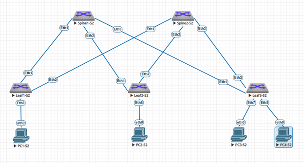

### VxLAN. L2 VNI.

### Задание:
- Настроить Overlay на основе VxLAN EVPN для L2 связанности между клиентами.
  
### В среде виртуализации EVE-NG cобрана и настроена топология Underlay сети Spine-Leaf в качестве которых используются L3-коммутаторы Arista с подключенными к ним устройствами "PC" имитирующими потребителей сервиса.
- 1: для настройки сегмента Underlay используется протокол динамической маршрутизации OSPF;
- 2: для настройки сегмента Overlay используется протокол динамической маршрутизации iBGP.


### IP план:
Device|Interface|IP Address|Subnet Mask
---|---|---|---
Spine1|Loopback0 (Underlay)|10.52.0.1|/32
-|Loopback1 (Overlay)|10.52.0.101|/32
-|Ethernet1|10.52.1.0|/31
-|Ethernet2|10.52.1.2|/31
-|Ethernet3|10.52.1.4|/31
Spine2|Loopback0 (Underlay)|10.52.0.2|/32
-|Loopback1 (Overlay)|10.52.0.102|/32
-|Ethernet1|10.52.2.0|/31
-|Ethernet2|10.52.2.2|/31
-|Ethernet3|10.52.2.4|/31
Leaf1|Loopback0 (Underlay)|10.52.0.11|/32
-|Loopback1 (Overlay)|10.52.0.111|/32
-|Ethernet1|10.52.1.1|/31
-|Ethernet2|10.52.2.1|/31
-|Ethernet8|10.52.11.1|/30
Leaf2|Loopback0 (Underlay)|10.52.0.12|/32
-|Loopback1 (Overlay)|10.52.0.112|/32
-|Ethernet1|10.52.1.3|/31
-|Ethernet2|10.52.2.3|/31
-|Ethernet8|10.52.12.1|/30
Leaf3|Loopback0 (Underlay)|10.52.0.13|/32
-|Loopback1 (Overlay)|10.52.0.113|/32
-|Ethernet1|10.52.1.5|/31
-|Ethernet2|10.52.2.5|/31
-|Ethernet8|10.52.12.5|/30
PC1|eth0|192.168.52.11|/24
PC2|eth0|192.168.52.21|/24
PC3|eth0|192.168.52.31|/24
PC4|eth0|192.168.52.32|/24

### Конфигурация оборудования
</details>
<details>
<summary> Spine1-52 </summary>

 ```
Spine1-52#sh run
! Command: show running-config
! device: Spine1-52 (vEOS-lab, EOS-4.29.2F)
!
! boot system flash:/vEOS-lab.swi
!
no aaa root
!
transceiver qsfp default-mode 4x10G
!
service routing protocols model multi-agent
!
hostname Spine1-52
!
spanning-tree mode mstp
!
interface Ethernet1
   description to Eth1 Leaf1-52
   mtu 9214
   no switchport
   ip address 10.52.1.0/31
   bfd interval 100 min-rx 100 multiplier 3
   ip ospf network point-to-point
   ip ospf authentication-key 7 b8R6BgflcEU=
   ip ospf area 0.0.0.0
!
interface Ethernet2
   description to Eth1 Leaf2-52
   mtu 9214
   no switchport
   ip address 10.52.1.2/31
   bfd interval 100 min-rx 100 multiplier 3
   ip ospf network point-to-point
   ip ospf authentication-key 7 X+t26ggFZHg=
   ip ospf area 0.0.0.0
!
interface Ethernet3
   description to Eth1 Leaf3-52
   mtu 9214
   no switchport
   ip address 10.52.1.4/31
   bfd interval 100 min-rx 100 multiplier 3
   ip ospf network point-to-point
   ip ospf authentication-key 7 X+t26ggFZHg=
   ip ospf area 0.0.0.0
!
interface Ethernet4
!
interface Ethernet5
!
interface Ethernet6
!
interface Ethernet7
!
interface Ethernet8
!
interface Loopback0
   description for Underlay
   ip address 10.52.0.1/32
   ip ospf area 0.0.0.0
!
interface Loopback1
   description for Overlay
   ip address 10.52.0.101/32
   ip ospf area 0.0.0.0
!
interface Management1
!
ip routing
!
router bgp 4200052101
   neighbor EVPN-OVERLAY peer group
   neighbor EVPN-OVERLAY remote-as 4200052101
   neighbor EVPN-OVERLAY update-source Loopback1
   neighbor EVPN-OVERLAY description Leaf's
   neighbor EVPN-OVERLAY route-reflector-client
   neighbor EVPN-OVERLAY send-community extended
   neighbor 10.52.0.111 peer group EVPN-OVERLAY
   neighbor 10.52.0.111 remote-as 4200052101
   neighbor 10.52.0.112 peer group EVPN-OVERLAY
   neighbor 10.52.0.112 remote-as 4200052101
   neighbor 10.52.0.113 peer group EVPN-OVERLAY
   neighbor 10.52.0.113 remote-as 4200052101
   !
   address-family evpn
      neighbor EVPN-OVERLAY activate
!
router ospf 1
   router-id 10.52.0.1
   passive-interface default
   no passive-interface Ethernet1
   no passive-interface Ethernet2
   no passive-interface Ethernet3
   max-lsa 12000
!
end
```
</details>
<details>
<summary> Spine2-52 </summary>
   
 ```
Spine2-52#sh run
! Command: show running-config
! device: Spine2-52 (vEOS-lab, EOS-4.29.2F)
!
! boot system flash:/vEOS-lab.swi
!
no aaa root
!
transceiver qsfp default-mode 4x10G
!
service routing protocols model multi-agent
!
hostname Spine2-52
!
spanning-tree mode mstp
!
interface Ethernet1
   description to Eth2 Leaf1-52
   mtu 9214
   no switchport
   ip address 10.52.2.0/31
   bfd interval 100 min-rx 100 multiplier 3
   ip ospf network point-to-point
   ip ospf authentication-key 7 b8R6BgflcEU=
   ip ospf area 0.0.0.0
!
interface Ethernet2
   description to Eth2 Leaf2-52
   mtu 9214
   no switchport
   ip address 10.52.2.2/31
   bfd interval 100 min-rx 100 multiplier 3
   ip ospf network point-to-point
   ip ospf authentication-key 7 X+t26ggFZHg=
   ip ospf area 0.0.0.0
!
interface Ethernet3
   description to Eth2 Leaf3-52
   mtu 9214
   no switchport
   ip address 10.52.2.4/31
   bfd interval 100 min-rx 100 multiplier 3
   ip ospf network point-to-point
   ip ospf authentication-key 7 X+t26ggFZHg=
   ip ospf area 0.0.0.0
!
interface Ethernet4
!
interface Ethernet5
!
interface Ethernet6
!
interface Ethernet7
!
interface Ethernet8
!
interface Loopback0
   description for Underlay
   ip address 10.52.0.2/32
   ip ospf area 0.0.0.0
!
interface Loopback1
   description for Overlay
   ip address 10.52.0.102/32
   ip ospf area 0.0.0.0
!
interface Management1
!
ip routing
!
router bgp 4200052101
   neighbor EVPN-OVERLAY peer group
   neighbor EVPN-OVERLAY remote-as 4200052101
   neighbor EVPN-OVERLAY update-source Loopback1
   neighbor EVPN-OVERLAY description Leaf's
   neighbor EVPN-OVERLAY route-reflector-client
   neighbor EVPN-OVERLAY send-community extended
   neighbor 10.52.0.111 peer group EVPN-OVERLAY
   neighbor 10.52.0.111 remote-as 4200052101
   neighbor 10.52.0.112 peer group EVPN-OVERLAY
   neighbor 10.52.0.112 remote-as 4200052101
   neighbor 10.52.0.113 peer group EVPN-OVERLAY
   neighbor 10.52.0.113 remote-as 4200052101
   !
   address-family evpn
      neighbor EVPN-OVERLAY activate
!
router ospf 1
   router-id 10.52.0.2
   passive-interface default
   no passive-interface Ethernet1
   no passive-interface Ethernet2
   no passive-interface Ethernet3
   max-lsa 12000
!
end
```
</details>
<details>
<summary> Leaf1-52 </summary>
   
 ```
Leaf1-52#sh run
! Command: show running-config
! device: Leaf1-52 (vEOS-lab, EOS-4.29.2F)
!
! boot system flash:/vEOS-lab.swi
!
no aaa root
!
transceiver qsfp default-mode 4x10G
!
service routing protocols model multi-agent
!
hostname Leaf1-52
!
spanning-tree mode mstp
!
vlan 52
   name Overlay_DC52
!
interface Ethernet1
   description to Eth1 Spine1-52
   mtu 9214
   no switchport
   ip address 10.52.1.1/31
   bfd interval 100 min-rx 100 multiplier 3
   ip ospf network point-to-point
   ip ospf authentication-key 7 b8R6BgflcEU=
   ip ospf area 0.0.0.0
!
interface Ethernet2
   description to Eth1 Spine2-52
   mtu 9214
   no switchport
   ip address 10.52.2.1/31
   bfd interval 100 min-rx 100 multiplier 3
   ip ospf network point-to-point
   ip ospf authentication-key 7 X+t26ggFZHg=
   ip ospf area 0.0.0.0
!
interface Ethernet3
!
interface Ethernet4
!
interface Ethernet5
!
interface Ethernet6
!
interface Ethernet7
!
interface Ethernet8
   description to PC1-52
   switchport access vlan 52
!
interface Loopback0
   description for Underlay
   ip address 10.52.0.11/32
   ip ospf area 0.0.0.0
!
interface Loopback1
   description for Overlay
   ip address 10.52.0.111/32
   ip ospf area 0.0.0.0
!
interface Management1
!
interface Vxlan1
   vxlan source-interface Loopback1
   vxlan udp-port 4789
   vxlan vlan 52 vni 1052
   vxlan learn-restrict any
!
ip routing
!
router bgp 4200052101
   neighbor EVPN-OVERLAY peer group
   neighbor EVPN-OVERLAY remote-as 4200052101
   neighbor EVPN-OVERLAY update-source Loopback1
   neighbor EVPN-OVERLAY description Spine's
   neighbor EVPN-OVERLAY send-community extended
   neighbor 10.52.0.101 peer group EVPN-OVERLAY
   neighbor 10.52.0.101 remote-as 4200052101
   neighbor 10.52.0.102 peer group EVPN-OVERLAY
   neighbor 10.52.0.102 remote-as 4200052101
   !
   vlan 52
      rd 4200052101:1052
      route-target both 52:1052
      redistribute learned
   !
   address-family evpn
      neighbor EVPN-OVERLAY activate
   !
   address-family ipv4
      network 10.52.0.111/32
!
router ospf 1
   router-id 10.52.0.11
   passive-interface default
   no passive-interface Ethernet1
   no passive-interface Ethernet2
   redistribute connected
   max-lsa 12000
!
end
```
</details>
<details>
<summary> Leaf2-52 </summary>
   
 ```
Leaf2-52#sh run
! Command: show running-config
! device: Leaf2-52 (vEOS-lab, EOS-4.29.2F)
!
! boot system flash:/vEOS-lab.swi
!
no aaa root
!
transceiver qsfp default-mode 4x10G
!
service routing protocols model multi-agent
!
hostname Leaf2-52
!
spanning-tree mode mstp
!
vlan 52
   name Overlay_DC52
!
interface Ethernet1
   description to Eth2 Spine1-52
   mtu 9214
   no switchport
   ip address 10.52.1.3/31
   bfd interval 100 min-rx 100 multiplier 3
   ip ospf network point-to-point
   ip ospf authentication-key 7 b8R6BgflcEU=
   ip ospf area 0.0.0.0
!
interface Ethernet2
   description to Eth2 Spine2-52
   mtu 9214
   no switchport
   ip address 10.52.2.3/31
   bfd interval 100 min-rx 100 multiplier 3
   ip ospf network point-to-point
   ip ospf authentication-key 7 X+t26ggFZHg=
   ip ospf area 0.0.0.0
!
interface Ethernet3
!
interface Ethernet4
!
interface Ethernet5
!
interface Ethernet6
!
interface Ethernet7
!
interface Ethernet8
   description to PC2-52
   switchport access vlan 52
!
interface Loopback0
   description for Underlay
   ip address 10.52.0.12/32
   ip ospf area 0.0.0.0
!
interface Loopback1
   description for Overlay
   ip address 10.52.0.112/32
   ip ospf area 0.0.0.0
!
interface Management1
!
interface Vxlan1
   vxlan source-interface Loopback1
   vxlan udp-port 4789
   vxlan vlan 52 vni 1052
   vxlan learn-restrict any
!
ip routing
!
router bgp 4200052101
   neighbor EVPN-OVERLAY peer group
   neighbor EVPN-OVERLAY remote-as 4200052101
   neighbor EVPN-OVERLAY update-source Loopback1
   neighbor EVPN-OVERLAY description Spine's
   neighbor EVPN-OVERLAY send-community extended
   neighbor 10.52.0.101 peer group EVPN-OVERLAY
   neighbor 10.52.0.101 remote-as 4200052101
   neighbor 10.52.0.102 peer group EVPN-OVERLAY
   neighbor 10.52.0.102 remote-as 4200052101
   !
   vlan 52
      rd 4200052101:1052
      route-target both 52:1052
      redistribute learned
   !
   address-family evpn
      neighbor EVPN-OVERLAY activate
   !
   address-family ipv4
      network 10.52.0.112/32
!
router ospf 1
   router-id 10.52.0.12
   passive-interface default
   no passive-interface Ethernet1
   no passive-interface Ethernet2
   redistribute connected
   max-lsa 12000
!
end
```
</details>
<details>
<summary> Leaf3-52 </summary>
   
 ```
Leaf3-52#sh run
! Command: show running-config
! device: Leaf3-52 (vEOS-lab, EOS-4.29.2F)
!
! boot system flash:/vEOS-lab.swi
!
no aaa root
!
transceiver qsfp default-mode 4x10G
!
service routing protocols model multi-agent
!
hostname Leaf3-52
!
spanning-tree mode mstp
!
vlan 52
   name Overlay_DC52
!
interface Ethernet1
   description to Eth3 Spine1-52
   mtu 9214
   no switchport
   ip address 10.52.1.5/31
   bfd interval 100 min-rx 100 multiplier 3
   ip ospf network point-to-point
   ip ospf authentication-key 7 b8R6BgflcEU=
   ip ospf area 0.0.0.0
!
interface Ethernet2
   description to Eth3 Spine2-52
   mtu 9214
   no switchport
   ip address 10.52.2.5/31
   bfd interval 100 min-rx 100 multiplier 3
   ip ospf network point-to-point
   ip ospf authentication-key 7 X+t26ggFZHg=
   ip ospf area 0.0.0.0
!
interface Ethernet3
!
interface Ethernet4
!
interface Ethernet5
!
interface Ethernet6
!
interface Ethernet7
   description to PC3-52
   switchport access vlan 52
!
interface Ethernet8
   description to PC4-52
   switchport access vlan 52
!
interface Loopback0
   description for Underlay
   ip address 10.52.0.13/32
   ip ospf area 0.0.0.0
!
interface Loopback1
   description for Overlay
   ip address 10.52.0.113/32
   ip ospf area 0.0.0.0
!
interface Management1
!
interface Vxlan1
   vxlan source-interface Loopback1
   vxlan udp-port 4789
   vxlan vlan 52 vni 1052
   vxlan learn-restrict any
!
ip routing
!
router bgp 4200052101
   neighbor EVPN-OVERLAY peer group
   neighbor EVPN-OVERLAY remote-as 4200052101
   neighbor EVPN-OVERLAY update-source Loopback1
   neighbor EVPN-OVERLAY description Spine's
   neighbor EVPN-OVERLAY send-community extended
   neighbor 10.52.0.101 peer group EVPN-OVERLAY
   neighbor 10.52.0.101 remote-as 4200052101
   neighbor 10.52.0.102 peer group EVPN-OVERLAY
   neighbor 10.52.0.102 remote-as 4200052101
   !
   vlan 52
      rd 4200052101:1052
      route-target both 52:1052
      redistribute learned
   !
   address-family evpn
      neighbor EVPN-OVERLAY activate
   !
   address-family ipv4
      network 10.52.0.113/32
!
router ospf 1
   router-id 10.52.0.13
   passive-interface default
   no passive-interface Ethernet1
   no passive-interface Ethernet2
   redistribute connected
   max-lsa 12000
!
end
```
</details>
<details>
<summary> PC1-52 </summary>
   
 ```
PC1-52> sh ip

NAME        : PC1-52[1]
IP/MASK     : 192.168.52.11/24
GATEWAY     : 192.168.52.1
DNS         :
MAC         : 00:50:79:66:68:06
LPORT       : 20000
RHOST:PORT  : 127.0.0.1:30000
MTU         : 1500
```
</details>
<details>
<summary> PC2-52 </summary>
   
 ```
PC2-52> sh ip

NAME        : PC2-52[1]
IP/MASK     : 192.168.52.21/24
GATEWAY     : 192.168.52.1
DNS         :
MAC         : 00:50:79:66:68:07
LPORT       : 20000
RHOST:PORT  : 127.0.0.1:30000
MTU         : 1500
```
</details>
<details>
<summary> PC3-52 </summary>
   
 ```
PC3-52> sh ip

NAME        : PC3-52[1]
IP/MASK     : 192.168.52.31/24
GATEWAY     : 192.168.52.1
DNS         :
MAC         : 00:50:79:66:68:08
LPORT       : 20000
RHOST:PORT  : 127.0.0.1:30000
MTU         : 1500
```
</details>
<details>
<summary> PC4-43 </summary>
   
 ```
PC4-52> sh ip
 
NAME        : PC4-52[1]
IP/MASK     : 192.168.52.32/24
GATEWAY     : 192.168.52.1
DNS         :
MAC         : 00:50:79:66:68:09
LPORT       : 20000
RHOST:PORT  : 127.0.0.1:30000
MTU         : 1500
```
</details>

#### Диагностика Spine/Leaf

<details>
<summary> Spine1-52 diag </summary>
 
 ```
Spine1-52#sh bgp evpn
BGP routing table information for VRF default
Router identifier 10.52.0.101, local AS number 4200052101
Route status codes: * - valid, > - active, S - Stale, E - ECMP head, e - ECMP
                    c - Contributing to ECMP, % - Pending BGP convergence
Origin codes: i - IGP, e - EGP, ? - incomplete
AS Path Attributes: Or-ID - Originator ID, C-LST - Cluster List, LL Nexthop - Link Local Nexthop

          Network                Next Hop              Metric  LocPref Weight  Path
 * >      RD: 4200052101:1052 mac-ip 0050.7966.6806
                                 10.52.0.111           -       100     0       i
 * >      RD: 4200052101:1052 mac-ip 0050.7966.6807
                                 10.52.0.112           -       100     0       i
 * >      RD: 4200052101:1052 mac-ip 0050.7966.6808
                                 10.52.0.113           -       100     0       i
 * >      RD: 4200052101:1052 mac-ip 0050.7966.6809
                                 10.52.0.113           -       100     0       i
 * >      RD: 4200052101:1052 imet 10.52.0.111
                                 10.52.0.111           -       100     0       i
 * >      RD: 4200052101:1052 imet 10.52.0.112
                                 10.52.0.112           -       100     0       i
 * >      RD: 4200052101:1052 imet 10.52.0.113
                                 10.52.0.113           -       100     0       i

Spine1-52#sh bgp evpn summary
BGP summary information for VRF default
Router identifier 10.52.0.101, local AS number 4200052101
Neighbor Status Codes: m - Under maintenance
  Description              Neighbor    V AS           MsgRcvd   MsgSent  InQ OutQ  Up/Down State   PfxRcd PfxAcc
  Leaf's                   10.52.0.111 4 4200052101        77        83    0    0 00:57:04 Estab   1      1
  Leaf's                   10.52.0.112 4 4200052101        64        71    0    0 00:40:56 Estab   1      1
  Leaf's                   10.52.0.113 4 4200052101        51        65    0    0 00:13:15 Estab   1      1
```
</details>
<details>
<summary> Spine2-52 diag </summary>
 
 ```
Spine2-52#sh bgp evpn
BGP routing table information for VRF default
Router identifier 10.52.0.102, local AS number 4200052101
Route status codes: * - valid, > - active, S - Stale, E - ECMP head, e - ECMP
                    c - Contributing to ECMP, % - Pending BGP convergence
Origin codes: i - IGP, e - EGP, ? - incomplete
AS Path Attributes: Or-ID - Originator ID, C-LST - Cluster List, LL Nexthop - Link Local Nexthop

          Network                Next Hop              Metric  LocPref Weight  Path
 * >      RD: 4200052101:1052 imet 10.52.0.111
                                 10.52.0.111           -       100     0       i
 * >      RD: 4200052101:1052 imet 10.52.0.112
                                 10.52.0.112           -       100     0       i
 * >      RD: 4200052101:1052 imet 10.52.0.113
                                 10.52.0.113           -       100     0       i
Spine2-52#
Spine2-52#sh bgp evpn sum
BGP summary information for VRF default
Router identifier 10.52.0.102, local AS number 4200052101
Neighbor Status Codes: m - Under maintenance
  Description              Neighbor    V AS           MsgRcvd   MsgSent  InQ OutQ  Up/Down State   PfxRcd PfxAcc
  Leaf's                   10.52.0.111 4 4200052101        80        83    0    0 00:58:52 Estab   1      1
  Leaf's                   10.52.0.112 4 4200052101        65        75    0    0 00:42:44 Estab   1      1
  Leaf's                   10.52.0.113 4 4200052101        52        64    0    0 00:15:03 Estab   1      1
```
</details>
<details>
<summary> Leaf1-52 diag </summary>
 
 ```
Leaf1-52#show bgp evpn
BGP routing table information for VRF default
Router identifier 10.52.0.111, local AS number 4200052101
Route status codes: * - valid, > - active, S - Stale, E - ECMP head, e - ECMP
                    c - Contributing to ECMP, % - Pending BGP convergence
Origin codes: i - IGP, e - EGP, ? - incomplete
AS Path Attributes: Or-ID - Originator ID, C-LST - Cluster List, LL Nexthop - Link Local Nexthop

          Network                Next Hop              Metric  LocPref Weight  Path
 * >      RD: 4200052101:1052 mac-ip 0050.7966.6806
                                 -                     -       -       0       i
 * >Ec    RD: 4200052101:1052 mac-ip 0050.7966.6807
                                 10.52.0.112           -       100     0       i Or-ID: 10.52.0.112 C-LST: 10.52.0.102
 *  ec    RD: 4200052101:1052 mac-ip 0050.7966.6807
                                 10.52.0.112           -       100     0       i Or-ID: 10.52.0.112 C-LST: 10.52.0.101
 * >Ec    RD: 4200052101:1052 mac-ip 0050.7966.6808
                                 10.52.0.113           -       100     0       i Or-ID: 10.52.0.113 C-LST: 10.52.0.102
 *  ec    RD: 4200052101:1052 mac-ip 0050.7966.6808
                                 10.52.0.113           -       100     0       i Or-ID: 10.52.0.113 C-LST: 10.52.0.101
 * >Ec    RD: 4200052101:1052 mac-ip 0050.7966.6809
                                 10.52.0.113           -       100     0       i Or-ID: 10.52.0.113 C-LST: 10.52.0.102
 *  ec    RD: 4200052101:1052 mac-ip 0050.7966.6809
                                 10.52.0.113           -       100     0       i Or-ID: 10.52.0.113 C-LST: 10.52.0.101
 * >      RD: 4200052101:1052 imet 10.52.0.111
                                 -                     -       -       0       i
 * >Ec    RD: 4200052101:1052 imet 10.52.0.112
                                 10.52.0.112           -       100     0       i Or-ID: 10.52.0.112 C-LST: 10.52.0.101
 *  ec    RD: 4200052101:1052 imet 10.52.0.112
                                 10.52.0.112           -       100     0       i Or-ID: 10.52.0.112 C-LST: 10.52.0.102
 * >Ec    RD: 4200052101:1052 imet 10.52.0.113
                                 10.52.0.113           -       100     0       i Or-ID: 10.52.0.113 C-LST: 10.52.0.101
 *  ec    RD: 4200052101:1052 imet 10.52.0.113
                                 10.52.0.113           -       100     0       i Or-ID: 10.52.0.113 C-LST: 10.52.0.102
Leaf1-52#
Leaf1-52#show bgp evpn sum
BGP summary information for VRF default
Router identifier 10.52.0.111, local AS number 4200052101
Neighbor Status Codes: m - Under maintenance
  Description              Neighbor    V AS           MsgRcvd   MsgSent  InQ OutQ  Up/Down State   PfxRcd PfxAcc
  Spine's                  10.52.0.101 4 4200052101        98        90    0    0 01:08:17 Estab   5      5
  Spine's                  10.52.0.102 4 4200052101        96        91    0    0 01:08:17 Estab   5      5
Leaf1-52#
Leaf1-52#show interfaces vxlan 1
Vxlan1 is up, line protocol is up (connected)
  Hardware is Vxlan
  Source interface is Loopback1 and is active with 10.52.0.111
  Listening on UDP port 4789
  Replication/Flood Mode is headend with Flood List Source: EVPN
  Remote MAC learning via EVPN
  VNI mapping to VLANs
  Static VLAN to VNI mapping is
    [52, 1052]
  Note: All Dynamic VLANs used by VCS are internal VLANs.
        Use 'show vxlan vni' for details.
  Static VRF to VNI mapping is not configured
  Headend replication flood vtep list is:
    52 10.52.0.112     10.52.0.113
  Shared Router MAC is 0000.0000.0000
Leaf1-52#
Leaf1-52#show mac address-table
          Mac Address Table
------------------------------------------------------------------

Vlan    Mac Address       Type        Ports      Moves   Last Move
----    -----------       ----        -----      -----   ---------
  52    0050.7966.6806    DYNAMIC     Et8        1       0:05:31 ago
  52    0050.7966.6807    DYNAMIC     Vx1        1       0:05:31 ago
  52    0050.7966.6808    DYNAMIC     Vx1        1       0:04:19 ago
  52    0050.7966.6809    DYNAMIC     Vx1        1       0:04:15 ago
Total Mac Addresses for this criterion: 4

          Multicast Mac Address Table
------------------------------------------------------------------

Vlan    Mac Address       Type        Ports
----    -----------       ----        -----
Total Mac Addresses for this criterion: 0
```
</details>
<details>
<summary> Leaf2-52 diag </summary>
 
 ```
Leaf2-52#show bgp evpn
BGP routing table information for VRF default
Router identifier 10.52.0.112, local AS number 4200052101
Route status codes: * - valid, > - active, S - Stale, E - ECMP head, e - ECMP
                    c - Contributing to ECMP, % - Pending BGP convergence
Origin codes: i - IGP, e - EGP, ? - incomplete
AS Path Attributes: Or-ID - Originator ID, C-LST - Cluster List, LL Nexthop - Link Local Nexthop

          Network                Next Hop              Metric  LocPref Weight  Path
 * >Ec    RD: 4200052101:1052 imet 10.52.0.111
                                 10.52.0.111           -       100     0       i Or-ID: 10.52.0.111 C-LST: 10.52.0.101
 *  ec    RD: 4200052101:1052 imet 10.52.0.111
                                 10.52.0.111           -       100     0       i Or-ID: 10.52.0.111 C-LST: 10.52.0.102
 * >      RD: 4200052101:1052 imet 10.52.0.112
                                 -                     -       -       0       i
 * >Ec    RD: 4200052101:1052 imet 10.52.0.113
                                 10.52.0.113           -       100     0       i Or-ID: 10.52.0.113 C-LST: 10.52.0.101
 *  ec    RD: 4200052101:1052 imet 10.52.0.113
                                 10.52.0.113           -       100     0       i Or-ID: 10.52.0.113 C-LST: 10.52.0.102
Leaf2-52#
Leaf2-52#show bgp evpn sum
BGP summary information for VRF default
Router identifier 10.52.0.112, local AS number 4200052101
Neighbor Status Codes: m - Under maintenance
  Description              Neighbor    V AS           MsgRcvd   MsgSent  InQ OutQ  Up/Down State   PfxRcd PfxAcc
  Spine's                  10.52.0.101 4 4200052101        91        82    0    0 00:55:03 Estab   2      2
  Spine's                  10.52.0.102 4 4200052101        92        82    0    0 00:55:03 Estab   2      2
Leaf2-52#
Leaf2-52#show interfaces vxlan 1
Vxlan1 is up, line protocol is up (connected)
  Hardware is Vxlan
  Source interface is Loopback1 and is active with 10.52.0.112
  Listening on UDP port 4789
  Replication/Flood Mode is headend with Flood List Source: EVPN
  Remote MAC learning via EVPN
  VNI mapping to VLANs
  Static VLAN to VNI mapping is
    [52, 1052]
  Note: All Dynamic VLANs used by VCS are internal VLANs.
        Use 'show vxlan vni' for details.
  Static VRF to VNI mapping is not configured
  Headend replication flood vtep list is:
    52 10.52.0.111     10.52.0.113
  Shared Router MAC is 0000.0000.0000
Leaf2-52#

Leaf2-52#sh mac address-table
          Mac Address Table
------------------------------------------------------------------

Vlan    Mac Address       Type        Ports      Moves   Last Move
----    -----------       ----        -----      -----   ---------
  52    0050.7966.6806    DYNAMIC     Vx1        1       0:01:18 ago
  52    0050.7966.6807    DYNAMIC     Et8        1       0:01:18 ago
  52    0050.7966.6808    DYNAMIC     Vx1        1       0:00:54 ago
  52    0050.7966.6809    DYNAMIC     Vx1        1       0:00:51 ago
Total Mac Addresses for this criterion: 4

          Multicast Mac Address Table
------------------------------------------------------------------

Vlan    Mac Address       Type        Ports
----    -----------       ----        -----
Total Mac Addresses for this criterion: 0
```
</details>
<details>
<summary> Leaf3-52 diag </summary>
 
 ```
Leaf3-52#show bgp evpn
BGP routing table information for VRF default
Router identifier 10.52.0.113, local AS number 4200052101
Route status codes: * - valid, > - active, S - Stale, E - ECMP head, e - ECMP
                    c - Contributing to ECMP, % - Pending BGP convergence
Origin codes: i - IGP, e - EGP, ? - incomplete
AS Path Attributes: Or-ID - Originator ID, C-LST - Cluster List, LL Nexthop - Link Local Nexthop

          Network                Next Hop              Metric  LocPref Weight  Path
 * >Ec    RD: 4200052101:1052 mac-ip 0050.7966.6806
                                 10.52.0.111           -       100     0       i Or-ID: 10.52.0.111 C-LST: 10.52.0.101
 *  ec    RD: 4200052101:1052 mac-ip 0050.7966.6806
                                 10.52.0.111           -       100     0       i Or-ID: 10.52.0.111 C-LST: 10.52.0.102
 * >Ec    RD: 4200052101:1052 mac-ip 0050.7966.6807
                                 10.52.0.112           -       100     0       i Or-ID: 10.52.0.112 C-LST: 10.52.0.102
 *  ec    RD: 4200052101:1052 mac-ip 0050.7966.6807
                                 10.52.0.112           -       100     0       i Or-ID: 10.52.0.112 C-LST: 10.52.0.101
 * >      RD: 4200052101:1052 mac-ip 0050.7966.6808
                                 -                     -       -       0       i
 * >      RD: 4200052101:1052 mac-ip 0050.7966.6809
                                 -                     -       -       0       i
 * >Ec    RD: 4200052101:1052 imet 10.52.0.111
                                 10.52.0.111           -       100     0       i Or-ID: 10.52.0.111 C-LST: 10.52.0.101
 *  ec    RD: 4200052101:1052 imet 10.52.0.111
                                 10.52.0.111           -       100     0       i Or-ID: 10.52.0.111 C-LST: 10.52.0.102
 * >Ec    RD: 4200052101:1052 imet 10.52.0.112
                                 10.52.0.112           -       100     0       i Or-ID: 10.52.0.112 C-LST: 10.52.0.101
 *  ec    RD: 4200052101:1052 imet 10.52.0.112
                                 10.52.0.112           -       100     0       i Or-ID: 10.52.0.112 C-LST: 10.52.0.102
 * >      RD: 4200052101:1052 imet 10.52.0.113
                                 -                     -       -       0       i
Leaf3-52#show bgp evpn sum
BGP summary information for VRF default
Router identifier 10.52.0.113, local AS number 4200052101
Neighbor Status Codes: m - Under maintenance
  Description              Neighbor    V AS           MsgRcvd   MsgSent  InQ OutQ  Up/Down State   PfxRcd PfxAcc
  Spine's                  10.52.0.101 4 4200052101        58        55    0    0 00:34:34 Estab   4      4
  Spine's                  10.52.0.102 4 4200052101        57        53    0    0 00:34:34 Estab   4      4
Leaf3-52#show interfaces vxlan 1
Vxlan1 is up, line protocol is up (connected)
  Hardware is Vxlan
  Source interface is Loopback1 and is active with 10.52.0.113
  Listening on UDP port 4789
  Replication/Flood Mode is headend with Flood List Source: EVPN
  Remote MAC learning via EVPN
  VNI mapping to VLANs
  Static VLAN to VNI mapping is
    [52, 1052]
  Note: All Dynamic VLANs used by VCS are internal VLANs.
        Use 'show vxlan vni' for details.
  Static VRF to VNI mapping is not configured
  Headend replication flood vtep list is:
    52 10.52.0.111     10.52.0.112
  Shared Router MAC is 0000.0000.0000
Leaf3-52#show mac address-table
          Mac Address Table
------------------------------------------------------------------

Vlan    Mac Address       Type        Ports      Moves   Last Move
----    -----------       ----        -----      -----   ---------
  52    0050.7966.6806    DYNAMIC     Vx1        1       0:02:57 ago
  52    0050.7966.6807    DYNAMIC     Vx1        1       0:02:57 ago
  52    0050.7966.6808    DYNAMIC     Et7        1       0:02:33 ago
  52    0050.7966.6809    DYNAMIC     Et8        1       0:02:30 ago
Total Mac Addresses for this criterion: 4

          Multicast Mac Address Table
------------------------------------------------------------------

Vlan    Mac Address       Type        Ports
----    -----------       ----        -----
Total Mac Addresses for this criterion: 0
```
</details>

#### Проверка наличия IP связности между устройствами "PC" имитирующими потребителей сервиса подключенных к L2 портам Leaf-ов в составе VxLAN-фабрики:

<details>
 
```
PC1-52> ping 192.168.52.21

84 bytes from 192.168.52.21 icmp_seq=1 ttl=64 time=329.917 ms

PC1-52> ping 192.168.52.31

84 bytes from 192.168.52.31 icmp_seq=1 ttl=64 time=103.625 ms

PC1-52> ping 192.168.52.32

84 bytes from 192.168.52.32 icmp_seq=1 ttl=64 time=80.832 ms

PC2-52> ping 192.168.52.31

84 bytes from 192.168.52.31 icmp_seq=1 ttl=64 time=38.055 ms

PC2-52> ping 192.168.52.32

84 bytes from 192.168.52.32 icmp_seq=1 ttl=64 time=39.902 ms

PC3-52> ping 192.168.52.32

84 bytes from 192.168.52.32 icmp_seq=1 ttl=64 time=11.557 ms
