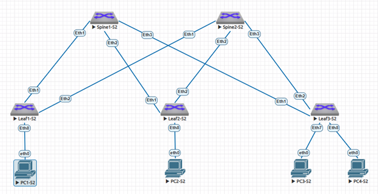

### VxLAN. L3 VNI.

### Задание:
- Настроить маршрутизацию в рамках Overlay между клиентами.
  
### В среде виртуализации EVE-NG cобрана и настроена топология Underlay/Overlay сети Spine-Leaf в качестве которых используются L3-коммутаторы Arista с подключенными к ним устройствами "PC" имитирующими потребителей сервиса.
- 1: для настройки сегмента Underlay используется протокол динамической маршрутизации OSPF;
- 2: для настройки сегмента Overlay используется протокол динамической маршрутизации iBGP.


### IP план:
Device|Interface|IP Address|Subnet Mask|Gateway
---|---|---|---|---
Spine1-52|Loopback0 (Underlay)|10.52.0.1|/32
-|Loopback1 (Overlay)|10.52.0.101|/32
-|Ethernet1|10.52.1.0|/31
-|Ethernet2|10.52.1.2|/31
-|Ethernet3|10.52.1.4|/31
Spine2-52|Loopback0 (Underlay)|10.52.0.2|/32
-|Loopback1 (Overlay)|10.52.0.102|/32
-|Ethernet1|10.52.2.0|/31
-|Ethernet2|10.52.2.2|/31
-|Ethernet3|10.52.2.4|/31
Leaf1-52|Loopback0 (Underlay)|10.52.0.11|/32
-|Loopback1 (Overlay)|10.52.0.111|/32
-|Ethernet1|10.52.1.1|/31
-|Ethernet2|10.52.2.1|/31
Leaf2-52|Loopback0 (Underlay)|10.52.0.12|/32
-|Loopback1 (Overlay)|10.52.0.112|/32
-|Ethernet1|10.52.1.3|/31
-|Ethernet2|10.52.2.3|/31
Leaf3-52|Loopback0 (Underlay)|10.52.0.13|/32
-|Loopback1 (Overlay)|10.52.0.113|/32
-|Ethernet1|10.52.1.5|/31
-|Ethernet2|10.52.2.5|/31
PC1-52|eth0|192.168.52.2|/24|192.168.52.1
PC2-52|eth0|192.168.152.2|/24|192.168.152.1
PC3-52|eth0|192.168.252.2|/25|192.168.252.1
PC4-52|eth0|192.168.252.130|/25|192.168.252.129

### Конфигурация оборудования
</details>
<details>
<summary> Spine1-52 </summary>

 ```
Spine1-52#sh run
! Command: show running-config
! device: Spine1-52 (vEOS-lab, EOS-4.29.2F)
!
! boot system flash:/vEOS-lab.swi
!
no aaa root
!
transceiver qsfp default-mode 4x10G
!
service routing protocols model multi-agent
!
hostname Spine1-52
!
spanning-tree mode mstp
!
interface Ethernet1
   description to Eth1 Leaf1-52
   mtu 9214
   no switchport
   ip address 10.52.1.0/31
   bfd interval 100 min-rx 100 multiplier 3
   ip ospf network point-to-point
   ip ospf authentication-key 7 b8R6BgflcEU=
   ip ospf area 0.0.0.0
!
interface Ethernet2
   description to Eth1 Leaf2-52
   mtu 9214
   no switchport
   ip address 10.52.1.2/31
   bfd interval 100 min-rx 100 multiplier 3
   ip ospf network point-to-point
   ip ospf authentication-key 7 X+t26ggFZHg=
   ip ospf area 0.0.0.0
!
interface Ethernet3
   description to Eth1 Leaf3-52
   mtu 9214
   no switchport
   ip address 10.52.1.4/31
   bfd interval 100 min-rx 100 multiplier 3
   ip ospf network point-to-point
   ip ospf authentication-key 7 X+t26ggFZHg=
   ip ospf area 0.0.0.0
!
interface Ethernet4
!
interface Ethernet5
!
interface Ethernet6
!
interface Ethernet7
!
interface Ethernet8
!
interface Loopback0
   description for Underlay
   ip address 10.52.0.1/32
   ip ospf area 0.0.0.0
!
interface Loopback1
   description for Overlay
   ip address 10.52.0.101/32
   ip ospf area 0.0.0.0
!
interface Management1
!
ip routing
!
router bgp 4200052101
   neighbor EVPN-OVERLAY peer group
   neighbor EVPN-OVERLAY remote-as 4200052101
   neighbor EVPN-OVERLAY update-source Loopback1
   neighbor EVPN-OVERLAY description Leaf's
   neighbor EVPN-OVERLAY route-reflector-client
   neighbor EVPN-OVERLAY send-community extended
   neighbor 10.52.0.111 peer group EVPN-OVERLAY
   neighbor 10.52.0.111 remote-as 4200052101
   neighbor 10.52.0.112 peer group EVPN-OVERLAY
   neighbor 10.52.0.112 remote-as 4200052101
   neighbor 10.52.0.113 peer group EVPN-OVERLAY
   neighbor 10.52.0.113 remote-as 4200052101
   !
   address-family evpn
      neighbor EVPN-OVERLAY activate
!
router ospf 1
   router-id 10.52.0.1
   passive-interface default
   no passive-interface Ethernet1
   no passive-interface Ethernet2
   no passive-interface Ethernet3
   max-lsa 12000
!
end
```
</details>
<details>
<summary> Spine2-52 </summary>
   
 ```
Spine2-52#sh run
! Command: show running-config
! device: Spine2-52 (vEOS-lab, EOS-4.29.2F)
!
! boot system flash:/vEOS-lab.swi
!
no aaa root
!
transceiver qsfp default-mode 4x10G
!
service routing protocols model multi-agent
!
hostname Spine2-52
!
spanning-tree mode mstp
!
interface Ethernet1
   description to Eth2 Leaf1-52
   mtu 9214
   no switchport
   ip address 10.52.2.0/31
   bfd interval 100 min-rx 100 multiplier 3
   ip ospf network point-to-point
   ip ospf authentication-key 7 b8R6BgflcEU=
   ip ospf area 0.0.0.0
!
interface Ethernet2
   description to Eth2 Leaf2-52
   mtu 9214
   no switchport
   ip address 10.52.2.2/31
   bfd interval 100 min-rx 100 multiplier 3
   ip ospf network point-to-point
   ip ospf authentication-key 7 X+t26ggFZHg=
   ip ospf area 0.0.0.0
!
interface Ethernet3
   description to Eth2 Leaf3-52
   mtu 9214
   no switchport
   ip address 10.52.2.4/31
   bfd interval 100 min-rx 100 multiplier 3
   ip ospf network point-to-point
   ip ospf authentication-key 7 X+t26ggFZHg=
   ip ospf area 0.0.0.0
!
interface Ethernet4
!
interface Ethernet5
!
interface Ethernet6
!
interface Ethernet7
!
interface Ethernet8
!
interface Loopback0
   description for Underlay
   ip address 10.52.0.2/32
   ip ospf area 0.0.0.0
!
interface Loopback1
   description for Overlay
   ip address 10.52.0.102/32
   ip ospf area 0.0.0.0
!
interface Management1
!
ip routing
!
router bgp 4200052101
   neighbor EVPN-OVERLAY peer group
   neighbor EVPN-OVERLAY remote-as 4200052101
   neighbor EVPN-OVERLAY update-source Loopback1
   neighbor EVPN-OVERLAY description Leaf's
   neighbor EVPN-OVERLAY route-reflector-client
   neighbor EVPN-OVERLAY send-community extended
   neighbor 10.52.0.111 peer group EVPN-OVERLAY
   neighbor 10.52.0.111 remote-as 4200052101
   neighbor 10.52.0.112 peer group EVPN-OVERLAY
   neighbor 10.52.0.112 remote-as 4200052101
   neighbor 10.52.0.113 peer group EVPN-OVERLAY
   neighbor 10.52.0.113 remote-as 4200052101
   !
   address-family evpn
      neighbor EVPN-OVERLAY activate
!
router ospf 1
   router-id 10.52.0.2
   passive-interface default
   no passive-interface Ethernet1
   no passive-interface Ethernet2
   no passive-interface Ethernet3
   max-lsa 12000
!
end
```
</details>
<details>
<summary> Leaf1-52 </summary>
   
 ```
Leaf1-52#sh run
! Command: show running-config
! device: Leaf1-52 (vEOS-lab, EOS-4.29.2F)
!
! boot system flash:/vEOS-lab.swi
!
no aaa root
!
transceiver qsfp default-mode 4x10G
!
service routing protocols model multi-agent
!
hostname Leaf1-52
!
spanning-tree mode mstp
!
vlan 52
   name Overlay_DC52_Vlan52
!
vrf instance vrf-vxlan
!
interface Ethernet1
   description to Eth1 Spine1-52
   mtu 9214
   no switchport
   ip address 10.52.1.1/31
   bfd interval 100 min-rx 100 multiplier 3
   ip ospf network point-to-point
   ip ospf authentication-key 7 b8R6BgflcEU=
   ip ospf area 0.0.0.0
!
interface Ethernet2
   description to Eth1 Spine2-52
   mtu 9214
   no switchport
   ip address 10.52.2.1/31
   bfd interval 100 min-rx 100 multiplier 3
   ip ospf network point-to-point
   ip ospf authentication-key 7 X+t26ggFZHg=
   ip ospf area 0.0.0.0
!
interface Ethernet3
!
interface Ethernet4
!
interface Ethernet5
!
interface Ethernet6
!
interface Ethernet7
!
interface Ethernet8
   description to PC1-52
   switchport access vlan 52
!
interface Loopback0
   description for Underlay
   ip address 10.52.0.11/32
   ip ospf area 0.0.0.0
!
interface Loopback1
   description for Overlay
   ip address 10.52.0.111/32
   ip ospf area 0.0.0.0
!
interface Management1
!
interface Vlan52
   vrf vrf-vxlan
   ip address virtual 192.168.52.1/24
!
interface Vxlan1
   vxlan source-interface Loopback1
   vxlan udp-port 4789
   vxlan vlan 52 vni 1052
   vxlan vrf vrf-vxlan vni 10052
   vxlan learn-restrict any
!
ip virtual-router mac-address 00:00:11:11:22:22
!
ip routing
ip routing vrf vrf-vxlan
!
router bgp 4200052101
   neighbor EVPN-OVERLAY peer group
   neighbor EVPN-OVERLAY remote-as 4200052101
   neighbor EVPN-OVERLAY update-source Loopback1
   neighbor EVPN-OVERLAY description Spine's
   neighbor EVPN-OVERLAY send-community extended
   neighbor 10.52.0.101 peer group EVPN-OVERLAY
   neighbor 10.52.0.101 remote-as 4200052101
   neighbor 10.52.0.102 peer group EVPN-OVERLAY
   neighbor 10.52.0.102 remote-as 4200052101
   !
   vlan 52
      rd 4200052101:1052
      route-target both 52:1052
      redistribute learned
   !
   address-family evpn
      neighbor EVPN-OVERLAY activate
   !
   vrf vrf-vxlan
      rd 10.52.0.111:1
      route-target import evpn 1:10052
      route-target export evpn 1:10052
      redistribute connected
!
router ospf 1
   router-id 10.52.0.11
   passive-interface default
   no passive-interface Ethernet1
   no passive-interface Ethernet2
   redistribute connected
   max-lsa 12000
!
end
```
</details>
<details>
<summary> Leaf2-52 </summary>
   
 ```
Leaf2-52#sh run
! Command: show running-config
! device: Leaf2-52 (vEOS-lab, EOS-4.29.2F)
!
! boot system flash:/vEOS-lab.swi
!
no aaa root
!
transceiver qsfp default-mode 4x10G
!
service routing protocols model multi-agent
!
hostname Leaf2-52
!
spanning-tree mode mstp
!
vlan 152
   name Overlay_DC52_Vlan152
!
vrf instance vrf-vxlan
!
interface Ethernet1
   description to Eth2 Spine1-52
   mtu 9214
   no switchport
   ip address 10.52.1.3/31
   bfd interval 100 min-rx 100 multiplier 3
   ip ospf network point-to-point
   ip ospf authentication-key 7 b8R6BgflcEU=
   ip ospf area 0.0.0.0
!
interface Ethernet2
   description to Eth2 Spine2-52
   mtu 9214
   no switchport
   ip address 10.52.2.3/31
   bfd interval 100 min-rx 100 multiplier 3
   ip ospf network point-to-point
   ip ospf authentication-key 7 X+t26ggFZHg=
   ip ospf area 0.0.0.0
!
interface Ethernet3
!
interface Ethernet4
!
interface Ethernet5
!
interface Ethernet6
!
interface Ethernet7
!
interface Ethernet8
   description to PC2-52
   switchport access vlan 152
!
interface Loopback0
   description for Underlay
   ip address 10.52.0.12/32
   ip ospf area 0.0.0.0
!
interface Loopback1
   description for Overlay
   ip address 10.52.0.112/32
   ip ospf area 0.0.0.0
!
interface Management1
!
interface Vlan152
   vrf vrf-vxlan
   ip address virtual 192.168.152.1/24
!
interface Vxlan1
   vxlan source-interface Loopback1
   vxlan udp-port 4789
   vxlan vlan 152 vni 1152
   vxlan vrf vrf-vxlan vni 10052
   vxlan learn-restrict any
!
ip virtual-router mac-address 00:00:11:11:22:22
!
ip routing
ip routing vrf vrf-vxlan
!
router bgp 4200052101
   neighbor EVPN-OVERLAY peer group
   neighbor EVPN-OVERLAY remote-as 4200052101
   neighbor EVPN-OVERLAY update-source Loopback1
   neighbor EVPN-OVERLAY description Spine's
   neighbor EVPN-OVERLAY send-community extended
   neighbor 10.52.0.101 peer group EVPN-OVERLAY
   neighbor 10.52.0.101 remote-as 4200052101
   neighbor 10.52.0.102 peer group EVPN-OVERLAY
   neighbor 10.52.0.102 remote-as 4200052101
   !
   vlan 152
      rd 4200052101:1152
      redistribute learned
   !
   address-family evpn
      neighbor EVPN-OVERLAY activate
   !
   vrf vrf-vxlan
      rd 10.52.0.112:1
      route-target import evpn 1:10052
      route-target export evpn 1:10052
      redistribute connected
!
router ospf 1
   router-id 10.52.0.12
   passive-interface default
   no passive-interface Ethernet1
   no passive-interface Ethernet2
   redistribute connected
   max-lsa 12000
!
end
```
</details>
<details>
<summary> Leaf3-52 </summary>
   
 ```
Leaf3-52#sh run
! Command: show running-config
! device: Leaf3-52 (vEOS-lab, EOS-4.29.2F)
!
! boot system flash:/vEOS-lab.swi
!
no aaa root
!
transceiver qsfp default-mode 4x10G
!
service routing protocols model multi-agent
!
hostname Leaf3-52
!
spanning-tree mode mstp
!
vlan 252
   name Overlay_DC52_Vlan252
!
vlan 352
   name Overlay_DC52_Vlan352
!
vrf instance vrf-vxlan
!
interface Ethernet1
   description to Eth3 Spine1-52
   mtu 9214
   no switchport
   ip address 10.52.1.5/31
   bfd interval 100 min-rx 100 multiplier 3
   ip ospf network point-to-point
   ip ospf authentication-key 7 b8R6BgflcEU=
   ip ospf area 0.0.0.0
!
interface Ethernet2
   description to Eth3 Spine2-52
   mtu 9214
   no switchport
   ip address 10.52.2.5/31
   bfd interval 100 min-rx 100 multiplier 3
   ip ospf network point-to-point
   ip ospf authentication-key 7 X+t26ggFZHg=
   ip ospf area 0.0.0.0
!
interface Ethernet3
!
interface Ethernet4
!
interface Ethernet5
!
interface Ethernet6
!
interface Ethernet7
   description to PC3-52
   switchport access vlan 252
!
interface Ethernet8
   description to PC4-52
   switchport access vlan 352
!
interface Loopback0
   description for Underlay
   ip address 10.52.0.13/32
   ip ospf area 0.0.0.0
!
interface Loopback1
   description for Overlay
   ip address 10.52.0.113/32
   ip ospf area 0.0.0.0
!
interface Management1
!
interface Vlan252
   vrf vrf-vxlan
   ip address virtual 192.168.252.1/25
!
interface Vlan352
   vrf vrf-vxlan
   ip address virtual 192.168.252.129/25
!
interface Vxlan1
   vxlan source-interface Loopback1
   vxlan udp-port 4789
   vxlan vlan 252 vni 1252
   vxlan vlan 352 vni 1352
   vxlan vrf vrf-vxlan vni 10052
   vxlan learn-restrict any
!
ip virtual-router mac-address 00:00:11:11:22:22
!
ip routing
ip routing vrf vrf-vxlan
!
router bgp 4200052101
   neighbor EVPN-OVERLAY peer group
   neighbor EVPN-OVERLAY remote-as 4200052101
   neighbor EVPN-OVERLAY update-source Loopback1
   neighbor EVPN-OVERLAY description Spine's
   neighbor EVPN-OVERLAY send-community extended
   neighbor 10.52.0.101 peer group EVPN-OVERLAY
   neighbor 10.52.0.101 remote-as 4200052101
   neighbor 10.52.0.102 peer group EVPN-OVERLAY
   neighbor 10.52.0.102 remote-as 4200052101
   !
   vlan 252
      rd 4200052101:1252
      redistribute learned
   !
   vlan 352
      rd 4200052101:1352
      redistribute learned
   !
   address-family evpn
      neighbor EVPN-OVERLAY activate
   !
   vrf vrf-vxlan
      rd 10.52.0.113:1
      route-target import evpn 1:10052
      route-target export evpn 1:10052
      redistribute connected
!
router ospf 1
   router-id 10.52.0.13
   passive-interface default
   no passive-interface Ethernet1
   no passive-interface Ethernet2
   redistribute connected
   max-lsa 12000
!
end
```
</details>
<details>
<summary> PC1-52 </summary>
   
 ```
PC1-52> sh ip

NAME        : PC1-52[1]
IP/MASK     : 192.168.52.2/24
GATEWAY     : 192.168.52.1
DNS         :
MAC         : 00:50:79:66:68:06
LPORT       : 20000
RHOST:PORT  : 127.0.0.1:30000
MTU         : 1500
```
</details>
<details>
<summary> PC2-52 </summary>
   
 ```
PC2-52> sh ip

NAME        : PC2-52[1]
IP/MASK     : 192.168.152.2/24
GATEWAY     : 192.168.152.1
DNS         :
MAC         : 00:50:79:66:68:07
LPORT       : 20000
RHOST:PORT  : 127.0.0.1:30000
MTU         : 1500
```
</details>
<details>
<summary> PC3-52 </summary>
   
 ```
PC3-52> sh ip

NAME        : PC3-52[1]
IP/MASK     : 192.168.252.2/25
GATEWAY     : 192.168.252.1
DNS         :
MAC         : 00:50:79:66:68:08
LPORT       : 20000
RHOST:PORT  : 127.0.0.1:30000
MTU         : 1500
```
</details>
<details>
<summary> PC4-52 </summary>
   
 ```
PC4-52> sh ip

NAME        : PC4-52[1]
IP/MASK     : 192.168.252.130/25
GATEWAY     : 192.168.252.129
DNS         :
MAC         : 00:50:79:66:68:09
LPORT       : 20000
RHOST:PORT  : 127.0.0.1:30000
MTU         : 1500
```
</details>

#### Диагностика Spine/Leaf

<details>
<summary> Spine1-52 diag </summary>
 
 ```
Spine1-52#show bgp evpn
BGP routing table information for VRF default
Router identifier 10.52.0.101, local AS number 4200052101
Route status codes: * - valid, > - active, S - Stale, E - ECMP head, e - ECMP
                    c - Contributing to ECMP, % - Pending BGP convergence
Origin codes: i - IGP, e - EGP, ? - incomplete
AS Path Attributes: Or-ID - Originator ID, C-LST - Cluster List, LL Nexthop - Link Local Nexthop

          Network                Next Hop              Metric  LocPref Weight  Path
 * >      RD: 4200052101:1052 mac-ip 0050.7966.6806
                                 10.52.0.111           -       100     0       i
 * >      RD: 4200052101:1052 mac-ip 0050.7966.6806 192.168.52.2
                                 10.52.0.111           -       100     0       i
 * >      RD: 4200052101:1052 mac-ip 0050.7966.6806 192.168.52.11
                                 10.52.0.111           -       100     0       i
 * >      RD: 4200052101:1052 imet 10.52.0.111
                                 10.52.0.111           -       100     0       i
 * >      RD: 10.52.0.111:1 ip-prefix 192.168.52.0/24
                                 10.52.0.111           -       100     0       i
 * >      RD: 10.52.0.112:1 ip-prefix 192.168.152.0/24
                                 10.52.0.112           -       100     0       i
 * >      RD: 10.52.0.113:1 ip-prefix 192.168.252.0/25
                                 10.52.0.113           -       100     0       i
 * >      RD: 10.52.0.113:1 ip-prefix 192.168.252.128/25
                                 10.52.0.113           -       100     0       i

Spine1-52#show bgp evpn summary
BGP summary information for VRF default
Router identifier 10.52.0.101, local AS number 4200052101
Neighbor Status Codes: m - Under maintenance
  Description              Neighbor    V AS           MsgRcvd   MsgSent  InQ OutQ  Up/Down State   PfxRcd PfxAcc
  Leaf's                   10.52.0.111 4 4200052101     10218     10228    0    0    6d00h Estab   5      5
  Leaf's                   10.52.0.112 4 4200052101     10201     10225    0    0    6d00h Estab   1      1
  Leaf's                   10.52.0.113 4 4200052101     10165     10214    0    0    5d23h Estab   2      2
```
</details>
<details>
<summary> Spine2-52 diag </summary>
 
 ```
Spine2-52#show bgp evpn
BGP routing table information for VRF default
Router identifier 10.52.0.102, local AS number 4200052101
Route status codes: * - valid, > - active, S - Stale, E - ECMP head, e - ECMP
                    c - Contributing to ECMP, % - Pending BGP convergence
Origin codes: i - IGP, e - EGP, ? - incomplete
AS Path Attributes: Or-ID - Originator ID, C-LST - Cluster List, LL Nexthop - Link Local Nexthop

          Network                Next Hop              Metric  LocPref Weight  Path
 * >      RD: 4200052101:1052 mac-ip 0050.7966.6806
                                 10.52.0.111           -       100     0       i
 * >      RD: 4200052101:1052 mac-ip 0050.7966.6806 192.168.52.2
                                 10.52.0.111           -       100     0       i
 * >      RD: 4200052101:1052 mac-ip 0050.7966.6806 192.168.52.11
                                 10.52.0.111           -       100     0       i
 * >      RD: 4200052101:1052 imet 10.52.0.111
                                 10.52.0.111           -       100     0       i
 * >      RD: 10.52.0.111:1 ip-prefix 192.168.52.0/24
                                 10.52.0.111           -       100     0       i
 * >      RD: 10.52.0.112:1 ip-prefix 192.168.152.0/24
                                 10.52.0.112           -       100     0       i
 * >      RD: 10.52.0.113:1 ip-prefix 192.168.252.0/25
                                 10.52.0.113           -       100     0       i
 * >      RD: 10.52.0.113:1 ip-prefix 192.168.252.128/25
                                 10.52.0.113           -       100     0       i

Spine2-52#show bgp evpn summary
BGP summary information for VRF default
Router identifier 10.52.0.102, local AS number 4200052101
Neighbor Status Codes: m - Under maintenance
  Description              Neighbor    V AS           MsgRcvd   MsgSent  InQ OutQ  Up/Down State   PfxRcd PfxAcc
  Leaf's                   10.52.0.111 4 4200052101     10228     10210    0    0    6d00h Estab   5      5
  Leaf's                   10.52.0.112 4 4200052101     10187     10216    0    0    6d00h Estab   1      1
  Leaf's                   10.52.0.113 4 4200052101     10169     10210    0    0    5d23h Estab   2      2
```
</details>
<details>
<summary> Leaf1-52 diag </summary>
 
 ```
Leaf1-52#show bgp evpn
BGP routing table information for VRF default
Router identifier 10.52.0.111, local AS number 4200052101
Route status codes: * - valid, > - active, S - Stale, E - ECMP head, e - ECMP
                    c - Contributing to ECMP, % - Pending BGP convergence
Origin codes: i - IGP, e - EGP, ? - incomplete
AS Path Attributes: Or-ID - Originator ID, C-LST - Cluster List, LL Nexthop - Link Local Nexthop

          Network                Next Hop              Metric  LocPref Weight  Path
 * >      RD: 4200052101:1052 mac-ip 0050.7966.6806
                                 -                     -       -       0       i
 * >      RD: 4200052101:1052 mac-ip 0050.7966.6806 192.168.52.2
                                 -                     -       -       0       i
 * >      RD: 4200052101:1052 mac-ip 0050.7966.6806 192.168.52.11
                                 -                     -       -       0       i
 * >      RD: 4200052101:1052 imet 10.52.0.111
                                 -                     -       -       0       i
 * >      RD: 10.52.0.111:1 ip-prefix 192.168.52.0/24
                                 -                     -       -       0       i
 * >      RD: 10.52.0.112:1 ip-prefix 192.168.152.0/24
                                 10.52.0.112           -       100     0       i Or-ID: 10.52.0.112 C-LST: 10.52.0.101
 *        RD: 10.52.0.112:1 ip-prefix 192.168.152.0/24
                                 10.52.0.112           -       100     0       i Or-ID: 10.52.0.112 C-LST: 10.52.0.102
 * >      RD: 10.52.0.113:1 ip-prefix 192.168.252.0/25
                                 10.52.0.113           -       100     0       i Or-ID: 10.52.0.113 C-LST: 10.52.0.101
 *        RD: 10.52.0.113:1 ip-prefix 192.168.252.0/25
                                 10.52.0.113           -       100     0       i Or-ID: 10.52.0.113 C-LST: 10.52.0.102
 * >      RD: 10.52.0.113:1 ip-prefix 192.168.252.128/25
                                 10.52.0.113           -       100     0       i Or-ID: 10.52.0.113 C-LST: 10.52.0.101
 *        RD: 10.52.0.113:1 ip-prefix 192.168.252.128/25
                                 10.52.0.113           -       100     0       i Or-ID: 10.52.0.113 C-LST: 10.52.0.102

Leaf1-52#show bgp evpn summary
BGP summary information for VRF default
Router identifier 10.52.0.111, local AS number 4200052101
Neighbor Status Codes: m - Under maintenance
  Description              Neighbor    V AS           MsgRcvd   MsgSent  InQ OutQ  Up/Down State   PfxRcd PfxAcc
  Spine's                  10.52.0.101 4 4200052101     10226     10217    0    0    6d00h Estab   3      3
  Spine's                  10.52.0.102 4 4200052101     10208     10226    0    0    6d00h Estab   3      3

Leaf1-52#show ip route vrf vrf-vxlan

VRF: vrf-vxlan
Codes: C - connected, S - static, K - kernel,
       O - OSPF, IA - OSPF inter area, E1 - OSPF external type 1,
       E2 - OSPF external type 2, N1 - OSPF NSSA external type 1,
       N2 - OSPF NSSA external type2, B - Other BGP Routes,
       B I - iBGP, B E - eBGP, R - RIP, I L1 - IS-IS level 1,
       I L2 - IS-IS level 2, O3 - OSPFv3, A B - BGP Aggregate,
       A O - OSPF Summary, NG - Nexthop Group Static Route,
       V - VXLAN Control Service, M - Martian,
       DH - DHCP client installed default route,
       DP - Dynamic Policy Route, L - VRF Leaked,
       G  - gRIBI, RC - Route Cache Route

Gateway of last resort is not set

 C        192.168.52.0/24 is directly connected, Vlan52
 B I      192.168.152.0/24 [200/0] via VTEP 10.52.0.112 VNI 10052 router-mac 50:00:00:03:37:66 local-interface Vxlan1
 B I      192.168.252.0/25 [200/0] via VTEP 10.52.0.113 VNI 10052 router-mac 50:00:00:15:f4:e8 local-interface Vxlan1
 B I      192.168.252.128/25 [200/0] via VTEP 10.52.0.113 VNI 10052 router-mac 50:00:00:15:f4:e8 local-interface Vxlan1

Leaf1-52#show mac address-table
          Mac Address Table
------------------------------------------------------------------

Vlan    Mac Address       Type        Ports      Moves   Last Move
----    -----------       ----        -----      -----   ---------
   1    0000.1111.2222    STATIC      Cpu
  52    0000.1111.2222    STATIC      Cpu
  52    0050.7966.6806    DYNAMIC     Et8        1       0:00:57 ago
4094    0000.1111.2222    STATIC      Cpu
4094    5000.0003.3766    DYNAMIC     Vx1        1       2:57:51 ago
4094    5000.0015.f4e8    DYNAMIC     Vx1        1       2:15:42 ago
Total Mac Addresses for this criterion: 6

          Multicast Mac Address Table
------------------------------------------------------------------

Vlan    Mac Address       Type        Ports
----    -----------       ----        -----
Total Mac Addresses for this criterion: 0

Leaf1-52#show vxlan address-table
          Vxlan Mac Address Table
----------------------------------------------------------------------

VLAN  Mac Address     Type      Prt  VTEP             Moves   Last Move
----  -----------     ----      ---  ----             -----   ---------
4094  5000.0003.3766  EVPN      Vx1  10.52.0.112      1       2:57:51 ago
4094  5000.0015.f4e8  EVPN      Vx1  10.52.0.113      1       2:15:42 ago
Total Remote Mac Addresses for this criterion: 2

Leaf1-52#show vxlan vtep
Remote VTEPS for Vxlan1:

VTEP              Tunnel Type(s)
----------------- --------------
10.52.0.112       unicast
10.52.0.113       unicast

Total number of remote VTEPS:  2

Leaf1-52#show interfaces vxlan 1
Vxlan1 is up, line protocol is up (connected)
  Hardware is Vxlan
  Source interface is Loopback1 and is active with 10.52.0.111
  Listening on UDP port 4789
  Replication/Flood Mode is headend with Flood List Source: EVPN
  Remote MAC learning via EVPN
  VNI mapping to VLANs
  Static VLAN to VNI mapping is
    [52, 1052]
  Dynamic VLAN to VNI mapping for 'evpn' is
    [4094, 10052]
  Note: All Dynamic VLANs used by VCS are internal VLANs.
        Use 'show vxlan vni' for details.
  Static VRF to VNI mapping is
   [vrf-vxlan, 10052]
  Shared Router MAC is 0000.0000.0000
```
</details>
<details>
<summary> Leaf2-52 diag </summary>
 
 ```
Leaf2-52#show bgp evpn
BGP routing table information for VRF default
Router identifier 10.52.0.112, local AS number 4200052101
Route status codes: * - valid, > - active, S - Stale, E - ECMP head, e - ECMP
                    c - Contributing to ECMP, % - Pending BGP convergence
Origin codes: i - IGP, e - EGP, ? - incomplete
AS Path Attributes: Or-ID - Originator ID, C-LST - Cluster List, LL Nexthop - Link Local Nexthop

          Network                Next Hop              Metric  LocPref Weight  Path
 * >Ec    RD: 4200052101:1052 mac-ip 0050.7966.6806
                                 10.52.0.111           -       100     0       i Or-ID: 10.52.0.111 C-LST: 10.52.0.101
 *  ec    RD: 4200052101:1052 mac-ip 0050.7966.6806
                                 10.52.0.111           -       100     0       i Or-ID: 10.52.0.111 C-LST: 10.52.0.102
 * >Ec    RD: 4200052101:1052 mac-ip 0050.7966.6806 192.168.52.2
                                 10.52.0.111           -       100     0       i Or-ID: 10.52.0.111 C-LST: 10.52.0.102
 *  ec    RD: 4200052101:1052 mac-ip 0050.7966.6806 192.168.52.2
                                 10.52.0.111           -       100     0       i Or-ID: 10.52.0.111 C-LST: 10.52.0.101
 * >Ec    RD: 4200052101:1052 mac-ip 0050.7966.6806 192.168.52.11
                                 10.52.0.111           -       100     0       i Or-ID: 10.52.0.111 C-LST: 10.52.0.102
 *  ec    RD: 4200052101:1052 mac-ip 0050.7966.6806 192.168.52.11
                                 10.52.0.111           -       100     0       i Or-ID: 10.52.0.111 C-LST: 10.52.0.101
 * >Ec    RD: 4200052101:1052 imet 10.52.0.111
                                 10.52.0.111           -       100     0       i Or-ID: 10.52.0.111 C-LST: 10.52.0.101
 *  ec    RD: 4200052101:1052 imet 10.52.0.111
                                 10.52.0.111           -       100     0       i Or-ID: 10.52.0.111 C-LST: 10.52.0.102
 * >      RD: 10.52.0.111:1 ip-prefix 192.168.52.0/24
                                 10.52.0.111           -       100     0       i Or-ID: 10.52.0.111 C-LST: 10.52.0.101
 *        RD: 10.52.0.111:1 ip-prefix 192.168.52.0/24
                                 10.52.0.111           -       100     0       i Or-ID: 10.52.0.111 C-LST: 10.52.0.102
 * >      RD: 10.52.0.112:1 ip-prefix 192.168.152.0/24
                                 -                     -       -       0       i
 * >      RD: 10.52.0.113:1 ip-prefix 192.168.252.0/25
                                 10.52.0.113           -       100     0       i Or-ID: 10.52.0.113 C-LST: 10.52.0.101
 *        RD: 10.52.0.113:1 ip-prefix 192.168.252.0/25
                                 10.52.0.113           -       100     0       i Or-ID: 10.52.0.113 C-LST: 10.52.0.102
 * >      RD: 10.52.0.113:1 ip-prefix 192.168.252.128/25
                                 10.52.0.113           -       100     0       i Or-ID: 10.52.0.113 C-LST: 10.52.0.101
 *        RD: 10.52.0.113:1 ip-prefix 192.168.252.128/25
                                 10.52.0.113           -       100     0       i Or-ID: 10.52.0.113 C-LST: 10.52.0.102

Leaf2-52#show bgp evpn summary
BGP summary information for VRF default
Router identifier 10.52.0.112, local AS number 4200052101
Neighbor Status Codes: m - Under maintenance
  Description              Neighbor    V AS           MsgRcvd   MsgSent  InQ OutQ  Up/Down State   PfxRcd PfxAcc
  Spine's                  10.52.0.101 4 4200052101     10224     10200    0    0    6d00h Estab   7      7
  Spine's                  10.52.0.102 4 4200052101     10213     10186    0    0    6d00h Estab   7      7

Leaf2-52#show ip route vrf vrf-vxlan

VRF: vrf-vxlan
Codes: C - connected, S - static, K - kernel,
       O - OSPF, IA - OSPF inter area, E1 - OSPF external type 1,
       E2 - OSPF external type 2, N1 - OSPF NSSA external type 1,
       N2 - OSPF NSSA external type2, B - Other BGP Routes,
       B I - iBGP, B E - eBGP, R - RIP, I L1 - IS-IS level 1,
       I L2 - IS-IS level 2, O3 - OSPFv3, A B - BGP Aggregate,
       A O - OSPF Summary, NG - Nexthop Group Static Route,
       V - VXLAN Control Service, M - Martian,
       DH - DHCP client installed default route,
       DP - Dynamic Policy Route, L - VRF Leaked,
       G  - gRIBI, RC - Route Cache Route

Gateway of last resort is not set

 B I      192.168.52.2/32 [200/0] via VTEP 10.52.0.111 VNI 10052 router-mac 50:00:00:d5:5d:c0 local-interface Vxlan1
 B I      192.168.52.11/32 [200/0] via VTEP 10.52.0.111 VNI 10052 router-mac 50:00:00:d5:5d:c0 local-interface Vxlan1
 B I      192.168.52.0/24 [200/0] via VTEP 10.52.0.111 VNI 10052 router-mac 50:00:00:d5:5d:c0 local-interface Vxlan1
 C        192.168.152.0/24 is directly connected, Vlan152
 B I      192.168.252.0/25 [200/0] via VTEP 10.52.0.113 VNI 10052 router-mac 50:00:00:15:f4:e8 local-interface Vxlan1
 B I      192.168.252.128/25 [200/0] via VTEP 10.52.0.113 VNI 10052 router-mac 50:00:00:15:f4:e8 local-interface Vxlan1

Leaf2-52#show mac address-table
          Mac Address Table
------------------------------------------------------------------

Vlan    Mac Address       Type        Ports      Moves   Last Move
----    -----------       ----        -----      -----   ---------
   1    0000.1111.2222    STATIC      Cpu
 152    0000.1111.2222    STATIC      Cpu
 152    0050.7966.6807    DYNAMIC     Et8        1       0:01:14 ago
4092    0000.1111.2222    STATIC      Cpu
4092    5000.0015.f4e8    DYNAMIC     Vx1        1       2:16:05 ago
4092    5000.00d5.5dc0    DYNAMIC     Vx1        1       3:18:06 ago
Total Mac Addresses for this criterion: 6

          Multicast Mac Address Table
------------------------------------------------------------------

Vlan    Mac Address       Type        Ports
----    -----------       ----        -----
Total Mac Addresses for this criterion: 0

Leaf2-52#show vxlan address-table
          Vxlan Mac Address Table
----------------------------------------------------------------------

VLAN  Mac Address     Type      Prt  VTEP             Moves   Last Move
----  -----------     ----      ---  ----             -----   ---------
4092  5000.0015.f4e8  EVPN      Vx1  10.52.0.113      1       2:16:05 ago
4092  5000.00d5.5dc0  EVPN      Vx1  10.52.0.111      1       3:18:06 ago
Total Remote Mac Addresses for this criterion: 2

Leaf2-52#show vxlan vtep
Remote VTEPS for Vxlan1:

VTEP              Tunnel Type(s)
----------------- --------------
10.52.0.111       unicast
10.52.0.113       unicast

Total number of remote VTEPS:  2

Leaf2-52#show interfaces vxlan 1
Vxlan1 is up, line protocol is up (connected)
  Hardware is Vxlan
  Source interface is Loopback1 and is active with 10.52.0.112
  Listening on UDP port 4789
  Replication/Flood Mode is headend with Flood List Source: EVPN
  Remote MAC learning via EVPN
  VNI mapping to VLANs
  Static VLAN to VNI mapping is
    [152, 1152]
  Dynamic VLAN to VNI mapping for 'evpn' is
    [4092, 10052]
  Note: All Dynamic VLANs used by VCS are internal VLANs.
        Use 'show vxlan vni' for details.
  Static VRF to VNI mapping is
   [vrf-vxlan, 10052]
  Shared Router MAC is 0000.0000.0000
```
</details>
<details>
<summary> Leaf3-52 diag </summary>
 
 ```
Leaf3-52#show bgp evpn
BGP routing table information for VRF default
Router identifier 10.52.0.113, local AS number 4200052101
Route status codes: * - valid, > - active, S - Stale, E - ECMP head, e - ECMP
                    c - Contributing to ECMP, % - Pending BGP convergence
Origin codes: i - IGP, e - EGP, ? - incomplete
AS Path Attributes: Or-ID - Originator ID, C-LST - Cluster List, LL Nexthop - Link Local Nexthop

          Network                Next Hop              Metric  LocPref Weight  Path
 * >Ec    RD: 4200052101:1052 mac-ip 0050.7966.6806
                                 10.52.0.111           -       100     0       i Or-ID: 10.52.0.111 C-LST: 10.52.0.101
 *  ec    RD: 4200052101:1052 mac-ip 0050.7966.6806
                                 10.52.0.111           -       100     0       i Or-ID: 10.52.0.111 C-LST: 10.52.0.102
 * >Ec    RD: 4200052101:1052 mac-ip 0050.7966.6806 192.168.52.2
                                 10.52.0.111           -       100     0       i Or-ID: 10.52.0.111 C-LST: 10.52.0.101
 *  ec    RD: 4200052101:1052 mac-ip 0050.7966.6806 192.168.52.2
                                 10.52.0.111           -       100     0       i Or-ID: 10.52.0.111 C-LST: 10.52.0.102
 * >Ec    RD: 4200052101:1052 mac-ip 0050.7966.6806 192.168.52.11
                                 10.52.0.111           -       100     0       i Or-ID: 10.52.0.111 C-LST: 10.52.0.101
 *  ec    RD: 4200052101:1052 mac-ip 0050.7966.6806 192.168.52.11
                                 10.52.0.111           -       100     0       i Or-ID: 10.52.0.111 C-LST: 10.52.0.102
 * >Ec    RD: 4200052101:1052 imet 10.52.0.111
                                 10.52.0.111           -       100     0       i Or-ID: 10.52.0.111 C-LST: 10.52.0.101
 *  ec    RD: 4200052101:1052 imet 10.52.0.111
                                 10.52.0.111           -       100     0       i Or-ID: 10.52.0.111 C-LST: 10.52.0.102
 * >      RD: 10.52.0.111:1 ip-prefix 192.168.52.0/24
                                 10.52.0.111           -       100     0       i Or-ID: 10.52.0.111 C-LST: 10.52.0.101
 *        RD: 10.52.0.111:1 ip-prefix 192.168.52.0/24
                                 10.52.0.111           -       100     0       i Or-ID: 10.52.0.111 C-LST: 10.52.0.102
 * >      RD: 10.52.0.112:1 ip-prefix 192.168.152.0/24
                                 10.52.0.112           -       100     0       i Or-ID: 10.52.0.112 C-LST: 10.52.0.101
 *        RD: 10.52.0.112:1 ip-prefix 192.168.152.0/24
                                 10.52.0.112           -       100     0       i Or-ID: 10.52.0.112 C-LST: 10.52.0.102
 * >      RD: 10.52.0.113:1 ip-prefix 192.168.252.0/25
                                 -                     -       -       0       i
 * >      RD: 10.52.0.113:1 ip-prefix 192.168.252.128/25
                                 -                     -       -       0       i

Leaf3-52#show bgp evpn summary
BGP summary information for VRF default
Router identifier 10.52.0.113, local AS number 4200052101
Neighbor Status Codes: m - Under maintenance
  Description              Neighbor    V AS           MsgRcvd   MsgSent  InQ OutQ  Up/Down State   PfxRcd PfxAcc
  Spine's                  10.52.0.101 4 4200052101     10176     10140    0    0    5d23h Estab   6      6
  Spine's                  10.52.0.102 4 4200052101     10174     10142    0    0    5d23h Estab   6      6

Leaf3-52#show ip route vrf vrf-vxlan

VRF: vrf-vxlan
Codes: C - connected, S - static, K - kernel,
       O - OSPF, IA - OSPF inter area, E1 - OSPF external type 1,
       E2 - OSPF external type 2, N1 - OSPF NSSA external type 1,
       N2 - OSPF NSSA external type2, B - Other BGP Routes,
       B I - iBGP, B E - eBGP, R - RIP, I L1 - IS-IS level 1,
       I L2 - IS-IS level 2, O3 - OSPFv3, A B - BGP Aggregate,
       A O - OSPF Summary, NG - Nexthop Group Static Route,
       V - VXLAN Control Service, M - Martian,
       DH - DHCP client installed default route,
       DP - Dynamic Policy Route, L - VRF Leaked,
       G  - gRIBI, RC - Route Cache Route

Gateway of last resort is not set

 B I      192.168.52.2/32 [200/0] via VTEP 10.52.0.111 VNI 10052 router-mac 50:00:00:d5:5d:c0 local-interface Vxlan1
 B I      192.168.52.11/32 [200/0] via VTEP 10.52.0.111 VNI 10052 router-mac 50:00:00:d5:5d:c0 local-interface Vxlan1
 B I      192.168.52.0/24 [200/0] via VTEP 10.52.0.111 VNI 10052 router-mac 50:00:00:d5:5d:c0 local-interface Vxlan1
 B I      192.168.152.0/24 [200/0] via VTEP 10.52.0.112 VNI 10052 router-mac 50:00:00:03:37:66 local-interface Vxlan1
 C        192.168.252.0/25 is directly connected, Vlan252
 C        192.168.252.128/25 is directly connected, Vlan352

Leaf3-52#show mac address-table
          Mac Address Table
------------------------------------------------------------------

Vlan    Mac Address       Type        Ports      Moves   Last Move
----    -----------       ----        -----      -----   ---------
   1    0000.1111.2222    STATIC      Cpu
 252    0000.1111.2222    STATIC      Cpu
 252    0050.7966.6808    DYNAMIC     Et7        1       0:01:26 ago
 352    0000.1111.2222    STATIC      Cpu
 352    0050.7966.6809    DYNAMIC     Et8        1       0:01:39 ago
4092    0000.1111.2222    STATIC      Cpu
4092    5000.0003.3766    DYNAMIC     Vx1        1       2:58:33 ago
4092    5000.00d5.5dc0    DYNAMIC     Vx1        1       3:18:25 ago
Total Mac Addresses for this criterion: 8

          Multicast Mac Address Table
------------------------------------------------------------------

Vlan    Mac Address       Type        Ports
----    -----------       ----        -----
Total Mac Addresses for this criterion: 0
Leaf3-52#
Leaf3-52#show vxlan address-table
          Vxlan Mac Address Table
----------------------------------------------------------------------

VLAN  Mac Address     Type      Prt  VTEP             Moves   Last Move
----  -----------     ----      ---  ----             -----   ---------
4092  5000.0003.3766  EVPN      Vx1  10.52.0.112      1       2:58:33 ago
4092  5000.00d5.5dc0  EVPN      Vx1  10.52.0.111      1       3:18:25 ago
Total Remote Mac Addresses for this criterion: 2

Leaf3-52#show vxlan vtep
Remote VTEPS for Vxlan1:

VTEP              Tunnel Type(s)
----------------- --------------
10.52.0.111       unicast
10.52.0.112       unicast

Total number of remote VTEPS:  2

Leaf3-52#show interfaces vxlan 1
Vxlan1 is up, line protocol is up (connected)
  Hardware is Vxlan
  Source interface is Loopback1 and is active with 10.52.0.113
  Listening on UDP port 4789
  Replication/Flood Mode is headend with Flood List Source: EVPN
  Remote MAC learning via EVPN
  VNI mapping to VLANs
  Static VLAN to VNI mapping is
    [252, 1252]       [352, 1352]
  Dynamic VLAN to VNI mapping for 'evpn' is
    [4092, 10052]
  Note: All Dynamic VLANs used by VCS are internal VLANs.
        Use 'show vxlan vni' for details.
  Static VRF to VNI mapping is
   [vrf-vxlan, 10052]
  Shared Router MAC is 0000.0000.0000
```
</details>

#### Проверка наличия IP связности между устройствами "PC" имитирующими потребителей, находящихся в индивидуальных Vlan-ах и подсетях, подключеных к портам Leaf-ов в составе VxLAN-фабрики:

<details>
 
```
PC1-52> ping 192.168.152.2

84 bytes from 192.168.152.2 icmp_seq=1 ttl=62 time=56.526 ms

PC1-52> ping 192.168.252.2

84 bytes from 192.168.252.2 icmp_seq=1 ttl=62 time=39.055 ms

PC1-52> ping 192.168.252.130

84 bytes from 192.168.252.130 icmp_seq=1 ttl=62 time=108.048 ms

PC2-52> ping 192.168.252.2

84 bytes from 192.168.252.2 icmp_seq=1 ttl=62 time=174.684 ms

PC2-52> ping 192.168.252.130

84 bytes from 192.168.252.130 icmp_seq=1 ttl=62 time=37.867 ms

PC3-52> ping 192.168.252.130

84 bytes from 192.168.252.130 icmp_seq=1 ttl=63 time=39.252 ms
