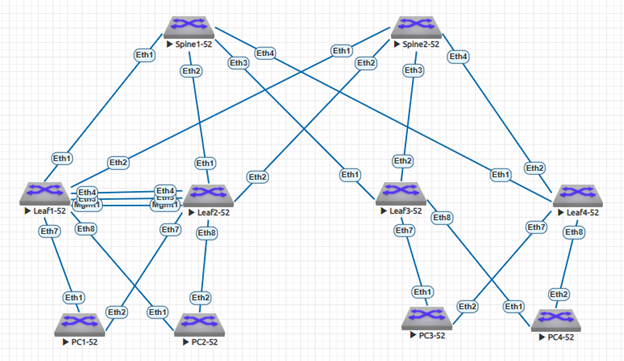
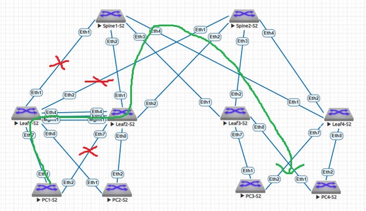

### VxLAN. Аналоги VPC.

### Задание:
- Настроить отказоустойчивое подключение клиентов с использованием EVPN Multihoming.
- Протестировать отказоустойчивость - убедиться, что связнность не теряется при отключении одного из линков.

### В среде виртуализации EVE-NG cобрана и настроена топология Underlay/Overlay сети Spine-Leaf в качестве которых используются L3-коммутаторы Arista с подключенными к ним устройствами "PC" имитирующими потребителей сервиса. В качестве устройств "PC" имитирующими потребителей сервиса, с целью сборки LAG (Port-channel) по протоколу LACP с Leaf-ами, объединенными в MLAG и ESI LAG, так же используются L3-коммутаторы Arista.
- 1: для настройки сегмента Underlay используется протокол динамической маршрутизации OSPF;
- 2: для настройки сегмента Overlay используется протокол динамической маршрутизации iBGP;
- 3: Leaf1-52 и Leaf2-52 объединены в MLAG;
- 4: Leaf3-52 и Leaf4-52 объединены в ESI LAG.



### IP план:

<details>
  
Device|Interface|IP Address|Subnet Mask|Gateway
---|---|---|---|---
Spine1-52|Loopback0 (Underlay)|10.52.0.1|/32
-|Loopback1 (Overlay)|10.52.0.101|/32
-|Ethernet1|10.52.1.0|/31
-|Ethernet2|10.52.1.2|/31
-|Ethernet3|10.52.1.4|/31
-|Ethernet4|10.52.1.6|/31
Spine2-52|Loopback0 (Underlay)|10.52.0.2|/32
-|Loopback1 (Overlay)|10.52.0.102|/32
-|Ethernet1|10.52.2.0|/31
-|Ethernet2|10.52.2.2|/31
-|Ethernet3|10.52.2.4|/31
-|Ethernet4|10.52.2.6|/31
Leaf1-52|Loopback0 (Underlay)|10.52.0.11|/32
-|Loopback1 (Overlay)|10.52.0.111|/32
-|Ethernet1|10.52.1.1|/31
-|Ethernet2|10.52.2.1|/31
-|Management1 (heartbeat MLAG)|10.52.255.1|/24
-|Vlan52 (Virtual VRRP GW for Net PC1-52)|192.168.52.1|/24
-|Vlan52 (VRRP for Net PC1-52)|192.168.52.253|/24
-|Vlan152 (Virtual VRRP GW for Net PC2-52)|192.168.152.1|/24
-|Vlan152 (VRRP for Net PC2-52)|192.168.152.253|/24
-|Vlan4094 (MLAG)|10.52.254.0|/31
Leaf2-52|Loopback0 (Underlay)|10.52.0.12|/32
-|Loopback1 (Overlay)|10.52.0.112|/32
-|Ethernet1|10.52.1.3|/31
-|Ethernet2|10.52.2.3|/31
-|Management1 (heartbeat MLAG)|10.52.255.2|/24
-|Vlan52 (Virtual VRRP GW for Net PC1-52)|192.168.52.1|/24
-|Vlan52 (VRRP for Net PC1-52)|192.168.52.254|/24
-|Vlan152 (Virtual VRRP GW for Net PC2-52)|192.168.152.1|/24
-|Vlan152 (VRRP for Net PC2-52)|192.168.152.254|/24
-|Vlan4094 (MLAG)|10.52.254.1|/31
Leaf3-52|Loopback0 (Underlay)|10.52.0.13|/32
-|Loopback1 (Overlay)|10.52.0.113|/32
-|Ethernet1|10.52.1.5|/31
-|Ethernet2|10.52.2.5|/31
-|Vlan252 (Virtual GW for Net PC3-52)|192.168.252.1|/25
-|Vlan352 (Virtual GW for Net PC4-52)|192.168.252.129|/25
Leaf4-52|Loopback0 (Underlay)|10.52.0.14|/32
-|Loopback1 (Overlay)|10.52.0.114|/32
-|Ethernet1|10.52.1.7|/31
-|Ethernet2|10.52.2.7|/31
-|Vlan252 (Virtual GW for Net PC3-52)|192.168.252.1|/25
-|Vlan352 (Virtual GW for Net PC4-52)|192.168.252.129|/25
PC1-52|Vlan52|192.168.52.2|/24|192.168.52.1
PC2-52|Vlan152|192.168.152.2|/24|192.168.152.1
PC3-52|Vlan252|192.168.252.2|/25|192.168.252.1
PC4-52|Vlan352|192.168.252.130|/25|192.168.252.129

</details>

### Конфигурация оборудования
</details>
<details>
<summary> Spine1-52 </summary>

 ```
Spine1-52#sh run
! Command: show running-config
! device: Spine1-52 (vEOS-lab, EOS-4.29.2F)
!
! boot system flash:/vEOS-lab.swi
!
no aaa root
!
transceiver qsfp default-mode 4x10G
!
service routing protocols model multi-agent
!
hostname Spine1-52
!
spanning-tree mode mstp
!
interface Ethernet1
   description to Eth1 Leaf1-52
   mtu 9214
   no switchport
   ip address 10.52.1.0/31
   bfd interval 100 min-rx 100 multiplier 3
   ip ospf network point-to-point
   ip ospf authentication-key 7 b8R6BgflcEU=
   ip ospf area 0.0.0.0
!
interface Ethernet2
   description to Eth1 Leaf2-52
   mtu 9214
   no switchport
   ip address 10.52.1.2/31
   bfd interval 100 min-rx 100 multiplier 3
   ip ospf network point-to-point
   ip ospf authentication-key 7 X+t26ggFZHg=
   ip ospf area 0.0.0.0
!
interface Ethernet3
   description to Eth1 Leaf3-52
   mtu 9214
   no switchport
   ip address 10.52.1.4/31
   bfd interval 100 min-rx 100 multiplier 3
   ip ospf network point-to-point
   ip ospf authentication-key 7 X+t26ggFZHg=
   ip ospf area 0.0.0.0
!
interface Ethernet4
   description to Eth1 Leaf4-52
   mtu 9214
   no switchport
   ip address 10.52.1.6/31
   bfd interval 100 min-rx 100 multiplier 3
   ip ospf network point-to-point
   ip ospf authentication-key 7 63RNWoAFcH0=
   ip ospf area 0.0.0.0
!
interface Ethernet5
!
interface Ethernet6
!
interface Ethernet7
!
interface Ethernet8
!
interface Loopback0
   description for Underlay
   ip address 10.52.0.1/32
   ip ospf area 0.0.0.0
!
interface Loopback1
   description for Overlay
   ip address 10.52.0.101/32
   ip ospf area 0.0.0.0
!
interface Management1
!
ip routing
!
router bgp 4200052101
   neighbor EVPN-OVERLAY peer group
   neighbor EVPN-OVERLAY remote-as 4200052101
   neighbor EVPN-OVERLAY update-source Loopback1
   neighbor EVPN-OVERLAY description Leaf's
   neighbor EVPN-OVERLAY route-reflector-client
   neighbor EVPN-OVERLAY send-community extended
   neighbor 10.52.0.111 peer group EVPN-OVERLAY
   neighbor 10.52.0.111 remote-as 4200052101
   neighbor 10.52.0.112 peer group EVPN-OVERLAY
   neighbor 10.52.0.112 remote-as 4200052101
   neighbor 10.52.0.113 peer group EVPN-OVERLAY
   neighbor 10.52.0.113 remote-as 4200052101
   neighbor 10.52.0.114 peer group EVPN-OVERLAY
   neighbor 10.52.0.114 remote-as 4200052101
   !
   address-family evpn
      neighbor EVPN-OVERLAY activate
!
router ospf 1
   router-id 10.52.0.1
   passive-interface default
   no passive-interface Ethernet1
   no passive-interface Ethernet2
   no passive-interface Ethernet3
   no passive-interface Ethernet4
   max-lsa 12000
!
end
```
</details>
<details>
<summary> Spine2-52 </summary>
   
 ```
Spine2-52#sh run
! Command: show running-config
! device: Spine2-52 (vEOS-lab, EOS-4.29.2F)
!
! boot system flash:/vEOS-lab.swi
!
no aaa root
!
transceiver qsfp default-mode 4x10G
!
service routing protocols model multi-agent
!
hostname Spine2-52
!
spanning-tree mode mstp
!
interface Ethernet1
   description to Eth2 Leaf1-52
   mtu 9214
   no switchport
   ip address 10.52.2.0/31
   bfd interval 100 min-rx 100 multiplier 3
   ip ospf network point-to-point
   ip ospf authentication-key 7 b8R6BgflcEU=
   ip ospf area 0.0.0.0
!
interface Ethernet2
   description to Eth2 Leaf2-52
   mtu 9214
   no switchport
   ip address 10.52.2.2/31
   bfd interval 100 min-rx 100 multiplier 3
   ip ospf network point-to-point
   ip ospf authentication-key 7 X+t26ggFZHg=
   ip ospf area 0.0.0.0
!
interface Ethernet3
   description to Eth2 Leaf3-52
   mtu 9214
   no switchport
   ip address 10.52.2.4/31
   bfd interval 100 min-rx 100 multiplier 3
   ip ospf network point-to-point
   ip ospf authentication-key 7 X+t26ggFZHg=
   ip ospf area 0.0.0.0
!
interface Ethernet4
   description to Eth2 Leaf4-52
   mtu 9214
   no switchport
   ip address 10.52.2.6/31
   bfd interval 100 min-rx 100 multiplier 3
   ip ospf network point-to-point
   ip ospf authentication-key 7 63RNWoAFcH0=
   ip ospf area 0.0.0.0
!
interface Ethernet5
!
interface Ethernet6
!
interface Ethernet7
!
interface Ethernet8
!
interface Loopback0
   description for Underlay
   ip address 10.52.0.2/32
   ip ospf area 0.0.0.0
!
interface Loopback1
   description for Overlay
   ip address 10.52.0.102/32
   ip ospf area 0.0.0.0
!
interface Management1
!
ip routing
!
router bgp 4200052101
   neighbor EVPN-OVERLAY peer group
   neighbor EVPN-OVERLAY remote-as 4200052101
   neighbor EVPN-OVERLAY update-source Loopback1
   neighbor EVPN-OVERLAY description Leaf's
   neighbor EVPN-OVERLAY route-reflector-client
   neighbor EVPN-OVERLAY send-community extended
   neighbor 10.52.0.111 peer group EVPN-OVERLAY
   neighbor 10.52.0.111 remote-as 4200052101
   neighbor 10.52.0.112 peer group EVPN-OVERLAY
   neighbor 10.52.0.112 remote-as 4200052101
   neighbor 10.52.0.113 peer group EVPN-OVERLAY
   neighbor 10.52.0.113 remote-as 4200052101
   neighbor 10.52.0.114 peer group EVPN-OVERLAY
   neighbor 10.52.0.114 remote-as 4200052101
   !
   address-family evpn
      neighbor EVPN-OVERLAY activate
!
router ospf 1
   router-id 10.52.0.2
   passive-interface default
   no passive-interface Ethernet1
   no passive-interface Ethernet2
   no passive-interface Ethernet3
   no passive-interface Ethernet4
   max-lsa 12000
!
end
```
</details>
<details>
<summary> Leaf1-52 </summary>
   
 ```
Leaf1-52# sh run
! Command: show running-config
! device: Leaf1-52 (vEOS-lab, EOS-4.29.2F)
!
! boot system flash:/vEOS-lab.swi
!
no aaa root
!
transceiver qsfp default-mode 4x10G
!
service routing protocols model multi-agent
!
hostname Leaf1-52
!
spanning-tree mode mstp
!
vlan 52
   name Overlay_DC52_Vlan52
!
vlan 152
   name Overlay_DC52_Vlan152
!
vlan 4094
   name MLAG-PEERLINK
   trunk group MLAG-PEERLINK
!
vrf instance MGMT
!
vrf instance vrf-vxlan
!
interface Port-Channel1
   description to Po1 PC1-52
   switchport trunk allowed vlan 52
   switchport mode trunk
   mlag 1
!
interface Port-Channel2
   description to Po1 PC2-52
   switchport trunk allowed vlan 152
   switchport mode trunk
   mlag 2
!
interface Port-Channel4094
   description MLAG-PEERLINK
   switchport mode trunk
   switchport trunk group MLAG-PEERLINK
   spanning-tree link-type point-to-point
!
interface Ethernet1
   description to Eth1 Spine1-52
   mtu 9214
   no switchport
   ip address 10.52.1.1/31
   bfd interval 100 min-rx 100 multiplier 3
   ip ospf network point-to-point
   ip ospf authentication-key 7 b8R6BgflcEU=
   ip ospf area 0.0.0.0
!
interface Ethernet2
   description to Eth1 Spine2-52
   mtu 9214
   no switchport
   ip address 10.52.2.1/31
   bfd interval 100 min-rx 100 multiplier 3
   ip ospf network point-to-point
   ip ospf authentication-key 7 X+t26ggFZHg=
   ip ospf area 0.0.0.0
!
interface Ethernet3
   description MLAG-PEERLINK to Eth3 Leaf2-52
   channel-group 4094 mode active
!
interface Ethernet4
   description MLAG-PEERLINK to Eth4 Leaf2-52
   channel-group 4094 mode active
!
interface Ethernet5
!
interface Ethernet6
!
interface Ethernet7
   description to Eth1 PC1-52
   channel-group 1 mode active
!
interface Ethernet8
   description to Eth1 PC2-52
   channel-group 2 mode active
!
interface Loopback0
   description for Underlay
   ip address 10.52.0.11/32
   ip ospf area 0.0.0.0
!
interface Loopback1
   description for Overlay
   ip address 10.52.0.111/32
   ip ospf area 0.0.0.0
!
interface Management1
   vrf MGMT
   ip address 10.52.255.1/24
!
interface Vlan52
   vrf vrf-vxlan
   ip address 192.168.52.253/24
   ip virtual-router address 192.168.52.1
!
interface Vlan152
   vrf vrf-vxlan
   ip address 192.168.152.253/24
   ip virtual-router address 192.168.152.1
!
interface Vlan4094
   mtu 9214
   ip address 10.52.254.0/31
   ip ospf network point-to-point
   ip ospf authentication-key 7 Gnq5kvFLB1s=
   ip ospf area 0.0.0.0
!
interface Vxlan1
   vxlan source-interface Loopback1
   vxlan udp-port 4789
   vxlan vlan 52 vni 1052
   vxlan vlan 152 vni 1152
   vxlan vrf vrf-vxlan vni 10052
   vxlan learn-restrict any
!
ip virtual-router mac-address 00:00:11:11:22:22
!
ip routing
ip routing vrf MGMT
ip routing vrf vrf-vxlan
!
mlag configuration
   domain-id Leaf1-52&Leaf2-52
   local-interface Vlan4094
   peer-address 10.52.254.1
   peer-address heartbeat 10.52.255.2 vrf MGMT
   peer-link Port-Channel4094
   dual-primary detection delay 1 action errdisable all-interfaces
!
router bgp 4200052101
   neighbor EVPN-OVERLAY peer group
   neighbor EVPN-OVERLAY remote-as 4200052101
   neighbor EVPN-OVERLAY update-source Loopback1
   neighbor EVPN-OVERLAY description Spine's
   neighbor EVPN-OVERLAY send-community extended
   neighbor 10.52.0.101 peer group EVPN-OVERLAY
   neighbor 10.52.0.101 remote-as 4200052101
   neighbor 10.52.0.102 peer group EVPN-OVERLAY
   neighbor 10.52.0.102 remote-as 4200052101
   !
   vlan 152
      rd 4200052101:1152
      route-target both 152:1152
      redistribute learned
   !
   vlan 52
      rd 4200052101:1052
      route-target both 52:1052
      redistribute learned
   !
   address-family evpn
      neighbor EVPN-OVERLAY activate
   !
   address-family ipv4
      network 10.52.0.111/32
   !
   vrf vrf-vxlan
      rd 10.52.0.111:1
      route-target import evpn 1:10052
      route-target export evpn 1:10052
      redistribute connected
!
router ospf 1
   router-id 10.52.0.11
   passive-interface default
   no passive-interface Ethernet1
   no passive-interface Ethernet2
   passive-interface Port-Channel4094
   no passive-interface Vlan4094
   redistribute connected
   max-lsa 12000
!
end
```
</details>
<details>
<summary> Leaf2-52 </summary>
   
 ```
Leaf2-52#sh run
! Command: show running-config
! device: Leaf2-52 (vEOS-lab, EOS-4.29.2F)
!
! boot system flash:/vEOS-lab.swi
!
no aaa root
!
transceiver qsfp default-mode 4x10G
!
service routing protocols model multi-agent
!
hostname Leaf2-52
!
spanning-tree mode mstp
!
vlan 52
   name Overlay_DC52_Vlan52
!
vlan 152
   name Overlay_DC52_Vlan152
!
vlan 4094
   name MLAG-PEERLINK
   trunk group MLAG-PEERLINK
!
vrf instance MGMT
!
vrf instance vrf-vxlan
!
interface Port-Channel1
   description to Po1 PC1-52
   switchport trunk allowed vlan 52
   switchport mode trunk
   mlag 1
!
interface Port-Channel2
   description to Po1 PC2-52
   switchport trunk allowed vlan 152
   switchport mode trunk
   mlag 2
!
interface Port-Channel4094
   description MLAG-PEERLINK
   switchport mode trunk
   switchport trunk group MLAG-PEERLINK
   spanning-tree link-type point-to-point
!
interface Ethernet1
   description to Eth2 Spine1-52
   mtu 9214
   no switchport
   ip address 10.52.1.3/31
   bfd interval 100 min-rx 100 multiplier 3
   ip ospf network point-to-point
   ip ospf authentication-key 7 b8R6BgflcEU=
   ip ospf area 0.0.0.0
!
interface Ethernet2
   description to Eth2 Spine2-52
   mtu 9214
   no switchport
   ip address 10.52.2.3/31
   bfd interval 100 min-rx 100 multiplier 3
   ip ospf network point-to-point
   ip ospf authentication-key 7 X+t26ggFZHg=
   ip ospf area 0.0.0.0
!
interface Ethernet3
   description MLAG-PEERLINK to Eth3 Leaf1-52
   channel-group 4094 mode active
!
interface Ethernet4
   description MLAG-PEERLINK to Eth4 Leaf1-52
   channel-group 4094 mode active
!
interface Ethernet5
!
interface Ethernet6
!
interface Ethernet7
   description to Eth2 PC1-52
   channel-group 1 mode active
!
interface Ethernet8
   description to Eth2 PC2-52
   channel-group 2 mode active
!
interface Loopback0
   description for Underlay
   ip address 10.52.0.12/32
   ip ospf area 0.0.0.0
!
interface Loopback1
   description for Overlay
   ip address 10.52.0.112/32
   ip ospf area 0.0.0.0
!
interface Management1
   vrf MGMT
   ip address 10.52.255.2/24
!
interface Vlan52
   vrf vrf-vxlan
   ip address 192.168.52.254/24
   ip virtual-router address 192.168.52.1
!
interface Vlan152
   vrf vrf-vxlan
   ip address 192.168.152.254/24
   ip virtual-router address 192.168.152.1
!
interface Vlan4094
   mtu 9214
   ip address 10.52.254.1/31
   ip ospf network point-to-point
   ip ospf authentication-key 7 Gnq5kvFLB1s=
   ip ospf area 0.0.0.0
!
interface Vxlan1
   vxlan source-interface Loopback1
   vxlan udp-port 4789
   vxlan vlan 52 vni 1052
   vxlan vlan 152 vni 1152
   vxlan vrf vrf-vxlan vni 10052
   vxlan learn-restrict any
!
ip virtual-router mac-address 00:00:11:11:22:22
!
ip routing
ip routing vrf MGMT
ip routing vrf vrf-vxlan
!
mlag configuration
   domain-id Leaf1-52&Leaf2-52
   local-interface Vlan4094
   peer-address 10.52.254.0
   peer-address heartbeat 10.52.255.1 vrf MGMT
   peer-link Port-Channel4094
   dual-primary detection delay 1 action errdisable all-interfaces
!
router bgp 4200052101
   neighbor EVPN-OVERLAY peer group
   neighbor EVPN-OVERLAY remote-as 4200052101
   neighbor EVPN-OVERLAY update-source Loopback1
   neighbor EVPN-OVERLAY description Spine's
   neighbor EVPN-OVERLAY send-community extended
   neighbor 10.52.0.101 peer group EVPN-OVERLAY
   neighbor 10.52.0.101 remote-as 4200052101
   neighbor 10.52.0.102 peer group EVPN-OVERLAY
   neighbor 10.52.0.102 remote-as 4200052101
   !
   vlan 152
      rd 4200052101:1152
      route-target both 152:1152
      redistribute learned
   !
   vlan 52
      rd 4200052101:1052
      route-target both 52:1052
      redistribute learned
   !
   address-family evpn
      neighbor EVPN-OVERLAY activate
   !
   address-family ipv4
      network 10.52.0.112/32
   !
   vrf vrf-vxlan
      rd 10.52.0.112:1
      route-target import evpn 1:10052
      route-target export evpn 1:10052
      redistribute connected
!
router ospf 1
   router-id 10.52.0.12
   passive-interface default
   no passive-interface Ethernet1
   no passive-interface Ethernet2
   passive-interface Port-Channel4094
   no passive-interface Vlan4094
   redistribute connected
   max-lsa 12000
!
end
```
</details>
<details>
<summary> Leaf3-52 </summary>
   
 ```
Leaf3-52#sh run
! Command: show running-config
! device: Leaf3-52 (vEOS-lab, EOS-4.29.2F)
!
! boot system flash:/vEOS-lab.swi
!
no aaa root
!
transceiver qsfp default-mode 4x10G
!
service routing protocols model multi-agent
!
link tracking group CORE-TRACKING
   recovery delay 1
!
hostname Leaf3-52
!
spanning-tree mode mstp
!
vlan 252
   name Overlay_DC52_Vlan252
!
vlan 352
   name Overlay_DC52_Vlan352
!
vrf instance vrf-vxlan
!
interface Port-Channel1
   description to Po1 PC3-52
   switchport trunk allowed vlan 252
   switchport mode trunk
   !
   evpn ethernet-segment
      identifier 0000:0000:0000:0000:0001
      route-target import 00:00:00:00:00:01
   lacp system-id 1111.1111.1111
!
interface Port-Channel2
   description to Po1 PC4-52
   switchport trunk allowed vlan 352
   switchport mode trunk
   !
   evpn ethernet-segment
      identifier 0000:0000:0000:0000:0002
      route-target import 00:00:00:00:00:02
   lacp system-id 1111.1111.1111
!
interface Ethernet1
   description to Eth3 Spine1-52
   mtu 9214
   no switchport
   ip address 10.52.1.5/31
   bfd interval 100 min-rx 100 multiplier 3
   ip ospf network point-to-point
   ip ospf authentication-key 7 b8R6BgflcEU=
   ip ospf area 0.0.0.0
   link tracking group CORE-TRACKING upstream
!
interface Ethernet2
   description to Eth3 Spine2-52
   mtu 9214
   no switchport
   ip address 10.52.2.5/31
   bfd interval 100 min-rx 100 multiplier 3
   ip ospf network point-to-point
   ip ospf authentication-key 7 X+t26ggFZHg=
   ip ospf area 0.0.0.0
   link tracking group CORE-TRACKING upstream
!
interface Ethernet3
!
interface Ethernet4
!
interface Ethernet5
!
interface Ethernet6
!
interface Ethernet7
   description to Eth1 PC3-52
   channel-group 1 mode active
   link tracking group CORE-TRACKING downstream
!
interface Ethernet8
   description to Eth1 PC4-52
   channel-group 2 mode active
   link tracking group CORE-TRACKING downstream
!
interface Loopback0
   description for Underlay
   ip address 10.52.0.13/32
   ip ospf area 0.0.0.0
!
interface Loopback1
   description for Overlay
   ip address 10.52.0.113/32
   ip ospf area 0.0.0.0
!
interface Management1
!
interface Vlan252
   vrf vrf-vxlan
   ip address virtual 192.168.252.1/25
!
interface Vlan352
   vrf vrf-vxlan
   ip address virtual 192.168.252.129/25
!
interface Vxlan1
   vxlan source-interface Loopback1
   vxlan udp-port 4789
   vxlan vlan 252 vni 1252
   vxlan vlan 352 vni 1352
   vxlan vrf vrf-vxlan vni 10052
   vxlan learn-restrict any
!
ip virtual-router mac-address 00:00:11:11:22:22
!
ip routing
ip routing vrf vrf-vxlan
!
router bgp 4200052101
   neighbor EVPN-OVERLAY peer group
   neighbor EVPN-OVERLAY remote-as 4200052101
   neighbor EVPN-OVERLAY update-source Loopback1
   neighbor EVPN-OVERLAY description Spine's
   neighbor EVPN-OVERLAY send-community extended
   neighbor 10.52.0.101 peer group EVPN-OVERLAY
   neighbor 10.52.0.101 remote-as 4200052101
   neighbor 10.52.0.102 peer group EVPN-OVERLAY
   neighbor 10.52.0.102 remote-as 4200052101
   !
   vlan 252
      rd 4200052101:1252
      route-target both 252:1252
      redistribute learned
   !
   vlan 352
      rd 4200052101:1352
      route-target both 352:1352
      redistribute learned
   !
   address-family evpn
      neighbor EVPN-OVERLAY activate
   !
   vrf vrf-vxlan
      rd 10.52.0.113:1
      route-target import evpn 1:10052
      route-target export evpn 1:10052
      redistribute connected
!
router ospf 1
   router-id 10.52.0.13
   passive-interface default
   no passive-interface Ethernet1
   no passive-interface Ethernet2
   redistribute connected
   max-lsa 12000
!
end
```
</details>
<details>
<summary> Leaf4-52 </summary>
   
 ```
Leaf4-52#sh run
! Command: show running-config
! device: Leaf4-52 (vEOS-lab, EOS-4.29.2F)
!
! boot system flash:/vEOS-lab.swi
!
no aaa root
!
transceiver qsfp default-mode 4x10G
!
service routing protocols model multi-agent
!
link tracking group CORE-TRACKING
   recovery delay 1
!
hostname Leaf4-52
!
spanning-tree mode mstp
!
vlan 252
   name Overlay_DC52_Vlan252
!
vlan 352
   name Overlay_DC52_Vlan352
!
vrf instance vrf-vxlan
!
interface Port-Channel1
   description to Po1 PC3-52
   switchport trunk allowed vlan 252
   switchport mode trunk
   !
   evpn ethernet-segment
      identifier 0000:0000:0000:0000:0001
      route-target import 00:00:00:00:00:01
   lacp system-id 1111.1111.1111
!
interface Port-Channel2
   description to Po1 PC4-52
   switchport trunk allowed vlan 352
   switchport mode trunk
   !
   evpn ethernet-segment
      identifier 0000:0000:0000:0000:0002
      route-target import 00:00:00:00:00:02
   lacp system-id 1111.1111.1111
!
interface Ethernet1
   description to Eth4 Spine1-52
   mtu 9214
   no switchport
   ip address 10.52.1.7/31
   bfd interval 100 min-rx 100 multiplier 3
   ip ospf network point-to-point
   ip ospf authentication-key 7 b8R6BgflcEU=
   ip ospf area 0.0.0.0
   link tracking group CORE-TRACKING upstream
!
interface Ethernet2
   description to Eth4 Spine2-52
   mtu 9214
   no switchport
   ip address 10.52.2.7/31
   bfd interval 100 min-rx 100 multiplier 3
   ip ospf network point-to-point
   ip ospf authentication-key 7 X+t26ggFZHg=
   ip ospf area 0.0.0.0
   link tracking group CORE-TRACKING upstream
!
interface Ethernet3
!
interface Ethernet4
!
interface Ethernet5
!
interface Ethernet6
!
interface Ethernet7
   description to Eth2 PC3-52
   channel-group 1 mode active
   link tracking group CORE-TRACKING downstream
!
interface Ethernet8
   description to Eth2 PC4-52
   channel-group 2 mode active
   link tracking group CORE-TRACKING downstream
!
interface Loopback0
   description for Underlay
   ip address 10.52.0.14/32
   ip ospf area 0.0.0.0
!
interface Loopback1
   description for Overlay
   ip address 10.52.0.114/32
   ip ospf area 0.0.0.0
!
interface Management1
!
interface Vlan252
   vrf vrf-vxlan
   ip address virtual 192.168.252.1/25
!
interface Vlan352
   vrf vrf-vxlan
   ip address virtual 192.168.252.129/25
!
interface Vxlan1
   vxlan source-interface Loopback1
   vxlan udp-port 4789
   vxlan vlan 252 vni 1252
   vxlan vlan 352 vni 1352
   vxlan vrf vrf-vxlan vni 10052
   vxlan learn-restrict any
!
ip virtual-router mac-address 00:00:11:11:22:22
!
ip routing
ip routing vrf vrf-vxlan
!
router bgp 4200052101
   neighbor EVPN-OVERLAY peer group
   neighbor EVPN-OVERLAY remote-as 4200052101
   neighbor EVPN-OVERLAY update-source Loopback1
   neighbor EVPN-OVERLAY description Spine's
   neighbor EVPN-OVERLAY send-community extended
   neighbor 10.52.0.101 peer group EVPN-OVERLAY
   neighbor 10.52.0.101 remote-as 4200052101
   neighbor 10.52.0.102 peer group EVPN-OVERLAY
   neighbor 10.52.0.102 remote-as 4200052101
   !
   vlan 252
      rd 4200052101:1252
      route-target both 252:1252
      redistribute learned
   !
   vlan 352
      rd 4200052101:1352
      route-target both 352:1352
      redistribute learned
   !
   address-family evpn
      neighbor EVPN-OVERLAY activate
   !
   vrf vrf-vxlan
      rd 10.52.0.114:1
      route-target import evpn 1:10052
      route-target export evpn 1:10052
      redistribute connected
!
router ospf 1
   router-id 10.52.0.14
   passive-interface default
   no passive-interface Ethernet1
   no passive-interface Ethernet2
   redistribute connected
   max-lsa 12000
!
end
```
</details>
<details>
<summary> PC1-52 </summary>
   
 ```
PC1-52#sh run
! Command: show running-config
! device: PC1-52 (vEOS-lab, EOS-4.29.2F)
!
! boot system flash:/vEOS-lab.swi
!
no aaa root
!
transceiver qsfp default-mode 4x10G
!
service routing protocols model ribd
!
hostname PC1-52
!
spanning-tree mode mstp
!
vlan 52
!
interface Port-Channel1
   description to Po1 Leaf1-52&Leaf2-52
   switchport trunk allowed vlan 52
   switchport mode trunk
!
interface Ethernet1
   description to Eth7 Leaf1-52
   channel-group 1 mode active
!
interface Ethernet2
   description to Eth7 Leaf2-52
   channel-group 1 mode active
!
interface Ethernet3
!
interface Ethernet4
!
interface Ethernet5
!
interface Ethernet6
!
interface Ethernet7
!
interface Ethernet8
!
interface Management1
!
interface Vlan52
   ip address 192.168.52.2/24
!
no ip routing
!
ip route 0.0.0.0/0 192.168.52.1
!
end
```
</details>
<details>
<summary> PC2-52 </summary>
   
 ```
PC2-52#sh run
! Command: show running-config
! device: PC2-52 (vEOS-lab, EOS-4.29.2F)
!
! boot system flash:/vEOS-lab.swi
!
no aaa root
!
transceiver qsfp default-mode 4x10G
!
service routing protocols model ribd
!
hostname PC2-52
!
spanning-tree mode mstp
!
vlan 152
!
interface Port-Channel1
   description to Po2 Leaf1-52&Leaf2-52
   switchport trunk allowed vlan 152
   switchport mode trunk
!
interface Ethernet1
   description to Eth8 Leaf1-52
   channel-group 1 mode active
!
interface Ethernet2
   description to Eth8 Leaf2-52
   channel-group 1 mode active
!
interface Ethernet3
!
interface Ethernet4
!
interface Ethernet5
!
interface Ethernet6
!
interface Ethernet7
!
interface Ethernet8
!
interface Management1
!
interface Vlan152
   ip address 192.168.152.2/24
!
no ip routing
!
ip route 0.0.0.0/0 192.168.152.1
!
end
```
</details>
<details>
<summary> PC3-52 </summary>
   
 ```
PC3-52#sh run
! Command: show running-config
! device: PC3-52 (vEOS-lab, EOS-4.29.2F)
!
! boot system flash:/vEOS-lab.swi
!
no aaa root
!
transceiver qsfp default-mode 4x10G
!
service routing protocols model ribd
!
hostname PC3-52
!
spanning-tree mode mstp
!
vlan 252
!
interface Port-Channel1
   description to Po1 Leaf3-52&Leaf4-52
   switchport trunk allowed vlan 252
   switchport mode trunk
!
interface Ethernet1
   description to Eth7 Leaf3-52
   channel-group 1 mode active
!
interface Ethernet2
   description to Eth7 Leaf4-52
   channel-group 1 mode active
!
interface Ethernet3
!
interface Ethernet4
!
interface Ethernet5
!
interface Ethernet6
!
interface Ethernet7
!
interface Ethernet8
!
interface Management1
!
interface Vlan252
   ip address 192.168.252.2/25
!
no ip routing
!
ip route 0.0.0.0/0 192.168.252.1
!
end
```
</details>
<details>
<summary> PC4-52 </summary>
   
 ```
PC4-52#sh run
! Command: show running-config
! device: PC4-52 (vEOS-lab, EOS-4.29.2F)
!
! boot system flash:/vEOS-lab.swi
!
no aaa root
!
transceiver qsfp default-mode 4x10G
!
service routing protocols model ribd
!
hostname PC4-52
!
spanning-tree mode mstp
!
vlan 352
!
interface Port-Channel1
   description to Po2 Leaf3-52&Leaf4-52
   switchport trunk allowed vlan 352
   switchport mode trunk
!
interface Ethernet1
   description to Eth8 Leaf3-52
   channel-group 1 mode active
!
interface Ethernet2
   description to Eth8 Leaf4-52
   channel-group 1 mode active
!
interface Ethernet3
!
interface Ethernet4
!
interface Ethernet5
!
interface Ethernet6
!
interface Ethernet7
!
interface Ethernet8
!
interface Management1
!
interface Vlan352
   ip address 192.168.252.130/25
!
no ip routing
!
ip route 0.0.0.0/0 192.168.252.129
!
end
```
</details>

#### Диагностика Spine/Leaf

<details>
<summary> Spine1-52 diag </summary>
 
 ```
Spine1-52#show bgp evpn
BGP routing table information for VRF default
Router identifier 10.52.0.101, local AS number 4200052101
Route status codes: * - valid, > - active, S - Stale, E - ECMP head, e - ECMP
                    c - Contributing to ECMP, % - Pending BGP convergence
Origin codes: i - IGP, e - EGP, ? - incomplete
AS Path Attributes: Or-ID - Originator ID, C-LST - Cluster List, LL Nexthop - Link Local Nexthop

          Network                Next Hop              Metric  LocPref Weight  Path
 * >Ec    RD: 4200052101:1252 auto-discovery 0 0000:0000:0000:0000:0001
                                 10.52.0.113           -       100     0       i
 *  ec    RD: 4200052101:1252 auto-discovery 0 0000:0000:0000:0000:0001
                                 10.52.0.114           -       100     0       i
 * >      RD: 10.52.0.113:1 auto-discovery 0000:0000:0000:0000:0001
                                 10.52.0.113           -       100     0       i
 * >      RD: 10.52.0.114:1 auto-discovery 0000:0000:0000:0000:0001
                                 10.52.0.114           -       100     0       i
 * >Ec    RD: 4200052101:1352 auto-discovery 0 0000:0000:0000:0000:0002
                                 10.52.0.113           -       100     0       i
 *  ec    RD: 4200052101:1352 auto-discovery 0 0000:0000:0000:0000:0002
                                 10.52.0.114           -       100     0       i
 * >      RD: 10.52.0.113:1 auto-discovery 0000:0000:0000:0000:0002
                                 10.52.0.113           -       100     0       i
 * >      RD: 10.52.0.114:1 auto-discovery 0000:0000:0000:0000:0002
                                 10.52.0.114           -       100     0       i
 * >      RD: 4200052101:1252 mac-ip 5000.00aa.5c3a
                                 10.52.0.114           -       100     0       i
 * >      RD: 4200052101:1252 mac-ip 5000.00aa.5c3a 192.168.252.2
                                 10.52.0.114           -       100     0       i
 * >      RD: 4200052101:1352 mac-ip 5000.00b7.4a5b
                                 10.52.0.113           -       100     0       i
 * >      RD: 4200052101:1352 mac-ip 5000.00b7.4a5b 192.168.252.130
                                 10.52.0.113           -       100     0       i
 * >      RD: 4200052101:1052 imet 10.52.0.111
                                 10.52.0.111           -       100     0       i
 * >      RD: 4200052101:1152 imet 10.52.0.111
                                 10.52.0.111           -       100     0       i
 * >      RD: 4200052101:1052 imet 10.52.0.112
                                 10.52.0.112           -       100     0       i
 * >      RD: 4200052101:1152 imet 10.52.0.112
                                 10.52.0.112           -       100     0       i
 * >      RD: 4200052101:1252 imet 10.52.0.113
                                 10.52.0.113           -       100     0       i
 * >      RD: 4200052101:1352 imet 10.52.0.113
                                 10.52.0.113           -       100     0       i
 * >      RD: 4200052101:1252 imet 10.52.0.114
                                 10.52.0.114           -       100     0       i
 * >      RD: 4200052101:1352 imet 10.52.0.114
                                 10.52.0.114           -       100     0       i
 * >      RD: 10.52.0.113:1 ethernet-segment 0000:0000:0000:0000:0001 10.52.0.113
                                 10.52.0.113           -       100     0       i
 * >      RD: 10.52.0.114:1 ethernet-segment 0000:0000:0000:0000:0001 10.52.0.114
                                 10.52.0.114           -       100     0       i
 * >      RD: 10.52.0.113:1 ethernet-segment 0000:0000:0000:0000:0002 10.52.0.113
                                 10.52.0.113           -       100     0       i
 * >      RD: 10.52.0.114:1 ethernet-segment 0000:0000:0000:0000:0002 10.52.0.114
                                 10.52.0.114           -       100     0       i
 * >      RD: 10.52.0.111:1 ip-prefix 192.168.52.0/24
                                 10.52.0.111           -       100     0       i
 * >      RD: 10.52.0.112:1 ip-prefix 192.168.52.0/24
                                 10.52.0.112           -       100     0       i
 * >      RD: 10.52.0.111:1 ip-prefix 192.168.152.0/24
                                 10.52.0.111           -       100     0       i
 * >      RD: 10.52.0.112:1 ip-prefix 192.168.152.0/24
                                 10.52.0.112           -       100     0       i
 * >      RD: 10.52.0.113:1 ip-prefix 192.168.252.0/25
                                 10.52.0.113           -       100     0       i
 * >      RD: 10.52.0.114:1 ip-prefix 192.168.252.0/25
                                 10.52.0.114           -       100     0       i
 * >      RD: 10.52.0.113:1 ip-prefix 192.168.252.128/25
                                 10.52.0.113           -       100     0       i
 * >      RD: 10.52.0.114:1 ip-prefix 192.168.252.128/25
                                 10.52.0.114           -       100     0       i

Spine1-52#show bgp evpn summary
BGP summary information for VRF default
Router identifier 10.52.0.101, local AS number 4200052101
Neighbor Status Codes: m - Under maintenance
  Description              Neighbor    V AS           MsgRcvd   MsgSent  InQ OutQ  Up/Down State   PfxRcd PfxAcc
  Leaf's                   10.52.0.111 4 4200052101       621      1313    0    0 07:06:07 Estab   4      4
  Leaf's                   10.52.0.112 4 4200052101       605      1307    0    0 07:06:07 Estab   4      4
  Leaf's                   10.52.0.113 4 4200052101       868       979    0    0 07:06:06 Estab   12     12
  Leaf's                   10.52.0.114 4 4200052101       813       908    0    0 06:32:14 Estab   12     12
```
</details>
<details>
<summary> Spine2-52 diag </summary>
 
 ```
Spine2-52#show bgp evpn
BGP routing table information for VRF default
Router identifier 10.52.0.102, local AS number 4200052101
Route status codes: * - valid, > - active, S - Stale, E - ECMP head, e - ECMP
                    c - Contributing to ECMP, % - Pending BGP convergence
Origin codes: i - IGP, e - EGP, ? - incomplete
AS Path Attributes: Or-ID - Originator ID, C-LST - Cluster List, LL Nexthop - Link Local Nexthop

          Network                Next Hop              Metric  LocPref Weight  Path
 * >Ec    RD: 4200052101:1252 auto-discovery 0 0000:0000:0000:0000:0001
                                 10.52.0.113           -       100     0       i
 *  ec    RD: 4200052101:1252 auto-discovery 0 0000:0000:0000:0000:0001
                                 10.52.0.114           -       100     0       i
 * >      RD: 10.52.0.113:1 auto-discovery 0000:0000:0000:0000:0001
                                 10.52.0.113           -       100     0       i
 * >      RD: 10.52.0.114:1 auto-discovery 0000:0000:0000:0000:0001
                                 10.52.0.114           -       100     0       i
 * >Ec    RD: 4200052101:1352 auto-discovery 0 0000:0000:0000:0000:0002
                                 10.52.0.113           -       100     0       i
 *  ec    RD: 4200052101:1352 auto-discovery 0 0000:0000:0000:0000:0002
                                 10.52.0.114           -       100     0       i
 * >      RD: 10.52.0.113:1 auto-discovery 0000:0000:0000:0000:0002
                                 10.52.0.113           -       100     0       i
 * >      RD: 10.52.0.114:1 auto-discovery 0000:0000:0000:0000:0002
                                 10.52.0.114           -       100     0       i
 * >      RD: 4200052101:1252 mac-ip 5000.00aa.5c3a
                                 10.52.0.114           -       100     0       i
 * >      RD: 4200052101:1252 mac-ip 5000.00aa.5c3a 192.168.252.2
                                 10.52.0.114           -       100     0       i
 * >      RD: 4200052101:1352 mac-ip 5000.00b7.4a5b
                                 10.52.0.113           -       100     0       i
 * >      RD: 4200052101:1352 mac-ip 5000.00b7.4a5b 192.168.252.130
                                 10.52.0.113           -       100     0       i
 * >      RD: 4200052101:1052 imet 10.52.0.111
                                 10.52.0.111           -       100     0       i
 * >      RD: 4200052101:1152 imet 10.52.0.111
                                 10.52.0.111           -       100     0       i
 * >      RD: 4200052101:1052 imet 10.52.0.112
                                 10.52.0.112           -       100     0       i
 * >      RD: 4200052101:1152 imet 10.52.0.112
                                 10.52.0.112           -       100     0       i
 * >      RD: 4200052101:1252 imet 10.52.0.113
                                 10.52.0.113           -       100     0       i
 * >      RD: 4200052101:1352 imet 10.52.0.113
                                 10.52.0.113           -       100     0       i
 * >      RD: 4200052101:1252 imet 10.52.0.114
                                 10.52.0.114           -       100     0       i
 * >      RD: 4200052101:1352 imet 10.52.0.114
                                 10.52.0.114           -       100     0       i
 * >      RD: 10.52.0.113:1 ethernet-segment 0000:0000:0000:0000:0001 10.52.0.113
                                 10.52.0.113           -       100     0       i
 * >      RD: 10.52.0.114:1 ethernet-segment 0000:0000:0000:0000:0001 10.52.0.114
                                 10.52.0.114           -       100     0       i
 * >      RD: 10.52.0.113:1 ethernet-segment 0000:0000:0000:0000:0002 10.52.0.113
                                 10.52.0.113           -       100     0       i
 * >      RD: 10.52.0.114:1 ethernet-segment 0000:0000:0000:0000:0002 10.52.0.114
                                 10.52.0.114           -       100     0       i
 * >      RD: 10.52.0.111:1 ip-prefix 192.168.52.0/24
                                 10.52.0.111           -       100     0       i
 * >      RD: 10.52.0.112:1 ip-prefix 192.168.52.0/24
                                 10.52.0.112           -       100     0       i
 * >      RD: 10.52.0.111:1 ip-prefix 192.168.152.0/24
                                 10.52.0.111           -       100     0       i
 * >      RD: 10.52.0.112:1 ip-prefix 192.168.152.0/24
                                 10.52.0.112           -       100     0       i
 * >      RD: 10.52.0.113:1 ip-prefix 192.168.252.0/25
                                 10.52.0.113           -       100     0       i
 * >      RD: 10.52.0.114:1 ip-prefix 192.168.252.0/25
                                 10.52.0.114           -       100     0       i
 * >      RD: 10.52.0.113:1 ip-prefix 192.168.252.128/25
                                 10.52.0.113           -       100     0       i
 * >      RD: 10.52.0.114:1 ip-prefix 192.168.252.128/25
                                 10.52.0.114           -       100     0       i

Spine2-52#show bgp evpn summary
BGP summary information for VRF default
Router identifier 10.52.0.102, local AS number 4200052101
Neighbor Status Codes: m - Under maintenance
  Description              Neighbor    V AS           MsgRcvd   MsgSent  InQ OutQ  Up/Down State   PfxRcd PfxAcc
  Leaf's                   10.52.0.111 4 4200052101       619      1304    0    0 07:06:46 Estab   4      4
  Leaf's                   10.52.0.112 4 4200052101       606      1318    0    0 07:06:50 Estab   4      4
  Leaf's                   10.52.0.113 4 4200052101       864       983    0    0 07:06:45 Estab   12     12
  Leaf's                   10.52.0.114 4 4200052101       817       911    0    0 06:32:46 Estab   12     12
```
</details>
<details>
<summary> Leaf1-52 diag </summary>
 
 ```
Leaf1-52#show bgp evpn
BGP routing table information for VRF default
Router identifier 10.52.0.111, local AS number 4200052101
Route status codes: * - valid, > - active, S - Stale, E - ECMP head, e - ECMP
                    c - Contributing to ECMP, % - Pending BGP convergence
Origin codes: i - IGP, e - EGP, ? - incomplete
AS Path Attributes: Or-ID - Originator ID, C-LST - Cluster List, LL Nexthop - Link Local Nexthop

          Network                Next Hop              Metric  LocPref Weight  Path
 * >Ec    RD: 4200052101:1252 auto-discovery 0 0000:0000:0000:0000:0001
                                 10.52.0.113           -       100     0       i Or-ID: 10.52.0.113 C-LST: 10.52.0.102
 *  ec    RD: 4200052101:1252 auto-discovery 0 0000:0000:0000:0000:0001
                                 10.52.0.113           -       100     0       i Or-ID: 10.52.0.113 C-LST: 10.52.0.101
 * >Ec    RD: 10.52.0.113:1 auto-discovery 0000:0000:0000:0000:0001
                                 10.52.0.113           -       100     0       i Or-ID: 10.52.0.113 C-LST: 10.52.0.102
 *  ec    RD: 10.52.0.113:1 auto-discovery 0000:0000:0000:0000:0001
                                 10.52.0.113           -       100     0       i Or-ID: 10.52.0.113 C-LST: 10.52.0.101
 * >Ec    RD: 10.52.0.114:1 auto-discovery 0000:0000:0000:0000:0001
                                 10.52.0.114           -       100     0       i Or-ID: 10.52.0.114 C-LST: 10.52.0.102
 *  ec    RD: 10.52.0.114:1 auto-discovery 0000:0000:0000:0000:0001
                                 10.52.0.114           -       100     0       i Or-ID: 10.52.0.114 C-LST: 10.52.0.101
 * >Ec    RD: 4200052101:1352 auto-discovery 0 0000:0000:0000:0000:0002
                                 10.52.0.113           -       100     0       i Or-ID: 10.52.0.113 C-LST: 10.52.0.102
 *  ec    RD: 4200052101:1352 auto-discovery 0 0000:0000:0000:0000:0002
                                 10.52.0.113           -       100     0       i Or-ID: 10.52.0.113 C-LST: 10.52.0.101
 * >Ec    RD: 10.52.0.113:1 auto-discovery 0000:0000:0000:0000:0002
                                 10.52.0.113           -       100     0       i Or-ID: 10.52.0.113 C-LST: 10.52.0.102
 *  ec    RD: 10.52.0.113:1 auto-discovery 0000:0000:0000:0000:0002
                                 10.52.0.113           -       100     0       i Or-ID: 10.52.0.113 C-LST: 10.52.0.101
 * >Ec    RD: 10.52.0.114:1 auto-discovery 0000:0000:0000:0000:0002
                                 10.52.0.114           -       100     0       i Or-ID: 10.52.0.114 C-LST: 10.52.0.102
 *  ec    RD: 10.52.0.114:1 auto-discovery 0000:0000:0000:0000:0002
                                 10.52.0.114           -       100     0       i Or-ID: 10.52.0.114 C-LST: 10.52.0.101
 * >Ec    RD: 4200052101:1252 mac-ip 5000.00aa.5c3a
                                 10.52.0.113           -       100     0       i Or-ID: 10.52.0.113 C-LST: 10.52.0.101
 *  ec    RD: 4200052101:1252 mac-ip 5000.00aa.5c3a
                                 10.52.0.113           -       100     0       i Or-ID: 10.52.0.113 C-LST: 10.52.0.102
 * >Ec    RD: 4200052101:1252 mac-ip 5000.00aa.5c3a 192.168.252.2
                                 10.52.0.113           -       100     0       i Or-ID: 10.52.0.113 C-LST: 10.52.0.101
 *  ec    RD: 4200052101:1252 mac-ip 5000.00aa.5c3a 192.168.252.2
                                 10.52.0.113           -       100     0       i Or-ID: 10.52.0.113 C-LST: 10.52.0.102
 * >Ec    RD: 4200052101:1352 mac-ip 5000.00b7.4a5b
                                 10.52.0.113           -       100     0       i Or-ID: 10.52.0.113 C-LST: 10.52.0.102
 *  ec    RD: 4200052101:1352 mac-ip 5000.00b7.4a5b
                                 10.52.0.113           -       100     0       i Or-ID: 10.52.0.113 C-LST: 10.52.0.101
 * >Ec    RD: 4200052101:1352 mac-ip 5000.00b7.4a5b 192.168.252.130
                                 10.52.0.113           -       100     0       i Or-ID: 10.52.0.113 C-LST: 10.52.0.102
 *  ec    RD: 4200052101:1352 mac-ip 5000.00b7.4a5b 192.168.252.130
                                 10.52.0.113           -       100     0       i Or-ID: 10.52.0.113 C-LST: 10.52.0.101
 * >      RD: 4200052101:1052 imet 10.52.0.111
                                 -                     -       -       0       i
 * >      RD: 4200052101:1152 imet 10.52.0.111
                                 -                     -       -       0       i
 * >Ec    RD: 4200052101:1052 imet 10.52.0.112
                                 10.52.0.112           -       100     0       i Or-ID: 10.52.0.112 C-LST: 10.52.0.102
 *  ec    RD: 4200052101:1052 imet 10.52.0.112
                                 10.52.0.112           -       100     0       i Or-ID: 10.52.0.112 C-LST: 10.52.0.101
 * >Ec    RD: 4200052101:1152 imet 10.52.0.112
                                 10.52.0.112           -       100     0       i Or-ID: 10.52.0.112 C-LST: 10.52.0.102
 *  ec    RD: 4200052101:1152 imet 10.52.0.112
                                 10.52.0.112           -       100     0       i Or-ID: 10.52.0.112 C-LST: 10.52.0.101
 * >Ec    RD: 4200052101:1252 imet 10.52.0.113
                                 10.52.0.113           -       100     0       i Or-ID: 10.52.0.113 C-LST: 10.52.0.102
 *  ec    RD: 4200052101:1252 imet 10.52.0.113
                                 10.52.0.113           -       100     0       i Or-ID: 10.52.0.113 C-LST: 10.52.0.101
 * >Ec    RD: 4200052101:1352 imet 10.52.0.113
                                 10.52.0.113           -       100     0       i Or-ID: 10.52.0.113 C-LST: 10.52.0.102
 *  ec    RD: 4200052101:1352 imet 10.52.0.113
                                 10.52.0.113           -       100     0       i Or-ID: 10.52.0.113 C-LST: 10.52.0.101
 * >Ec    RD: 4200052101:1252 imet 10.52.0.114
                                 10.52.0.114           -       100     0       i Or-ID: 10.52.0.114 C-LST: 10.52.0.102
 *  ec    RD: 4200052101:1252 imet 10.52.0.114
                                 10.52.0.114           -       100     0       i Or-ID: 10.52.0.114 C-LST: 10.52.0.101
 * >Ec    RD: 4200052101:1352 imet 10.52.0.114
                                 10.52.0.114           -       100     0       i Or-ID: 10.52.0.114 C-LST: 10.52.0.102
 *  ec    RD: 4200052101:1352 imet 10.52.0.114
                                 10.52.0.114           -       100     0       i Or-ID: 10.52.0.114 C-LST: 10.52.0.101
 * >Ec    RD: 10.52.0.113:1 ethernet-segment 0000:0000:0000:0000:0001 10.52.0.113
                                 10.52.0.113           -       100     0       i Or-ID: 10.52.0.113 C-LST: 10.52.0.102
 *  ec    RD: 10.52.0.113:1 ethernet-segment 0000:0000:0000:0000:0001 10.52.0.113
                                 10.52.0.113           -       100     0       i Or-ID: 10.52.0.113 C-LST: 10.52.0.101
 * >Ec    RD: 10.52.0.114:1 ethernet-segment 0000:0000:0000:0000:0001 10.52.0.114
                                 10.52.0.114           -       100     0       i Or-ID: 10.52.0.114 C-LST: 10.52.0.102
 *  ec    RD: 10.52.0.114:1 ethernet-segment 0000:0000:0000:0000:0001 10.52.0.114
                                 10.52.0.114           -       100     0       i Or-ID: 10.52.0.114 C-LST: 10.52.0.101
 * >Ec    RD: 10.52.0.113:1 ethernet-segment 0000:0000:0000:0000:0002 10.52.0.113
                                 10.52.0.113           -       100     0       i Or-ID: 10.52.0.113 C-LST: 10.52.0.102
 *  ec    RD: 10.52.0.113:1 ethernet-segment 0000:0000:0000:0000:0002 10.52.0.113
                                 10.52.0.113           -       100     0       i Or-ID: 10.52.0.113 C-LST: 10.52.0.101
 * >Ec    RD: 10.52.0.114:1 ethernet-segment 0000:0000:0000:0000:0002 10.52.0.114
                                 10.52.0.114           -       100     0       i Or-ID: 10.52.0.114 C-LST: 10.52.0.102
 *  ec    RD: 10.52.0.114:1 ethernet-segment 0000:0000:0000:0000:0002 10.52.0.114
                                 10.52.0.114           -       100     0       i Or-ID: 10.52.0.114 C-LST: 10.52.0.101
 * >      RD: 10.52.0.111:1 ip-prefix 192.168.52.0/24
                                 -                     -       -       0       i
 * >      RD: 10.52.0.112:1 ip-prefix 192.168.52.0/24
                                 10.52.0.112           -       100     0       i Or-ID: 10.52.0.112 C-LST: 10.52.0.101
 *        RD: 10.52.0.112:1 ip-prefix 192.168.52.0/24
                                 10.52.0.112           -       100     0       i Or-ID: 10.52.0.112 C-LST: 10.52.0.102
 * >      RD: 10.52.0.111:1 ip-prefix 192.168.152.0/24
                                 -                     -       -       0       i
 * >      RD: 10.52.0.112:1 ip-prefix 192.168.152.0/24
                                 10.52.0.112           -       100     0       i Or-ID: 10.52.0.112 C-LST: 10.52.0.101
 *        RD: 10.52.0.112:1 ip-prefix 192.168.152.0/24
                                 10.52.0.112           -       100     0       i Or-ID: 10.52.0.112 C-LST: 10.52.0.102
 * >      RD: 10.52.0.113:1 ip-prefix 192.168.252.0/25
                                 10.52.0.113           -       100     0       i Or-ID: 10.52.0.113 C-LST: 10.52.0.101
 *        RD: 10.52.0.113:1 ip-prefix 192.168.252.0/25
                                 10.52.0.113           -       100     0       i Or-ID: 10.52.0.113 C-LST: 10.52.0.102
 * >      RD: 10.52.0.114:1 ip-prefix 192.168.252.0/25
                                 10.52.0.114           -       100     0       i Or-ID: 10.52.0.114 C-LST: 10.52.0.101
 *        RD: 10.52.0.114:1 ip-prefix 192.168.252.0/25
                                 10.52.0.114           -       100     0       i Or-ID: 10.52.0.114 C-LST: 10.52.0.102
 * >      RD: 10.52.0.113:1 ip-prefix 192.168.252.128/25
                                 10.52.0.113           -       100     0       i Or-ID: 10.52.0.113 C-LST: 10.52.0.101
 *        RD: 10.52.0.113:1 ip-prefix 192.168.252.128/25
                                 10.52.0.113           -       100     0       i Or-ID: 10.52.0.113 C-LST: 10.52.0.102
 * >      RD: 10.52.0.114:1 ip-prefix 192.168.252.128/25
                                 10.52.0.114           -       100     0       i Or-ID: 10.52.0.114 C-LST: 10.52.0.101
 *        RD: 10.52.0.114:1 ip-prefix 192.168.252.128/25
                                 10.52.0.114           -       100     0       i Or-ID: 10.52.0.114 C-LST: 10.52.0.102

Leaf1-52#show bgp evpn summary
BGP summary information for VRF default
Router identifier 10.52.0.111, local AS number 4200052101
Neighbor Status Codes: m - Under maintenance
  Description              Neighbor    V AS           MsgRcvd   MsgSent  InQ OutQ  Up/Down State   PfxRcd PfxAcc
  Spine's                  10.52.0.101 4 4200052101       229       161    0    0 01:37:15 Estab   26     26
  Spine's                  10.52.0.102 4 4200052101       235       165    0    0 01:37:18 Estab   26     26

Leaf1-52#show bgp evpn instance vlan 52
EVPN instance: VLAN 52
  Route distinguisher: 4200052101:1052
  Route target import: Route-Target-AS:52:1052
  Route target export: Route-Target-AS:52:1052
  Service interface: VLAN-based
  Local VXLAN IP address: 10.52.0.111
  VXLAN: enabled
  MPLS: disabled

Leaf1-52#show bgp evpn instance vlan 152
EVPN instance: VLAN 152
  Route distinguisher: 4200052101:1152
  Route target import: Route-Target-AS:152:1152
  Route target export: Route-Target-AS:152:1152
  Service interface: VLAN-based
  Local VXLAN IP address: 10.52.0.111
  VXLAN: enabled
  MPLS: disabled

Leaf1-52#show bgp evpn route-type auto-discovery
BGP routing table information for VRF default
Router identifier 10.52.0.111, local AS number 4200052101
Route status codes: * - valid, > - active, S - Stale, E - ECMP head, e - ECMP
                    c - Contributing to ECMP, % - Pending BGP convergence
Origin codes: i - IGP, e - EGP, ? - incomplete
AS Path Attributes: Or-ID - Originator ID, C-LST - Cluster List, LL Nexthop - Link Local Nexthop

          Network                Next Hop              Metric  LocPref Weight  Path
 * >Ec    RD: 4200052101:1252 auto-discovery 0 0000:0000:0000:0000:0001
                                 10.52.0.113           -       100     0       i Or-ID: 10.52.0.113 C-LST: 10.52.0.102
 *  ec    RD: 4200052101:1252 auto-discovery 0 0000:0000:0000:0000:0001
                                 10.52.0.113           -       100     0       i Or-ID: 10.52.0.113 C-LST: 10.52.0.101
 * >Ec    RD: 10.52.0.113:1 auto-discovery 0000:0000:0000:0000:0001
                                 10.52.0.113           -       100     0       i Or-ID: 10.52.0.113 C-LST: 10.52.0.102
 *  ec    RD: 10.52.0.113:1 auto-discovery 0000:0000:0000:0000:0001
                                 10.52.0.113           -       100     0       i Or-ID: 10.52.0.113 C-LST: 10.52.0.101
 * >Ec    RD: 10.52.0.114:1 auto-discovery 0000:0000:0000:0000:0001
                                 10.52.0.114           -       100     0       i Or-ID: 10.52.0.114 C-LST: 10.52.0.102
 *  ec    RD: 10.52.0.114:1 auto-discovery 0000:0000:0000:0000:0001
                                 10.52.0.114           -       100     0       i Or-ID: 10.52.0.114 C-LST: 10.52.0.101
 * >Ec    RD: 4200052101:1352 auto-discovery 0 0000:0000:0000:0000:0002
                                 10.52.0.113           -       100     0       i Or-ID: 10.52.0.113 C-LST: 10.52.0.102
 *  ec    RD: 4200052101:1352 auto-discovery 0 0000:0000:0000:0000:0002
                                 10.52.0.113           -       100     0       i Or-ID: 10.52.0.113 C-LST: 10.52.0.101
 * >Ec    RD: 10.52.0.113:1 auto-discovery 0000:0000:0000:0000:0002
                                 10.52.0.113           -       100     0       i Or-ID: 10.52.0.113 C-LST: 10.52.0.102
 *  ec    RD: 10.52.0.113:1 auto-discovery 0000:0000:0000:0000:0002
                                 10.52.0.113           -       100     0       i Or-ID: 10.52.0.113 C-LST: 10.52.0.101
 * >Ec    RD: 10.52.0.114:1 auto-discovery 0000:0000:0000:0000:0002
                                 10.52.0.114           -       100     0       i Or-ID: 10.52.0.114 C-LST: 10.52.0.102
 *  ec    RD: 10.52.0.114:1 auto-discovery 0000:0000:0000:0000:0002
                                 10.52.0.114           -       100     0       i Or-ID: 10.52.0.114 C-LST: 10.52.0.101

Leaf1-52#show bgp evpn route-type ethernet-segment
BGP routing table information for VRF default
Router identifier 10.52.0.111, local AS number 4200052101
Route status codes: * - valid, > - active, S - Stale, E - ECMP head, e - ECMP
                    c - Contributing to ECMP, % - Pending BGP convergence
Origin codes: i - IGP, e - EGP, ? - incomplete
AS Path Attributes: Or-ID - Originator ID, C-LST - Cluster List, LL Nexthop - Link Local Nexthop

          Network                Next Hop              Metric  LocPref Weight  Path
 * >Ec    RD: 10.52.0.113:1 ethernet-segment 0000:0000:0000:0000:0001 10.52.0.113
                                 10.52.0.113           -       100     0       i Or-ID: 10.52.0.113 C-LST: 10.52.0.102
 *  ec    RD: 10.52.0.113:1 ethernet-segment 0000:0000:0000:0000:0001 10.52.0.113
                                 10.52.0.113           -       100     0       i Or-ID: 10.52.0.113 C-LST: 10.52.0.101
 * >Ec    RD: 10.52.0.114:1 ethernet-segment 0000:0000:0000:0000:0001 10.52.0.114
                                 10.52.0.114           -       100     0       i Or-ID: 10.52.0.114 C-LST: 10.52.0.102
 *  ec    RD: 10.52.0.114:1 ethernet-segment 0000:0000:0000:0000:0001 10.52.0.114
                                 10.52.0.114           -       100     0       i Or-ID: 10.52.0.114 C-LST: 10.52.0.101
 * >Ec    RD: 10.52.0.113:1 ethernet-segment 0000:0000:0000:0000:0002 10.52.0.113
                                 10.52.0.113           -       100     0       i Or-ID: 10.52.0.113 C-LST: 10.52.0.102
 *  ec    RD: 10.52.0.113:1 ethernet-segment 0000:0000:0000:0000:0002 10.52.0.113
                                 10.52.0.113           -       100     0       i Or-ID: 10.52.0.113 C-LST: 10.52.0.101
 * >Ec    RD: 10.52.0.114:1 ethernet-segment 0000:0000:0000:0000:0002 10.52.0.114
                                 10.52.0.114           -       100     0       i Or-ID: 10.52.0.114 C-LST: 10.52.0.102
 *  ec    RD: 10.52.0.114:1 ethernet-segment 0000:0000:0000:0000:0002 10.52.0.114
                                 10.52.0.114           -       100     0       i Or-ID: 10.52.0.114 C-LST: 10.52.0.101

Leaf1-52#show mlag
MLAG Configuration:
domain-id                          :   Leaf1-52&Leaf2-52
local-interface                    :            Vlan4094
peer-address                       :         10.52.254.1
peer-link                          :    Port-Channel4094
hb-peer-address                    :         10.52.255.2
hb-peer-vrf                        :                MGMT
peer-config                        :          consistent

MLAG Status:
state                              :              Active
negotiation status                 :           Connected
peer-link status                   :                  Up
local-int status                   :                  Up
system-id                          :   52:00:00:03:37:66
dual-primary detection             :          Configured
dual-primary interface errdisabled :               False

MLAG Ports:
Disabled                           :                   0
Configured                         :                   0
Inactive                           :                   0
Active-partial                     :                   0
Active-full                        :                   2
```
</details>
<details>
<summary> Leaf2-52 diag </summary>
 
 ```
Leaf2-52#show bgp evpn
BGP routing table information for VRF default
Router identifier 10.52.0.112, local AS number 4200052101
Route status codes: * - valid, > - active, S - Stale, E - ECMP head, e - ECMP
                    c - Contributing to ECMP, % - Pending BGP convergence
Origin codes: i - IGP, e - EGP, ? - incomplete
AS Path Attributes: Or-ID - Originator ID, C-LST - Cluster List, LL Nexthop - Link Local Nexthop

          Network                Next Hop              Metric  LocPref Weight  Path
 * >Ec    RD: 4200052101:1252 auto-discovery 0 0000:0000:0000:0000:0001
                                 10.52.0.113           -       100     0       i Or-ID: 10.52.0.113 C-LST: 10.52.0.102
 *  ec    RD: 4200052101:1252 auto-discovery 0 0000:0000:0000:0000:0001
                                 10.52.0.113           -       100     0       i Or-ID: 10.52.0.113 C-LST: 10.52.0.101
 * >Ec    RD: 10.52.0.113:1 auto-discovery 0000:0000:0000:0000:0001
                                 10.52.0.113           -       100     0       i Or-ID: 10.52.0.113 C-LST: 10.52.0.101
 *  ec    RD: 10.52.0.113:1 auto-discovery 0000:0000:0000:0000:0001
                                 10.52.0.113           -       100     0       i Or-ID: 10.52.0.113 C-LST: 10.52.0.102
 * >Ec    RD: 10.52.0.114:1 auto-discovery 0000:0000:0000:0000:0001
                                 10.52.0.114           -       100     0       i Or-ID: 10.52.0.114 C-LST: 10.52.0.101
 *  ec    RD: 10.52.0.114:1 auto-discovery 0000:0000:0000:0000:0001
                                 10.52.0.114           -       100     0       i Or-ID: 10.52.0.114 C-LST: 10.52.0.102
 * >Ec    RD: 4200052101:1352 auto-discovery 0 0000:0000:0000:0000:0002
                                 10.52.0.113           -       100     0       i Or-ID: 10.52.0.113 C-LST: 10.52.0.102
 *  ec    RD: 4200052101:1352 auto-discovery 0 0000:0000:0000:0000:0002
                                 10.52.0.113           -       100     0       i Or-ID: 10.52.0.113 C-LST: 10.52.0.101
 * >Ec    RD: 10.52.0.113:1 auto-discovery 0000:0000:0000:0000:0002
                                 10.52.0.113           -       100     0       i Or-ID: 10.52.0.113 C-LST: 10.52.0.101
 *  ec    RD: 10.52.0.113:1 auto-discovery 0000:0000:0000:0000:0002
                                 10.52.0.113           -       100     0       i Or-ID: 10.52.0.113 C-LST: 10.52.0.102
 * >Ec    RD: 10.52.0.114:1 auto-discovery 0000:0000:0000:0000:0002
                                 10.52.0.114           -       100     0       i Or-ID: 10.52.0.114 C-LST: 10.52.0.101
 *  ec    RD: 10.52.0.114:1 auto-discovery 0000:0000:0000:0000:0002
                                 10.52.0.114           -       100     0       i Or-ID: 10.52.0.114 C-LST: 10.52.0.102
 * >Ec    RD: 4200052101:1252 mac-ip 5000.00aa.5c3a
                                 10.52.0.113           -       100     0       i Or-ID: 10.52.0.113 C-LST: 10.52.0.102
 *  ec    RD: 4200052101:1252 mac-ip 5000.00aa.5c3a
                                 10.52.0.113           -       100     0       i Or-ID: 10.52.0.113 C-LST: 10.52.0.101
 * >Ec    RD: 4200052101:1252 mac-ip 5000.00aa.5c3a 192.168.252.2
                                 10.52.0.113           -       100     0       i Or-ID: 10.52.0.113 C-LST: 10.52.0.102
 *  ec    RD: 4200052101:1252 mac-ip 5000.00aa.5c3a 192.168.252.2
                                 10.52.0.113           -       100     0       i Or-ID: 10.52.0.113 C-LST: 10.52.0.101
 * >Ec    RD: 4200052101:1352 mac-ip 5000.00b7.4a5b
                                 10.52.0.113           -       100     0       i Or-ID: 10.52.0.113 C-LST: 10.52.0.101
 *  ec    RD: 4200052101:1352 mac-ip 5000.00b7.4a5b
                                 10.52.0.113           -       100     0       i Or-ID: 10.52.0.113 C-LST: 10.52.0.102
 * >Ec    RD: 4200052101:1352 mac-ip 5000.00b7.4a5b 192.168.252.130
                                 10.52.0.113           -       100     0       i Or-ID: 10.52.0.113 C-LST: 10.52.0.101
 *  ec    RD: 4200052101:1352 mac-ip 5000.00b7.4a5b 192.168.252.130
                                 10.52.0.113           -       100     0       i Or-ID: 10.52.0.113 C-LST: 10.52.0.102
 * >Ec    RD: 4200052101:1052 imet 10.52.0.111
                                 10.52.0.111           -       100     0       i Or-ID: 10.52.0.111 C-LST: 10.52.0.102
 *  ec    RD: 4200052101:1052 imet 10.52.0.111
                                 10.52.0.111           -       100     0       i Or-ID: 10.52.0.111 C-LST: 10.52.0.101
 * >Ec    RD: 4200052101:1152 imet 10.52.0.111
                                 10.52.0.111           -       100     0       i Or-ID: 10.52.0.111 C-LST: 10.52.0.102
 *  ec    RD: 4200052101:1152 imet 10.52.0.111
                                 10.52.0.111           -       100     0       i Or-ID: 10.52.0.111 C-LST: 10.52.0.101
 * >      RD: 4200052101:1052 imet 10.52.0.112
                                 -                     -       -       0       i
 * >      RD: 4200052101:1152 imet 10.52.0.112
                                 -                     -       -       0       i
 * >Ec    RD: 4200052101:1252 imet 10.52.0.113
                                 10.52.0.113           -       100     0       i Or-ID: 10.52.0.113 C-LST: 10.52.0.101
 *  ec    RD: 4200052101:1252 imet 10.52.0.113
                                 10.52.0.113           -       100     0       i Or-ID: 10.52.0.113 C-LST: 10.52.0.102
 * >Ec    RD: 4200052101:1352 imet 10.52.0.113
                                 10.52.0.113           -       100     0       i Or-ID: 10.52.0.113 C-LST: 10.52.0.101
 *  ec    RD: 4200052101:1352 imet 10.52.0.113
                                 10.52.0.113           -       100     0       i Or-ID: 10.52.0.113 C-LST: 10.52.0.102
 * >Ec    RD: 4200052101:1252 imet 10.52.0.114
                                 10.52.0.114           -       100     0       i Or-ID: 10.52.0.114 C-LST: 10.52.0.101
 *  ec    RD: 4200052101:1252 imet 10.52.0.114
                                 10.52.0.114           -       100     0       i Or-ID: 10.52.0.114 C-LST: 10.52.0.102
 * >Ec    RD: 4200052101:1352 imet 10.52.0.114
                                 10.52.0.114           -       100     0       i Or-ID: 10.52.0.114 C-LST: 10.52.0.102
 *  ec    RD: 4200052101:1352 imet 10.52.0.114
                                 10.52.0.114           -       100     0       i Or-ID: 10.52.0.114 C-LST: 10.52.0.101
 * >Ec    RD: 10.52.0.113:1 ethernet-segment 0000:0000:0000:0000:0001 10.52.0.113
                                 10.52.0.113           -       100     0       i Or-ID: 10.52.0.113 C-LST: 10.52.0.101
 *  ec    RD: 10.52.0.113:1 ethernet-segment 0000:0000:0000:0000:0001 10.52.0.113
                                 10.52.0.113           -       100     0       i Or-ID: 10.52.0.113 C-LST: 10.52.0.102
 * >Ec    RD: 10.52.0.114:1 ethernet-segment 0000:0000:0000:0000:0001 10.52.0.114
                                 10.52.0.114           -       100     0       i Or-ID: 10.52.0.114 C-LST: 10.52.0.101
 *  ec    RD: 10.52.0.114:1 ethernet-segment 0000:0000:0000:0000:0001 10.52.0.114
                                 10.52.0.114           -       100     0       i Or-ID: 10.52.0.114 C-LST: 10.52.0.102
 * >Ec    RD: 10.52.0.113:1 ethernet-segment 0000:0000:0000:0000:0002 10.52.0.113
                                 10.52.0.113           -       100     0       i Or-ID: 10.52.0.113 C-LST: 10.52.0.101
 *  ec    RD: 10.52.0.113:1 ethernet-segment 0000:0000:0000:0000:0002 10.52.0.113
                                 10.52.0.113           -       100     0       i Or-ID: 10.52.0.113 C-LST: 10.52.0.102
 * >Ec    RD: 10.52.0.114:1 ethernet-segment 0000:0000:0000:0000:0002 10.52.0.114
                                 10.52.0.114           -       100     0       i Or-ID: 10.52.0.114 C-LST: 10.52.0.101
 *  ec    RD: 10.52.0.114:1 ethernet-segment 0000:0000:0000:0000:0002 10.52.0.114
                                 10.52.0.114           -       100     0       i Or-ID: 10.52.0.114 C-LST: 10.52.0.102
 * >      RD: 10.52.0.111:1 ip-prefix 192.168.52.0/24
                                 10.52.0.111           -       100     0       i Or-ID: 10.52.0.111 C-LST: 10.52.0.101
 *        RD: 10.52.0.111:1 ip-prefix 192.168.52.0/24
                                 10.52.0.111           -       100     0       i Or-ID: 10.52.0.111 C-LST: 10.52.0.102
 * >      RD: 10.52.0.112:1 ip-prefix 192.168.52.0/24
                                 -                     -       -       0       i
 * >      RD: 10.52.0.111:1 ip-prefix 192.168.152.0/24
                                 10.52.0.111           -       100     0       i Or-ID: 10.52.0.111 C-LST: 10.52.0.101
 *        RD: 10.52.0.111:1 ip-prefix 192.168.152.0/24
                                 10.52.0.111           -       100     0       i Or-ID: 10.52.0.111 C-LST: 10.52.0.102
 * >      RD: 10.52.0.112:1 ip-prefix 192.168.152.0/24
                                 -                     -       -       0       i
 * >      RD: 10.52.0.113:1 ip-prefix 192.168.252.0/25
                                 10.52.0.113           -       100     0       i Or-ID: 10.52.0.113 C-LST: 10.52.0.101
 *        RD: 10.52.0.113:1 ip-prefix 192.168.252.0/25
                                 10.52.0.113           -       100     0       i Or-ID: 10.52.0.113 C-LST: 10.52.0.102
 * >      RD: 10.52.0.114:1 ip-prefix 192.168.252.0/25
                                 10.52.0.114           -       100     0       i Or-ID: 10.52.0.114 C-LST: 10.52.0.101
 *        RD: 10.52.0.114:1 ip-prefix 192.168.252.0/25
                                 10.52.0.114           -       100     0       i Or-ID: 10.52.0.114 C-LST: 10.52.0.102
 * >      RD: 10.52.0.113:1 ip-prefix 192.168.252.128/25
                                 10.52.0.113           -       100     0       i Or-ID: 10.52.0.113 C-LST: 10.52.0.101
 *        RD: 10.52.0.113:1 ip-prefix 192.168.252.128/25
                                 10.52.0.113           -       100     0       i Or-ID: 10.52.0.113 C-LST: 10.52.0.102
 * >      RD: 10.52.0.114:1 ip-prefix 192.168.252.128/25
                                 10.52.0.114           -       100     0       i Or-ID: 10.52.0.114 C-LST: 10.52.0.101
 *        RD: 10.52.0.114:1 ip-prefix 192.168.252.128/25
                                 10.52.0.114           -       100     0       i Or-ID: 10.52.0.114 C-LST: 10.52.0.102

Leaf2-52#show bgp evpn summary
BGP summary information for VRF default
Router identifier 10.52.0.112, local AS number 4200052101
Neighbor Status Codes: m - Under maintenance
  Description              Neighbor    V AS           MsgRcvd   MsgSent  InQ OutQ  Up/Down State   PfxRcd PfxAcc
  Spine's                  10.52.0.101 4 4200052101       256       163    0    0 01:39:51 Estab   26     26
  Spine's                  10.52.0.102 4 4200052101       265       163    0    0 01:39:50 Estab   26     26

Leaf2-52#show bgp evpn instance vlan 52
EVPN instance: VLAN 52
  Route distinguisher: 4200052101:1052
  Route target import: Route-Target-AS:52:1052
  Route target export: Route-Target-AS:52:1052
  Service interface: VLAN-based
  Local VXLAN IP address: 10.52.0.112
  VXLAN: enabled
  MPLS: disabled

Leaf2-52#show bgp evpn instance vlan 152
EVPN instance: VLAN 152
  Route distinguisher: 4200052101:1152
  Route target import: Route-Target-AS:152:1152
  Route target export: Route-Target-AS:152:1152
  Service interface: VLAN-based
  Local VXLAN IP address: 10.52.0.112
  VXLAN: enabled
  MPLS: disabled

Leaf2-52#show bgp evpn route-type auto-discovery
BGP routing table information for VRF default
Router identifier 10.52.0.112, local AS number 4200052101
Route status codes: * - valid, > - active, S - Stale, E - ECMP head, e - ECMP
                    c - Contributing to ECMP, % - Pending BGP convergence
Origin codes: i - IGP, e - EGP, ? - incomplete
AS Path Attributes: Or-ID - Originator ID, C-LST - Cluster List, LL Nexthop - Link Local Nexthop

          Network                Next Hop              Metric  LocPref Weight  Path
 * >Ec    RD: 4200052101:1252 auto-discovery 0 0000:0000:0000:0000:0001
                                 10.52.0.113           -       100     0       i Or-ID: 10.52.0.113 C-LST: 10.52.0.102
 *  ec    RD: 4200052101:1252 auto-discovery 0 0000:0000:0000:0000:0001
                                 10.52.0.113           -       100     0       i Or-ID: 10.52.0.113 C-LST: 10.52.0.101
 * >Ec    RD: 10.52.0.113:1 auto-discovery 0000:0000:0000:0000:0001
                                 10.52.0.113           -       100     0       i Or-ID: 10.52.0.113 C-LST: 10.52.0.101
 *  ec    RD: 10.52.0.113:1 auto-discovery 0000:0000:0000:0000:0001
                                 10.52.0.113           -       100     0       i Or-ID: 10.52.0.113 C-LST: 10.52.0.102
 * >Ec    RD: 10.52.0.114:1 auto-discovery 0000:0000:0000:0000:0001
                                 10.52.0.114           -       100     0       i Or-ID: 10.52.0.114 C-LST: 10.52.0.101
 *  ec    RD: 10.52.0.114:1 auto-discovery 0000:0000:0000:0000:0001
                                 10.52.0.114           -       100     0       i Or-ID: 10.52.0.114 C-LST: 10.52.0.102
 * >Ec    RD: 4200052101:1352 auto-discovery 0 0000:0000:0000:0000:0002
                                 10.52.0.113           -       100     0       i Or-ID: 10.52.0.113 C-LST: 10.52.0.102
 *  ec    RD: 4200052101:1352 auto-discovery 0 0000:0000:0000:0000:0002
                                 10.52.0.113           -       100     0       i Or-ID: 10.52.0.113 C-LST: 10.52.0.101
 * >Ec    RD: 10.52.0.113:1 auto-discovery 0000:0000:0000:0000:0002
                                 10.52.0.113           -       100     0       i Or-ID: 10.52.0.113 C-LST: 10.52.0.101
 *  ec    RD: 10.52.0.113:1 auto-discovery 0000:0000:0000:0000:0002
                                 10.52.0.113           -       100     0       i Or-ID: 10.52.0.113 C-LST: 10.52.0.102
 * >Ec    RD: 10.52.0.114:1 auto-discovery 0000:0000:0000:0000:0002
                                 10.52.0.114           -       100     0       i Or-ID: 10.52.0.114 C-LST: 10.52.0.101
 *  ec    RD: 10.52.0.114:1 auto-discovery 0000:0000:0000:0000:0002
                                 10.52.0.114           -       100     0       i Or-ID: 10.52.0.114 C-LST: 10.52.0.102

Leaf2-52#show bgp evpn route-type ethernet-segment
BGP routing table information for VRF default
Router identifier 10.52.0.112, local AS number 4200052101
Route status codes: * - valid, > - active, S - Stale, E - ECMP head, e - ECMP
                    c - Contributing to ECMP, % - Pending BGP convergence
Origin codes: i - IGP, e - EGP, ? - incomplete
AS Path Attributes: Or-ID - Originator ID, C-LST - Cluster List, LL Nexthop - Link Local Nexthop

          Network                Next Hop              Metric  LocPref Weight  Path
 * >Ec    RD: 10.52.0.113:1 ethernet-segment 0000:0000:0000:0000:0001 10.52.0.113
                                 10.52.0.113           -       100     0       i Or-ID: 10.52.0.113 C-LST: 10.52.0.101
 *  ec    RD: 10.52.0.113:1 ethernet-segment 0000:0000:0000:0000:0001 10.52.0.113
                                 10.52.0.113           -       100     0       i Or-ID: 10.52.0.113 C-LST: 10.52.0.102
 * >Ec    RD: 10.52.0.114:1 ethernet-segment 0000:0000:0000:0000:0001 10.52.0.114
                                 10.52.0.114           -       100     0       i Or-ID: 10.52.0.114 C-LST: 10.52.0.101
 *  ec    RD: 10.52.0.114:1 ethernet-segment 0000:0000:0000:0000:0001 10.52.0.114
                                 10.52.0.114           -       100     0       i Or-ID: 10.52.0.114 C-LST: 10.52.0.102
 * >Ec    RD: 10.52.0.113:1 ethernet-segment 0000:0000:0000:0000:0002 10.52.0.113
                                 10.52.0.113           -       100     0       i Or-ID: 10.52.0.113 C-LST: 10.52.0.101
 *  ec    RD: 10.52.0.113:1 ethernet-segment 0000:0000:0000:0000:0002 10.52.0.113
                                 10.52.0.113           -       100     0       i Or-ID: 10.52.0.113 C-LST: 10.52.0.102
 * >Ec    RD: 10.52.0.114:1 ethernet-segment 0000:0000:0000:0000:0002 10.52.0.114
                                 10.52.0.114           -       100     0       i Or-ID: 10.52.0.114 C-LST: 10.52.0.101
 *  ec    RD: 10.52.0.114:1 ethernet-segment 0000:0000:0000:0000:0002 10.52.0.114
                                 10.52.0.114           -       100     0       i Or-ID: 10.52.0.114 C-LST: 10.52.0.102

Leaf2-52#show mlag
MLAG Configuration:
domain-id                          :   Leaf1-52&Leaf2-52
local-interface                    :            Vlan4094
peer-address                       :         10.52.254.0
peer-link                          :    Port-Channel4094
hb-peer-address                    :         10.52.255.1
hb-peer-vrf                        :                MGMT
peer-config                        :          consistent

MLAG Status:
state                              :              Active
negotiation status                 :           Connected
peer-link status                   :                  Up
local-int status                   :                  Up
system-id                          :   52:00:00:03:37:66
dual-primary detection             :          Configured
dual-primary interface errdisabled :               False

MLAG Ports:
Disabled                           :                   0
Configured                         :                   0
Inactive                           :                   0
Active-partial                     :                   0
Active-full                        :                   2
```
</details>
<details>
<summary> Leaf3-52 diag </summary>
 
 ```
Leaf3-52#show bgp evpn
BGP routing table information for VRF default
Router identifier 10.52.0.113, local AS number 4200052101
Route status codes: * - valid, > - active, S - Stale, E - ECMP head, e - ECMP
                    c - Contributing to ECMP, % - Pending BGP convergence
Origin codes: i - IGP, e - EGP, ? - incomplete
AS Path Attributes: Or-ID - Originator ID, C-LST - Cluster List, LL Nexthop - Link Local Nexthop

          Network                Next Hop              Metric  LocPref Weight  Path
 * >      RD: 4200052101:1252 auto-discovery 0 0000:0000:0000:0000:0001
                                 -                     -       -       0       i
 * >      RD: 10.52.0.113:1 auto-discovery 0000:0000:0000:0000:0001
                                 -                     -       -       0       i
 * >Ec    RD: 10.52.0.114:1 auto-discovery 0000:0000:0000:0000:0001
                                 10.52.0.114           -       100     0       i Or-ID: 10.52.0.114 C-LST: 10.52.0.102
 *  ec    RD: 10.52.0.114:1 auto-discovery 0000:0000:0000:0000:0001
                                 10.52.0.114           -       100     0       i Or-ID: 10.52.0.114 C-LST: 10.52.0.101
 * >      RD: 4200052101:1352 auto-discovery 0 0000:0000:0000:0000:0002
                                 -                     -       -       0       i
 * >      RD: 10.52.0.113:1 auto-discovery 0000:0000:0000:0000:0002
                                 -                     -       -       0       i
 * >Ec    RD: 10.52.0.114:1 auto-discovery 0000:0000:0000:0000:0002
                                 10.52.0.114           -       100     0       i Or-ID: 10.52.0.114 C-LST: 10.52.0.102
 *  ec    RD: 10.52.0.114:1 auto-discovery 0000:0000:0000:0000:0002
                                 10.52.0.114           -       100     0       i Or-ID: 10.52.0.114 C-LST: 10.52.0.101
 * >Ec    RD: 4200052101:1252 mac-ip 5000.00aa.5c3a
                                 10.52.0.114           -       100     0       i Or-ID: 10.52.0.114 C-LST: 10.52.0.102
 *  ec    RD: 4200052101:1252 mac-ip 5000.00aa.5c3a
                                 10.52.0.114           -       100     0       i Or-ID: 10.52.0.114 C-LST: 10.52.0.101
 * >Ec    RD: 4200052101:1252 mac-ip 5000.00aa.5c3a 192.168.252.2
                                 10.52.0.114           -       100     0       i Or-ID: 10.52.0.114 C-LST: 10.52.0.102
 *  ec    RD: 4200052101:1252 mac-ip 5000.00aa.5c3a 192.168.252.2
                                 10.52.0.114           -       100     0       i Or-ID: 10.52.0.114 C-LST: 10.52.0.101
 *        RD: 4200052101:1252 mac-ip 5000.00aa.5c3a 192.168.252.2
                                 -                     -       -       0       i
 * >      RD: 4200052101:1352 mac-ip 5000.00b7.4a5b
                                 -                     -       -       0       i
 * >      RD: 4200052101:1352 mac-ip 5000.00b7.4a5b 192.168.252.130
                                 -                     -       -       0       i
 * >Ec    RD: 4200052101:1052 imet 10.52.0.111
                                 10.52.0.111           -       100     0       i Or-ID: 10.52.0.111 C-LST: 10.52.0.102
 *  ec    RD: 4200052101:1052 imet 10.52.0.111
                                 10.52.0.111           -       100     0       i Or-ID: 10.52.0.111 C-LST: 10.52.0.101
 * >Ec    RD: 4200052101:1152 imet 10.52.0.111
                                 10.52.0.111           -       100     0       i Or-ID: 10.52.0.111 C-LST: 10.52.0.102
 *  ec    RD: 4200052101:1152 imet 10.52.0.111
                                 10.52.0.111           -       100     0       i Or-ID: 10.52.0.111 C-LST: 10.52.0.101
 * >Ec    RD: 4200052101:1052 imet 10.52.0.112
                                 10.52.0.112           -       100     0       i Or-ID: 10.52.0.112 C-LST: 10.52.0.102
 *  ec    RD: 4200052101:1052 imet 10.52.0.112
                                 10.52.0.112           -       100     0       i Or-ID: 10.52.0.112 C-LST: 10.52.0.101
 * >Ec    RD: 4200052101:1152 imet 10.52.0.112
                                 10.52.0.112           -       100     0       i Or-ID: 10.52.0.112 C-LST: 10.52.0.102
 *  ec    RD: 4200052101:1152 imet 10.52.0.112
                                 10.52.0.112           -       100     0       i Or-ID: 10.52.0.112 C-LST: 10.52.0.101
 * >      RD: 4200052101:1252 imet 10.52.0.113
                                 -                     -       -       0       i
 * >      RD: 4200052101:1352 imet 10.52.0.113
                                 -                     -       -       0       i
 * >Ec    RD: 4200052101:1252 imet 10.52.0.114
                                 10.52.0.114           -       100     0       i Or-ID: 10.52.0.114 C-LST: 10.52.0.101
 *  ec    RD: 4200052101:1252 imet 10.52.0.114
                                 10.52.0.114           -       100     0       i Or-ID: 10.52.0.114 C-LST: 10.52.0.102
 * >Ec    RD: 4200052101:1352 imet 10.52.0.114
                                 10.52.0.114           -       100     0       i Or-ID: 10.52.0.114 C-LST: 10.52.0.101
 *  ec    RD: 4200052101:1352 imet 10.52.0.114
                                 10.52.0.114           -       100     0       i Or-ID: 10.52.0.114 C-LST: 10.52.0.102
 * >      RD: 10.52.0.113:1 ethernet-segment 0000:0000:0000:0000:0001 10.52.0.113
                                 -                     -       -       0       i
 * >Ec    RD: 10.52.0.114:1 ethernet-segment 0000:0000:0000:0000:0001 10.52.0.114
                                 10.52.0.114           -       100     0       i Or-ID: 10.52.0.114 C-LST: 10.52.0.102
 *  ec    RD: 10.52.0.114:1 ethernet-segment 0000:0000:0000:0000:0001 10.52.0.114
                                 10.52.0.114           -       100     0       i Or-ID: 10.52.0.114 C-LST: 10.52.0.101
 * >      RD: 10.52.0.113:1 ethernet-segment 0000:0000:0000:0000:0002 10.52.0.113
                                 -                     -       -       0       i
 * >Ec    RD: 10.52.0.114:1 ethernet-segment 0000:0000:0000:0000:0002 10.52.0.114
                                 10.52.0.114           -       100     0       i Or-ID: 10.52.0.114 C-LST: 10.52.0.101
 *  ec    RD: 10.52.0.114:1 ethernet-segment 0000:0000:0000:0000:0002 10.52.0.114
                                 10.52.0.114           -       100     0       i Or-ID: 10.52.0.114 C-LST: 10.52.0.102
 * >      RD: 10.52.0.111:1 ip-prefix 192.168.52.0/24
                                 10.52.0.111           -       100     0       i Or-ID: 10.52.0.111 C-LST: 10.52.0.101
 *        RD: 10.52.0.111:1 ip-prefix 192.168.52.0/24
                                 10.52.0.111           -       100     0       i Or-ID: 10.52.0.111 C-LST: 10.52.0.102
 * >      RD: 10.52.0.112:1 ip-prefix 192.168.52.0/24
                                 10.52.0.112           -       100     0       i Or-ID: 10.52.0.112 C-LST: 10.52.0.101
 *        RD: 10.52.0.112:1 ip-prefix 192.168.52.0/24
                                 10.52.0.112           -       100     0       i Or-ID: 10.52.0.112 C-LST: 10.52.0.102
 * >      RD: 10.52.0.111:1 ip-prefix 192.168.152.0/24
                                 10.52.0.111           -       100     0       i Or-ID: 10.52.0.111 C-LST: 10.52.0.101
 *        RD: 10.52.0.111:1 ip-prefix 192.168.152.0/24
                                 10.52.0.111           -       100     0       i Or-ID: 10.52.0.111 C-LST: 10.52.0.102
 * >      RD: 10.52.0.112:1 ip-prefix 192.168.152.0/24
                                 10.52.0.112           -       100     0       i Or-ID: 10.52.0.112 C-LST: 10.52.0.101
 *        RD: 10.52.0.112:1 ip-prefix 192.168.152.0/24
                                 10.52.0.112           -       100     0       i Or-ID: 10.52.0.112 C-LST: 10.52.0.102
 * >      RD: 10.52.0.113:1 ip-prefix 192.168.252.0/25
                                 -                     -       -       0       i
 * >      RD: 10.52.0.114:1 ip-prefix 192.168.252.0/25
                                 10.52.0.114           -       100     0       i Or-ID: 10.52.0.114 C-LST: 10.52.0.101
 *        RD: 10.52.0.114:1 ip-prefix 192.168.252.0/25
                                 10.52.0.114           -       100     0       i Or-ID: 10.52.0.114 C-LST: 10.52.0.102
 * >      RD: 10.52.0.113:1 ip-prefix 192.168.252.128/25
                                 -                     -       -       0       i
 * >      RD: 10.52.0.114:1 ip-prefix 192.168.252.128/25
                                 10.52.0.114           -       100     0       i Or-ID: 10.52.0.114 C-LST: 10.52.0.101
 *        RD: 10.52.0.114:1 ip-prefix 192.168.252.128/25
                                 10.52.0.114           -       100     0       i Or-ID: 10.52.0.114 C-LST: 10.52.0.102

Leaf3-52#show bgp evpn summary
BGP summary information for VRF default
Router identifier 10.52.0.113, local AS number 4200052101
Neighbor Status Codes: m - Under maintenance
  Description              Neighbor    V AS           MsgRcvd   MsgSent  InQ OutQ  Up/Down State   PfxRcd PfxAcc
  Spine's                  10.52.0.101 4 4200052101      1202       983    0    0 07:10:03 Estab   18     18
  Spine's                  10.52.0.102 4 4200052101      1200       982    0    0 07:10:09 Estab   18     18

Leaf3-52#show bgp evpn instance vlan 252
EVPN instance: VLAN 252
  Route distinguisher: 4200052101:1252
  Route target import: Route-Target-AS:252:1252
  Route target export: Route-Target-AS:252:1252
  Service interface: VLAN-based
  Local VXLAN IP address: 10.52.0.113
  VXLAN: enabled
  MPLS: disabled
  Local ethernet segment:
    ESI: 0000:0000:0000:0000:0001
      Interface: Port-Channel1
      Mode: all-active
      State: up
      ES-Import RT: 00:00:00:00:00:01
      DF election algorithm: modulus
      Designated forwarder: 10.52.0.113
      Non-Designated forwarder: 10.52.0.114

Leaf3-52#show bgp evpn instance vlan 352
EVPN instance: VLAN 352
  Route distinguisher: 4200052101:1352
  Route target import: Route-Target-AS:352:1352
  Route target export: Route-Target-AS:352:1352
  Service interface: VLAN-based
  Local VXLAN IP address: 10.52.0.113
  VXLAN: enabled
  MPLS: disabled
  Local ethernet segment:
    ESI: 0000:0000:0000:0000:0002
      Interface: Port-Channel2
      Mode: all-active
      State: up
      ES-Import RT: 00:00:00:00:00:02
      DF election algorithm: modulus
      Designated forwarder: 10.52.0.113
      Non-Designated forwarder: 10.52.0.114

Leaf3-52#show bgp evpn route-type auto-discovery
BGP routing table information for VRF default
Router identifier 10.52.0.113, local AS number 4200052101
Route status codes: * - valid, > - active, S - Stale, E - ECMP head, e - ECMP
                    c - Contributing to ECMP, % - Pending BGP convergence
Origin codes: i - IGP, e - EGP, ? - incomplete
AS Path Attributes: Or-ID - Originator ID, C-LST - Cluster List, LL Nexthop - Link Local Nexthop

          Network                Next Hop              Metric  LocPref Weight  Path
 * >      RD: 4200052101:1252 auto-discovery 0 0000:0000:0000:0000:0001
                                 -                     -       -       0       i
 * >      RD: 10.52.0.113:1 auto-discovery 0000:0000:0000:0000:0001
                                 -                     -       -       0       i
 * >Ec    RD: 10.52.0.114:1 auto-discovery 0000:0000:0000:0000:0001
                                 10.52.0.114           -       100     0       i Or-ID: 10.52.0.114 C-LST: 10.52.0.102
 *  ec    RD: 10.52.0.114:1 auto-discovery 0000:0000:0000:0000:0001
                                 10.52.0.114           -       100     0       i Or-ID: 10.52.0.114 C-LST: 10.52.0.101
 * >      RD: 4200052101:1352 auto-discovery 0 0000:0000:0000:0000:0002
                                 -                     -       -       0       i
 * >      RD: 10.52.0.113:1 auto-discovery 0000:0000:0000:0000:0002
                                 -                     -       -       0       i
 * >Ec    RD: 10.52.0.114:1 auto-discovery 0000:0000:0000:0000:0002
                                 10.52.0.114           -       100     0       i Or-ID: 10.52.0.114 C-LST: 10.52.0.102
 *  ec    RD: 10.52.0.114:1 auto-discovery 0000:0000:0000:0000:0002
                                 10.52.0.114           -       100     0       i Or-ID: 10.52.0.114 C-LST: 10.52.0.101

Leaf3-52#show bgp evpn route-type ethernet-segment
BGP routing table information for VRF default
Router identifier 10.52.0.113, local AS number 4200052101
Route status codes: * - valid, > - active, S - Stale, E - ECMP head, e - ECMP
                    c - Contributing to ECMP, % - Pending BGP convergence
Origin codes: i - IGP, e - EGP, ? - incomplete
AS Path Attributes: Or-ID - Originator ID, C-LST - Cluster List, LL Nexthop - Link Local Nexthop

          Network                Next Hop              Metric  LocPref Weight  Path
 * >      RD: 10.52.0.113:1 ethernet-segment 0000:0000:0000:0000:0001 10.52.0.113
                                 -                     -       -       0       i
 * >Ec    RD: 10.52.0.114:1 ethernet-segment 0000:0000:0000:0000:0001 10.52.0.114
                                 10.52.0.114           -       100     0       i Or-ID: 10.52.0.114 C-LST: 10.52.0.102
 *  ec    RD: 10.52.0.114:1 ethernet-segment 0000:0000:0000:0000:0001 10.52.0.114
                                 10.52.0.114           -       100     0       i Or-ID: 10.52.0.114 C-LST: 10.52.0.101
 * >      RD: 10.52.0.113:1 ethernet-segment 0000:0000:0000:0000:0002 10.52.0.113
                                 -                     -       -       0       i
 * >Ec    RD: 10.52.0.114:1 ethernet-segment 0000:0000:0000:0000:0002 10.52.0.114
                                 10.52.0.114           -       100     0       i Or-ID: 10.52.0.114 C-LST: 10.52.0.101
 *  ec    RD: 10.52.0.114:1 ethernet-segment 0000:0000:0000:0000:0002 10.52.0.114
                                 10.52.0.114           -       100     0       i Or-ID: 10.52.0.114 C-LST: 10.52.0.102
```
</details>
<details>
<summary> Leaf4-52 diag </summary>
 
 ```
Leaf4-52#show bgp evpn
BGP routing table information for VRF default
Router identifier 10.52.0.114, local AS number 4200052101
Route status codes: * - valid, > - active, S - Stale, E - ECMP head, e - ECMP
                    c - Contributing to ECMP, % - Pending BGP convergence
Origin codes: i - IGP, e - EGP, ? - incomplete
AS Path Attributes: Or-ID - Originator ID, C-LST - Cluster List, LL Nexthop - Link Local Nexthop

          Network                Next Hop              Metric  LocPref Weight  Path
 * >      RD: 4200052101:1252 auto-discovery 0 0000:0000:0000:0000:0001
                                 -                     -       -       0       i
 *        RD: 4200052101:1252 auto-discovery 0 0000:0000:0000:0000:0001
                                 10.52.0.113           -       100     0       i Or-ID: 10.52.0.113 C-LST: 10.52.0.102
 *        RD: 4200052101:1252 auto-discovery 0 0000:0000:0000:0000:0001
                                 10.52.0.113           -       100     0       i Or-ID: 10.52.0.113 C-LST: 10.52.0.101
 * >Ec    RD: 10.52.0.113:1 auto-discovery 0000:0000:0000:0000:0001
                                 10.52.0.113           -       100     0       i Or-ID: 10.52.0.113 C-LST: 10.52.0.101
 *  ec    RD: 10.52.0.113:1 auto-discovery 0000:0000:0000:0000:0001
                                 10.52.0.113           -       100     0       i Or-ID: 10.52.0.113 C-LST: 10.52.0.102
 * >      RD: 10.52.0.114:1 auto-discovery 0000:0000:0000:0000:0001
                                 -                     -       -       0       i
 * >      RD: 4200052101:1352 auto-discovery 0 0000:0000:0000:0000:0002
                                 -                     -       -       0       i
 *        RD: 4200052101:1352 auto-discovery 0 0000:0000:0000:0000:0002
                                 10.52.0.113           -       100     0       i Or-ID: 10.52.0.113 C-LST: 10.52.0.102
 *        RD: 4200052101:1352 auto-discovery 0 0000:0000:0000:0000:0002
                                 10.52.0.113           -       100     0       i Or-ID: 10.52.0.113 C-LST: 10.52.0.101
 * >Ec    RD: 10.52.0.113:1 auto-discovery 0000:0000:0000:0000:0002
                                 10.52.0.113           -       100     0       i Or-ID: 10.52.0.113 C-LST: 10.52.0.102
 *  ec    RD: 10.52.0.113:1 auto-discovery 0000:0000:0000:0000:0002
                                 10.52.0.113           -       100     0       i Or-ID: 10.52.0.113 C-LST: 10.52.0.101
 * >      RD: 10.52.0.114:1 auto-discovery 0000:0000:0000:0000:0002
                                 -                     -       -       0       i
 * >      RD: 4200052101:1252 mac-ip 5000.00aa.5c3a
                                 -                     -       -       0       i
 * >      RD: 4200052101:1252 mac-ip 5000.00aa.5c3a 192.168.252.2
                                 -                     -       -       0       i
 * >Ec    RD: 4200052101:1352 mac-ip 5000.00b7.4a5b
                                 10.52.0.113           -       100     0       i Or-ID: 10.52.0.113 C-LST: 10.52.0.102
 *  ec    RD: 4200052101:1352 mac-ip 5000.00b7.4a5b
                                 10.52.0.113           -       100     0       i Or-ID: 10.52.0.113 C-LST: 10.52.0.101
 * >Ec    RD: 4200052101:1352 mac-ip 5000.00b7.4a5b 192.168.252.130
                                 10.52.0.113           -       100     0       i Or-ID: 10.52.0.113 C-LST: 10.52.0.101
 *  ec    RD: 4200052101:1352 mac-ip 5000.00b7.4a5b 192.168.252.130
                                 10.52.0.113           -       100     0       i Or-ID: 10.52.0.113 C-LST: 10.52.0.102
 *        RD: 4200052101:1352 mac-ip 5000.00b7.4a5b 192.168.252.130
                                 -                     -       -       0       i
 * >Ec    RD: 4200052101:1052 imet 10.52.0.111
                                 10.52.0.111           -       100     0       i Or-ID: 10.52.0.111 C-LST: 10.52.0.101
 *  ec    RD: 4200052101:1052 imet 10.52.0.111
                                 10.52.0.111           -       100     0       i Or-ID: 10.52.0.111 C-LST: 10.52.0.102
 * >Ec    RD: 4200052101:1152 imet 10.52.0.111
                                 10.52.0.111           -       100     0       i Or-ID: 10.52.0.111 C-LST: 10.52.0.101
 *  ec    RD: 4200052101:1152 imet 10.52.0.111
                                 10.52.0.111           -       100     0       i Or-ID: 10.52.0.111 C-LST: 10.52.0.102
 * >Ec    RD: 4200052101:1052 imet 10.52.0.112
                                 10.52.0.112           -       100     0       i Or-ID: 10.52.0.112 C-LST: 10.52.0.101
 *  ec    RD: 4200052101:1052 imet 10.52.0.112
                                 10.52.0.112           -       100     0       i Or-ID: 10.52.0.112 C-LST: 10.52.0.102
 * >Ec    RD: 4200052101:1152 imet 10.52.0.112
                                 10.52.0.112           -       100     0       i Or-ID: 10.52.0.112 C-LST: 10.52.0.101
 *  ec    RD: 4200052101:1152 imet 10.52.0.112
                                 10.52.0.112           -       100     0       i Or-ID: 10.52.0.112 C-LST: 10.52.0.102
 * >Ec    RD: 4200052101:1252 imet 10.52.0.113
                                 10.52.0.113           -       100     0       i Or-ID: 10.52.0.113 C-LST: 10.52.0.101
 *  ec    RD: 4200052101:1252 imet 10.52.0.113
                                 10.52.0.113           -       100     0       i Or-ID: 10.52.0.113 C-LST: 10.52.0.102
 * >Ec    RD: 4200052101:1352 imet 10.52.0.113
                                 10.52.0.113           -       100     0       i Or-ID: 10.52.0.113 C-LST: 10.52.0.101
 *  ec    RD: 4200052101:1352 imet 10.52.0.113
                                 10.52.0.113           -       100     0       i Or-ID: 10.52.0.113 C-LST: 10.52.0.102
 * >      RD: 4200052101:1252 imet 10.52.0.114
                                 -                     -       -       0       i
 * >      RD: 4200052101:1352 imet 10.52.0.114
                                 -                     -       -       0       i
 * >Ec    RD: 10.52.0.113:1 ethernet-segment 0000:0000:0000:0000:0001 10.52.0.113
                                 10.52.0.113           -       100     0       i Or-ID: 10.52.0.113 C-LST: 10.52.0.101
 *  ec    RD: 10.52.0.113:1 ethernet-segment 0000:0000:0000:0000:0001 10.52.0.113
                                 10.52.0.113           -       100     0       i Or-ID: 10.52.0.113 C-LST: 10.52.0.102
 * >      RD: 10.52.0.114:1 ethernet-segment 0000:0000:0000:0000:0001 10.52.0.114
                                 -                     -       -       0       i
 * >Ec    RD: 10.52.0.113:1 ethernet-segment 0000:0000:0000:0000:0002 10.52.0.113
                                 10.52.0.113           -       100     0       i Or-ID: 10.52.0.113 C-LST: 10.52.0.102
 *  ec    RD: 10.52.0.113:1 ethernet-segment 0000:0000:0000:0000:0002 10.52.0.113
                                 10.52.0.113           -       100     0       i Or-ID: 10.52.0.113 C-LST: 10.52.0.101
 * >      RD: 10.52.0.114:1 ethernet-segment 0000:0000:0000:0000:0002 10.52.0.114
                                 -                     -       -       0       i
 * >      RD: 10.52.0.111:1 ip-prefix 192.168.52.0/24
                                 10.52.0.111           -       100     0       i Or-ID: 10.52.0.111 C-LST: 10.52.0.101
 *        RD: 10.52.0.111:1 ip-prefix 192.168.52.0/24
                                 10.52.0.111           -       100     0       i Or-ID: 10.52.0.111 C-LST: 10.52.0.102
 * >      RD: 10.52.0.112:1 ip-prefix 192.168.52.0/24
                                 10.52.0.112           -       100     0       i Or-ID: 10.52.0.112 C-LST: 10.52.0.101
 *        RD: 10.52.0.112:1 ip-prefix 192.168.52.0/24
                                 10.52.0.112           -       100     0       i Or-ID: 10.52.0.112 C-LST: 10.52.0.102
 * >      RD: 10.52.0.111:1 ip-prefix 192.168.152.0/24
                                 10.52.0.111           -       100     0       i Or-ID: 10.52.0.111 C-LST: 10.52.0.101
 *        RD: 10.52.0.111:1 ip-prefix 192.168.152.0/24
                                 10.52.0.111           -       100     0       i Or-ID: 10.52.0.111 C-LST: 10.52.0.102
 * >      RD: 10.52.0.112:1 ip-prefix 192.168.152.0/24
                                 10.52.0.112           -       100     0       i Or-ID: 10.52.0.112 C-LST: 10.52.0.101
 *        RD: 10.52.0.112:1 ip-prefix 192.168.152.0/24
                                 10.52.0.112           -       100     0       i Or-ID: 10.52.0.112 C-LST: 10.52.0.102
 * >      RD: 10.52.0.113:1 ip-prefix 192.168.252.0/25
                                 10.52.0.113           -       100     0       i Or-ID: 10.52.0.113 C-LST: 10.52.0.101
 *        RD: 10.52.0.113:1 ip-prefix 192.168.252.0/25
                                 10.52.0.113           -       100     0       i Or-ID: 10.52.0.113 C-LST: 10.52.0.102
 * >      RD: 10.52.0.114:1 ip-prefix 192.168.252.0/25
                                 -                     -       -       0       i
 * >      RD: 10.52.0.113:1 ip-prefix 192.168.252.128/25
                                 10.52.0.113           -       100     0       i Or-ID: 10.52.0.113 C-LST: 10.52.0.101
 *        RD: 10.52.0.113:1 ip-prefix 192.168.252.128/25
                                 10.52.0.113           -       100     0       i Or-ID: 10.52.0.113 C-LST: 10.52.0.102
 * >      RD: 10.52.0.114:1 ip-prefix 192.168.252.128/25
                                 -                     -       -       0       i

Leaf4-52#show bgp evpn summary
BGP summary information for VRF default
Router identifier 10.52.0.114, local AS number 4200052101
Neighbor Status Codes: m - Under maintenance
  Description              Neighbor    V AS           MsgRcvd   MsgSent  InQ OutQ  Up/Down State   PfxRcd PfxAcc
  Spine's                  10.52.0.101 4 4200052101       919       823    0    0 06:36:54 Estab   20     20
  Spine's                  10.52.0.102 4 4200052101       921       827    0    0 06:36:54 Estab   20     20

Leaf4-52#show bgp evpn instance vlan 252
EVPN instance: VLAN 252
  Route distinguisher: 4200052101:1252
  Route target import: Route-Target-AS:252:1252
  Route target export: Route-Target-AS:252:1252
  Service interface: VLAN-based
  Local VXLAN IP address: 10.52.0.114
  VXLAN: enabled
  MPLS: disabled
  Local ethernet segment:
    ESI: 0000:0000:0000:0000:0001
      Interface: Port-Channel1
      Mode: all-active
      State: up
      ES-Import RT: 00:00:00:00:00:01
      DF election algorithm: modulus
      Designated forwarder: 10.52.0.113
      Non-Designated forwarder: 10.52.0.114

Leaf4-52#show bgp evpn instance vlan 352
EVPN instance: VLAN 352
  Route distinguisher: 4200052101:1352
  Route target import: Route-Target-AS:352:1352
  Route target export: Route-Target-AS:352:1352
  Service interface: VLAN-based
  Local VXLAN IP address: 10.52.0.114
  VXLAN: enabled
  MPLS: disabled
  Local ethernet segment:
    ESI: 0000:0000:0000:0000:0002
      Interface: Port-Channel2
      Mode: all-active
      State: up
      ES-Import RT: 00:00:00:00:00:02
      DF election algorithm: modulus
      Designated forwarder: 10.52.0.113
      Non-Designated forwarder: 10.52.0.114

Leaf4-52#show bgp evpn route-type auto-discovery
BGP routing table information for VRF default
Router identifier 10.52.0.114, local AS number 4200052101
Route status codes: * - valid, > - active, S - Stale, E - ECMP head, e - ECMP
                    c - Contributing to ECMP, % - Pending BGP convergence
Origin codes: i - IGP, e - EGP, ? - incomplete
AS Path Attributes: Or-ID - Originator ID, C-LST - Cluster List, LL Nexthop - Link Local Nexthop

          Network                Next Hop              Metric  LocPref Weight  Path
 * >      RD: 4200052101:1252 auto-discovery 0 0000:0000:0000:0000:0001
                                 -                     -       -       0       i
 *        RD: 4200052101:1252 auto-discovery 0 0000:0000:0000:0000:0001
                                 10.52.0.113           -       100     0       i Or-ID: 10.52.0.113 C-LST: 10.52.0.102
 *        RD: 4200052101:1252 auto-discovery 0 0000:0000:0000:0000:0001
                                 10.52.0.113           -       100     0       i Or-ID: 10.52.0.113 C-LST: 10.52.0.101
 * >Ec    RD: 10.52.0.113:1 auto-discovery 0000:0000:0000:0000:0001
                                 10.52.0.113           -       100     0       i Or-ID: 10.52.0.113 C-LST: 10.52.0.101
 *  ec    RD: 10.52.0.113:1 auto-discovery 0000:0000:0000:0000:0001
                                 10.52.0.113           -       100     0       i Or-ID: 10.52.0.113 C-LST: 10.52.0.102
 * >      RD: 10.52.0.114:1 auto-discovery 0000:0000:0000:0000:0001
                                 -                     -       -       0       i
 * >      RD: 4200052101:1352 auto-discovery 0 0000:0000:0000:0000:0002
                                 -                     -       -       0       i
 *        RD: 4200052101:1352 auto-discovery 0 0000:0000:0000:0000:0002
                                 10.52.0.113           -       100     0       i Or-ID: 10.52.0.113 C-LST: 10.52.0.102
 *        RD: 4200052101:1352 auto-discovery 0 0000:0000:0000:0000:0002
                                 10.52.0.113           -       100     0       i Or-ID: 10.52.0.113 C-LST: 10.52.0.101
 * >Ec    RD: 10.52.0.113:1 auto-discovery 0000:0000:0000:0000:0002
                                 10.52.0.113           -       100     0       i Or-ID: 10.52.0.113 C-LST: 10.52.0.102
 *  ec    RD: 10.52.0.113:1 auto-discovery 0000:0000:0000:0000:0002
                                 10.52.0.113           -       100     0       i Or-ID: 10.52.0.113 C-LST: 10.52.0.101
 * >      RD: 10.52.0.114:1 auto-discovery 0000:0000:0000:0000:0002
                                 -                     -       -       0       i

Leaf4-52#show bgp evpn route-type ethernet-segment
BGP routing table information for VRF default
Router identifier 10.52.0.114, local AS number 4200052101
Route status codes: * - valid, > - active, S - Stale, E - ECMP head, e - ECMP
                    c - Contributing to ECMP, % - Pending BGP convergence
Origin codes: i - IGP, e - EGP, ? - incomplete
AS Path Attributes: Or-ID - Originator ID, C-LST - Cluster List, LL Nexthop - Link Local Nexthop

          Network                Next Hop              Metric  LocPref Weight  Path
 * >Ec    RD: 10.52.0.113:1 ethernet-segment 0000:0000:0000:0000:0001 10.52.0.113
                                 10.52.0.113           -       100     0       i Or-ID: 10.52.0.113 C-LST: 10.52.0.101
 *  ec    RD: 10.52.0.113:1 ethernet-segment 0000:0000:0000:0000:0001 10.52.0.113
                                 10.52.0.113           -       100     0       i Or-ID: 10.52.0.113 C-LST: 10.52.0.102
 * >      RD: 10.52.0.114:1 ethernet-segment 0000:0000:0000:0000:0001 10.52.0.114
                                 -                     -       -       0       i
 * >Ec    RD: 10.52.0.113:1 ethernet-segment 0000:0000:0000:0000:0002 10.52.0.113
                                 10.52.0.113           -       100     0       i Or-ID: 10.52.0.113 C-LST: 10.52.0.102
 *  ec    RD: 10.52.0.113:1 ethernet-segment 0000:0000:0000:0000:0002 10.52.0.113
                                 10.52.0.113           -       100     0       i Or-ID: 10.52.0.113 C-LST: 10.52.0.101
 * >      RD: 10.52.0.114:1 ethernet-segment 0000:0000:0000:0000:0002 10.52.0.114
                                 -                     -       -       0       i
```
</details>
<details>
<summary> PC1-52 diag </summary>
 
 ```
PC1-52#sh lacp count
                       LACPDUs        Markers       Marker Response
 Port    Status       RX      TX     RX     TX         RX          TX   Illegal
------- ---------- ------- ------- ------ ------ ---------- ----------- -------
Port Channel Port-Channel1:
 Et1     Bundled    1555    2373      0      0          0           0         0
 Et2     Bundled    1545    2422      0      0          0           0         0

PC1-52#sh int po1 st
Port       Name                     Status       Vlan     Duplex Speed  Type         Flags Encapsulation
Po1        to Po1 Leaf1-52&Leaf2-52 connected    trunk    full   2G     N/A
```
</details>
<details>
<summary> PC2-52 diag </summary>
 
 ```
PC2-52#sh lacp count
                       LACPDUs        Markers       Marker Response
 Port    Status       RX      TX     RX     TX         RX          TX   Illegal
------- ---------- ------- ------- ------ ------ ---------- ----------- -------
Port Channel Port-Channel1:
 Et1     Bundled    1202    1200      0      0          0           0         0
 Et2     Bundled    1203    1201      0      0          0           0         0

PC2-52#sh int po1 st
Port       Name                     Status       Vlan     Duplex Speed  Type         Flags Encapsulation
Po1        to Po2 Leaf1-52&Leaf2-52 connected    trunk    full   2G     N/A
```
</details>
<details>
<summary> PC3-52 diag </summary>
 
 ```
PC3-52#sh lacp count
                      LACPDUs        Markers        Marker Response
 Port    Status      RX      TX     RX     TX          RX          TX   Illegal
------- ---------- ------ ------- ------ ------ ----------- ----------- -------
Port Channel Port-Channel1:
 Et1     Bundled    886     881      0      0           0           0         0
 Et2     Bundled    812    2738      0      0           0           0         0

PC3-52#sh int po1 st
Port       Name                     Status       Vlan     Duplex Speed  Type         Flags Encapsulation
Po1        to Po1 Leaf3-52&Leaf4-52 connected    trunk    full   2G     N/A
```
</details>
<details>
<summary> PC4-52 diag </summary>
 
 ```
PC4-52#sh lacp count
                      LACPDUs        Markers        Marker Response
 Port    Status      RX      TX     RX     TX          RX          TX   Illegal
------- ---------- ------ ------- ------ ------ ----------- ----------- -------
Port Channel Port-Channel1:
 Et1     Bundled    881     879      0      0           0           0         0
 Et2     Bundled    814    2742      0      0           0           0         0

PC4-52#sh int po1 st
Port       Name                     Status       Vlan     Duplex Speed  Type         Flags Encapsulation
Po1        to Po2 Leaf3-52&Leaf4-52 connected    trunk    full   2G     N/A
```
</details>

#### Проверка наличия IP связности между устройствами "PC" имитирующими потребителей, находящихся в индивидуальных Vlan-ах и подсетях, подключеных c через LAG (Port-channel) по протоколу LACP с разнесением линков между Leaf-ами объединенными в MLAG и ESI LAG в составе VxLAN-фабрики:

<details>
 
```
PC1-52#ping 192.168.152.2
PING 192.168.152.2 (192.168.152.2) 72(100) bytes of data.
80 bytes from 192.168.152.2: icmp_seq=1 ttl=63 time=1055 ms
80 bytes from 192.168.152.2: icmp_seq=2 ttl=63 time=1048 ms
80 bytes from 192.168.152.2: icmp_seq=3 ttl=63 time=1069 ms
80 bytes from 192.168.152.2: icmp_seq=4 ttl=63 time=1087 ms
80 bytes from 192.168.152.2: icmp_seq=5 ttl=63 time=1092 ms

--- 192.168.152.2 ping statistics ---
5 packets transmitted, 5 received, 0% packet loss, time 53ms
rtt min/avg/max/mdev = 1048.417/1070.660/1092.253/17.125 ms, pipe 5, ipg/ewma 13.344/1064.505 ms

PC1-52#ping 192.168.252.2
PING 192.168.252.2 (192.168.252.2) 72(100) bytes of data.
80 bytes from 192.168.252.2: icmp_seq=1 ttl=62 time=171 ms
80 bytes from 192.168.252.2: icmp_seq=2 ttl=62 time=167 ms
80 bytes from 192.168.252.2: icmp_seq=3 ttl=62 time=166 ms
80 bytes from 192.168.252.2: icmp_seq=4 ttl=62 time=167 ms
80 bytes from 192.168.252.2: icmp_seq=5 ttl=62 time=164 ms

--- 192.168.252.2 ping statistics ---
5 packets transmitted, 5 received, 0% packet loss, time 50ms
rtt min/avg/max/mdev = 164.815/167.488/171.279/2.174 ms, pipe 5, ipg/ewma 12.639/169.270 ms

PC1-52#ping 192.168.252.130
PING 192.168.252.130 (192.168.252.130) 72(100) bytes of data.
80 bytes from 192.168.252.130: icmp_seq=1 ttl=62 time=127 ms
80 bytes from 192.168.252.130: icmp_seq=2 ttl=62 time=120 ms
80 bytes from 192.168.252.130: icmp_seq=3 ttl=62 time=119 ms
80 bytes from 192.168.252.130: icmp_seq=4 ttl=62 time=124 ms
80 bytes from 192.168.252.130: icmp_seq=5 ttl=62 time=121 ms

--- 192.168.252.130 ping statistics ---
5 packets transmitted, 5 received, 0% packet loss, time 50ms
rtt min/avg/max/mdev = 119.030/122.468/127.730/3.128 ms, pipe 5, ipg/ewma 12.519/125.067 ms

PC2-52#ping 192.168.252.2
PING 192.168.252.2 (192.168.252.2) 72(100) bytes of data.
80 bytes from 192.168.252.2: icmp_seq=1 ttl=62 time=139 ms
80 bytes from 192.168.252.2: icmp_seq=2 ttl=62 time=131 ms
80 bytes from 192.168.252.2: icmp_seq=3 ttl=62 time=132 ms
80 bytes from 192.168.252.2: icmp_seq=4 ttl=62 time=129 ms
80 bytes from 192.168.252.2: icmp_seq=5 ttl=62 time=131 ms

--- 192.168.252.2 ping statistics ---
5 packets transmitted, 5 received, 0% packet loss, time 51ms
rtt min/avg/max/mdev = 129.816/132.762/139.110/3.299 ms, pipe 5, ipg/ewma 12.986/135.804 ms

PC2-52#ping 192.168.252.130
PING 192.168.252.130 (192.168.252.130) 72(100) bytes of data.
80 bytes from 192.168.252.130: icmp_seq=1 ttl=62 time=104 ms
80 bytes from 192.168.252.130: icmp_seq=2 ttl=62 time=99.0 ms
80 bytes from 192.168.252.130: icmp_seq=3 ttl=62 time=102 ms
80 bytes from 192.168.252.130: icmp_seq=4 ttl=62 time=100 ms
80 bytes from 192.168.252.130: icmp_seq=5 ttl=62 time=93.3 ms

--- 192.168.252.130 ping statistics ---
5 packets transmitted, 5 received, 0% packet loss, time 50ms
rtt min/avg/max/mdev = 93.372/100.132/104.595/3.862 ms, pipe 5, ipg/ewma 12.727/102.147 ms

PC3-52#ping 192.168.252.130
PING 192.168.252.130 (192.168.252.130) 72(100) bytes of data.
80 bytes from 192.168.252.130: icmp_seq=1 ttl=63 time=175 ms
80 bytes from 192.168.252.130: icmp_seq=2 ttl=63 time=166 ms
80 bytes from 192.168.252.130: icmp_seq=3 ttl=63 time=170 ms
80 bytes from 192.168.252.130: icmp_seq=4 ttl=63 time=177 ms
80 bytes from 192.168.252.130: icmp_seq=5 ttl=63 time=176 ms

--- 192.168.252.130 ping statistics ---
5 packets transmitted, 5 received, 0% packet loss, time 54ms
rtt min/avg/max/mdev = 166.618/173.258/177.396/4.163 ms, pipe 5, ipg/ewma 13.722/174.510 ms
```
</details>

### Тестирование отказоустойчивости.
#### Сценарий №1:

.png)

- Обрыв линка от PC1-52 к Leaf2-52.
- Линк PC1-52 к Leaf1-52 - в работе.

<details>
<summary> PC1-52 diag </summary>
 
 ```
PC1-52#sh lacp count
po1 st                       LACPDUs        Markers       Marker Response
 Port    Status       RX      TX     RX     TX         RX          TX   Illegal
------- ---------- ------- ------- ------ ------ ---------- ----------- -------
Port Channel Port-Channel1:
 Et1     Bundled    2284    3102      0      0          0           0         0

PC1-52#sh int po1 st
Port       Name                     Status       Vlan     Duplex Speed  Type         Flags Encapsulation
Po1        to Po1 Leaf1-52&Leaf2-52 connected    trunk    full   1G     N/A
```
</details>

- Обрыв линка от PC2-52 к Leaf1-52.
- Линк PC2-52 к Leaf2-52 - в работе.

<details>
<summary> PC2-52 diag </summary>
 
 ```
PC2-52#sh lacp count
                       LACPDUs        Markers       Marker Response
 Port    Status       RX      TX     RX     TX         RX          TX   Illegal
------- ---------- ------- ------- ------ ------ ---------- ----------- -------
Port Channel Port-Channel1:
 Et2     Bundled    1929    1927      0      0          0           0         0

PC2-52#sh int po1 st
Port       Name                     Status       Vlan     Duplex Speed  Type         Flags Encapsulation
Po1        to Po2 Leaf1-52&Leaf2-52 connected    trunk    full   1G     N/A
```
</details>

- Обрыв линка от PC3-52 к Leaf4-52.
- Линк PC3-52 к Leaf3-52 - в работе.

<details>
<summary> PC3-52 diag </summary>
 
 ```
PC3-52#sh lacp count
                       LACPDUs        Markers       Marker Response
 Port    Status       RX      TX     RX     TX         RX          TX   Illegal
------- ---------- ------- ------- ------ ------ ---------- ----------- -------
Port Channel Port-Channel1:
 Et1     Bundled    1611    1606      0      0          0           0         0

PC3-52#sh int po1 st
Port       Name                     Status       Vlan     Duplex Speed  Type         Flags Encapsulation
Po1        to Po1 Leaf3-52&Leaf4-52 connected    trunk    full   1G     N/A
```
</details>

- Обрыв линка от PC4-52 к Leaf3-52.
- Линк PC4-52 к Leaf4-52 - в работе.

<details>
<summary> PC4-52 diag </summary>
 
 ```
PC4-52#sh lacp count
                       LACPDUs        Markers       Marker Response
 Port    Status       RX      TX     RX     TX         RX          TX   Illegal
------- ---------- ------- ------- ------ ------ ---------- ----------- -------
Port Channel Port-Channel1:
 Et2     Bundled    1539    3467      0      0          0           0         0

PC4-52#sh int po1 st
Port       Name                     Status       Vlan     Duplex Speed  Type         Flags Encapsulation
Po1        to Po2 Leaf3-52&Leaf4-52 connected    trunk    full   1G     N/A
```
</details>

#### Проверка наличия IP связности между устройствами "PC"

<details>
 
```
PC1-52#ping 192.168.152.2
PING 192.168.152.2 (192.168.152.2) 72(100) bytes of data.
80 bytes from 192.168.152.2: icmp_seq=1 ttl=62 time=263 ms
80 bytes from 192.168.152.2: icmp_seq=2 ttl=62 time=262 ms
80 bytes from 192.168.152.2: icmp_seq=3 ttl=62 time=263 ms
80 bytes from 192.168.152.2: icmp_seq=4 ttl=62 time=267 ms
80 bytes from 192.168.152.2: icmp_seq=5 ttl=62 time=271 ms

--- 192.168.152.2 ping statistics ---
5 packets transmitted, 5 received, 0% packet loss, time 47ms
rtt min/avg/max/mdev = 262.486/265.652/271.989/3.590 ms, pipe 5, ipg/ewma 11.941/264.754 ms

PC1-52#ping 192.168.252.2
PING 192.168.252.2 (192.168.252.2) 72(100) bytes of data.
80 bytes from 192.168.252.2: icmp_seq=1 ttl=62 time=146 ms
80 bytes from 192.168.252.2: icmp_seq=2 ttl=62 time=139 ms
80 bytes from 192.168.252.2: icmp_seq=3 ttl=62 time=145 ms
80 bytes from 192.168.252.2: icmp_seq=4 ttl=62 time=143 ms
80 bytes from 192.168.252.2: icmp_seq=5 ttl=62 time=136 ms

--- 192.168.252.2 ping statistics ---
5 packets transmitted, 5 received, 0% packet loss, time 51ms
rtt min/avg/max/mdev = 136.443/142.384/146.947/3.856 ms, pipe 5, ipg/ewma 12.826/144.488 ms

PC1-52#ping 192.168.252.130
PING 192.168.252.130 (192.168.252.130) 72(100) bytes of data.
80 bytes from 192.168.252.130: icmp_seq=1 ttl=62 time=139 ms
80 bytes from 192.168.252.130: icmp_seq=2 ttl=62 time=127 ms
80 bytes from 192.168.252.130: icmp_seq=3 ttl=62 time=135 ms
80 bytes from 192.168.252.130: icmp_seq=4 ttl=62 time=135 ms
80 bytes from 192.168.252.130: icmp_seq=5 ttl=62 time=132 ms

--- 192.168.252.130 ping statistics ---
5 packets transmitted, 5 received, 0% packet loss, time 57ms
rtt min/avg/max/mdev = 127.444/134.172/139.963/4.110 ms, pipe 5, ipg/ewma 14.288/137.065 ms

PC2-52#ping 192.168.252.2
PING 192.168.252.2 (192.168.252.2) 72(100) bytes of data.
80 bytes from 192.168.252.2: icmp_seq=1 ttl=62 time=119 ms
80 bytes from 192.168.252.2: icmp_seq=2 ttl=62 time=150 ms
80 bytes from 192.168.252.2: icmp_seq=3 ttl=62 time=149 ms
80 bytes from 192.168.252.2: icmp_seq=4 ttl=62 time=148 ms
80 bytes from 192.168.252.2: icmp_seq=5 ttl=62 time=144 ms

--- 192.168.252.2 ping statistics ---
5 packets transmitted, 5 received, 0% packet loss, time 51ms
rtt min/avg/max/mdev = 119.030/142.227/150.082/11.763 ms, pipe 5, ipg/ewma 12.901/130.904 ms

PC2-52#ping 192.168.252.130
PING 192.168.252.130 (192.168.252.130) 72(100) bytes of data.
80 bytes from 192.168.252.130: icmp_seq=1 ttl=62 time=153 ms
80 bytes from 192.168.252.130: icmp_seq=2 ttl=62 time=171 ms
80 bytes from 192.168.252.130: icmp_seq=3 ttl=62 time=174 ms
80 bytes from 192.168.252.130: icmp_seq=4 ttl=62 time=177 ms
80 bytes from 192.168.252.130: icmp_seq=5 ttl=62 time=170 ms

--- 192.168.252.130 ping statistics ---
5 packets transmitted, 5 received, 0% packet loss, time 55ms
rtt min/avg/max/mdev = 153.253/169.453/177.604/8.480 ms, pipe 5, ipg/ewma 13.870/161.621 ms

PC3-52#ping 192.168.252.130
PING 192.168.252.130 (192.168.252.130) 72(100) bytes of data.
80 bytes from 192.168.252.130: icmp_seq=1 ttl=63 time=168 ms
80 bytes from 192.168.252.130: icmp_seq=2 ttl=63 time=167 ms
80 bytes from 192.168.252.130: icmp_seq=3 ttl=63 time=165 ms
80 bytes from 192.168.252.130: icmp_seq=4 ttl=63 time=166 ms
80 bytes from 192.168.252.130: icmp_seq=5 ttl=63 time=173 ms

--- 192.168.252.130 ping statistics ---
5 packets transmitted, 5 received, 0% packet loss, time 49ms
rtt min/avg/max/mdev = 165.733/168.203/173.130/2.685 ms, pipe 5, ipg/ewma 12.494/168.493 ms
```
</details>

#### Сценарий №2 (зеркальный относительно Сценария №1):

.png)

- Обрыв линка от PC1-52 к Leaf1-52.
- Линк PC1-52 к Leaf2-52 - в работе.

<details>
<summary> PC1-52 diag </summary>
 
 ```
PC1-52#sh lacp count
                       LACPDUs        Markers       Marker Response
 Port    Status       RX      TX     RX     TX         RX          TX   Illegal
------- ---------- ------- ------- ------ ------ ---------- ----------- -------
Port Channel Port-Channel1:
 Et2     Bundled    2279    3156      0      0          0           0         0

PC1-52#sh int po1 st
Port       Name                     Status       Vlan     Duplex Speed  Type         Flags Encapsulation
Po1        to Po1 Leaf1-52&Leaf2-52 connected    trunk    full   1G     N/A
```
</details>

- Обрыв линка от PC2-52 к Leaf2-52.
- Линк PC2-52 к Leaf1-52 - в работе.

<details>
<summary> PC2-52 diag </summary>
 
 ```
PC2-52#sh lacp count
                       LACPDUs        Markers       Marker Response
 Port    Status       RX      TX     RX     TX         RX          TX   Illegal
------- ---------- ------- ------- ------ ------ ---------- ----------- -------
Port Channel Port-Channel1:
 Et1     Bundled    1936    1934      0      0          0           0         0

PC2-52#sh int po1 st
Port       Name                     Status       Vlan     Duplex Speed  Type         Flags Encapsulation
Po1        to Po2 Leaf1-52&Leaf2-52 connected    trunk    full   1G     N/A
```
</details>

- Обрыв линка от PC3-52 к Leaf3-52.
- Линк PC3-52 к Leaf4-52 - в работе.

<details>
<summary> PC3-52 diag </summary>
 
 ```
PC3-52#sh lacp count
                       LACPDUs        Markers       Marker Response
 Port    Status       RX      TX     RX     TX         RX          TX   Illegal
------- ---------- ------- ------- ------ ------ ---------- ----------- -------
Port Channel Port-Channel1:
 Et2     Bundled    1543    3468      0      0          0           0         0

PC3-52#sh int po1 st
Port       Name                     Status       Vlan     Duplex Speed  Type         Flags Encapsulation
Po1        to Po1 Leaf3-52&Leaf4-52 connected    trunk    full   1G     N/A
```
</details>

- Обрыв линка от PC4-52 к Leaf4-52.
- Линк PC4-52 к Leaf3-52 - в работе.

<details>
<summary> PC4-52 diag </summary>
 
 ```
PC4-52#sh lacp count
                       LACPDUs        Markers       Marker Response
 Port    Status       RX      TX     RX     TX         RX          TX   Illegal
------- ---------- ------- ------- ------ ------ ---------- ----------- -------
Port Channel Port-Channel1:
 Et1     Bundled    1612    1610      0      0          0           0         0

PC4-52#sh int po1 st
Port       Name                     Status       Vlan     Duplex Speed  Type         Flags Encapsulation
Po1        to Po2 Leaf3-52&Leaf4-52 connected    trunk    full   1G     N/A
```
</details>

#### Проверка наличия IP связности между устройствами "PC"

<details>
 
```
PC1-52#ping 192.168.152.2
PING 192.168.152.2 (192.168.152.2) 72(100) bytes of data.
80 bytes from 192.168.152.2: icmp_seq=1 ttl=63 time=56.3 ms
80 bytes from 192.168.152.2: icmp_seq=2 ttl=63 time=70.8 ms
80 bytes from 192.168.152.2: icmp_seq=3 ttl=63 time=79.7 ms
80 bytes from 192.168.152.2: icmp_seq=4 ttl=63 time=92.2 ms
80 bytes from 192.168.152.2: icmp_seq=5 ttl=63 time=89.9 ms

--- 192.168.152.2 ping statistics ---
5 packets transmitted, 5 received, 0% packet loss, time 47ms
rtt min/avg/max/mdev = 56.371/77.830/92.242/13.182 ms, pipe 5, ipg/ewma 11.851/67.942 ms

PC1-52#ping 192.168.252.2
PING 192.168.252.2 (192.168.252.2) 72(100) bytes of data.
80 bytes from 192.168.252.2: icmp_seq=1 ttl=62 time=248 ms
80 bytes from 192.168.252.2: icmp_seq=2 ttl=62 time=246 ms
80 bytes from 192.168.252.2: icmp_seq=3 ttl=62 time=486 ms
80 bytes from 192.168.252.2: icmp_seq=4 ttl=62 time=493 ms
80 bytes from 192.168.252.2: icmp_seq=5 ttl=62 time=520 ms

--- 192.168.252.2 ping statistics ---
5 packets transmitted, 5 received, 0% packet loss, time 48ms
rtt min/avg/max/mdev = 246.044/399.040/520.720/124.537 ms, pipe 5, ipg/ewma 12.159/331.781 ms

PC1-52#ping 192.168.252.130
PING 192.168.252.130 (192.168.252.130) 72(100) bytes of data.
80 bytes from 192.168.252.130: icmp_seq=1 ttl=62 time=136 ms
80 bytes from 192.168.252.130: icmp_seq=2 ttl=62 time=132 ms
80 bytes from 192.168.252.130: icmp_seq=3 ttl=62 time=137 ms
80 bytes from 192.168.252.130: icmp_seq=4 ttl=62 time=135 ms
80 bytes from 192.168.252.130: icmp_seq=5 ttl=62 time=145 ms

--- 192.168.252.130 ping statistics ---
5 packets transmitted, 5 received, 0% packet loss, time 48ms
rtt min/avg/max/mdev = 132.677/137.555/145.375/4.258 ms, pipe 5, ipg/ewma 12.207/137.362 ms

PC2-52#ping 192.168.252.2
PING 192.168.252.2 (192.168.252.2) 72(100) bytes of data.
80 bytes from 192.168.252.2: icmp_seq=1 ttl=62 time=300 ms
80 bytes from 192.168.252.2: icmp_seq=2 ttl=62 time=301 ms
80 bytes from 192.168.252.2: icmp_seq=3 ttl=62 time=483 ms
80 bytes from 192.168.252.2: icmp_seq=4 ttl=62 time=492 ms
80 bytes from 192.168.252.2: icmp_seq=5 ttl=62 time=531 ms

--- 192.168.252.2 ping statistics ---
5 packets transmitted, 5 received, 0% packet loss, time 44ms
rtt min/avg/max/mdev = 300.630/421.743/531.276/100.003 ms, pipe 5, ipg/ewma 11.142/367.953 ms

PC2-52#ping 192.168.252.130
PING 192.168.252.130 (192.168.252.130) 72(100) bytes of data.
80 bytes from 192.168.252.130: icmp_seq=1 ttl=62 time=142 ms
80 bytes from 192.168.252.130: icmp_seq=2 ttl=62 time=133 ms
80 bytes from 192.168.252.130: icmp_seq=3 ttl=62 time=131 ms
80 bytes from 192.168.252.130: icmp_seq=4 ttl=62 time=127 ms
80 bytes from 192.168.252.130: icmp_seq=5 ttl=62 time=118 ms

--- 192.168.252.130 ping statistics ---
5 packets transmitted, 5 received, 0% packet loss, time 56ms
rtt min/avg/max/mdev = 118.318/130.652/142.617/7.917 ms, pipe 5, ipg/ewma 14.026/136.083 ms

PC3-52#ping 192.168.252.130
PING 192.168.252.130 (192.168.252.130) 72(100) bytes of data.
80 bytes from 192.168.252.130: icmp_seq=1 ttl=63 time=190 ms
80 bytes from 192.168.252.130: icmp_seq=2 ttl=63 time=182 ms
80 bytes from 192.168.252.130: icmp_seq=3 ttl=63 time=196 ms
80 bytes from 192.168.252.130: icmp_seq=4 ttl=63 time=195 ms
80 bytes from 192.168.252.130: icmp_seq=5 ttl=63 time=191 ms

--- 192.168.252.130 ping statistics ---
5 packets transmitted, 5 received, 0% packet loss, time 54ms
rtt min/avg/max/mdev = 182.716/191.330/196.318/4.965 ms, pipe 5, ipg/ewma 13.680/190.911 ms
```
</details>

#### Сценарий №3 (Двойной обрыв):



- Обрыв обеих линков от Leaf1-52 к Spine1-52 и Spine2-52 (оборваны прямые стыки со Spine).
- PeerLink между Leaf1-52 и Leaf2-52 - в работе.
- Обрыв линка от PC1-52 к Leaf2-52.
- Линк PC1-52 к Leaf1-52 - в работе.

<details>
<summary> Leaf1-52 diag </summary>
  
 ```
Leaf1-52#sh bgp evpn summ
BGP summary information for VRF default
Router identifier 10.52.0.111, local AS number 4200052101
Neighbor Status Codes: m - Under maintenance
Description Neighbor V AS MsgRcvd MsgSent InQ OutQ Up/Down State PfxRcd PfxAcc
Spine's 10.52.0.101 4 4200052101 176 120 0 0 01:19:04 Estab 26 26
Spine's 10.52.0.102 4 4200052101 174 124 0 0 01:19:08 Estab 26 26

Leaf1-52#sh ip route

VRF: default
Codes: C - connected, S - static, K - kernel,
      O - OSPF, IA - OSPF inter area, E1 - OSPF external type 1,
      E2 - OSPF external type 2, N1 - OSPF NSSA external type 1,
      N2 - OSPF NSSA external type2, B - Other BGP Routes,
      B I - iBGP, B E - eBGP, R - RIP, I L1 - IS-IS level 1,
      I L2 - IS-IS level 2, O3 - OSPFv3, A B - BGP Aggregate,
      A O - OSPF Summary, NG - Nexthop Group Static Route,
      V - VXLAN Control Service, M - Martian,
      DH - DHCP client installed default route,
      DP - Dynamic Policy Route, L - VRF Leaked,
      G  - gRIBI, RC - Route Cache Route

Gateway of last resort is not set

O 10.52.0.1/32 [110/30] via 10.52.254.1, Vlan4094
O 10.52.0.2/32 [110/30] via 10.52.254.1, Vlan4094
C 10.52.0.11/32 is directly connected, Loopback0
O 10.52.0.12/32 [110/20] via 10.52.254.1, Vlan4094
O 10.52.0.13/32 [110/40] via 10.52.254.1, Vlan4094
O 10.52.0.14/32 [110/40] via 10.52.254.1, Vlan4094
O 10.52.0.101/32 [110/30] via 10.52.254.1, Vlan4094
O 10.52.0.102/32 [110/30] via 10.52.254.1, Vlan4094
C 10.52.0.111/32 is directly connected, Loopback1
O 10.52.0.112/32 [110/20] via 10.52.254.1, Vlan4094
O 10.52.0.113/32 [110/40] via 10.52.254.1, Vlan4094
O 10.52.0.114/32 [110/40] via 10.52.254.1, Vlan4094
O 10.52.1.2/31 [110/20] via 10.52.254.1, Vlan4094
O 10.52.1.4/31 [110/30] via 10.52.254.1, Vlan4094
O 10.52.1.6/31 [110/30] via 10.52.254.1, Vlan4094
O 10.52.2.2/31 [110/20] via 10.52.254.1, Vlan4094
O 10.52.2.4/31 [110/30] via 10.52.254.1, Vlan4094
O 10.52.2.6/31 [110/30] via 10.52.254.1, Vlan4094

Leaf1-52#show bgp evpn route-type mac-ip
BGP routing table information for VRF default
Router identifier 10.52.0.111, local AS number 4200052101
Route status codes: * - valid, > - active, S - Stale, E - ECMP head, e - ECMP
c - Contributing to ECMP, % - Pending BGP convergence
Origin codes: i - IGP, e - EGP, ? - incomplete
AS Path Attributes: Or-ID - Originator ID, C-LST - Cluster List, LL Nexthop - Link Local Nexthop

Network Next Hop Metric LocPref Weight Path
* >Ec RD: 4200052101:1252 mac-ip 5000.00aa.5c3a
10.52.0.113 - 100 0 i Or-ID: 10.52.0.113 C-LST: 10.52.0.102
* ec RD: 4200052101:1252 mac-ip 5000.00aa.5c3a
10.52.0.113 - 100 0 i Or-ID: 10.52.0.113 C-LST: 10.52.0.101
* >Ec RD: 4200052101:1252 mac-ip 5000.00aa.5c3a 192.168.252.2
10.52.0.113 - 100 0 i Or-ID: 10.52.0.113 C-LST: 10.52.0.102
* ec RD: 4200052101:1252 mac-ip 5000.00aa.5c3a 192.168.252.2
10.52.0.113 - 100 0 i Or-ID: 10.52.0.113 C-LST: 10.52.0.101
* >Ec RD: 4200052101:1352 mac-ip 5000.00b7.4a5b
10.52.0.113 - 100 0 i Or-ID: 10.52.0.113 C-LST: 10.52.0.102
* ec RD: 4200052101:1352 mac-ip 5000.00b7.4a5b
10.52.0.113 - 100 0 i Or-ID: 10.52.0.113 C-LST: 10.52.0.101
* >Ec RD: 4200052101:1352 mac-ip 5000.00b7.4a5b 192.168.252.130
10.52.0.113 - 100 0 i Or-ID: 10.52.0.113 C-LST: 10.52.0.102
* ec RD: 4200052101:1352 mac-ip 5000.00b7.4a5b 192.168.252.130
10.52.0.113 - 100 0 i Or-ID: 10.52.0.113 C-LST: 10.52.0.101
```
</details>

#### Проверка наличия IP связности между устройствами "PC"

<details>
 
```
PC1-52#ping 192.168.152.2
PING 192.168.152.2 (192.168.152.2) 72(100) bytes of data.
80 bytes from 192.168.152.2: icmp_seq=1 ttl=63 time=389 ms

PC1-52#ping 192.168.252.2
PING 192.168.252.2 (192.168.252.2) 72(100) bytes of data.
80 bytes from 192.168.252.2: icmp_seq=1 ttl=62 time=150 ms

PC1-52#ping 192.168.252.130
PING 192.168.252.130 (192.168.252.130) 72(100) bytes of data.
80 bytes from 192.168.252.130: icmp_seq=1 ttl=62 time=166 ms
