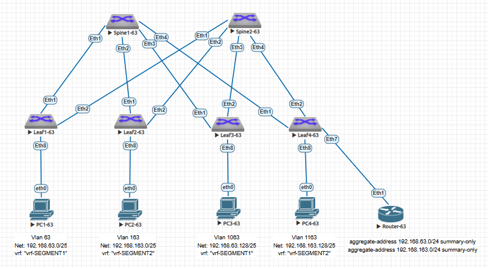

### VxLAN. Routing.

### Задание:
- Реализовать передачу суммарных префиксов через EVPN route-type 5.

### В среде виртуализации EVE-NG cобрана и настроена топология Underlay/Overlay сети Spine-Leaf в качестве которых используются L3-коммутаторы Arista с подключенными к ним устройствами "PC" имитирующими потребителей сервиса.
- 1: для настройки сегмента Underlay используется протокол динамической маршрутизации ISIS;
- 2: для настройки сегмента Overlay используется протокол динамической маршрутизации eBGP;
- 3: На Spine1-63,  Spine2-63, Leaf1-63, Leaf2-63, Leaf3-63 настроена опция BGP "allowas-in 1", позволяющая им принимать маршруты, в AS_PATH которых встречается номер их собственной AS не более одного раза;
- 4: На Leaf4-63 настроена опция BGP "allowas-in 2", позволяющая ему принимать маршруты, в AS_PATH которых встречается номер их собственной AS не более двух раз;
- 5 На Router-63 выполнена настройка суммирования префиксов, полученных из vrf "vrf-SEGMENT1" и vrf "vrf-SEGMENT2" VxLan фабрики и анонса в обратном направлении только суммарных префиксов:<br>
   * aggregate-address 192.168.63.0/24 summary-only;<br>
   * aggregate-address 192.168.163.0/24 summary-only;
- 6: Потребители сервиса "PC" разнесены по собственным подсетям x.x.x.x/25 и Vlan-ам;
- 7: Подсети устройств потребители сервиса:
    * "PC1-63" и "PC3-63" терминируются в отдельном vrf "vrf-SEGMENT1";
    * "PC2-63" и "PC4-63" терминируются в отдельном vrf "vrf-SEGMENT2".
 


### IP план:

<details>
  
Device|Interface|IP Address|Subnet Mask|Gateway|vrf
---|---|---|---|---|---
Spine1-63|Loopback0 (Underlay)|10.63.0.1|/32|-|-
-|Loopback1 (Overlay)|10.63.0.101|/32|-|-
-|Ethernet1|10.63.1.0|/31|-|-
-|Ethernet2|10.63.1.2|/31|-|-
-|Ethernet3|10.63.1.4|/31|-|-
-|Ethernet4|10.63.1.6|/31|-|-
Spine2-63|Loopback0 (Underlay)|10.63.0.2|/32|-|-
-|Loopback1 (Overlay)|10.63.0.102|/32|-|-
-|Ethernet1|10.63.2.0|/31|-|-
-|Ethernet2|10.63.2.2|/31|-|-
-|Ethernet3|10.63.2.4|/31|-|-
-|Ethernet4|10.63.2.6|/31|-|-
Leaf1-63|Loopback0 (Underlay)|10.63.0.11|/32|-|-
-|Loopback1 (Overlay)|10.63.0.111|/32|-|-
-|Ethernet1|10.63.1.1|/31|-|-
-|Ethernet2|10.63.2.1|/31|-|-
-|Vlan63 (GW for Net 192.168.63.0/25)|192.168.63.1|/25|-|vrf-SEGMENT1
-|Vlan163 (GW for Net 192.168.163.0/25)|192.168.63.1|/25|-|vrf-SEGMENT2
Leaf2-63|Loopback0 (Underlay)|10.63.0.12|/32|-|-
-|Loopback1 (Overlay)|10.63.0.112|/32|-|-
-|Ethernet1|10.63.1.3|/31|-|-
-|Ethernet2|10.63.2.3|/31|-|-
-|Vlan163 (GW for Net 192.168.163.0/25)|192.168.163.1|/25|-|vrf-SEGMENT2
Leaf3-63|Loopback0 (Underlay)|10.63.0.13|/32|-|-
-|Loopback1 (Overlay)|10.63.0.113|/32|-|-
-|Ethernet1|10.63.1.5|/31|-|-
-|Ethernet2|10.63.2.5|/31|-|-
-|Vlan1063 (GW for Net 192.168.63.128/25)|192.168.63.129|/25|-|vrf-SEGMENT1
Leaf4-63|Loopback0 (Underlay)|10.63.0.14|/32|-|-
-|Loopback1 (Overlay)|10.63.0.114|/32|-|-
-|Ethernet1|10.63.1.7|/31|-|-
-|Ethernet2|10.63.2.7|/31|-|-
-|Vlan1163 (GW for Net 192.168.163.128/25)|192.168.163.129|/25|-|vrf-SEGMENT2
PC1-63|eth0|192.168.63.2|/25|192.168.63.1|vrf-SEGMENT1
PC2-63|eth0|192.168.163.2|/25|192.168.163.1|vrf-SEGMENT2
PC3-63|eth0|192.168.63.130|/25|192.168.63.129|vrf-SEGMENT1
PC4-63|eth0|192.168.163.130|/25|192.168.163.129|vrf-SEGMENT2
PC5-63|eth0|192.168.163.3|/25|192.168.163.1|vrf-SEGMENT2

</details>

### Конфигурация оборудования
</details>
<details>
<summary> Spine1-63 </summary>

 ```
Spine1-63#sh run
! Command: show running-config
! device: Spine1-63 (vEOS-lab, EOS-4.29.2F)
!
! boot system flash:/vEOS-lab.swi
!
no aaa root
!
transceiver qsfp default-mode 4x10G
!
service routing protocols model multi-agent
!
hostname Spine1-63
!
spanning-tree mode mstp
!
interface Ethernet1
   description to Eth1 Leaf1-63
   mtu 9000
   no switchport
   ip address 10.63.1.0/31
   bfd interval 100 min-rx 100 multiplier 3
   isis enable UNDERLAY
   isis network point-to-point
   isis authentication mode text
   isis authentication key 7 WkfPNQfla08=
!
interface Ethernet2
   description to Eth1 Leaf2-63
   mtu 9000
   no switchport
   ip address 10.63.1.2/31
   bfd interval 100 min-rx 100 multiplier 3
   isis enable UNDERLAY
   isis network point-to-point
   isis authentication mode text
   isis authentication key 7 WkfPNQfla08=
!
interface Ethernet3
   description to Eth1 Leaf3-63
   mtu 9000
   no switchport
   ip address 10.63.1.4/31
   bfd interval 100 min-rx 100 multiplier 3
   isis enable UNDERLAY
   isis network point-to-point
   isis authentication mode text
   isis authentication key 7 WkfPNQfla08=
!
interface Ethernet4
   description to Eth1 Leaf4-63
   mtu 9000
   no switchport
   ip address 10.63.1.6/31
   bfd interval 100 min-rx 100 multiplier 3
   isis enable UNDERLAY
   isis network point-to-point
   isis authentication mode text
   isis authentication key 7 WkfPNQfla08=
!
interface Ethernet5
!
interface Ethernet6
!
interface Ethernet7
!
interface Ethernet8
!
interface Loopback0
   description for Underlay
   ip address 10.63.0.1/32
   isis enable UNDERLAY
!
interface Loopback1
   description for Overlay
   ip address 10.63.0.101/32
   isis enable UNDERLAY
!
interface Management1
!
ip routing
!
router bgp 4200063101
   neighbor EVPN-OVERLAY peer group
   neighbor EVPN-OVERLAY next-hop-unchanged
   neighbor EVPN-OVERLAY update-source Loopback1
   neighbor EVPN-OVERLAY ebgp-multihop 3
   neighbor EVPN-OVERLAY send-community extended
   neighbor 10.63.0.111 peer group EVPN-OVERLAY
   neighbor 10.63.0.111 remote-as 4200063111
   neighbor 10.63.0.112 peer group EVPN-OVERLAY
   neighbor 10.63.0.112 remote-as 4200063112
   neighbor 10.63.0.113 peer group EVPN-OVERLAY
   neighbor 10.63.0.113 remote-as 4200063113
   neighbor 10.63.0.114 peer group EVPN-OVERLAY
   neighbor 10.63.0.114 remote-as 4200063114
   neighbor 10.63.0.114 allowas-in 1
   !
   address-family evpn
      neighbor EVPN-OVERLAY activate
!
router isis UNDERLAY
   net 49.0001.0100.6300.0001.00
   router-id ipv4 10.63.0.1
   !
   address-family ipv4 unicast
!
end
```
</details>
<details>
<summary> Spine2-63 </summary>
   
 ```
Spine2-63#sh run
! Command: show running-config
! device: Spine2-63 (vEOS-lab, EOS-4.29.2F)
!
! boot system flash:/vEOS-lab.swi
!
no aaa root
!
transceiver qsfp default-mode 4x10G
!
service routing protocols model multi-agent
!
hostname Spine2-63
!
spanning-tree mode mstp
!
interface Ethernet1
   description to Eth2 Leaf1-63
   mtu 9000
   no switchport
   ip address 10.63.2.0/31
   bfd interval 100 min-rx 100 multiplier 3
   isis enable UNDERLAY
   isis network point-to-point
   isis authentication mode text
   isis authentication key 7 WkfPNQfla08=
!
interface Ethernet2
   description to Eth2 Leaf2-63
   mtu 9000
   no switchport
   ip address 10.63.2.2/31
   bfd interval 100 min-rx 100 multiplier 3
   isis enable UNDERLAY
   isis network point-to-point
   isis authentication mode text
   isis authentication key 7 WkfPNQfla08=
!
interface Ethernet3
   description to Eth2 Leaf3-63
   mtu 9000
   no switchport
   ip address 10.63.2.4/31
   bfd interval 100 min-rx 100 multiplier 3
   isis enable UNDERLAY
   isis network point-to-point
   isis authentication mode text
   isis authentication key 7 WkfPNQfla08=
!
interface Ethernet4
   description to Eth2 Leaf4-63
   mtu 9000
   no switchport
   ip address 10.63.2.6/31
   bfd interval 100 min-rx 100 multiplier 3
   isis enable UNDERLAY
   isis network point-to-point
   isis authentication mode text
   isis authentication key 7 WkfPNQfla08=
!
interface Ethernet5
!
interface Ethernet6
!
interface Ethernet7
!
interface Ethernet8
!
interface Loopback0
   description for Underlay
   ip address 10.63.0.2/32
   isis enable UNDERLAY
!
interface Loopback1
   description for Overlay
   ip address 10.63.0.102/32
   isis enable UNDERLAY
!
interface Management1
!
ip routing
!
router bgp 4200063101
   neighbor EVPN-OVERLAY peer group
   neighbor EVPN-OVERLAY next-hop-unchanged
   neighbor EVPN-OVERLAY update-source Loopback1
   neighbor EVPN-OVERLAY ebgp-multihop 3
   neighbor EVPN-OVERLAY send-community extended
   neighbor 10.63.0.111 peer group EVPN-OVERLAY
   neighbor 10.63.0.111 remote-as 4200063111
   neighbor 10.63.0.112 peer group EVPN-OVERLAY
   neighbor 10.63.0.112 remote-as 4200063112
   neighbor 10.63.0.113 peer group EVPN-OVERLAY
   neighbor 10.63.0.113 remote-as 4200063113
   neighbor 10.63.0.114 peer group EVPN-OVERLAY
   neighbor 10.63.0.114 remote-as 4200063114
   neighbor 10.63.0.114 allowas-in 1
   !
   address-family evpn
      neighbor EVPN-OVERLAY activate
!
router isis UNDERLAY
   net 49.0001.0100.6300.0002.00
   router-id ipv4 10.63.0.2
   !
   address-family ipv4 unicast
!
end
```
</details>
<details>
<summary> Leaf1-63 </summary>
   
 ```
Leaf1-63#sh run
! Command: show running-config
! device: Leaf1-63 (vEOS-lab, EOS-4.29.2F)
!
! boot system flash:/vEOS-lab.swi
!
no aaa root
!
transceiver qsfp default-mode 4x10G
!
service routing protocols model multi-agent
!
hostname Leaf1-63
!
spanning-tree mode mstp
!
vlan 63
   name Overlay_DC63_vrf-SEGMENT1
!
vlan 163
   name Overlay_DC63_vrf-SEGMENT2
!
vrf instance vrf-SEGMENT1
!
vrf instance vrf-SEGMENT2
!
interface Ethernet1
   description to Eth1 Spine1-63
   mtu 9000
   no switchport
   ip address 10.63.1.1/31
   bfd interval 100 min-rx 100 multiplier 3
   isis enable UNDERLAY
   isis network point-to-point
   isis authentication mode text
   isis authentication key 7 WkfPNQfla08=
!
interface Ethernet2
   description to Eth1 Spine2-63
   mtu 9000
   no switchport
   ip address 10.63.2.1/31
   bfd interval 100 min-rx 100 multiplier 3
   isis enable UNDERLAY
   isis network point-to-point
   isis authentication mode text
   isis authentication key 7 WkfPNQfla08=
!
interface Ethernet3
!
interface Ethernet4
!
interface Ethernet5
!
interface Ethernet6
!
interface Ethernet7
   description to Eth0 PC5-63
   switchport access vlan 163
!
interface Ethernet8
   description to Eth0 PC1-63
   switchport access vlan 63
!
interface Loopback0
   description for Underlay
   ip address 10.63.0.11/32
   isis enable UNDERLAY
!
interface Loopback1
   description for Overlay
   ip address 10.63.0.111/32
   isis enable UNDERLAY
!
interface Management1
!
interface Vlan63
   vrf vrf-SEGMENT1
   ip address virtual 192.168.63.1/25
!
interface Vlan163
   vrf vrf-SEGMENT2
   ip address virtual 192.168.163.1/25
!
interface Vxlan1
   vxlan source-interface Loopback1
   vxlan udp-port 4789
   vxlan vlan 63 vni 10063
   vxlan vlan 163 vni 10163
   vxlan vrf vrf-SEGMENT1 vni 100063
   vxlan vrf vrf-SEGMENT2 vni 100163
   vxlan learn-restrict any
!
ip virtual-router mac-address 00:00:00:63:10:01
!
ip routing
ip routing vrf vrf-SEGMENT1
ip routing vrf vrf-SEGMENT2
!
router bgp 4200063111
   neighbor EVPN-OVERLAY peer group
   neighbor EVPN-OVERLAY remote-as 4200063101
   neighbor EVPN-OVERLAY update-source Loopback1
   neighbor EVPN-OVERLAY description Spine's
   neighbor EVPN-OVERLAY ebgp-multihop 3
   neighbor EVPN-OVERLAY send-community extended
   neighbor 10.63.0.101 peer group EVPN-OVERLAY
   neighbor 10.63.0.101 allowas-in 1
   neighbor 10.63.0.102 peer group EVPN-OVERLAY
   neighbor 10.63.0.102 allowas-in 1
   !
   vlan 163
      rd 4200063111:10163
      route-target both 163:10163
      redistribute learned
   !
   vlan 63
      rd 4200063111:10063
      route-target both 63:10063
      redistribute learned
   !
   address-family evpn
      neighbor EVPN-OVERLAY activate
   !
   vrf vrf-SEGMENT1
      rd 10.63.0.111:1
      route-target import evpn 1:100063
      route-target export evpn 1:100063
      redistribute connected
   !
   vrf vrf-SEGMENT2
      rd 10.63.0.111:2
      route-target import evpn 2:100163
      route-target export evpn 2:100163
      redistribute connected
!
router isis UNDERLAY
   net 49.0001.0100.6300.0011.00
   router-id ipv4 10.63.0.11
   redistribute connected
   !
   address-family ipv4 unicast
!
end
```
</details>
<details>
<summary> Leaf2-63 </summary>
   
 ```
Leaf2-63#sh run
! Command: show running-config
! device: Leaf2-63 (vEOS-lab, EOS-4.29.2F)
!
! boot system flash:/vEOS-lab.swi
!
no aaa root
!
transceiver qsfp default-mode 4x10G
!
service routing protocols model multi-agent
!
hostname Leaf2-63
!
spanning-tree mode mstp
!
vlan 163
   name Overlay_DC63_vrf-SEGMENT2
!
vrf instance vrf-SEGMENT2
!
interface Ethernet1
   description to Eth2 Spine1-63
   mtu 9000
   no switchport
   ip address 10.63.1.3/31
   bfd interval 100 min-rx 100 multiplier 3
   isis enable UNDERLAY
   isis network point-to-point
   isis authentication mode text
   isis authentication key 7 WkfPNQfla08=
!
interface Ethernet2
   description to Eth2 Spine2-63
   mtu 9000
   no switchport
   ip address 10.63.2.3/31
   bfd interval 100 min-rx 100 multiplier 3
   isis enable UNDERLAY
   isis network point-to-point
   isis authentication mode text
   isis authentication key 7 WkfPNQfla08=
!
interface Ethernet3
!
interface Ethernet4
!
interface Ethernet5
!
interface Ethernet6
!
interface Ethernet7
!
interface Ethernet8
   description to Eth0 PC2-63
   switchport access vlan 163
!
interface Loopback0
   description for Underlay
   ip address 10.63.0.12/32
   isis enable UNDERLAY
!
interface Loopback1
   description for Overlay
   ip address 10.63.0.112/32
   isis enable UNDERLAY
!
interface Management1
!
interface Vlan163
   vrf vrf-SEGMENT2
   ip address virtual 192.168.163.1/25
!
interface Vxlan1
   vxlan source-interface Loopback1
   vxlan udp-port 4789
   vxlan vlan 163 vni 10163
   vxlan vrf vrf-SEGMENT2 vni 100163
   vxlan learn-restrict any
!
ip virtual-router mac-address 00:00:00:63:10:02
!
ip routing
ip routing vrf vrf-SEGMENT2
!
router bgp 4200063112
   neighbor EVPN-OVERLAY peer group
   neighbor EVPN-OVERLAY remote-as 4200063101
   neighbor EVPN-OVERLAY update-source Loopback1
   neighbor EVPN-OVERLAY description Spine's
   neighbor EVPN-OVERLAY ebgp-multihop 3
   neighbor EVPN-OVERLAY send-community extended
   neighbor 10.63.0.101 peer group EVPN-OVERLAY
   neighbor 10.63.0.101 allowas-in 1
   neighbor 10.63.0.102 peer group EVPN-OVERLAY
   neighbor 10.63.0.102 allowas-in 1
   !
   vlan 163
      rd 4200063112:10163
      route-target both 163:10163
      redistribute learned
   !
   address-family evpn
      neighbor EVPN-OVERLAY activate
   !
   vrf vrf-SEGMENT2
      rd 10.63.0.112:2
      route-target import evpn 2:100163
      route-target export evpn 2:100163
      redistribute connected
!
router isis UNDERLAY
   net 49.0001.0100.6300.0012.00
   router-id ipv4 10.63.0.12
   redistribute connected
   !
   address-family ipv4 unicast
!
end
```
</details>
<details>
<summary> Leaf3-63 </summary>
   
 ```
Leaf3-63#sh run
! Command: show running-config
! device: Leaf3-63 (vEOS-lab, EOS-4.29.2F)
!
! boot system flash:/vEOS-lab.swi
!
no aaa root
!
transceiver qsfp default-mode 4x10G
!
service routing protocols model multi-agent
!
hostname Leaf3-63
!
spanning-tree mode mstp
!
vlan 1063
   name Overlay_DC63_vrf-SEGMENT1
!
vrf instance vrf-SEGMENT1
!
interface Ethernet1
   description to Eth3 Spine1-63
   mtu 9000
   no switchport
   ip address 10.63.1.5/31
   bfd interval 100 min-rx 100 multiplier 3
   isis enable UNDERLAY
   isis network point-to-point
   isis authentication mode text
   isis authentication key 7 WkfPNQfla08=
!
interface Ethernet2
   description to Eth3 Spine2-63
   mtu 9000
   no switchport
   ip address 10.63.2.5/31
   bfd interval 100 min-rx 100 multiplier 3
   isis enable UNDERLAY
   isis network point-to-point
   isis authentication mode text
   isis authentication key 7 WkfPNQfla08=
!
interface Ethernet3
!
interface Ethernet4
!
interface Ethernet5
!
interface Ethernet6
!
interface Ethernet7
!
interface Ethernet8
   description to Eth0 PC3-63
   switchport access vlan 1063
!
interface Loopback0
   description for Underlay
   ip address 10.63.0.13/32
   isis enable UNDERLAY
!
interface Loopback1
   description for Overlay
   ip address 10.63.0.113/32
   isis enable UNDERLAY
!
interface Management1
!
interface Vlan1063
   vrf vrf-SEGMENT1
   ip address virtual 192.168.63.129/25
!
interface Vxlan1
   vxlan source-interface Loopback1
   vxlan udp-port 4789
   vxlan vlan 1063 vni 11063
   vxlan vrf vrf-SEGMENT1 vni 100063
   vxlan learn-restrict any
!
ip virtual-router mac-address 00:00:00:63:10:03
!
ip routing
ip routing vrf vrf-SEGMENT1
!
router bgp 4200063113
   neighbor EVPN-OVERLAY peer group
   neighbor EVPN-OVERLAY remote-as 4200063101
   neighbor EVPN-OVERLAY update-source Loopback1
   neighbor EVPN-OVERLAY description Spine's
   neighbor EVPN-OVERLAY ebgp-multihop 3
   neighbor EVPN-OVERLAY send-community extended
   neighbor 10.63.0.101 peer group EVPN-OVERLAY
   neighbor 10.63.0.101 allowas-in 1
   neighbor 10.63.0.102 peer group EVPN-OVERLAY
   neighbor 10.63.0.102 allowas-in 1
   !
   vlan 1063
      rd 4200063113:11063
      route-target both 1063:11063
      redistribute learned
   !
   address-family evpn
      neighbor EVPN-OVERLAY activate
   !
   vrf vrf-SEGMENT1
      rd 10.63.0.113:1
      route-target import evpn 1:100063
      route-target export evpn 1:100063
      redistribute connected
!
router isis UNDERLAY
   net 49.0001.0100.6300.0013.00
   router-id ipv4 10.63.0.13
   redistribute connected
   !
   address-family ipv4 unicast
!
end
```
</details>
<details>
<summary> Leaf4-63 </summary>
   
 ```
Leaf4-63#sh run
! Command: show running-config
! device: Leaf4-63 (vEOS-lab, EOS-4.29.2F)
!
! boot system flash:/vEOS-lab.swi
!
no aaa root
!
transceiver qsfp default-mode 4x10G
!
service routing protocols model multi-agent
!
hostname Leaf4-63
!
spanning-tree mode mstp
!
vlan 1163
   name Overlay_DC63_vrf-SEGMENT2
!
vrf instance vrf-SEGMENT1
!
vrf instance vrf-SEGMENT2
!
interface Ethernet1
   description to Eth4 Spine1-63
   mtu 9000
   no switchport
   ip address 10.63.1.7/31
   bfd interval 100 min-rx 100 multiplier 3
   isis enable UNDERLAY
   isis network point-to-point
   isis authentication mode text
   isis authentication key 7 WkfPNQfla08=
!
interface Ethernet2
   description to Eth4 Spine2-63
   mtu 9000
   no switchport
   ip address 10.63.2.7/31
   bfd interval 100 min-rx 100 multiplier 3
   isis enable UNDERLAY
   isis network point-to-point
   isis authentication mode text
   isis authentication key 7 WkfPNQfla08=
!
interface Ethernet3
!
interface Ethernet4
!
interface Ethernet5
!
interface Ethernet6
!
interface Ethernet7
   description to Eth1 Router-63
   mtu 9000
   no switchport
   bfd interval 100 min-rx 100 multiplier 3
!
interface Ethernet7.2063
   encapsulation dot1q vlan 2063
   vrf vrf-SEGMENT1
   ip address 10.63.63.1/31
!
interface Ethernet7.2163
   encapsulation dot1q vlan 2163
   vrf vrf-SEGMENT2
   ip address 10.63.163.1/31
!
interface Ethernet8
   description to Eth0 PC4-63
   switchport access vlan 1163
!
interface Loopback0
   description for Underlay
   ip address 10.63.0.14/32
   isis enable UNDERLAY
!
interface Loopback1
   description for Overlay
   ip address 10.63.0.114/32
   isis enable UNDERLAY
!
interface Management1
!
interface Vlan1163
   vrf vrf-SEGMENT2
   ip address virtual 192.168.163.129/25
!
interface Vxlan1
   vxlan source-interface Loopback1
   vxlan udp-port 4789
   vxlan vlan 1163 vni 11163
   vxlan vrf vrf-SEGMENT1 vni 100063
   vxlan vrf vrf-SEGMENT2 vni 100163
   vxlan learn-restrict any
!
ip virtual-router mac-address 00:00:00:63:10:04
!
ip routing
ip routing vrf vrf-SEGMENT1
ip routing vrf vrf-SEGMENT2
!
router bgp 4200063114
   neighbor EVPN-OVERLAY peer group
   neighbor EVPN-OVERLAY remote-as 4200063101
   neighbor EVPN-OVERLAY update-source Loopback1
   neighbor EVPN-OVERLAY description Spine's
   neighbor EVPN-OVERLAY ebgp-multihop 3
   neighbor EVPN-OVERLAY send-community extended
   neighbor 10.63.0.101 peer group EVPN-OVERLAY
   neighbor 10.63.0.102 peer group EVPN-OVERLAY
   !
   vlan 1163
      rd 4200063114:11163
      route-target both 1163:11163
      redistribute learned
   !
   address-family evpn
      neighbor EVPN-OVERLAY activate
   !
   address-family ipv4
      neighbor 10.63.63.0 activate
      neighbor 10.63.163.0 activate
   !
   vrf vrf-SEGMENT1
      rd 10.63.0.114:1
      route-target import evpn 1:100063
      route-target export evpn 1:100063
      neighbor 10.63.63.0 remote-as 4200063163
      neighbor 10.63.63.0 allowas-in 2
      redistribute connected
   !
   vrf vrf-SEGMENT2
      rd 10.63.0.114:2
      route-target import evpn 2:100163
      route-target export evpn 2:100163
      neighbor 10.63.163.0 remote-as 4200063163
      neighbor 10.63.163.0 allowas-in 2
      redistribute connected
!
router isis UNDERLAY
   net 49.0001.0100.6300.0014.00
   router-id ipv4 10.63.0.14
   redistribute connected
   !
   address-family ipv4 unicast
!
end
```
</details>
<details>
<summary> Router-63 </summary>
   
 ```
Router-63#sh run
! Command: show running-config
! device: Router-63 (vEOS-lab, EOS-4.29.2F)
!
! boot system flash:/vEOS-lab.swi
!
no aaa root
!
transceiver qsfp default-mode 4x10G
!
service routing protocols model multi-agent
!
hostname Router-63
!
spanning-tree mode mstp
!
interface Ethernet1
   description to Eth7 Leaf4-63
   mtu 9000
   no switchport
   bfd interval 100 min-rx 100 multiplier 3
!
interface Ethernet1.2063
   encapsulation dot1q vlan 2063
   ip address 10.63.63.0/31
!
interface Ethernet1.2163
   encapsulation dot1q vlan 2163
   ip address 10.63.163.0/31
!
interface Ethernet2
!
interface Ethernet3
!
interface Ethernet4
!
interface Ethernet5
!
interface Ethernet6
!
interface Ethernet7
!
interface Ethernet8
!
interface Loopback1
   ip address 10.63.0.255/32
!
interface Management1
!
ip routing
!
router bgp 4200063163
   router-id 10.63.0.255
   neighbor AGG-NET-RT-FABRIC peer group
   neighbor AGG-NET-RT-FABRIC remote-as 4200063114
   neighbor 10.63.63.1 peer group AGG-NET-RT-FABRIC
   neighbor 10.63.163.1 peer group AGG-NET-RT-FABRIC
   aggregate-address 192.168.63.0/24 summary-only
   aggregate-address 192.168.163.0/24 summary-only
   !
   address-family ipv4
      neighbor AGG-NET-RT-FABRIC activate
!
end
```
</details>
<details>
<summary> PC1-63 </summary>
   
 ```
PC1-63> sh ip

NAME        : PC1-63[1]
IP/MASK     : 192.168.63.2/25
GATEWAY     : 192.168.63.1
DNS         :
MAC         : 00:50:79:66:68:2e
LPORT       : 20000
RHOST:PORT  : 127.0.0.1:30000
MTU         : 1500
```
</details>
<details>
<summary> PC2-52 </summary>
   
 ```
PC2-63> sh ip

NAME        : PC2-63[1]
IP/MASK     : 192.168.163.2/25
GATEWAY     : 192.168.163.1
DNS         :
MAC         : 00:50:79:66:68:2f
LPORT       : 20000
RHOST:PORT  : 127.0.0.1:30000
MTU         : 1500
```
</details>
<details>
<summary> PC3-52 </summary>
   
 ```
PC3-63> sh ip

NAME        : PC3-63[1]
IP/MASK     : 192.168.63.130/25
GATEWAY     : 192.168.63.129
DNS         :
MAC         : 00:50:79:66:68:30
LPORT       : 20000
RHOST:PORT  : 127.0.0.1:30000
MTU         : 1500
```
</details>
<details>
<summary> PC4-52 </summary>
   
 ```
PC4-63> sh ip

NAME        : PC4-63[1]
IP/MASK     : 192.168.163.130/25
GATEWAY     : 192.168.163.129
DNS         :
MAC         : 00:50:79:66:68:31
LPORT       : 20000
RHOST:PORT  : 127.0.0.1:30000
MTU         : 1500
```
</details>
<details>
<summary> PC5-52 </summary>
   
 ```
PC5-63> sh ip

NAME        : PC5-63[1]
IP/MASK     : 192.168.163.3/25
GATEWAY     : 192.168.163.1
DNS         :
MAC         : 00:50:79:66:68:32
LPORT       : 20000
RHOST:PORT  : 127.0.0.1:30000
MTU         : 1500
```
</details>

#### Диагностика оборудования.

<details>
<summary> Spine1-63 diag </summary>
 
 ```
Spine1-63#show bgp evpn route-type ip-prefix ipv4
BGP routing table information for VRF default
Router identifier 10.63.0.101, local AS number 4200063101
Route status codes: * - valid, > - active, S - Stale, E - ECMP head, e - ECMP
                    c - Contributing to ECMP, % - Pending BGP convergence
Origin codes: i - IGP, e - EGP, ? - incomplete
AS Path Attributes: Or-ID - Originator ID, C-LST - Cluster List, LL Nexthop - Link Local Nexthop

          Network                Next Hop              Metric  LocPref Weight  Path
 * >      RD: 10.63.0.114:1 ip-prefix 10.63.63.0/31
                                 10.63.0.114           -       100     0       4200063114 i
 * >      RD: 10.63.0.114:2 ip-prefix 10.63.63.0/31
                                 10.63.0.114           -       100     0       4200063114 4200063163 4200063114 i
 * >      RD: 10.63.0.114:1 ip-prefix 10.63.163.0/31
                                 10.63.0.114           -       100     0       4200063114 4200063163 4200063114 i
 * >      RD: 10.63.0.114:2 ip-prefix 10.63.163.0/31
                                 10.63.0.114           -       100     0       4200063114 i
 * >      RD: 10.63.0.114:1 ip-prefix 192.168.63.0/24
                                 10.63.0.114           -       100     0       4200063114 4200063163 4200063114 4200063101 i
 * >      RD: 10.63.0.114:2 ip-prefix 192.168.63.0/24
                                 10.63.0.114           -       100     0       4200063114 4200063163 4200063114 4200063101 i
 * >      RD: 10.63.0.111:1 ip-prefix 192.168.63.0/25
                                 10.63.0.111           -       100     0       4200063111 i
 * >      RD: 10.63.0.113:1 ip-prefix 192.168.63.128/25
                                 10.63.0.113           -       100     0       4200063113 i
 * >      RD: 10.63.0.114:1 ip-prefix 192.168.163.0/24
                                 10.63.0.114           -       100     0       4200063114 4200063163 4200063114 i
 * >      RD: 10.63.0.114:2 ip-prefix 192.168.163.0/24
                                 10.63.0.114           -       100     0       4200063114 4200063163 4200063114 i
 * >      RD: 10.63.0.111:2 ip-prefix 192.168.163.0/25
                                 10.63.0.111           -       100     0       4200063111 i
 * >      RD: 10.63.0.112:2 ip-prefix 192.168.163.0/25
                                 10.63.0.112           -       100     0       4200063112 i
 * >      RD: 10.63.0.114:2 ip-prefix 192.168.163.128/25
                                 10.63.0.114           -       100     0       4200063114 i
```
</details>
<details>
<summary> Spine2-63 diag </summary>
 
 ```
Spine2-63#show bgp evpn route-type ip-prefix ipv4
BGP routing table information for VRF default
Router identifier 10.63.0.102, local AS number 4200063101
Route status codes: * - valid, > - active, S - Stale, E - ECMP head, e - ECMP
                    c - Contributing to ECMP, % - Pending BGP convergence
Origin codes: i - IGP, e - EGP, ? - incomplete
AS Path Attributes: Or-ID - Originator ID, C-LST - Cluster List, LL Nexthop - Link Local Nexthop

          Network                Next Hop              Metric  LocPref Weight  Path
 * >      RD: 10.63.0.114:1 ip-prefix 10.63.63.0/31
                                 10.63.0.114           -       100     0       4200063114 i
 * >      RD: 10.63.0.114:2 ip-prefix 10.63.63.0/31
                                 10.63.0.114           -       100     0       4200063114 4200063163 4200063114 i
 * >      RD: 10.63.0.114:1 ip-prefix 10.63.163.0/31
                                 10.63.0.114           -       100     0       4200063114 4200063163 4200063114 i
 * >      RD: 10.63.0.114:2 ip-prefix 10.63.163.0/31
                                 10.63.0.114           -       100     0       4200063114 i
 * >      RD: 10.63.0.114:1 ip-prefix 192.168.63.0/24
                                 10.63.0.114           -       100     0       4200063114 4200063163 4200063114 4200063101 i
 * >      RD: 10.63.0.114:2 ip-prefix 192.168.63.0/24
                                 10.63.0.114           -       100     0       4200063114 4200063163 4200063114 4200063101 i
 * >      RD: 10.63.0.111:1 ip-prefix 192.168.63.0/25
                                 10.63.0.111           -       100     0       4200063111 i
 *        RD: 10.63.0.111:1 ip-prefix 192.168.63.0/25
                                 10.63.0.111           -       100     0       4200063114 4200063101 4200063111 i
 * >      RD: 10.63.0.113:1 ip-prefix 192.168.63.128/25
                                 10.63.0.113           -       100     0       4200063113 i
 *        RD: 10.63.0.113:1 ip-prefix 192.168.63.128/25
                                 10.63.0.113           -       100     0       4200063114 4200063101 4200063113 i
 * >      RD: 10.63.0.114:1 ip-prefix 192.168.163.0/24
                                 10.63.0.114           -       100     0       4200063114 4200063163 4200063114 i
 * >      RD: 10.63.0.114:2 ip-prefix 192.168.163.0/24
                                 10.63.0.114           -       100     0       4200063114 4200063163 4200063114 i
 * >      RD: 10.63.0.111:2 ip-prefix 192.168.163.0/25
                                 10.63.0.111           -       100     0       4200063111 i
 *        RD: 10.63.0.111:2 ip-prefix 192.168.163.0/25
                                 10.63.0.111           -       100     0       4200063114 4200063101 4200063111 i
 * >      RD: 10.63.0.112:2 ip-prefix 192.168.163.0/25
                                 10.63.0.112           -       100     0       4200063112 i
 *        RD: 10.63.0.112:2 ip-prefix 192.168.163.0/25
                                 10.63.0.112           -       100     0       4200063114 4200063101 4200063112 i
 * >      RD: 10.63.0.114:2 ip-prefix 192.168.163.128/25
                                 10.63.0.114           -       100     0       4200063114 i
 ```
</details>
<details>
<summary> Leaf1-63 diag </summary>
 
 ```
Leaf1-63#show ip route vrf vrf-SEGMENT1

VRF: vrf-SEGMENT1
Codes: C - connected, S - static, K - kernel,
       O - OSPF, IA - OSPF inter area, E1 - OSPF external type 1,
       E2 - OSPF external type 2, N1 - OSPF NSSA external type 1,
       N2 - OSPF NSSA external type2, B - Other BGP Routes,
       B I - iBGP, B E - eBGP, R - RIP, I L1 - IS-IS level 1,
       I L2 - IS-IS level 2, O3 - OSPFv3, A B - BGP Aggregate,
       A O - OSPF Summary, NG - Nexthop Group Static Route,
       V - VXLAN Control Service, M - Martian,
       DH - DHCP client installed default route,
       DP - Dynamic Policy Route, L - VRF Leaked,
       G  - gRIBI, RC - Route Cache Route

Gateway of last resort is not set

 B E      10.63.63.0/31 [200/0] via VTEP 10.63.0.114 VNI 100063 router-mac 50:00:00:26:10:0e local-interface Vxlan1
 B E      10.63.163.0/31 [200/0] via VTEP 10.63.0.114 VNI 100063 router-mac 50:00:00:26:10:0e local-interface Vxlan1
 C        192.168.63.0/25 is directly connected, Vlan63
 B E      192.168.63.128/25 [200/0] via VTEP 10.63.0.113 VNI 100063 router-mac 50:00:00:2f:d8:fe local-interface Vxlan1
 B E      192.168.63.0/24 [200/0] via VTEP 10.63.0.114 VNI 100063 router-mac 50:00:00:26:10:0e local-interface Vxlan1
 B E      192.168.163.0/24 [200/0] via VTEP 10.63.0.114 VNI 100063 router-mac 50:00:00:26:10:0e local-interface Vxlan1

Leaf1-63#show ip route vrf vrf-SEGMENT2

VRF: vrf-SEGMENT2
Codes: C - connected, S - static, K - kernel,
       O - OSPF, IA - OSPF inter area, E1 - OSPF external type 1,
       E2 - OSPF external type 2, N1 - OSPF NSSA external type 1,
       N2 - OSPF NSSA external type2, B - Other BGP Routes,
       B I - iBGP, B E - eBGP, R - RIP, I L1 - IS-IS level 1,
       I L2 - IS-IS level 2, O3 - OSPFv3, A B - BGP Aggregate,
       A O - OSPF Summary, NG - Nexthop Group Static Route,
       V - VXLAN Control Service, M - Martian,
       DH - DHCP client installed default route,
       DP - Dynamic Policy Route, L - VRF Leaked,
       G  - gRIBI, RC - Route Cache Route

Gateway of last resort is not set

 B E      10.63.63.0/31 [200/0] via VTEP 10.63.0.114 VNI 100163 router-mac 50:00:00:26:10:0e local-interface Vxlan1
 B E      10.63.163.0/31 [200/0] via VTEP 10.63.0.114 VNI 100163 router-mac 50:00:00:26:10:0e local-interface Vxlan1
 B E      192.168.63.0/24 [200/0] via VTEP 10.63.0.114 VNI 100163 router-mac 50:00:00:26:10:0e local-interface Vxlan1
 C        192.168.163.0/25 is directly connected, Vlan163
 B E      192.168.163.128/25 [200/0] via VTEP 10.63.0.114 VNI 100163 router-mac 50:00:00:26:10:0e local-interface Vxlan1 B E      192.168.163.0/24 [200/0] via VTEP 10.63.0.114 VNI 100163 router-mac 50:00:00:26:10:0e local-interface Vxlan1

Leaf1-63#show bgp evpn route-type ip-prefix ipv4
BGP routing table information for VRF default
Router identifier 10.63.0.111, local AS number 4200063111
Route status codes: * - valid, > - active, S - Stale, E - ECMP head, e - ECMP
                    c - Contributing to ECMP, % - Pending BGP convergence
Origin codes: i - IGP, e - EGP, ? - incomplete
AS Path Attributes: Or-ID - Originator ID, C-LST - Cluster List, LL Nexthop - Link Local Nexthop

          Network                Next Hop              Metric  LocPref Weight  Path
 * >      RD: 10.63.0.114:1 ip-prefix 10.63.63.0/31
                                 10.63.0.114           -       100     0       4200063101 4200063114 i
 *        RD: 10.63.0.114:1 ip-prefix 10.63.63.0/31
                                 10.63.0.114           -       100     0       4200063101 4200063114 i
 * >      RD: 10.63.0.114:2 ip-prefix 10.63.63.0/31
                                 10.63.0.114           -       100     0       4200063101 4200063114 4200063163 4200063114 i
 *        RD: 10.63.0.114:2 ip-prefix 10.63.63.0/31
                                 10.63.0.114           -       100     0       4200063101 4200063114 4200063163 4200063114 i
 * >      RD: 10.63.0.114:1 ip-prefix 10.63.163.0/31
                                 10.63.0.114           -       100     0       4200063101 4200063114 4200063163 4200063114 i
 *        RD: 10.63.0.114:1 ip-prefix 10.63.163.0/31
                                 10.63.0.114           -       100     0       4200063101 4200063114 4200063163 4200063114 i
 * >      RD: 10.63.0.114:2 ip-prefix 10.63.163.0/31
                                 10.63.0.114           -       100     0       4200063101 4200063114 i
 *        RD: 10.63.0.114:2 ip-prefix 10.63.163.0/31
                                 10.63.0.114           -       100     0       4200063101 4200063114 i
 * >      RD: 10.63.0.114:1 ip-prefix 192.168.63.0/24
                                 10.63.0.114           -       100     0       4200063101 4200063114 4200063163 4200063114 4200063101 i
 *        RD: 10.63.0.114:1 ip-prefix 192.168.63.0/24
                                 10.63.0.114           -       100     0       4200063101 4200063114 4200063163 4200063114 4200063101 i
 * >      RD: 10.63.0.114:2 ip-prefix 192.168.63.0/24
                                 10.63.0.114           -       100     0       4200063101 4200063114 4200063163 4200063114 4200063101 i
 *        RD: 10.63.0.114:2 ip-prefix 192.168.63.0/24
                                 10.63.0.114           -       100     0       4200063101 4200063114 4200063163 4200063114 4200063101 i
 * >      RD: 10.63.0.111:1 ip-prefix 192.168.63.0/25
                                 -                     -       -       0       i
 * >      RD: 10.63.0.113:1 ip-prefix 192.168.63.128/25
                                 10.63.0.113           -       100     0       4200063101 4200063113 i
 *        RD: 10.63.0.113:1 ip-prefix 192.168.63.128/25
                                 10.63.0.113           -       100     0       4200063101 4200063113 i
 * >      RD: 10.63.0.114:1 ip-prefix 192.168.163.0/24
                                 10.63.0.114           -       100     0       4200063101 4200063114 4200063163 4200063114 i
 *        RD: 10.63.0.114:1 ip-prefix 192.168.163.0/24
                                 10.63.0.114           -       100     0       4200063101 4200063114 4200063163 4200063114 i
 * >      RD: 10.63.0.114:2 ip-prefix 192.168.163.0/24
                                 10.63.0.114           -       100     0       4200063101 4200063114 4200063163 4200063114 i
 *        RD: 10.63.0.114:2 ip-prefix 192.168.163.0/24
                                 10.63.0.114           -       100     0       4200063101 4200063114 4200063163 4200063114 i
 * >      RD: 10.63.0.111:2 ip-prefix 192.168.163.0/25
                                 -                     -       -       0       i
 * >      RD: 10.63.0.112:2 ip-prefix 192.168.163.0/25
                                 10.63.0.112           -       100     0       4200063101 4200063112 i
 *        RD: 10.63.0.112:2 ip-prefix 192.168.163.0/25
                                 10.63.0.112           -       100     0       4200063101 4200063112 i
 * >      RD: 10.63.0.114:2 ip-prefix 192.168.163.128/25
                                 10.63.0.114           -       100     0       4200063101 4200063114 i
 *        RD: 10.63.0.114:2 ip-prefix 192.168.163.128/25
                                 10.63.0.114           -       100     0       4200063101 4200063114 i
```
</details>
<details>
<summary> Leaf2-63 diag </summary>
 
 ```
Leaf2-63#show ip route vrf vrf-SEGMENT2

VRF: vrf-SEGMENT2
Codes: C - connected, S - static, K - kernel,
       O - OSPF, IA - OSPF inter area, E1 - OSPF external type 1,
       E2 - OSPF external type 2, N1 - OSPF NSSA external type 1,
       N2 - OSPF NSSA external type2, B - Other BGP Routes,
       B I - iBGP, B E - eBGP, R - RIP, I L1 - IS-IS level 1,
       I L2 - IS-IS level 2, O3 - OSPFv3, A B - BGP Aggregate,
       A O - OSPF Summary, NG - Nexthop Group Static Route,
       V - VXLAN Control Service, M - Martian,
       DH - DHCP client installed default route,
       DP - Dynamic Policy Route, L - VRF Leaked,
       G  - gRIBI, RC - Route Cache Route

Gateway of last resort is not set

 B E      10.63.63.0/31 [200/0] via VTEP 10.63.0.114 VNI 100163 router-mac 50:00:00:26:10:0e local-interface Vxlan1
 B E      10.63.163.0/31 [200/0] via VTEP 10.63.0.114 VNI 100163 router-mac 50:00:00:26:10:0e local-interface Vxlan1
 B E      192.168.63.0/24 [200/0] via VTEP 10.63.0.114 VNI 100163 router-mac 50:00:00:26:10:0e local-interface Vxlan1
 C        192.168.163.0/25 is directly connected, Vlan163
 B E      192.168.163.128/25 [200/0] via VTEP 10.63.0.114 VNI 100163 router-mac 50:00:00:26:10:0e local-interface Vxlan1 B E      192.168.163.0/24 [200/0] via VTEP 10.63.0.114 VNI 100163 router-mac 50:00:00:26:10:0e local-interface Vxlan1

Leaf2-63#show bgp evpn route-type ip-prefix ipv4
BGP routing table information for VRF default
Router identifier 10.63.0.112, local AS number 4200063112
Route status codes: * - valid, > - active, S - Stale, E - ECMP head, e - ECMP
                    c - Contributing to ECMP, % - Pending BGP convergence
Origin codes: i - IGP, e - EGP, ? - incomplete
AS Path Attributes: Or-ID - Originator ID, C-LST - Cluster List, LL Nexthop - Link Local Nexthop

          Network                Next Hop              Metric  LocPref Weight  Path
 * >      RD: 10.63.0.114:1 ip-prefix 10.63.63.0/31
                                 10.63.0.114           -       100     0       4200063101 4200063114 i
 *        RD: 10.63.0.114:1 ip-prefix 10.63.63.0/31
                                 10.63.0.114           -       100     0       4200063101 4200063114 i
 * >      RD: 10.63.0.114:2 ip-prefix 10.63.63.0/31
                                 10.63.0.114           -       100     0       4200063101 4200063114 4200063163 4200063114 i
 *        RD: 10.63.0.114:2 ip-prefix 10.63.63.0/31
                                 10.63.0.114           -       100     0       4200063101 4200063114 4200063163 4200063114 i
 * >      RD: 10.63.0.114:1 ip-prefix 10.63.163.0/31
                                 10.63.0.114           -       100     0       4200063101 4200063114 4200063163 4200063114 i
 *        RD: 10.63.0.114:1 ip-prefix 10.63.163.0/31
                                 10.63.0.114           -       100     0       4200063101 4200063114 4200063163 4200063114 i
 * >      RD: 10.63.0.114:2 ip-prefix 10.63.163.0/31
                                 10.63.0.114           -       100     0       4200063101 4200063114 i
 *        RD: 10.63.0.114:2 ip-prefix 10.63.163.0/31
                                 10.63.0.114           -       100     0       4200063101 4200063114 i
 * >      RD: 10.63.0.114:1 ip-prefix 192.168.63.0/24
                                 10.63.0.114           -       100     0       4200063101 4200063114 4200063163 4200063114 4200063101 i
 *        RD: 10.63.0.114:1 ip-prefix 192.168.63.0/24
                                 10.63.0.114           -       100     0       4200063101 4200063114 4200063163 4200063114 4200063101 i
 * >      RD: 10.63.0.114:2 ip-prefix 192.168.63.0/24
                                 10.63.0.114           -       100     0       4200063101 4200063114 4200063163 4200063114 4200063101 i
 *        RD: 10.63.0.114:2 ip-prefix 192.168.63.0/24
                                 10.63.0.114           -       100     0       4200063101 4200063114 4200063163 4200063114 4200063101 i
 * >      RD: 10.63.0.111:1 ip-prefix 192.168.63.0/25
                                 10.63.0.111           -       100     0       4200063101 4200063111 i
 *        RD: 10.63.0.111:1 ip-prefix 192.168.63.0/25
                                 10.63.0.111           -       100     0       4200063101 4200063111 i
 * >      RD: 10.63.0.113:1 ip-prefix 192.168.63.128/25
                                 10.63.0.113           -       100     0       4200063101 4200063113 i
 *        RD: 10.63.0.113:1 ip-prefix 192.168.63.128/25
                                 10.63.0.113           -       100     0       4200063101 4200063113 i
 * >      RD: 10.63.0.114:1 ip-prefix 192.168.163.0/24
                                 10.63.0.114           -       100     0       4200063101 4200063114 4200063163 4200063114 i
 *        RD: 10.63.0.114:1 ip-prefix 192.168.163.0/24
                                 10.63.0.114           -       100     0       4200063101 4200063114 4200063163 4200063114 i
 * >      RD: 10.63.0.114:2 ip-prefix 192.168.163.0/24
                                 10.63.0.114           -       100     0       4200063101 4200063114 4200063163 4200063114 i
 *        RD: 10.63.0.114:2 ip-prefix 192.168.163.0/24
                                 10.63.0.114           -       100     0       4200063101 4200063114 4200063163 4200063114 i
 * >      RD: 10.63.0.111:2 ip-prefix 192.168.163.0/25
                                 10.63.0.111           -       100     0       4200063101 4200063111 i
 *        RD: 10.63.0.111:2 ip-prefix 192.168.163.0/25
                                 10.63.0.111           -       100     0       4200063101 4200063111 i
 * >      RD: 10.63.0.112:2 ip-prefix 192.168.163.0/25
                                 -                     -       -       0       i
 * >      RD: 10.63.0.114:2 ip-prefix 192.168.163.128/25
                                 10.63.0.114           -       100     0       4200063101 4200063114 i
 *        RD: 10.63.0.114:2 ip-prefix 192.168.163.128/25
                                 10.63.0.114           -       100     0       4200063101 4200063114 i
```
</details>
<details>
<summary> Leaf3-63 diag </summary>
 
 ```
Leaf3-63#show ip route vrf vrf-SEGMENT1

VRF: vrf-SEGMENT1
Codes: C - connected, S - static, K - kernel,
       O - OSPF, IA - OSPF inter area, E1 - OSPF external type 1,
       E2 - OSPF external type 2, N1 - OSPF NSSA external type 1,
       N2 - OSPF NSSA external type2, B - Other BGP Routes,
       B I - iBGP, B E - eBGP, R - RIP, I L1 - IS-IS level 1,
       I L2 - IS-IS level 2, O3 - OSPFv3, A B - BGP Aggregate,
       A O - OSPF Summary, NG - Nexthop Group Static Route,
       V - VXLAN Control Service, M - Martian,
       DH - DHCP client installed default route,
       DP - Dynamic Policy Route, L - VRF Leaked,
       G  - gRIBI, RC - Route Cache Route

Gateway of last resort is not set

 B E      10.63.63.0/31 [200/0] via VTEP 10.63.0.114 VNI 100063 router-mac 50:00:00:26:10:0e local-interface Vxlan1
 B E      10.63.163.0/31 [200/0] via VTEP 10.63.0.114 VNI 100063 router-mac 50:00:00:26:10:0e local-interface Vxlan1
 B E      192.168.63.0/25 [200/0] via VTEP 10.63.0.111 VNI 100063 router-mac 50:00:00:45:ab:df local-interface Vxlan1
 C        192.168.63.128/25 is directly connected, Vlan1063
 B E      192.168.63.0/24 [200/0] via VTEP 10.63.0.114 VNI 100063 router-mac 50:00:00:26:10:0e local-interface Vxlan1
 B E      192.168.163.0/24 [200/0] via VTEP 10.63.0.114 VNI 100063 router-mac 50:00:00:26:10:0e local-interface Vxlan1

Leaf3-63#show bgp evpn route-type ip-prefix ipv4
BGP routing table information for VRF default
Router identifier 10.63.0.113, local AS number 4200063113
Route status codes: * - valid, > - active, S - Stale, E - ECMP head, e - ECMP
                    c - Contributing to ECMP, % - Pending BGP convergence
Origin codes: i - IGP, e - EGP, ? - incomplete
AS Path Attributes: Or-ID - Originator ID, C-LST - Cluster List, LL Nexthop - Link Local Nexthop

          Network                Next Hop              Metric  LocPref Weight  Path
 * >      RD: 10.63.0.114:1 ip-prefix 10.63.63.0/31
                                 10.63.0.114           -       100     0       4200063101 4200063114 i
 *        RD: 10.63.0.114:1 ip-prefix 10.63.63.0/31
                                 10.63.0.114           -       100     0       4200063101 4200063114 i
 * >      RD: 10.63.0.114:2 ip-prefix 10.63.63.0/31
                                 10.63.0.114           -       100     0       4200063101 4200063114 4200063163 4200063114 i
 *        RD: 10.63.0.114:2 ip-prefix 10.63.63.0/31
                                 10.63.0.114           -       100     0       4200063101 4200063114 4200063163 4200063114 i
 * >      RD: 10.63.0.114:1 ip-prefix 10.63.163.0/31
                                 10.63.0.114           -       100     0       4200063101 4200063114 4200063163 4200063114 i
 *        RD: 10.63.0.114:1 ip-prefix 10.63.163.0/31
                                 10.63.0.114           -       100     0       4200063101 4200063114 4200063163 4200063114 i
 * >      RD: 10.63.0.114:2 ip-prefix 10.63.163.0/31
                                 10.63.0.114           -       100     0       4200063101 4200063114 i
 *        RD: 10.63.0.114:2 ip-prefix 10.63.163.0/31
                                 10.63.0.114           -       100     0       4200063101 4200063114 i
 * >      RD: 10.63.0.114:1 ip-prefix 192.168.63.0/24
                                 10.63.0.114           -       100     0       4200063101 4200063114 4200063163 4200063114 4200063101 i
 *        RD: 10.63.0.114:1 ip-prefix 192.168.63.0/24
                                 10.63.0.114           -       100     0       4200063101 4200063114 4200063163 4200063114 4200063101 i
 * >      RD: 10.63.0.114:2 ip-prefix 192.168.63.0/24
                                 10.63.0.114           -       100     0       4200063101 4200063114 4200063163 4200063114 4200063101 i
 *        RD: 10.63.0.114:2 ip-prefix 192.168.63.0/24
                                 10.63.0.114           -       100     0       4200063101 4200063114 4200063163 4200063114 4200063101 i
 * >      RD: 10.63.0.111:1 ip-prefix 192.168.63.0/25
                                 10.63.0.111           -       100     0       4200063101 4200063111 i
 *        RD: 10.63.0.111:1 ip-prefix 192.168.63.0/25
                                 10.63.0.111           -       100     0       4200063101 4200063111 i
 * >      RD: 10.63.0.113:1 ip-prefix 192.168.63.128/25
                                 -                     -       -       0       i
 * >      RD: 10.63.0.114:1 ip-prefix 192.168.163.0/24
                                 10.63.0.114           -       100     0       4200063101 4200063114 4200063163 4200063114 i
 *        RD: 10.63.0.114:1 ip-prefix 192.168.163.0/24
                                 10.63.0.114           -       100     0       4200063101 4200063114 4200063163 4200063114 i
 * >      RD: 10.63.0.114:2 ip-prefix 192.168.163.0/24
                                 10.63.0.114           -       100     0       4200063101 4200063114 4200063163 4200063114 i
 *        RD: 10.63.0.114:2 ip-prefix 192.168.163.0/24
                                 10.63.0.114           -       100     0       4200063101 4200063114 4200063163 4200063114 i
 * >      RD: 10.63.0.111:2 ip-prefix 192.168.163.0/25
                                 10.63.0.111           -       100     0       4200063101 4200063111 i
 *        RD: 10.63.0.111:2 ip-prefix 192.168.163.0/25
                                 10.63.0.111           -       100     0       4200063101 4200063111 i
 * >      RD: 10.63.0.112:2 ip-prefix 192.168.163.0/25
                                 10.63.0.112           -       100     0       4200063101 4200063112 i
 *        RD: 10.63.0.112:2 ip-prefix 192.168.163.0/25
                                 10.63.0.112           -       100     0       4200063101 4200063112 i
 * >      RD: 10.63.0.114:2 ip-prefix 192.168.163.128/25
                                 10.63.0.114           -       100     0       4200063101 4200063114 i
 *        RD: 10.63.0.114:2 ip-prefix 192.168.163.128/25
                                 10.63.0.114           -       100     0       4200063101 4200063114 i
```
</details>
<details>
<summary> Leaf4-63 diag </summary>
 
 ```
Leaf4-63#show ip route vrf vrf-SEGMENT1

VRF: vrf-SEGMENT1
Codes: C - connected, S - static, K - kernel,
       O - OSPF, IA - OSPF inter area, E1 - OSPF external type 1,
       E2 - OSPF external type 2, N1 - OSPF NSSA external type 1,
       N2 - OSPF NSSA external type2, B - Other BGP Routes,
       B I - iBGP, B E - eBGP, R - RIP, I L1 - IS-IS level 1,
       I L2 - IS-IS level 2, O3 - OSPFv3, A B - BGP Aggregate,
       A O - OSPF Summary, NG - Nexthop Group Static Route,
       V - VXLAN Control Service, M - Martian,
       DH - DHCP client installed default route,
       DP - Dynamic Policy Route, L - VRF Leaked,
       G  - gRIBI, RC - Route Cache Route

Gateway of last resort is not set

 C        10.63.63.0/31 is directly connected, Ethernet7.2063
 B E      10.63.163.0/31 [200/0] via 10.63.63.0, Ethernet7.2063
 B E      192.168.63.0/25 [200/0] via VTEP 10.63.0.111 VNI 100063 router-mac 50:00:00:45:ab:df local-interface Vxlan1
 B E      192.168.63.128/25 [200/0] via VTEP 10.63.0.113 VNI 100063 router-mac 50:00:00:2f:d8:fe local-interface Vxlan1
 B E      192.168.63.0/24 [200/0] via 10.63.63.0, Ethernet7.2063
 B E      192.168.163.0/24 [200/0] via 10.63.63.0, Ethernet7.2063

Leaf4-63#show ip route vrf vrf-SEGMENT2

VRF: vrf-SEGMENT2
Codes: C - connected, S - static, K - kernel,
       O - OSPF, IA - OSPF inter area, E1 - OSPF external type 1,
       E2 - OSPF external type 2, N1 - OSPF NSSA external type 1,
       N2 - OSPF NSSA external type2, B - Other BGP Routes,
       B I - iBGP, B E - eBGP, R - RIP, I L1 - IS-IS level 1,
       I L2 - IS-IS level 2, O3 - OSPFv3, A B - BGP Aggregate,
       A O - OSPF Summary, NG - Nexthop Group Static Route,
       V - VXLAN Control Service, M - Martian,
       DH - DHCP client installed default route,
       DP - Dynamic Policy Route, L - VRF Leaked,
       G  - gRIBI, RC - Route Cache Route

Gateway of last resort is not set

 B E      10.63.63.0/31 [200/0] via 10.63.163.0, Ethernet7.2163
 C        10.63.163.0/31 is directly connected, Ethernet7.2163
 B E      192.168.63.0/24 [200/0] via 10.63.163.0, Ethernet7.2163
 B E      192.168.163.0/25 [200/0] via VTEP 10.63.0.112 VNI 100163 router-mac 50:00:00:ae:f7:03 local-interface Vxlan1
 C        192.168.163.128/25 is directly connected, Vlan1163
 B E      192.168.163.0/24 [200/0] via 10.63.163.0, Ethernet7.2163

Leaf4-63#show bgp evpn route-type ip-prefix ipv4
BGP routing table information for VRF default
Router identifier 10.63.0.114, local AS number 4200063114
Route status codes: * - valid, > - active, S - Stale, E - ECMP head, e - ECMP
                    c - Contributing to ECMP, % - Pending BGP convergence
Origin codes: i - IGP, e - EGP, ? - incomplete
AS Path Attributes: Or-ID - Originator ID, C-LST - Cluster List, LL Nexthop - Link Local Nexthop

          Network                Next Hop              Metric  LocPref Weight  Path
 * >      RD: 10.63.0.114:1 ip-prefix 10.63.63.0/31
                                 -                     -       -       0       i
 * >      RD: 10.63.0.114:2 ip-prefix 10.63.63.0/31
                                 -                     -       100     0       4200063163 4200063114 i
 * >      RD: 10.63.0.114:1 ip-prefix 10.63.163.0/31
                                 -                     -       100     0       4200063163 4200063114 i
 * >      RD: 10.63.0.114:2 ip-prefix 10.63.163.0/31
                                 -                     -       -       0       i
 * >      RD: 10.63.0.114:1 ip-prefix 192.168.63.0/24
                                 -                     -       100     0       4200063163 4200063114 4200063101 i
 * >      RD: 10.63.0.114:2 ip-prefix 192.168.63.0/24
                                 -                     -       100     0       4200063163 4200063114 4200063101 i
 * >      RD: 10.63.0.111:1 ip-prefix 192.168.63.0/25
                                 10.63.0.111           -       100     0       4200063101 4200063111 i
 *        RD: 10.63.0.111:1 ip-prefix 192.168.63.0/25
                                 10.63.0.111           -       100     0       4200063101 4200063111 i
 * >      RD: 10.63.0.113:1 ip-prefix 192.168.63.128/25
                                 10.63.0.113           -       100     0       4200063101 4200063113 i
 *        RD: 10.63.0.113:1 ip-prefix 192.168.63.128/25
                                 10.63.0.113           -       100     0       4200063101 4200063113 i
 * >      RD: 10.63.0.114:1 ip-prefix 192.168.163.0/24
                                 -                     -       100     0       4200063163 4200063114 i
 * >      RD: 10.63.0.114:2 ip-prefix 192.168.163.0/24
                                 -                     -       100     0       4200063163 4200063114 i
 * >      RD: 10.63.0.111:2 ip-prefix 192.168.163.0/25
                                 10.63.0.111           -       100     0       4200063101 4200063111 i
 *        RD: 10.63.0.111:2 ip-prefix 192.168.163.0/25
                                 10.63.0.111           -       100     0       4200063101 4200063111 i
 * >      RD: 10.63.0.112:2 ip-prefix 192.168.163.0/25
                                 10.63.0.112           -       100     0       4200063101 4200063112 i
 *        RD: 10.63.0.112:2 ip-prefix 192.168.163.0/25
                                 10.63.0.112           -       100     0       4200063101 4200063112 i
 * >      RD: 10.63.0.114:2 ip-prefix 192.168.163.128/25
                                 -                     -       -       0       i
```
</details>
<details>
<summary> Router-63 diag </summary>
 
 ```
Router-63#show ip route

VRF: default
Codes: C - connected, S - static, K - kernel,
       O - OSPF, IA - OSPF inter area, E1 - OSPF external type 1,
       E2 - OSPF external type 2, N1 - OSPF NSSA external type 1,
       N2 - OSPF NSSA external type2, B - Other BGP Routes,
       B I - iBGP, B E - eBGP, R - RIP, I L1 - IS-IS level 1,
       I L2 - IS-IS level 2, O3 - OSPFv3, A B - BGP Aggregate,
       A O - OSPF Summary, NG - Nexthop Group Static Route,
       V - VXLAN Control Service, M - Martian,
       DH - DHCP client installed default route,
       DP - Dynamic Policy Route, L - VRF Leaked,
       G  - gRIBI, RC - Route Cache Route

Gateway of last resort is not set

 C        10.63.0.255/32 is directly connected, Loopback1
 C        10.63.63.0/31 is directly connected, Ethernet1.2063
 C        10.63.163.0/31 is directly connected, Ethernet1.2163
 B E      192.168.63.0/25 [200/0] via 10.63.63.1, Ethernet1.2063
 B E      192.168.63.128/25 [200/0] via 10.63.63.1, Ethernet1.2063
 A B      192.168.63.0/24 is directly connected, Null0
 B E      192.168.163.0/25 [200/0] via 10.63.163.1, Ethernet1.2163
 B E      192.168.163.128/25 [200/0] via 10.63.163.1, Ethernet1.2163
 A B      192.168.163.0/24 is directly connected, Null0

Router-63#show bgp neighbors 10.63.63.1 received-routes
BGP routing table information for VRF default
Router identifier 10.63.0.255, local AS number 4200063163
Route status codes: s - suppressed contributor, * - valid, > - active, E - ECMP head, e - ECMP
                    S - Stale, c - Contributing to ECMP, b - backup, L - labeled-unicast
                    % - Pending BGP convergence
Origin codes: i - IGP, e - EGP, ? - incomplete
RPKI Origin Validation codes: V - valid, I - invalid, U - unknown
AS Path Attributes: Or-ID - Originator ID, C-LST - Cluster List, LL Nexthop - Link Local Nexthop

          Network                Next Hop              Metric  AIGP       LocPref Weight  Path
 * >      10.63.63.0/31          10.63.63.1            -       -          -       -       4200063114 i
 *s>      192.168.63.0/25        10.63.63.1            -       -          -       -       4200063114 4200063101 4200063111 i
 *s>      192.168.63.128/25      10.63.63.1            -       -          -       -       4200063114 4200063101 4200063113 i

Router-63#show bgp neighbors 10.63.63.1 advertised-routes
BGP routing table information for VRF default
Router identifier 10.63.0.255, local AS number 4200063163
Route status codes: s - suppressed contributor, * - valid, > - active, E - ECMP head, e - ECMP
                    S - Stale, c - Contributing to ECMP, b - backup, L - labeled-unicast, q - Queued for advertisement
                    % - Pending BGP convergence
Origin codes: i - IGP, e - EGP, ? - incomplete
RPKI Origin Validation codes: V - valid, I - invalid, U - unknown
AS Path Attributes: Or-ID - Originator ID, C-LST - Cluster List, LL Nexthop - Link Local Nexthop

          Network                Next Hop              Metric  AIGP       LocPref Weight  Path
 * >      10.63.163.0/31         10.63.63.0            -       -          -       -       4200063163 4200063114 i
 * >      192.168.63.0/24        10.63.63.0            -       -          -       -       4200063163 4200063114 4200063101 i
 * >      192.168.163.0/24       10.63.63.0            -       -          -       -       4200063163 4200063114 i

Router-63#show bgp neighbors 10.63.163.1 received-routes
BGP routing table information for VRF default
Router identifier 10.63.0.255, local AS number 4200063163
Route status codes: s - suppressed contributor, * - valid, > - active, E - ECMP head, e - ECMP
                    S - Stale, c - Contributing to ECMP, b - backup, L - labeled-unicast
                    % - Pending BGP convergence
Origin codes: i - IGP, e - EGP, ? - incomplete
RPKI Origin Validation codes: V - valid, I - invalid, U - unknown
AS Path Attributes: Or-ID - Originator ID, C-LST - Cluster List, LL Nexthop - Link Local Nexthop

          Network                Next Hop              Metric  AIGP       LocPref Weight  Path
 * >      10.63.163.0/31         10.63.163.1           -       -          -       -       4200063114 i
 *s>      192.168.163.0/25       10.63.163.1           -       -          -       -       4200063114 4200063101 4200063112 i
 *s>      192.168.163.128/25     10.63.163.1           -       -          -       -       4200063114 i
Router-63#
Router-63#show bgp neighbors 10.63.163.1 advertised-routes
BGP routing table information for VRF default
Router identifier 10.63.0.255, local AS number 4200063163
Route status codes: s - suppressed contributor, * - valid, > - active, E - ECMP head, e - ECMP
                    S - Stale, c - Contributing to ECMP, b - backup, L - labeled-unicast, q - Queued for advertisement
                    % - Pending BGP convergence
Origin codes: i - IGP, e - EGP, ? - incomplete
RPKI Origin Validation codes: V - valid, I - invalid, U - unknown
AS Path Attributes: Or-ID - Originator ID, C-LST - Cluster List, LL Nexthop - Link Local Nexthop

          Network                Next Hop              Metric  AIGP       LocPref Weight  Path
 * >      10.63.63.0/31          10.63.163.0           -       -          -       -       4200063163 4200063114 i
 * >      192.168.63.0/24        10.63.163.0           -       -          -       -       4200063163 4200063114 4200063101 i
 * >      192.168.163.0/24       10.63.163.0           -       -          -       -       4200063163 4200063114 i
```
</details>

#### Проверка наличия IP связности между устройствами "PC":

<details>
 
```
PC1-63> ping 192.168.163.2

84 bytes from 192.168.163.2 icmp_seq=1 ttl=59 time=110.085 ms

PC1-63> ping 192.168.63.130

84 bytes from 192.168.63.130 icmp_seq=1 ttl=62 time=246.598 ms

PC1-63> ping 192.168.163.130

84 bytes from 192.168.163.130 icmp_seq=1 ttl=60 time=371.413 ms

PC1-63> ping 192.168.163.3

84 bytes from 192.168.163.3 icmp_seq=1 ttl=59 time=586.581 ms

PC2-63> ping 192.168.63.130

84 bytes from 192.168.63.130 icmp_seq=1 ttl=59 time=110.361 ms

PC2-63> ping 192.168.163.130

84 bytes from 192.168.163.130 icmp_seq=1 ttl=62 time=42.092 ms

PC2-63> ping 192.168.163.3

84 bytes from 192.168.163.3 icmp_seq=1 ttl=64 time=45.929 ms

PC3-63> ping 192.168.163.130

84 bytes from 192.168.163.130 icmp_seq=1 ttl=60 time=85.153 ms

PC3-63> ping 192.168.163.3

84 bytes from 192.168.163.3 icmp_seq=1 ttl=59 time=116.192 ms

PC4-63> ping 192.168.163.3

84 bytes from 192.168.163.3 icmp_seq=1 ttl=62 time=100.015 ms
