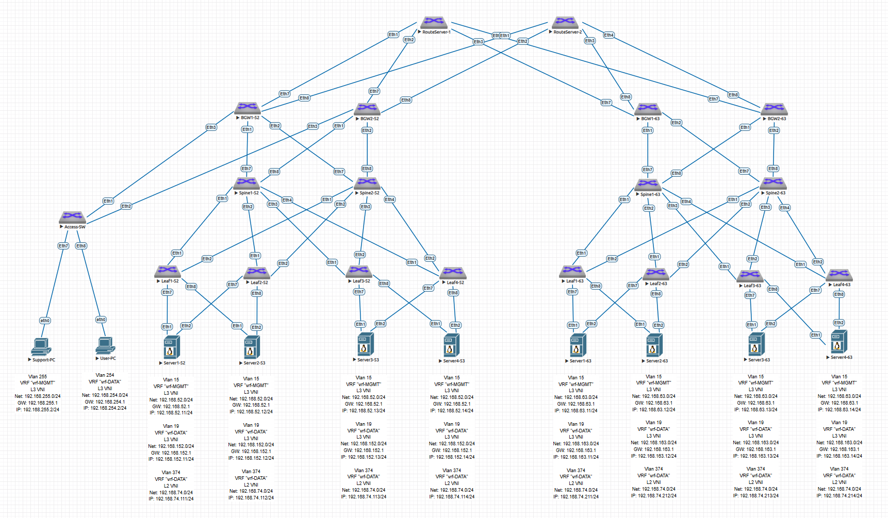

## Проектная работа: "Моделирование реализации ПАК накопления статистической информации и содержимого на базе сетевой архитектуры CLOS с использованием VXLAN/EVPN фабрик в георазнесенных ЦОД"

### Оглавление
1. [Цель](#цель)
2. [Задачи](#задачи)
3. [Описание объекта](#Описание-объекта)
4. [IP план](#IP-план)
5. [Конфигурация оборудования](#Конфигурация-оборудования)
6. [Диагностика оборудования](#Диагностика-оборудования)
7. [Проверка наличия связностей в топологии Multisite для сервисов между Сайтами DC52 и DC63](#Проверка-наличия-связностей-в-топологии-Multisite-для-сервисов-между-Сайтами-DC52-и-DC63)

### Цель:
- Спроектировать и в среде виртуализации EVE-NG выполнить моделирование сетевой архитектуры CLOS с использованием VXLAN/EVPN фабрик обеспечивающего L2/L3 транспорт для ПАК накопления статистической информации и содержимого, размещенного в двух георазнесенных ЦОД объединенных в топологию Multisite с возможностью бесшовного масштабирования на большее колличество ЦОД.

### Задачи:

- Проектирование и настройка отказоустойчивой сетевой топологии для двух ЦОД объединенных в топологию Multisite с возможностью бесшовного расширения на большее колличество ЦОД;
- Проектирование и настройка адресного пространства;
- Проектирование и настройка DCI interconnect;
- Проектирование и настройка сетевых протоколов обеспечивающих оптимальную загрузку линий связи, балансировку трафика, безопасность и быструю сходимость;
- Обеспечение резервирования физических подключений конечных устройств при помощи технологии Multihoming путем объединения пар Leaf-ов в ESI LAG;
- Обеспечени L2 внутрисетевой связности между конечными устройствами внути ЦОД и в разнесенных ЦОД-ах;
- Обеспечени L3 межсетевой связности между конечными устройствами в разнесенных ЦОД-ах;
- Обеспечени L3 межсетевой связности между рабочим местом Технической поддержки ПАК до конечных устройств расположенных в локальном и удаленном ЦОД-ах в изолировангим vrf "vrf-MGMT";
- Обеспечени L3 межсетевой связности между рабочим местом Пользователя ПАК до конечных устройств расположенных в локальном и удаленном ЦОД-ах в изолировангим vrf "vrf-DATA"; 

### Описание объекта:

ПАК накопления статистической информации и содержимого представляет собой два кластера серверов:
- Кластер серверов - обработчиков поступающего трафика с функционалом:
  * Формирования статистической информации для поступающего на обработку трафика - индексы (текстовые журналы, файлы);
  * Обработккой поступающей информации и отправки потока обработанного содержимого.
- Кластер серверов накопления и хранения статистической информации и содержимого поступающих от Кластера серверов обработчиков. 

Каждое из конечных устройст (Server) имитирующих сервера вышеупомянутых Кластеров имеет по три IP адреса из разных подсетей:
- Первый IP-адрес из подсети 192.168.52.0/24 в ЦОД-52 либо 192.168.63.0/24 в ЦОД-63 находятся в изолировнном vrf "vrf-MGMT" - используется для удаленного доступа Технической поддержки ПАК, со стороны рабочего места которой используется подсеть 192.168.255.0/24 и является маршрутизируемым (L3 VNI);
- Второй IP-адрес из подсети 192.168.152.0/24 в ЦОД-52 либо 192.168.163.0/24 в ЦОД-63 находятся в изолировнном vrf "vrf-DATA" - используется для передачи статистической информации от Кластера серверов - обработчиков на Кластер серверов хранения статистической информации и содержимого, а так же выгрузки накопленной статистической информации и содержимого по запросу Пользователя ПАК со стороны рабочего места которого используется подсеть 192.168.254.0/24 и является маршрутизируемым (L3 VNI);
- Третий IP-адрес из подсети 192.168.74.0/24 в ЦОД-52 и в ЦОД-63 находятся в изолировнном vrf "vrf-MGMT" - используется для передач потока содержимого от Кластера серверов - обработчиков на Кластер серверов хранения статистической информации и содержимого и является НЕмаршрутизируемым (L2 VNI).

Для обеспечения резервирования физических подключений каждое из конечных устройств подключено в два Leaf-а, которые собраны ESI LAG. Линки собраны в LAG с включенным протоколом LACP.

В среде виртуализации EVE-NG cобрана и настроена топология Underlay/Overlay сети Spine-Leaf для двух ЦОД - ЦОД-52 и ЦОД-63, которые через DCI interconnect и два RouteServer-а объединены в топологию Multisite.
МежЦОДовые каналы могут быть выполнеты на базе:
* Темных волокон;
* DWDM каналов;
* X-Connect с обеспечением на канале MTU не менее 9000.

При расширении ПАК и выносе сегментов в новые ЦОДы топология легко пожет масштабироваться при подключении сегментов расширения ПАК к действующим RouteServer-ам и их включением в Multisite.

В качестве всех элементов лабораторной сборки, включая конечные устройства (Server) и коммутатор доступа - используются L3-коммутаторы Arista.
В качестве рабочих мест Технической поддержки и Пользователя ПАК используются устройства, виртуальные PC.

Для реализации VXLAN EVPN фабрики в ЦОД 52:
- 1: для настройки сегмента Underlay используется протокол динамической маршрутизации OSPF. На линках интерконнекта используется network point-to-point. На портах интерконнекта включен протокол BFD. Настроена аутентификация. MTU увеличен до 9000;
- 2: для настройки сегмента Overlay используется протокол динамической маршрутизации iBGP с включенной опцией балансировки трафика.

Для реализации VXLAN EVPN фабрики в ЦОД 63:
- 1: для настройки сегмента Underlay используется протокол динамической маршрутизации IS-IS. На линках интерконнекта используется network point-to-point. На портах интерконнекта включен протокол BFD. Настроена аутентификация. MTU увеличен до 9000;
- 2: для настройки сегмента Overlay используется протокол динамической маршрутизации iBGP с включенной опцией балансировки трафика.

Для реализации топологии Multisite на DCI interconnect между BGW в ЦОДах и RouteServer-ами используется протокол динамической маршрутизации eBGP. На линках интерконнекта используется network point-to-point. На eBGP сессиях между BGW в ЦОДах и RouteServer-ами включена BGP аутентификация. MTU увеличен до 9000.



### IP план:
<details>
<summary> Сайт "DC52" </summary>
 
Device|Interface|IP Address|Subnet Mask|Gateway|vrf
---|---|---|---|---|---
RouteServer-1|Loopback0|10.52.0.0|/32|-|-
-|Ethernet1|10.52.1.252|/31|-|-
-|Ethernet2|10.52.1.254|/31|-|-
-|Ethernet3|10.63.1.252|/31|-|-
-|Ethernet4|10.63.1.254|/31|-|-
BGW1-52|Loopback0 (Underlay)|10.52.0.98|/32|-|-
-|Loopback1 (Overlay)|10.52.0.198|/32|-|-
-|Ethernet1|10.52.1.97|/31|-|-
-|Ethernet2|10.52.2.97|/31|-|-
-|Ethernet7|10.52.1.253|/31|-|-
-|Ethernet8|10.52.2.253|/31|-|-
-|Vlan255 (GW for Net 192.168.255.0/24)|192.168.255.1|/24|-|vrf-MGMT
-|Vlan254 (GW for Net 192.168.254.0/24)|192.168.254.1|/24|-|vrf-DATA
BGW2-52|Loopback0 (Underlay)|10.52.0.99|/32|-|-
-|Loopback1 (Overlay)|10.52.0.199|/32|-|-
-|Ethernet1|10.52.1.99|/31|-|-
-|Ethernet2|10.52.2.99|/31|-|-
-|Ethernet7|10.52.1.255|/31|-|-
-|Ethernet8|10.52.2.255|/31|-|-
-|Vlan255 (GW for Net 192.168.255.0/24)|192.168.255.1|/24|-|vrf-MGMT
-|Vlan254 (GW for Net 192.168.254.0/24)|192.168.254.1|/24|-|vrf-DATA
Spine1-52|Loopback0 (Underlay)|10.52.0.1|/32|-|-
-|Loopback1 (Overlay)|10.52.0.101|/32|-|-
-|Ethernet1|10.52.1.0|/31|-|-
-|Ethernet2|10.52.1.2|/31|-|-
-|Ethernet3|10.52.1.4|/31|-|-
-|Ethernet4|10.52.1.6|/31|-|-
-|Ethernet7|10.52.1.96|/31|-|-
-|Ethernet8|10.52.1.98|/31|-|-
Spine2-52|Loopback0 (Underlay)|10.52.0.2|/32|-|-
-|Loopback1 (Overlay)|10.52.0.102|/32|-|-
-|Ethernet1|10.52.2.0|/31|-|-
-|Ethernet2|10.52.2.2|/31|-|-
-|Ethernet3|10.52.2.4|/31|-|-
-|Ethernet4|10.52.2.6|/31|-|-
-|Ethernet7|10.52.2.96|/31|-|-
-|Ethernet8|10.52.2.98|/31|-|-
Leaf1-52|Loopback0 (Underlay)|10.52.0.11|/32|-|-
-|Loopback1 (Overlay)|10.52.0.111|/32|-|-
-|Ethernet1|10.52.1.1|/31|-|-
-|Ethernet2|10.52.2.1|/31|-|-
-|Vlan15 (GW for Net 192.168.52.0/24)|192.168.52.1|/24|-|vrf-MGMT
-|Vlan19 (GW for Net 192.168.152.0/24)|192.168.152.1|/24|-|vrf-DATA
Leaf2-52|Loopback0 (Underlay)|10.52.0.12|/32|-|-
-|Loopback1 (Overlay)|10.52.0.112|/32|-|-
-|Ethernet1|10.52.1.3|/31|-|-
-|Ethernet2|10.52.2.3|/31|-|-
-|Vlan15 (GW for Net 192.168.52.0/24)|192.168.52.1|/24|-|vrf-MGMT
-|Vlan19 (GW for Net 192.168.152.0/24)|192.168.152.1|/24|-|vrf-DATA
Leaf3-52|Loopback0 (Underlay)|10.52.0.13|/32|-|-
-|Loopback1 (Overlay)|10.52.0.113|/32|-|-
-|Ethernet1|10.52.1.5|/31|-|-
-|Ethernet2|10.52.2.5|/31|-|-
-|Vlan15 (GW for Net 192.168.52.0/24)|192.168.52.1|/24|-|vrf-MGMT
-|Vlan19 (GW for Net 192.168.152.0/24)|192.168.152.1|/24|-|vrf-DATA
Leaf4-52|Loopback0 (Underlay)|10.52.0.14|/32|-|-
-|Loopback1 (Overlay)|10.52.0.114|/32|-|-
-|Ethernet1|10.52.1.7|/31|-|-
-|Ethernet2|10.52.2.7|/31|-|-
-|Vlan15 (GW for Net 192.168.52.0/24)|192.168.52.1|/24|-|vrf-MGMT
-|Vlan19 (GW for Net 192.168.152.0/24)|192.168.152.1|/24|-|vrf-DATA
Leaf4-52|Loopback0 (Underlay)|10.52.0.14|/32|-|-
-|Loopback1 (Overlay)|10.52.0.114|/32|-|-
-|Ethernet1|10.52.1.7|/31|-|-
-|Ethernet2|10.52.2.7|/31|-|-
-|Vlan15 (GW for Net 192.168.52.0/24)|192.168.52.1|/24|-|vrf-MGMT
-|Vlan19 (GW for Net 192.168.152.0/24)|192.168.152.1|/24|-|vrf-DATA
Server1-52|Vlan15|192.168.52.11|/24|192.168.52.1|vrf-MGMT
-|Vlan19|192.168.152.11|/24|192.168.152.1|vrf-DATA (local vrf-DATA-538)
-|Vlan374|192.168.74.111|/24|-|vrf-DATA (local vrf-DATA-374)
Server2-52|Vlan15|192.168.52.12|/24|192.168.52.1|vrf-MGMT
-|Vlan19|192.168.152.12|/24|192.168.152.1|vrf-DATA (local vrf-DATA-538)
-|Vlan374|192.168.74.112|/24|-|vrf-DATA (local vrf-DATA-374)
Server3-52|Vlan15|192.168.52.13|/24|192.168.52.1|vrf-MGMT
-|Vlan19|192.168.152.13|/24|192.168.152.1|vrf-DATA (local vrf-DATA-538)
-|Vlan374|192.168.74.113|/24|-|vrf-DATA (local vrf-DATA-374)
Server4-52|Vlan15|192.168.52.14|/24|192.168.52.1|vrf-MGMT
-|Vlan19|192.168.152.14|/24|192.168.152.1|vrf-DATA (local vrf-DATA-538)
-|Vlan374|192.168.74.114|/24|-|vrf-DATA (local vrf-DATA-374)
Support-PC|eth0|192.168.255.2|/24|192.168.255.1|vrf-MGMT
User-PC|eth0|192.168.254.2|/24|192.168.254.1|vrf-DATA

</details>

<details>
<summary> Сайт "DC63" </summary>
  
Device|Interface|IP Address|Subnet Mask|Gateway|vrf
---|---|---|---|---|---
RouteServer-2|Loopback0|10.63.0.0|/32|-|-
-|Ethernet1|10.52.2.252|/31|-|-
-|Ethernet2|10.52.2.254|/31|-|-
-|Ethernet3|10.63.2.252|/31|-|-
-|Ethernet4|10.63.2.254|/31|-|-
BGW1-63|Loopback0 (Underlay)|10.63.0.98|/32|-|-
-|Loopback1 (Overlay)|10.63.0.198|/32|-|-
-|Ethernet1|10.63.1.97|/31|-|-
-|Ethernet2|10.63.2.97|/31|-|-
-|Ethernet7|10.63.1.253|/31|-|-
-|Ethernet8|10.63.2.253|/31|-|-
BGW2-63|Loopback0 (Underlay)|10.63.0.99|/32|-|-
-|Loopback1 (Overlay)|10.63.0.199|/32|-|-
-|Ethernet1|10.63.1.99|/31|-|-
-|Ethernet2|10.63.2.99|/31|-|-
-|Ethernet7|10.63.1.255|/31|-|-
-|Ethernet8|10.63.2.255|/31|-|-
Spine1-63|Loopback0 (Underlay)|10.63.0.1|/32|-|-
-|Loopback1 (Overlay)|10.63.0.101|/32|-|-
-|Ethernet1|10.63.1.0|/31|-|-
-|Ethernet2|10.63.1.2|/31|-|-
-|Ethernet3|10.63.1.4|/31|-|-
-|Ethernet4|10.63.1.6|/31|-|-
-|Ethernet7|10.63.1.96|/31|-|-
-|Ethernet8|10.63.1.98|/31|-|-
Spine2-63|Loopback0 (Underlay)|10.63.0.2|/32|-|-
-|Loopback1 (Overlay)|10.63.0.102|/32|-|-
-|Ethernet1|10.63.2.0|/31|-|-
-|Ethernet2|10.63.2.2|/31|-|-
-|Ethernet3|10.63.2.4|/31|-|-
-|Ethernet4|10.63.2.6|/31|-|-
-|Ethernet7|10.63.2.96|/31|-|-
-|Ethernet8|10.63.2.98|/31|-|-
Leaf1-63|Loopback0 (Underlay)|10.63.0.11|/32|-|-
-|Loopback1 (Overlay)|10.63.0.111|/32|-|-
-|Ethernet1|10.63.1.1|/31|-|-
-|Ethernet2|10.63.2.1|/31|-|-
-|Vlan15 (GW for Net 192.168.63.0/24)|192.168.63.1|/24|-|vrf-MGMT
-|Vlan19 (GW for Net 192.168.163.0/24)|192.168.163.1|/24|-|vrf-DATA
Leaf2-63|Loopback0 (Underlay)|10.63.0.12|/32|-|-
-|Loopback1 (Overlay)|10.63.0.112|/32|-|-
-|Ethernet1|10.63.1.3|/31|-|-
-|Ethernet2|10.63.2.3|/31|-|-
-|Vlan15 (GW for Net 192.168.63.0/24)|192.168.63.1|/24|-|vrf-MGMT
-|Vlan19 (GW for Net 192.168.163.0/24)|192.168.163.1|/24|-|vrf-DATA
Leaf3-63|Loopback0 (Underlay)|10.63.0.13|/32|-|-
-|Loopback1 (Overlay)|10.63.0.113|/32|-|-
-|Ethernet1|10.63.1.5|/31|-|-
-|Ethernet2|10.63.2.5|/31|-|-
-|Vlan15 (GW for Net 192.168.63.0/24)|192.168.63.1|/24|-|vrf-MGMT
-|Vlan19 (GW for Net 192.168.163.0/24)|192.168.163.1|/24|-|vrf-DATA
Leaf4-63|Loopback0 (Underlay)|10.63.0.14|/32|-|-
-|Loopback1 (Overlay)|10.63.0.114|/32|-|-
-|Ethernet1|10.63.1.7|/31|-|-
-|Ethernet2|10.63.2.7|/31|-|-
-|Vlan15 (GW for Net 192.168.63.0/24)|192.168.63.1|/24|-|vrf-MGMT
-|Vlan19 (GW for Net 192.168.163.0/24)|192.168.163.1|/24|-|vrf-DATA
Leaf4-63|Loopback0 (Underlay)|10.63.0.14|/32|-|-
-|Loopback1 (Overlay)|10.63.0.114|/32|-|-
-|Ethernet1|10.63.1.7|/31|-|-
-|Ethernet2|10.63.2.7|/31|-|-
-|Vlan15 (GW for Net 192.168.63.0/24)|192.168.63.1|/24|-|vrf-MGMT
-|Vlan19 (GW for Net 192.168.163.0/24)|192.168.163.1|/24|-|vrf-DATA
Server1-63|Vlan15|192.168.63.11|/24|192.168.63.1|vrf-MGMT
-|Vlan19|192.168.163.11|/24|192.168.163.1|vrf-DATA (local vrf-DATA-538)
-|Vlan374|192.168.74.211|/24|-|vrf-DATA (local vrf-DATA-374)
Server2-63|Vlan15|192.168.63.12|/24|192.168.63.1|vrf-MGMT
-|Vlan19|192.168.163.12|/24|192.168.163.1|vrf-DATA (local vrf-DATA-538)
-|Vlan374|192.168.74.212|/24|-|vrf-DATA (local vrf-DATA-374)
Server3-63|Vlan15|192.168.63.13|/24|192.168.63.1|vrf-MGMT
-|Vlan19|192.168.163.13|/24|192.168.163.1|vrf-DATA (local vrf-DATA-538)
-|Vlan374|192.168.74.213|/24|-|vrf-DATA (local vrf-DATA-374)
Server4-63|Vlan15|192.168.63.14|/24|192.168.63.1|vrf-MGMT
-|Vlan19|192.168.163.14|/24|192.168.163.1|vrf-DATA (local vrf-DATA-538)
-|Vlan374|192.168.74.214|/24|-|vrf-DATA (local vrf-DATA-374)

</details>

### Конфигурация оборудования:
#### Сайт "DC52":

</details>
<details>
<summary> RouteServer-1 </summary>

 ```
RouteServer-1#sh run
! Command: show running-config
! device: RouteServer-1 (vEOS-lab, EOS-4.29.2F)
!
! boot system flash:/vEOS-lab.swi
!
no aaa root
!
transceiver qsfp default-mode 4x10G
!
service routing protocols model multi-agent
!
hostname RouteServer-1
!
spanning-tree mode mstp
!
interface Ethernet1
   description to Eth7 BGW1-52
   mtu 9000
   no switchport
   ip address 10.52.1.252/31
   bfd interval 100 min-rx 100 multiplier 3
!
interface Ethernet2
   description to Eth7 BGW2-52
   mtu 9000
   no switchport
   ip address 10.52.1.254/31
   bfd interval 100 min-rx 100 multiplier 3
!
interface Ethernet3
   description to Eth7 BGW1-63
   mtu 9000
   no switchport
   ip address 10.63.1.252/31
   bfd interval 100 min-rx 100 multiplier 3
!
interface Ethernet4
   description to Eth7 BGW2-63
   mtu 9000
   no switchport
   ip address 10.63.1.254/31
   bfd interval 100 min-rx 100 multiplier 3
!
interface Ethernet5
!
interface Ethernet6
!
interface Ethernet7
!
interface Ethernet8
!
interface Loopback0
   ip address 10.52.0.0/32
!
interface Management1
!
ip routing
!
router bgp 4200000000
   router-id 10.52.0.0
   maximum-paths 10 ecmp 10
   neighbor BGW peer group
   neighbor BGW description BGWs
   neighbor BGW send-community extended
   neighbor 10.52.1.253 peer group BGW
   neighbor 10.52.1.253 remote-as 4200052101
   neighbor 10.52.1.253 password 7 TLYYj1Otets=
   neighbor 10.52.1.255 peer group BGW
   neighbor 10.52.1.255 remote-as 4200052101
   neighbor 10.52.1.255 password 7 LyI6epdyJCU=
   neighbor 10.63.1.253 peer group BGW
   neighbor 10.63.1.253 remote-as 4200063101
   neighbor 10.63.1.253 password 7 fSv5mLlPdqc=
   neighbor 10.63.1.255 peer group BGW
   neighbor 10.63.1.255 remote-as 4200063101
   neighbor 10.63.1.255 password 7 lpdOdGnG0Ng=
   !
   address-family evpn
      neighbor BGW activate
      neighbor BGW next-hop-unchanged
   !
   address-family ipv4
      neighbor BGW activate
!
end
```
</details>
<details>
<summary> BGW1-52 </summary>
   
 ```
BGW1-52#sh run
! Command: show running-config
! device: BGW1-52 (vEOS-lab, EOS-4.29.2F)
!
! boot system flash:/vEOS-lab.swi
!
no aaa root
!
transceiver qsfp default-mode 4x10G
!
service routing protocols model multi-agent
!
hostname BGW1-52
!
spanning-tree mode mstp
!
vlan 254
   name Overlay_User_vrf-DATA
!
vlan 255
   name Overlay_Support_vrf-MGMT
!
vlan 374
   name Overlay_MiltiSite_L2_374_vrf-DAT
!
vrf instance vrf-DATA
!
vrf instance vrf-MGMT
!
interface Port-Channel1
   description to Po1 Access-SW
   switchport trunk allowed vlan 254-255
   switchport mode trunk
   !
   evpn ethernet-segment
      identifier 0000:0000:0000:0052:5001
      route-target import 00:00:00:52:50:01
   lacp system-id 0000.0052.0005
!
interface Ethernet1
   description to Eth7 Spine1-52
   mtu 9000
   no switchport
   ip address 10.52.1.97/31
   bfd interval 100 min-rx 100 multiplier 3
   ip ospf network point-to-point
   ip ospf authentication-key 7 b8R6BgflcEU=
   ip ospf area 0.0.0.0
!
interface Ethernet2
   description to Eth7 Spine2-52
   mtu 9000
   no switchport
   ip address 10.52.2.97/31
   bfd interval 100 min-rx 100 multiplier 3
   ip ospf network point-to-point
   ip ospf authentication-key 7 X+t26ggFZHg=
   ip ospf area 0.0.0.0
!
interface Ethernet3
   description to Eth1 Access-SW
   channel-group 1 mode active
!
interface Ethernet4
!
interface Ethernet5
!
interface Ethernet6
!
interface Ethernet7
   description to Eth1 RouteServer-1
   mtu 9000
   no switchport
   ip address 10.52.1.253/31
   bfd interval 100 min-rx 100 multiplier 3
!
interface Ethernet8
   description to Eth1 RouteServer-2
   mtu 9000
   no switchport
   ip address 10.52.2.253/31
   bfd interval 100 min-rx 100 multiplier 3
!
interface Loopback0
   description for Underlay
   ip address 10.52.0.98/32
   ip ospf area 0.0.0.0
!
interface Loopback1
   description for Overlay
   ip address 10.52.0.198/32
   ip ospf area 0.0.0.0
!
interface Management1
!
interface Vlan254
   vrf vrf-DATA
   ip address virtual 192.168.254.1/24
!
interface Vlan255
   vrf vrf-MGMT
   ip address virtual 192.168.255.1/24
!
interface Vxlan1
   vxlan source-interface Loopback1
   vxlan udp-port 4789
   vxlan vlan 254 vni 1254
   vxlan vlan 255 vni 1255
   vxlan vlan 374 vni 1374
   vxlan vrf vrf-DATA vni 10019
   vxlan vrf vrf-MGMT vni 10015
   vxlan learn-restrict any
!
ip virtual-router mac-address 00:00:00:52:10:05
!
ip routing
ip routing vrf vrf-DATA
ip routing vrf vrf-MGMT
!
router bgp 4200052101
   maximum-paths 10 ecmp 10
   neighbor DCI-INTERCONNECT peer group
   neighbor DCI-INTERCONNECT remote-as 4200000000
   neighbor DCI-INTERCONNECT description RouteServer's
   neighbor DCI-INTERCONNECT send-community extended
   neighbor EVPN-OVERLAY peer group
   neighbor EVPN-OVERLAY remote-as 4200052101
   neighbor EVPN-OVERLAY update-source Loopback1
   neighbor EVPN-OVERLAY description Spine's
   neighbor EVPN-OVERLAY send-community extended
   neighbor 10.52.0.101 peer group EVPN-OVERLAY
   neighbor 10.52.0.102 peer group EVPN-OVERLAY
   neighbor 10.52.1.252 peer group DCI-INTERCONNECT
   neighbor 10.52.1.252 password 7 TLYYj1Otets=
   neighbor 10.52.2.252 peer group DCI-INTERCONNECT
   neighbor 10.52.2.252 password 7 lGwP0K8bxJI=
   !
   vlan 254
      rd 4200052101:1254
      route-target both 254:1254
      redistribute learned
   !
   vlan 255
      rd 4200052101:1255
      route-target both 255:1255
      redistribute learned
   !
   vlan 374
      rd evpn domain all 4200052101:1374
      route-target import export evpn domain all 374:1374
   !
   address-family evpn
      neighbor DCI-INTERCONNECT activate
      neighbor DCI-INTERCONNECT domain remote
      neighbor EVPN-OVERLAY activate
      domain identifier 4200052101:1
      neighbor default next-hop-self received-evpn-routes route-type ip-prefix inter-domain
   !
   address-family ipv4
      neighbor DCI-INTERCONNECT activate
      network 10.52.0.98/32
      network 10.52.0.198/32
   !
   vrf vrf-DATA
      rd 10.52.0.198:2
      route-target import evpn 2:10019
      route-target export evpn 2:10019
      redistribute connected
   !
   vrf vrf-MGMT
      rd 10.52.0.198:1
      route-target import evpn 1:10015
      route-target export evpn 1:10015
      redistribute connected
!
router ospf 1
   router-id 10.52.0.98
   passive-interface default
   no passive-interface Ethernet1
   no passive-interface Ethernet2
   redistribute connected
   max-lsa 12000
!
end
```
</details>
<details>
<summary> BGW2-52 </summary>
   
 ```
BGW2-52#sh run
! Command: show running-config
! device: BGW2-52 (vEOS-lab, EOS-4.29.2F)
!
! boot system flash:/vEOS-lab.swi
!
no aaa root
!
transceiver qsfp default-mode 4x10G
!
service routing protocols model multi-agent
!
hostname BGW2-52
!
spanning-tree mode mstp
!
vlan 254
   name Overlay_User_vrf-DATA
!
vlan 255
   name Overlay_Support_vrf-MGMT
!
vlan 374
   name Overlay_MiltiSite_L2_374_vrf-DAT
!
vrf instance vrf-DATA
!
vrf instance vrf-MGMT
!
interface Port-Channel1
   description to Po1 Access-SW
   switchport trunk allowed vlan 254-255
   switchport mode trunk
   !
   evpn ethernet-segment
      identifier 0000:0000:0000:0052:5001
      route-target import 00:00:00:52:50:01
   lacp system-id 0000.0052.0005
!
interface Ethernet1
   description to Eth8 Spine1-52
   mtu 9000
   no switchport
   ip address 10.52.1.99/31
   bfd interval 100 min-rx 100 multiplier 3
   ip ospf network point-to-point
   ip ospf authentication-key 7 b8R6BgflcEU=
   ip ospf area 0.0.0.0
!
interface Ethernet2
   description to Eth8 Spine2-52
   mtu 9000
   no switchport
   ip address 10.52.2.99/31
   bfd interval 100 min-rx 100 multiplier 3
   ip ospf network point-to-point
   ip ospf authentication-key 7 X+t26ggFZHg=
   ip ospf area 0.0.0.0
!
interface Ethernet3
   description to Eth2 Access-SW
   channel-group 1 mode active
!
interface Ethernet4
!
interface Ethernet5
!
interface Ethernet6
!
interface Ethernet7
   description to Eth2 RouteServer-1
   mtu 9000
   no switchport
   ip address 10.52.1.255/31
   bfd interval 100 min-rx 100 multiplier 3
!
interface Ethernet8
   description to Eth2 RouteServer-2
   mtu 9000
   no switchport
   ip address 10.52.2.255/31
   bfd interval 100 min-rx 100 multiplier 3
!
interface Loopback0
   description for Underlay
   ip address 10.52.0.99/32
   ip ospf area 0.0.0.0
!
interface Loopback1
   description for Overlay
   ip address 10.52.0.199/32
   ip ospf area 0.0.0.0
!
interface Management1
!
interface Vlan254
   vrf vrf-DATA
   ip address virtual 192.168.254.1/24
!
interface Vlan255
   vrf vrf-MGMT
   ip address virtual 192.168.255.1/24
!
interface Vxlan1
   vxlan source-interface Loopback1
   vxlan udp-port 4789
   vxlan vlan 254 vni 1254
   vxlan vlan 255 vni 1255
   vxlan vlan 374 vni 1374
   vxlan vrf vrf-DATA vni 10019
   vxlan vrf vrf-MGMT vni 10015
   vxlan learn-restrict any
!
ip virtual-router mac-address 00:00:00:52:10:05
!
ip routing
ip routing vrf vrf-DATA
ip routing vrf vrf-MGMT
!
router bgp 4200052101
   maximum-paths 10 ecmp 10
   neighbor DCI-INTERCONNECT peer group
   neighbor DCI-INTERCONNECT remote-as 4200000000
   neighbor DCI-INTERCONNECT description RouteServer's
   neighbor DCI-INTERCONNECT send-community extended
   neighbor EVPN-OVERLAY peer group
   neighbor EVPN-OVERLAY remote-as 4200052101
   neighbor EVPN-OVERLAY update-source Loopback1
   neighbor EVPN-OVERLAY description Spine's
   neighbor EVPN-OVERLAY send-community extended
   neighbor 10.52.0.101 peer group EVPN-OVERLAY
   neighbor 10.52.0.102 peer group EVPN-OVERLAY
   neighbor 10.52.1.254 peer group DCI-INTERCONNECT
   neighbor 10.52.1.254 password 7 LyI6epdyJCU=
   neighbor 10.52.2.254 peer group DCI-INTERCONNECT
   neighbor 10.52.2.254 password 7 HqIj1schjnI=
   !
   vlan 254
      rd 4200052101:1254
      route-target both 254:1254
      redistribute learned
   !
   vlan 255
      rd 4200052101:1255
      route-target both 255:1255
      redistribute learned
   !
   vlan 374
      rd evpn domain all 4200052101:1374
      route-target import export evpn domain all 374:1374
   !
   address-family evpn
      neighbor DCI-INTERCONNECT activate
      neighbor DCI-INTERCONNECT domain remote
      neighbor EVPN-OVERLAY activate
      domain identifier 4200052101:1
      neighbor default next-hop-self received-evpn-routes route-type ip-prefix inter-domain
   !
   address-family ipv4
      neighbor DCI-INTERCONNECT activate
      network 10.52.0.99/32
      network 10.52.0.199/32
   !
   vrf vrf-DATA
      rd 10.52.0.199:2
      route-target import evpn 2:10019
      route-target export evpn 2:10019
      redistribute connected
   !
   vrf vrf-MGMT
      rd 10.52.0.199:1
      route-target import evpn 1:10015
      route-target export evpn 1:10015
      redistribute connected
!
router ospf 1
   router-id 10.52.0.99
   passive-interface default
   no passive-interface Ethernet1
   no passive-interface Ethernet2
   redistribute connected
   max-lsa 12000
!
end
```
</details>
<details>
<summary> Spine1-52 </summary>
   
 ```
Spine1-52#sh run
! Command: show running-config
! device: Spine1-52 (vEOS-lab, EOS-4.29.2F)
!
! boot system flash:/vEOS-lab.swi
!
no aaa root
!
transceiver qsfp default-mode 4x10G
!
service routing protocols model multi-agent
!
hostname Spine1-52
!
spanning-tree mode mstp
!
interface Ethernet1
   description to Eth1 Leaf1-52
   mtu 9000
   no switchport
   ip address 10.52.1.0/31
   bfd interval 100 min-rx 100 multiplier 3
   ip ospf network point-to-point
   ip ospf authentication-key 7 b8R6BgflcEU=
   ip ospf area 0.0.0.0
!
interface Ethernet2
   description to Eth1 Leaf2-52
   mtu 9000
   no switchport
   ip address 10.52.1.2/31
   bfd interval 100 min-rx 100 multiplier 3
   ip ospf network point-to-point
   ip ospf authentication-key 7 X+t26ggFZHg=
   ip ospf area 0.0.0.0
!
interface Ethernet3
   description to Eth1 Leaf3-52
   mtu 9000
   no switchport
   ip address 10.52.1.4/31
   bfd interval 100 min-rx 100 multiplier 3
   ip ospf network point-to-point
   ip ospf authentication-key 7 X+t26ggFZHg=
   ip ospf area 0.0.0.0
!
interface Ethernet4
   description to Eth1 Leaf4-52
   mtu 9000
   no switchport
   ip address 10.52.1.6/31
   bfd interval 100 min-rx 100 multiplier 3
   ip ospf network point-to-point
   ip ospf authentication-key 7 63RNWoAFcH0=
   ip ospf area 0.0.0.0
!
interface Ethernet5
!
interface Ethernet6
!
interface Ethernet7
   description to Eth1 BGW1-52
   mtu 9000
   no switchport
   ip address 10.52.1.96/31
   bfd interval 100 min-rx 100 multiplier 3
   ip ospf network point-to-point
   ip ospf authentication-key 7 yqceYYmPHX0=
   ip ospf area 0.0.0.0
!
interface Ethernet8
   description to Eth1 BGW2-52
   mtu 9000
   no switchport
   ip address 10.52.1.98/31
   bfd interval 100 min-rx 100 multiplier 3
   ip ospf network point-to-point
   ip ospf authentication-key 7 BKSGtyN72u8=
   ip ospf area 0.0.0.0
!
interface Loopback0
   description for Underlay
   ip address 10.52.0.1/32
   ip ospf area 0.0.0.0
!
interface Loopback1
   description for Overlay
   ip address 10.52.0.101/32
   ip ospf area 0.0.0.0
!
interface Management1
!
ip routing
!
router bgp 4200052101
   maximum-paths 10 ecmp 10
   neighbor EVPN-OVERLAY peer group
   neighbor EVPN-OVERLAY remote-as 4200052101
   neighbor EVPN-OVERLAY update-source Loopback1
   neighbor EVPN-OVERLAY description Leaf's
   neighbor EVPN-OVERLAY route-reflector-client
   neighbor EVPN-OVERLAY send-community extended
   neighbor 10.52.0.111 peer group EVPN-OVERLAY
   neighbor 10.52.0.112 peer group EVPN-OVERLAY
   neighbor 10.52.0.113 peer group EVPN-OVERLAY
   neighbor 10.52.0.114 peer group EVPN-OVERLAY
   neighbor 10.52.0.198 peer group EVPN-OVERLAY
   neighbor 10.52.0.199 peer group EVPN-OVERLAY
   !
   address-family evpn
      neighbor EVPN-OVERLAY activate
!
router ospf 1
   router-id 10.52.0.1
   passive-interface default
   no passive-interface Ethernet1
   no passive-interface Ethernet2
   no passive-interface Ethernet3
   no passive-interface Ethernet4
   no passive-interface Ethernet7
   no passive-interface Ethernet8
   max-lsa 12000
!
end
```
</details>
<details>
<summary> Spine2-52 </summary>
   
 ```
Spine2-52#sh run
! Command: show running-config
! device: Spine2-52 (vEOS-lab, EOS-4.29.2F)
!
! boot system flash:/vEOS-lab.swi
!
no aaa root
!
transceiver qsfp default-mode 4x10G
!
service routing protocols model multi-agent
!
hostname Spine2-52
!
spanning-tree mode mstp
!
interface Ethernet1
   description to Eth2 Leaf1-52
   mtu 9000
   no switchport
   ip address 10.52.2.0/31
   bfd interval 100 min-rx 100 multiplier 3
   ip ospf network point-to-point
   ip ospf authentication-key 7 b8R6BgflcEU=
   ip ospf area 0.0.0.0
!
interface Ethernet2
   description to Eth2 Leaf2-52
   mtu 9000
   no switchport
   ip address 10.52.2.2/31
   bfd interval 100 min-rx 100 multiplier 3
   ip ospf network point-to-point
   ip ospf authentication-key 7 X+t26ggFZHg=
   ip ospf area 0.0.0.0
!
interface Ethernet3
   description to Eth2 Leaf3-52
   mtu 9000
   no switchport
   ip address 10.52.2.4/31
   bfd interval 100 min-rx 100 multiplier 3
   ip ospf network point-to-point
   ip ospf authentication-key 7 X+t26ggFZHg=
   ip ospf area 0.0.0.0
!
interface Ethernet4
   description to Eth2 Leaf4-52
   mtu 9000
   no switchport
   ip address 10.52.2.6/31
   bfd interval 100 min-rx 100 multiplier 3
   ip ospf network point-to-point
   ip ospf authentication-key 7 63RNWoAFcH0=
   ip ospf area 0.0.0.0
!
interface Ethernet5
!
interface Ethernet6
!
interface Ethernet7
   description to Eth2 BGW1-52
   mtu 9000
   no switchport
   ip address 10.52.2.96/31
   bfd interval 100 min-rx 100 multiplier 3
   ip ospf network point-to-point
   ip ospf authentication-key 7 yqceYYmPHX0=
   ip ospf area 0.0.0.0
!
interface Ethernet8
   description to Eth2 BGW2-52
   mtu 9000
   no switchport
   ip address 10.52.2.98/31
   bfd interval 100 min-rx 100 multiplier 3
   ip ospf network point-to-point
   ip ospf authentication-key 7 BKSGtyN72u8=
   ip ospf area 0.0.0.0
!
interface Loopback0
   description for Underlay
   ip address 10.52.0.2/32
   ip ospf area 0.0.0.0
!
interface Loopback1
   description for Overlay
   ip address 10.52.0.102/32
   ip ospf area 0.0.0.0
!
interface Management1
!
ip routing
!
router bgp 4200052101
   maximum-paths 10 ecmp 10
   neighbor EVPN-OVERLAY peer group
   neighbor EVPN-OVERLAY remote-as 4200052101
   neighbor EVPN-OVERLAY update-source Loopback1
   neighbor EVPN-OVERLAY description Leaf's
   neighbor EVPN-OVERLAY route-reflector-client
   neighbor EVPN-OVERLAY send-community extended
   neighbor 10.52.0.111 peer group EVPN-OVERLAY
   neighbor 10.52.0.112 peer group EVPN-OVERLAY
   neighbor 10.52.0.113 peer group EVPN-OVERLAY
   neighbor 10.52.0.114 peer group EVPN-OVERLAY
   neighbor 10.52.0.198 peer group EVPN-OVERLAY
   neighbor 10.52.0.199 peer group EVPN-OVERLAY
   !
   address-family evpn
      neighbor EVPN-OVERLAY activate
!
router ospf 1
   router-id 10.52.0.2
   passive-interface default
   no passive-interface Ethernet1
   no passive-interface Ethernet2
   no passive-interface Ethernet3
   no passive-interface Ethernet4
   no passive-interface Ethernet7
   no passive-interface Ethernet8
   max-lsa 12000
!
end
```
</details>
<details>
<summary> Leaf1-52 </summary>
   
 ```
Leaf1-52#sh run
! Command: show running-config
! device: Leaf1-52 (vEOS-lab, EOS-4.29.2F)
!
! boot system flash:/vEOS-lab.swi
!
no aaa root
!
transceiver qsfp default-mode 4x10G
!
service routing protocols model multi-agent
!
link tracking group CORE-TRACKING
   recovery delay 1
!
hostname Leaf1-52
!
spanning-tree mode mstp
!
vlan 15
   name Overlay_DC52_374_vrf-MGMT
!
vlan 19
   name Overlay_DC52_538_vrf-DATA
!
vlan 374
   name Overlay_MiltiSite_L2_374_vrf-DAT
!
vrf instance vrf-DATA
!
vrf instance vrf-MGMT
!
interface Port-Channel1
   description to Po1 Server1-52
   switchport trunk allowed vlan 15,19,374
   switchport mode trunk
   !
   evpn ethernet-segment
      identifier 0000:0000:0000:0052:1001
      route-target import 00:00:00:52:10:01
   lacp system-id 0000.0052.0001
!
interface Port-Channel2
   description to Po1 Server2-52
   switchport trunk allowed vlan 15,19,374
   switchport mode trunk
   !
   evpn ethernet-segment
      identifier 0000:0000:0000:0052:1002
      route-target import 00:00:00:52:10:02
   lacp system-id 0000.0052.0001
!
interface Ethernet1
   description to Eth1 Spine1-52
   mtu 9000
   no switchport
   ip address 10.52.1.1/31
   bfd interval 100 min-rx 100 multiplier 3
   ip ospf network point-to-point
   ip ospf authentication-key 7 b8R6BgflcEU=
   ip ospf area 0.0.0.0
   link tracking group CORE-TRACKING upstream
!
interface Ethernet2
   description to Eth1 Spine2-52
   mtu 9000
   no switchport
   ip address 10.52.2.1/31
   bfd interval 100 min-rx 100 multiplier 3
   ip ospf network point-to-point
   ip ospf authentication-key 7 X+t26ggFZHg=
   ip ospf area 0.0.0.0
   link tracking group CORE-TRACKING upstream
!
interface Ethernet3
!
interface Ethernet4
!
interface Ethernet5
!
interface Ethernet6
!
interface Ethernet7
   description to Eth1 Server1-52
   channel-group 1 mode active
   link tracking group CORE-TRACKING downstream
!
interface Ethernet8
   description to Eth1 Server2-52
   channel-group 2 mode active
   link tracking group CORE-TRACKING downstream
!
interface Loopback0
   description for Underlay
   ip address 10.52.0.11/32
   ip ospf area 0.0.0.0
!
interface Loopback1
   description for Overlay
   ip address 10.52.0.111/32
   ip ospf area 0.0.0.0
!
interface Management1
!
interface Vlan15
   vrf vrf-MGMT
   ip address virtual 192.168.52.1/24
!
interface Vlan19
   vrf vrf-DATA
   ip address virtual 192.168.152.1/24
!
interface Vxlan1
   vxlan source-interface Loopback1
   vxlan udp-port 4789
   vxlan vlan 15 vni 1015
   vxlan vlan 19 vni 1019
   vxlan vlan 374 vni 1374
   vxlan vrf vrf-DATA vni 10019
   vxlan vrf vrf-MGMT vni 10015
   vxlan learn-restrict any
!
ip virtual-router mac-address 00:00:00:52:10:01
!
ip routing
ip routing vrf vrf-DATA
ip routing vrf vrf-MGMT
!
router bgp 4200052101
   maximum-paths 10 ecmp 10
   neighbor EVPN-OVERLAY peer group
   neighbor EVPN-OVERLAY remote-as 4200052101
   neighbor EVPN-OVERLAY update-source Loopback1
   neighbor EVPN-OVERLAY description Spine's
   neighbor EVPN-OVERLAY send-community extended
   neighbor 10.52.0.101 peer group EVPN-OVERLAY
   neighbor 10.52.0.102 peer group EVPN-OVERLAY
   !
   vlan 15
      rd 4200052101:1015
      route-target both 15:1015
      redistribute learned
   !
   vlan 19
      rd 4200052101:1019
      route-target both 19:1019
      redistribute learned
   !
   vlan 374
      rd 4200052101:1374
      route-target both 374:1374
      redistribute learned
   !
   address-family evpn
      neighbor EVPN-OVERLAY activate
   !
   vrf vrf-DATA
      rd 10.52.0.111:2
      route-target import evpn 2:10019
      route-target export evpn 2:10019
      redistribute connected
   !
   vrf vrf-MGMT
      rd 10.52.0.111:1
      route-target import evpn 1:10015
      route-target export evpn 1:10015
      redistribute connected
!
router ospf 1
   router-id 10.52.0.11
   passive-interface default
   no passive-interface Ethernet1
   no passive-interface Ethernet2
   redistribute connected
   max-lsa 12000
!
end
```
</details>
<details>
<summary> Leaf2-52 </summary>
   
 ```
Leaf2-52#sh run
! Command: show running-config
! device: Leaf2-52 (vEOS-lab, EOS-4.29.2F)
!
! boot system flash:/vEOS-lab.swi
!
no aaa root
!
transceiver qsfp default-mode 4x10G
!
service routing protocols model multi-agent
!
link tracking group CORE-TRACKING
   recovery delay 1
!
hostname Leaf2-52
!
spanning-tree mode mstp
!
vlan 15
   name Overlay_DC52_374_vrf-MGMT
!
vlan 19
   name Overlay_DC52_538_vrf-DATA
!
vlan 374
   name Overlay_MiltiSite_L2_374_vrf-DAT
!
vrf instance vrf-DATA
!
vrf instance vrf-MGMT
!
interface Port-Channel1
   description to Po1 Server1-52
   switchport trunk allowed vlan 15,19,374
   switchport mode trunk
   !
   evpn ethernet-segment
      identifier 0000:0000:0000:0052:1001
      route-target import 00:00:00:52:10:01
   lacp system-id 0000.0052.0001
!
interface Port-Channel2
   description to Po1 Server2-52
   switchport trunk allowed vlan 15,19,374
   switchport mode trunk
   !
   evpn ethernet-segment
      identifier 0000:0000:0000:0052:1002
      route-target import 00:00:00:52:10:02
   lacp system-id 0000.0052.0001
!
interface Ethernet1
   description to Eth2 Spine1-52
   mtu 9000
   no switchport
   ip address 10.52.1.3/31
   bfd interval 100 min-rx 100 multiplier 3
   ip ospf network point-to-point
   ip ospf authentication-key 7 b8R6BgflcEU=
   ip ospf area 0.0.0.0
   link tracking group CORE-TRACKING upstream
!
interface Ethernet2
   description to Eth2 Spine2-52
   mtu 9000
   no switchport
   ip address 10.52.2.3/31
   bfd interval 100 min-rx 100 multiplier 3
   ip ospf network point-to-point
   ip ospf authentication-key 7 X+t26ggFZHg=
   ip ospf area 0.0.0.0
   link tracking group CORE-TRACKING upstream
!
interface Ethernet3
!
interface Ethernet4
!
interface Ethernet5
!
interface Ethernet6
!
interface Ethernet7
   description to Eth2 Server1-52
   channel-group 1 mode active
!
interface Ethernet8
   description to Eth2 Server2-52
   channel-group 2 mode active
!
interface Loopback0
   description for Underlay
   ip address 10.52.0.12/32
   ip ospf area 0.0.0.0
!
interface Loopback1
   description for Overlay
   ip address 10.52.0.112/32
   ip ospf area 0.0.0.0
!
interface Management1
!
interface Vlan15
   vrf vrf-MGMT
   ip address virtual 192.168.52.1/24
!
interface Vlan19
   vrf vrf-DATA
   ip address virtual 192.168.152.1/24
!
interface Vxlan1
   vxlan source-interface Loopback1
   vxlan udp-port 4789
   vxlan vlan 15 vni 1015
   vxlan vlan 19 vni 1019
   vxlan vlan 374 vni 1374
   vxlan vrf vrf-DATA vni 10019
   vxlan vrf vrf-MGMT vni 10015
   vxlan learn-restrict any
!
ip virtual-router mac-address 00:00:00:52:10:01
!
ip routing
ip routing vrf vrf-DATA
ip routing vrf vrf-MGMT
!
router bgp 4200052101
   maximum-paths 10 ecmp 10
   neighbor EVPN-OVERLAY peer group
   neighbor EVPN-OVERLAY remote-as 4200052101
   neighbor EVPN-OVERLAY update-source Loopback1
   neighbor EVPN-OVERLAY description Spine's
   neighbor EVPN-OVERLAY send-community extended
   neighbor 10.52.0.101 peer group EVPN-OVERLAY
   neighbor 10.52.0.102 peer group EVPN-OVERLAY
   !
   vlan 15
      rd 4200052101:1015
      route-target both 15:1015
      redistribute learned
   !
   vlan 19
      rd 4200052101:1019
      route-target both 19:1019
      redistribute learned
   !
   vlan 374
      rd 4200052101:1374
      route-target both 374:1374
      redistribute learned
   !
   address-family evpn
      neighbor EVPN-OVERLAY activate
   !
   vrf vrf-DATA
      rd 10.52.0.112:2
      route-target import evpn 2:10019
      route-target export evpn 2:10019
      redistribute connected
   !
   vrf vrf-MGMT
      rd 10.52.0.111:1
      route-target import evpn 1:10015
      route-target export evpn 1:10015
      redistribute connected
!
router ospf 1
   router-id 10.52.0.12
   passive-interface default
   no passive-interface Ethernet1
   no passive-interface Ethernet2
   redistribute connected
   max-lsa 12000
!
end
```
</details>
<details>
<summary> Leaf3-52 </summary>
   
 ```
Leaf3-52#sh run
! Command: show running-config
! device: Leaf3-52 (vEOS-lab, EOS-4.29.2F)
!
! boot system flash:/vEOS-lab.swi
!
no aaa root
!
transceiver qsfp default-mode 4x10G
!
service routing protocols model multi-agent
!
link tracking group CORE-TRACKING
   recovery delay 1
!
hostname Leaf3-52
!
spanning-tree mode mstp
!
vlan 15
   name Overlay_DC52_374_vrf-MGMT
!
vlan 19
   name Overlay_DC52_538_vrf-DATA
!
vlan 374
   name Overlay_MiltiSite_L2_374_vrf-DAT
!
vrf instance vrf-DATA
!
vrf instance vrf-MGMT
!
interface Port-Channel1
   description to Po1 Server3-52
   switchport trunk allowed vlan 15,19,374
   switchport mode trunk
   !
   evpn ethernet-segment
      identifier 0000:0000:0000:0052:3001
      route-target import 00:00:00:52:30:01
   lacp system-id 0000.0052.0003
!
interface Port-Channel2
   description to Po1 Server4-52
   switchport trunk allowed vlan 15,19,374
   switchport mode trunk
   !
   evpn ethernet-segment
      identifier 0000:0000:0000:0052:3002
      route-target import 00:00:00:52:30:02
   lacp system-id 0000.0052.0003
!
interface Ethernet1
   description to Eth3 Spine1-52
   mtu 9000
   no switchport
   ip address 10.52.1.5/31
   bfd interval 100 min-rx 100 multiplier 3
   ip ospf network point-to-point
   ip ospf authentication-key 7 b8R6BgflcEU=
   ip ospf area 0.0.0.0
   link tracking group CORE-TRACKING upstream
!
interface Ethernet2
   description to Eth3 Spine2-52
   mtu 9000
   no switchport
   ip address 10.52.2.5/31
   bfd interval 100 min-rx 100 multiplier 3
   ip ospf network point-to-point
   ip ospf authentication-key 7 X+t26ggFZHg=
   ip ospf area 0.0.0.0
   link tracking group CORE-TRACKING upstream
!
interface Ethernet3
!
interface Ethernet4
!
interface Ethernet5
!
interface Ethernet6
!
interface Ethernet7
   description to Eth1 Server3-52
   channel-group 1 mode active
   link tracking group CORE-TRACKING downstream
!
interface Ethernet8
   description to Eth1 Server4-52
   channel-group 2 mode active
   link tracking group CORE-TRACKING downstream
!
interface Loopback0
   description for Underlay
   ip address 10.52.0.13/32
   ip ospf area 0.0.0.0
!
interface Loopback1
   description for Overlay
   ip address 10.52.0.113/32
   ip ospf area 0.0.0.0
!
interface Management1
!
interface Vlan15
   vrf vrf-MGMT
   ip address virtual 192.168.52.1/24
!
interface Vlan19
   vrf vrf-DATA
   ip address virtual 192.168.152.1/24
!
interface Vxlan1
   vxlan source-interface Loopback1
   vxlan udp-port 4789
   vxlan vlan 15 vni 1015
   vxlan vlan 19 vni 1019
   vxlan vlan 374 vni 1374
   vxlan vrf vrf-DATA vni 10019
   vxlan vrf vrf-MGMT vni 10015
   vxlan learn-restrict any
!
ip virtual-router mac-address 00:00:00:52:10:03
!
ip routing
ip routing vrf vrf-DATA
ip routing vrf vrf-MGMT
!
router bgp 4200052101
   maximum-paths 10 ecmp 10
   neighbor EVPN-OVERLAY peer group
   neighbor EVPN-OVERLAY remote-as 4200052101
   neighbor EVPN-OVERLAY update-source Loopback1
   neighbor EVPN-OVERLAY description Spine's
   neighbor EVPN-OVERLAY send-community extended
   neighbor 10.52.0.101 peer group EVPN-OVERLAY
   neighbor 10.52.0.102 peer group EVPN-OVERLAY
   !
   vlan 15
      rd 4200052101:1015
      route-target both 15:1015
      redistribute learned
   !
   vlan 19
      rd 4200052101:1019
      route-target both 19:1019
      redistribute learned
   !
   vlan 374
      rd 4200052101:1374
      route-target both 374:1374
      redistribute learned
   !
   address-family evpn
      neighbor EVPN-OVERLAY activate
   !
   vrf vrf-DATA
      rd 10.52.0.113:2
      route-target import evpn 2:10019
      route-target export evpn 2:10019
      redistribute connected
   !
   vrf vrf-MGMT
      rd 10.52.0.111:1
      route-target import evpn 1:10015
      route-target export evpn 1:10015
      redistribute connected
!
router ospf 1
   router-id 10.52.0.13
   passive-interface default
   no passive-interface Ethernet1
   no passive-interface Ethernet2
   redistribute connected
   max-lsa 12000
!
end
```
</details>
<details>
<summary> Leaf4-52 </summary>
   
 ```
Leaf4-52#sh run
! Command: show running-config
! device: Leaf4-52 (vEOS-lab, EOS-4.29.2F)
!
! boot system flash:/vEOS-lab.swi
!
no aaa root
!
transceiver qsfp default-mode 4x10G
!
service routing protocols model multi-agent
!
link tracking group CORE-TRACKING
   recovery delay 1
!
hostname Leaf4-52
!
spanning-tree mode mstp
!
vlan 15
   name Overlay_DC52_374_vrf-MGMT
!
vlan 19
   name Overlay_DC52_538_vrf-DATA
!
vlan 374
   name Overlay_MiltiSite_L2_374_vrf-DAT
!
vrf instance vrf-DATA
!
vrf instance vrf-MGMT
!
interface Port-Channel1
   description to Po1 Server3-52
   switchport trunk allowed vlan 15,19,374
   switchport mode trunk
   !
   evpn ethernet-segment
      identifier 0000:0000:0000:0052:3001
      route-target import 00:00:00:52:30:01
   lacp system-id 0000.0052.0003
!
interface Port-Channel2
   description to Po1 Server4-52
   switchport trunk allowed vlan 15,19,374
   switchport mode trunk
   !
   evpn ethernet-segment
      identifier 0000:0000:0000:0052:3002
      route-target import 00:00:00:52:30:02
   lacp system-id 0000.0052.0003
!
interface Ethernet1
   description to Eth4 Spine1-52
   mtu 9000
   no switchport
   ip address 10.52.1.7/31
   bfd interval 100 min-rx 100 multiplier 3
   ip ospf network point-to-point
   ip ospf authentication-key 7 b8R6BgflcEU=
   ip ospf area 0.0.0.0
   link tracking group CORE-TRACKING upstream
!
interface Ethernet2
   description to Eth4 Spine2-52
   mtu 9000
   no switchport
   ip address 10.52.2.7/31
   bfd interval 100 min-rx 100 multiplier 3
   ip ospf network point-to-point
   ip ospf authentication-key 7 X+t26ggFZHg=
   ip ospf area 0.0.0.0
   link tracking group CORE-TRACKING upstream
!
interface Ethernet3
!
interface Ethernet4
!
interface Ethernet5
!
interface Ethernet6
!
interface Ethernet7
   description to Eth2 Server3-52
   channel-group 1 mode active
   link tracking group CORE-TRACKING downstream
!
interface Ethernet8
   description to Eth2 Server4-52
   channel-group 2 mode active
   link tracking group CORE-TRACKING downstream
!
interface Loopback0
   description for Underlay
   ip address 10.52.0.14/32
   ip ospf area 0.0.0.0
!
interface Loopback1
   description for Overlay
   ip address 10.52.0.114/32
   ip ospf area 0.0.0.0
!
interface Management1
!
interface Vlan15
   vrf vrf-MGMT
   ip address virtual 192.168.52.1/24
!
interface Vlan19
   vrf vrf-DATA
   ip address virtual 192.168.152.1/24
!
interface Vxlan1
   vxlan source-interface Loopback1
   vxlan udp-port 4789
   vxlan vlan 15 vni 1015
   vxlan vlan 19 vni 1019
   vxlan vlan 374 vni 1374
   vxlan vrf vrf-DATA vni 10019
   vxlan vrf vrf-MGMT vni 10015
   vxlan learn-restrict any
!
ip virtual-router mac-address 00:00:00:52:10:03
!
ip routing
ip routing vrf vrf-DATA
ip routing vrf vrf-MGMT
!
router bgp 4200052101
   maximum-paths 10 ecmp 10
   neighbor EVPN-OVERLAY peer group
   neighbor EVPN-OVERLAY remote-as 4200052101
   neighbor EVPN-OVERLAY update-source Loopback1
   neighbor EVPN-OVERLAY description Spine's
   neighbor EVPN-OVERLAY send-community extended
   neighbor 10.52.0.101 peer group EVPN-OVERLAY
   neighbor 10.52.0.102 peer group EVPN-OVERLAY
   !
   vlan 15
      rd 4200052101:1015
      route-target both 15:1015
      redistribute learned
   !
   vlan 19
      rd 4200052101:1019
      route-target both 19:1019
      redistribute learned
   !
   vlan 374
      rd 4200052101:1374
      route-target both 374:1374
      redistribute learned
   !
   address-family evpn
      neighbor EVPN-OVERLAY activate
   !
   vrf vrf-DATA
      rd 10.52.0.114:2
      route-target import evpn 2:10019
      route-target export evpn 2:10019
      redistribute connected
   !
   vrf vrf-MGMT
      rd 10.52.0.111:1
      route-target import evpn 1:10015
      route-target export evpn 1:10015
      redistribute connected
!
router ospf 1
   router-id 10.52.0.14
   passive-interface default
   no passive-interface Ethernet1
   no passive-interface Ethernet2
   redistribute connected
   max-lsa 12000
!
end
 ```
</details>

#### Сайт "DC63":

</details>
<details>
<summary> RouteServer-2 </summary>

 ```
RouteServer-2#sh run
! Command: show running-config
! device: RouteServer-2 (vEOS-lab, EOS-4.29.2F)
!
! boot system flash:/vEOS-lab.swi
!
no aaa root
!
transceiver qsfp default-mode 4x10G
!
service routing protocols model multi-agent
!
hostname RouteServer-2
!
spanning-tree mode mstp
!
interface Ethernet1
   description to Eth8 BGW1-52
   mtu 9000
   no switchport
   ip address 10.52.2.252/31
   bfd interval 100 min-rx 100 multiplier 3
!
interface Ethernet2
   description to Eth8 BGW2-52
   mtu 9000
   no switchport
   ip address 10.52.2.254/31
   bfd interval 100 min-rx 100 multiplier 3
!
interface Ethernet3
   description to Eth8 BGW1-63
   mtu 9000
   no switchport
   ip address 10.63.2.252/31
   bfd interval 100 min-rx 100 multiplier 3
!
interface Ethernet4
   description to Eth8 BGW2-63
   mtu 9000
   no switchport
   ip address 10.63.2.254/31
   bfd interval 100 min-rx 100 multiplier 3
!
interface Ethernet5
!
interface Ethernet6
!
interface Ethernet7
!
interface Ethernet8
!
interface Loopback0
   ip address 10.63.0.0/32
!
interface Management1
!
ip routing
!
router bgp 4200000000
   router-id 10.63.0.0
   maximum-paths 10 ecmp 10
   neighbor BGW peer group
   neighbor BGW description BGWs
   neighbor BGW send-community extended
   neighbor 10.52.2.253 peer group BGW
   neighbor 10.52.2.253 remote-as 4200052101
   neighbor 10.52.2.253 password 7 lGwP0K8bxJI=
   neighbor 10.52.2.255 peer group BGW
   neighbor 10.52.2.255 remote-as 4200052101
   neighbor 10.52.2.255 password 7 HqIj1schjnI=
   neighbor 10.63.2.253 peer group BGW
   neighbor 10.63.2.253 remote-as 4200063101
   neighbor 10.63.2.253 password 7 +LXF1WeINJg=
   neighbor 10.63.2.255 peer group BGW
   neighbor 10.63.2.255 remote-as 4200063101
   neighbor 10.63.2.255 password 7 HeGnoCDEt5o=
   !
   address-family evpn
      neighbor BGW activate
      neighbor BGW next-hop-unchanged
   !
   address-family ipv4
      neighbor BGW activate
!
end
```
</details>
<details>
<summary> BGW1-63 </summary>
   
 ```
BGW1-63#sh run
! Command: show running-config
! device: BGW1-63 (vEOS-lab, EOS-4.29.2F)
!
! boot system flash:/vEOS-lab.swi
!
no aaa root
!
transceiver qsfp default-mode 4x10G
!
service routing protocols model multi-agent
!
hostname BGW1-63
!
spanning-tree mode mstp
!
vlan 374
   name Overlay_MiltiSite_L2_374_vrf-DAT
!
vrf instance vrf-DATA
!
vrf instance vrf-MGMT
!
interface Ethernet1
   description to Eth7 Spine1-63
   mtu 9000
   no switchport
   ip address 10.63.1.97/31
   bfd interval 100 min-rx 100 multiplier 3
   isis enable UNDERLAY
   isis network point-to-point
   isis authentication mode text
   isis authentication key 7 WkfPNQfla08=
!
interface Ethernet2
   description to Eth7 Spine2-63
   mtu 9000
   no switchport
   ip address 10.63.2.97/31
   bfd interval 100 min-rx 100 multiplier 3
   isis enable UNDERLAY
   isis network point-to-point
   isis authentication mode text
   isis authentication key 7 WkfPNQfla08=
!
interface Ethernet3
!
interface Ethernet4
!
interface Ethernet5
!
interface Ethernet6
!
interface Ethernet7
   description to Eth3 RouteServer-1
   mtu 9000
   no switchport
   ip address 10.63.1.253/31
   bfd interval 100 min-rx 100 multiplier 3
!
interface Ethernet8
   description to Eth3 RouteServer-2
   mtu 9000
   no switchport
   ip address 10.63.2.253/31
   bfd interval 100 min-rx 100 multiplier 3
!
interface Loopback0
   description for Underlay
   ip address 10.63.0.98/32
   isis enable UNDERLAY
!
interface Loopback1
   description for Overlay
   ip address 10.63.0.198/32
   isis enable UNDERLAY
!
interface Management1
!
interface Vxlan1
   vxlan source-interface Loopback1
   vxlan udp-port 4789
   vxlan vlan 374 vni 1374
   vxlan vrf vrf-DATA vni 10019
   vxlan vrf vrf-MGMT vni 10015
   vxlan learn-restrict any
!
ip routing
ip routing vrf vrf-DATA
ip routing vrf vrf-MGMT
!
router bgp 4200063101
   maximum-paths 10 ecmp 10
   neighbor DCI-INTERCONNECT peer group
   neighbor DCI-INTERCONNECT remote-as 4200000000
   neighbor DCI-INTERCONNECT description RouteServer's
   neighbor DCI-INTERCONNECT send-community extended
   neighbor EVPN-OVERLAY peer group
   neighbor EVPN-OVERLAY remote-as 4200063101
   neighbor EVPN-OVERLAY update-source Loopback1
   neighbor EVPN-OVERLAY description Spine's
   neighbor EVPN-OVERLAY send-community extended
   neighbor 10.63.0.101 peer group EVPN-OVERLAY
   neighbor 10.63.0.102 peer group EVPN-OVERLAY
   neighbor 10.63.1.252 peer group DCI-INTERCONNECT
   neighbor 10.63.1.252 password 7 fSv5mLlPdqc=
   neighbor 10.63.2.252 peer group DCI-INTERCONNECT
   neighbor 10.63.2.252 password 7 +LXF1WeINJg=
   !
   vlan 374
      rd evpn domain all 4200063101:1374
      route-target import export evpn domain all 374:1374
   !
   address-family evpn
      neighbor DCI-INTERCONNECT activate
      neighbor DCI-INTERCONNECT domain remote
      neighbor EVPN-OVERLAY activate
      domain identifier 4200063101:1
      neighbor default next-hop-self received-evpn-routes route-type ip-prefix inter-domain
   !
   address-family ipv4
      neighbor DCI-INTERCONNECT activate
      network 10.63.0.98/32
      network 10.63.0.198/32
   !
   vrf vrf-DATA
      rd 10.63.0.198:2
      route-target import evpn 2:10019
      route-target export evpn 2:10019
   !
   vrf vrf-MGMT
      rd 10.52.0.198:1
      route-target import evpn 1:10015
      route-target export evpn 1:10015
!
router isis UNDERLAY
   net 49.0001.0100.6300.0098.00
   router-id ipv4 10.63.0.98
   redistribute connected
   !
   address-family ipv4 unicast
!
end
```
</details>
<details>
<summary> BGW2-63 </summary>
   
 ```
BGW2-63#sh run
! Command: show running-config
! device: BGW2-63 (vEOS-lab, EOS-4.29.2F)
!
! boot system flash:/vEOS-lab.swi
!
no aaa root
!
transceiver qsfp default-mode 4x10G
!
service routing protocols model multi-agent
!
hostname BGW2-63
!
spanning-tree mode mstp
!
vlan 374
   name Overlay_MiltiSite_L2_374_vrf-DAT
!
vrf instance vrf-DATA
!
vrf instance vrf-MGMT
!
interface Ethernet1
   description to Eth8 Spine1-63
   mtu 9000
   no switchport
   ip address 10.63.1.99/31
   bfd interval 100 min-rx 100 multiplier 3
   isis enable UNDERLAY
   isis network point-to-point
   isis authentication mode text
   isis authentication key 7 WkfPNQfla08=
!
interface Ethernet2
   description to Eth8 Spine2-63
   mtu 9000
   no switchport
   ip address 10.63.2.99/31
   bfd interval 100 min-rx 100 multiplier 3
   isis enable UNDERLAY
   isis network point-to-point
   isis authentication mode text
   isis authentication key 7 WkfPNQfla08=
!
interface Ethernet3
!
interface Ethernet4
!
interface Ethernet5
!
interface Ethernet6
!
interface Ethernet7
   description to Eth4 RouteServer-1
   mtu 9000
   no switchport
   ip address 10.63.1.255/31
   bfd interval 100 min-rx 100 multiplier 3
!
interface Ethernet8
   description to Eth4 RouteServer-2
   mtu 9000
   no switchport
   ip address 10.63.2.255/31
   bfd interval 100 min-rx 100 multiplier 3
!
interface Loopback0
   description for Underlay
   ip address 10.63.0.99/32
   isis enable UNDERLAY
!
interface Loopback1
   description for Overlay
   ip address 10.63.0.199/32
   isis enable UNDERLAY
!
interface Management1
!
interface Vxlan1
   vxlan source-interface Loopback1
   vxlan udp-port 4789
   vxlan vlan 374 vni 1374
   vxlan vrf vrf-DATA vni 10019
   vxlan vrf vrf-MGMT vni 10015
   vxlan learn-restrict any
!
ip routing
ip routing vrf vrf-DATA
ip routing vrf vrf-MGMT
!
router bgp 4200063101
   maximum-paths 10 ecmp 10
   neighbor DCI-INTERCONNECT peer group
   neighbor DCI-INTERCONNECT remote-as 4200000000
   neighbor DCI-INTERCONNECT description RouteServer's
   neighbor DCI-INTERCONNECT send-community extended
   neighbor EVPN-OVERLAY peer group
   neighbor EVPN-OVERLAY remote-as 4200063101
   neighbor EVPN-OVERLAY update-source Loopback1
   neighbor EVPN-OVERLAY description Spine's
   neighbor EVPN-OVERLAY send-community extended
   neighbor 10.63.0.101 peer group EVPN-OVERLAY
   neighbor 10.63.0.102 peer group EVPN-OVERLAY
   neighbor 10.63.1.254 peer group DCI-INTERCONNECT
   neighbor 10.63.1.254 password 7 lpdOdGnG0Ng=
   neighbor 10.63.2.254 peer group DCI-INTERCONNECT
   neighbor 10.63.2.254 password 7 HeGnoCDEt5o=
   !
   vlan 374
      rd evpn domain all 4200063101:1374
      route-target import export evpn domain all 374:1374
   !
   address-family evpn
      neighbor DCI-INTERCONNECT activate
      neighbor DCI-INTERCONNECT domain remote
      neighbor EVPN-OVERLAY activate
      domain identifier 4200063101:1
      neighbor default next-hop-self received-evpn-routes route-type ip-prefix inter-domain
   !
   address-family ipv4
      neighbor DCI-INTERCONNECT activate
      network 10.63.0.99/32
      network 10.63.0.199/32
   !
   vrf vrf-DATA
      rd 10.63.0.199:2
      route-target import evpn 2:10019
      route-target export evpn 2:10019
   !
   vrf vrf-MGMT
      rd 10.63.0.199:1
      route-target import evpn 1:10015
      route-target export evpn 1:10015
!
router isis UNDERLAY
   net 49.0001.0100.6300.0099.00
   router-id ipv4 10.63.0.99
   redistribute connected
   !
   address-family ipv4 unicast
!
end
```
</details>
<details>
<summary> Spine1-63 </summary>
   
 ```
Spine1-63#sh run
! Command: show running-config
! device: Spine1-63 (vEOS-lab, EOS-4.29.2F)
!
! boot system flash:/vEOS-lab.swi
!
no aaa root
!
transceiver qsfp default-mode 4x10G
!
service routing protocols model multi-agent
!
hostname Spine1-63
!
spanning-tree mode mstp
!
interface Ethernet1
   description to Eth1 Leaf1-63
   mtu 9000
   no switchport
   ip address 10.63.1.0/31
   bfd interval 100 min-rx 100 multiplier 3
   isis enable UNDERLAY
   isis network point-to-point
   isis authentication mode text
   isis authentication key 7 WkfPNQfla08=
!
interface Ethernet2
   description to Eth1 Leaf2-63
   mtu 9000
   no switchport
   ip address 10.63.1.2/31
   bfd interval 100 min-rx 100 multiplier 3
   isis enable UNDERLAY
   isis network point-to-point
   isis authentication mode text
   isis authentication key 7 WkfPNQfla08=
!
interface Ethernet3
   description to Eth1 Leaf3-63
   mtu 9000
   no switchport
   ip address 10.63.1.4/31
   bfd interval 100 min-rx 100 multiplier 3
   isis enable UNDERLAY
   isis network point-to-point
   isis authentication mode text
   isis authentication key 7 WkfPNQfla08=
!
interface Ethernet4
   description to Eth1 Leaf4-63
   mtu 9000
   no switchport
   ip address 10.63.1.6/31
   bfd interval 100 min-rx 100 multiplier 3
   isis enable UNDERLAY
   isis network point-to-point
   isis authentication mode text
   isis authentication key 7 WkfPNQfla08=
!
interface Ethernet5
!
interface Ethernet6
!
interface Ethernet7
   description to Eth1 BGW1-63
   mtu 9000
   no switchport
   ip address 10.63.1.96/31
   bfd interval 100 min-rx 100 multiplier 3
   isis enable UNDERLAY
   isis network point-to-point
   isis authentication mode text
   isis authentication key 7 WkfPNQfla08=
!
interface Ethernet8
   description to Eth1 BGW2-63
   mtu 9000
   no switchport
   ip address 10.63.1.98/31
   bfd interval 100 min-rx 100 multiplier 3
   isis enable UNDERLAY
   isis network point-to-point
   isis authentication mode text
   isis authentication key 7 WkfPNQfla08=
!
interface Loopback0
   description for Underlay
   ip address 10.63.0.1/32
   isis enable UNDERLAY
!
interface Loopback1
   description for Overlay
   ip address 10.63.0.101/32
   isis enable UNDERLAY
!
interface Management1
!
ip routing
!
router bgp 4200063101
   maximum-paths 10 ecmp 10
   neighbor EVPN-OVERLAY peer group
   neighbor EVPN-OVERLAY remote-as 4200063101
   neighbor EVPN-OVERLAY update-source Loopback1
   neighbor EVPN-OVERLAY description Leaf's
   neighbor EVPN-OVERLAY route-reflector-client
   neighbor EVPN-OVERLAY send-community extended
   neighbor 10.63.0.111 peer group EVPN-OVERLAY
   neighbor 10.63.0.112 peer group EVPN-OVERLAY
   neighbor 10.63.0.113 peer group EVPN-OVERLAY
   neighbor 10.63.0.114 peer group EVPN-OVERLAY
   neighbor 10.63.0.198 peer group EVPN-OVERLAY
   neighbor 10.63.0.199 peer group EVPN-OVERLAY
   !
   address-family evpn
      neighbor EVPN-OVERLAY activate
!
router isis UNDERLAY
   net 49.0001.0100.6300.0001.00
   router-id ipv4 10.63.0.1
   !
   address-family ipv4 unicast
!
end
```
</details>
<details>
<summary> Spine2-63 </summary>
   
 ```
Spine2-63#sh run
! Command: show running-config
! device: Spine2-63 (vEOS-lab, EOS-4.29.2F)
!
! boot system flash:/vEOS-lab.swi
!
no aaa root
!
transceiver qsfp default-mode 4x10G
!
service routing protocols model multi-agent
!
hostname Spine2-63
!
spanning-tree mode mstp
!
interface Ethernet1
   description to Eth2 Leaf1-63
   mtu 9000
   no switchport
   ip address 10.63.2.0/31
   bfd interval 100 min-rx 100 multiplier 3
   isis enable UNDERLAY
   isis network point-to-point
   isis authentication mode text
   isis authentication key 7 WkfPNQfla08=
!
interface Ethernet2
   description to Eth2 Leaf2-63
   mtu 9000
   no switchport
   ip address 10.63.2.2/31
   bfd interval 100 min-rx 100 multiplier 3
   isis enable UNDERLAY
   isis network point-to-point
   isis authentication mode text
   isis authentication key 7 WkfPNQfla08=
!
interface Ethernet3
   description to Eth2 Leaf3-63
   mtu 9000
   no switchport
   ip address 10.63.2.4/31
   bfd interval 100 min-rx 100 multiplier 3
   isis enable UNDERLAY
   isis network point-to-point
   isis authentication mode text
   isis authentication key 7 WkfPNQfla08=
!
interface Ethernet4
   description to Eth2 Leaf4-63
   mtu 9000
   no switchport
   ip address 10.63.2.6/31
   bfd interval 100 min-rx 100 multiplier 3
   isis enable UNDERLAY
   isis network point-to-point
   isis authentication mode text
   isis authentication key 7 WkfPNQfla08=
!
interface Ethernet5
!
interface Ethernet6
!
interface Ethernet7
   description to Eth2 BGW1-63
   mtu 9000
   no switchport
   ip address 10.63.2.96/31
   bfd interval 100 min-rx 100 multiplier 3
   isis enable UNDERLAY
   isis network point-to-point
   isis authentication mode text
   isis authentication key 7 WkfPNQfla08=
!
interface Ethernet8
   description to Eth2 BGW2-63
   mtu 9000
   no switchport
   ip address 10.63.2.98/31
   bfd interval 100 min-rx 100 multiplier 3
   isis enable UNDERLAY
   isis network point-to-point
   isis authentication mode text
   isis authentication key 7 WkfPNQfla08=
!
interface Loopback0
   description for Underlay
   ip address 10.63.0.2/32
   isis enable UNDERLAY
!
interface Loopback1
   description for Overlay
   ip address 10.63.0.102/32
   isis enable UNDERLAY
!
interface Management1
!
ip routing
!
router bgp 4200063101
   maximum-paths 10 ecmp 10
   neighbor EVPN-OVERLAY peer group
   neighbor EVPN-OVERLAY remote-as 4200063101
   neighbor EVPN-OVERLAY update-source Loopback1
   neighbor EVPN-OVERLAY description Leaf's
   neighbor EVPN-OVERLAY route-reflector-client
   neighbor EVPN-OVERLAY send-community extended
   neighbor 10.63.0.111 peer group EVPN-OVERLAY
   neighbor 10.63.0.112 peer group EVPN-OVERLAY
   neighbor 10.63.0.113 peer group EVPN-OVERLAY
   neighbor 10.63.0.114 peer group EVPN-OVERLAY
   neighbor 10.63.0.198 peer group EVPN-OVERLAY
   neighbor 10.63.0.199 peer group EVPN-OVERLAY
   !
   address-family evpn
      neighbor EVPN-OVERLAY activate
!
router isis UNDERLAY
   net 49.0001.0100.6300.0002.00
   router-id ipv4 10.63.0.2
   !
   address-family ipv4 unicast
!
end
```
</details>
<details>
<summary> Leaf1-63 </summary>
   
 ```
Leaf1-63#sh run
! Command: show running-config
! device: Leaf1-63 (vEOS-lab, EOS-4.29.2F)
!
! boot system flash:/vEOS-lab.swi
!
no aaa root
!
transceiver qsfp default-mode 4x10G
!
service routing protocols model multi-agent
!
link tracking group CORE-TRACKING
   recovery delay 1
!
hostname Leaf1-63
!
spanning-tree mode mstp
!
vlan 15
   name Overlay_DC63_374_vrf-MGMT
!
vlan 19
   name Overlay_DC63_538_vrf-DATA
!
vlan 374
   name Overlay_MiltiSite_L2_374_vrf-DAT
!
vrf instance vrf-DATA
!
vrf instance vrf-MGMT
!
interface Port-Channel1
   description to Po1 Server1-63
   switchport trunk allowed vlan 15,19,374
   switchport mode trunk
   !
   evpn ethernet-segment
      identifier 0000:0000:0000:0063:1001
      route-target import 00:00:00:63:10:01
   lacp system-id 0000.0063.0001
!
interface Port-Channel2
   description to Po1 Server2-63
   switchport trunk allowed vlan 15,19,374
   switchport mode trunk
   !
   evpn ethernet-segment
      identifier 0000:0000:0000:0063:1002
      route-target import 00:00:00:63:10:02
   lacp system-id 0000.0063.0001
!
interface Ethernet1
   description to Eth1 Spine1-63
   mtu 9000
   no switchport
   ip address 10.63.1.1/31
   bfd interval 100 min-rx 100 multiplier 3
   isis enable UNDERLAY
   isis network point-to-point
   isis authentication mode text
   isis authentication key 7 WkfPNQfla08=
   link tracking group CORE-TRACKING upstream
!
interface Ethernet2
   description to Eth1 Spine2-63
   mtu 9000
   no switchport
   ip address 10.63.2.1/31
   bfd interval 100 min-rx 100 multiplier 3
   isis enable UNDERLAY
   isis network point-to-point
   isis authentication mode text
   isis authentication key 7 WkfPNQfla08=
   link tracking group CORE-TRACKING upstream
!
interface Ethernet3
!
interface Ethernet4
!
interface Ethernet5
!
interface Ethernet6
!
interface Ethernet7
   description to Eth1 Server1-63
   channel-group 1 mode active
   link tracking group CORE-TRACKING downstream
!
interface Ethernet8
   description to Eth1 Server2-63
   channel-group 2 mode active
   link tracking group CORE-TRACKING downstream
!
interface Loopback0
   description for Underlay
   ip address 10.63.0.11/32
   isis enable UNDERLAY
!
interface Loopback1
   description for Overlay
   ip address 10.63.0.111/32
   isis enable UNDERLAY
!
interface Management1
!
interface Vlan15
   vrf vrf-MGMT
   ip address virtual 192.168.63.1/24
!
interface Vlan19
   vrf vrf-DATA
   ip address virtual 192.168.163.1/24
!
interface Vxlan1
   vxlan source-interface Loopback1
   vxlan udp-port 4789
   vxlan vlan 15 vni 1015
   vxlan vlan 19 vni 1019
   vxlan vlan 374 vni 1374
   vxlan vrf vrf-DATA vni 10019
   vxlan vrf vrf-MGMT vni 10015
   vxlan learn-restrict any
!
ip virtual-router mac-address 00:00:00:63:10:01
!
ip routing
ip routing vrf vrf-DATA
ip routing vrf vrf-MGMT
!
router bgp 4200063101
   maximum-paths 10 ecmp 10
   neighbor EVPN-OVERLAY peer group
   neighbor EVPN-OVERLAY remote-as 4200063101
   neighbor EVPN-OVERLAY update-source Loopback1
   neighbor EVPN-OVERLAY description Spine's
   neighbor EVPN-OVERLAY send-community extended
   neighbor 10.63.0.101 peer group EVPN-OVERLAY
   neighbor 10.63.0.102 peer group EVPN-OVERLAY
   !
   vlan 15
      rd 4200063101:1015
      route-target both 15:1015
      redistribute learned
   !
   vlan 19
      rd 4200063101:1019
      route-target both 19:1019
      redistribute learned
   !
   vlan 374
      rd 4200063101:1374
      route-target both 374:1374
      redistribute learned
   !
   address-family evpn
      neighbor EVPN-OVERLAY activate
   !
   vrf vrf-DATA
      rd 10.63.0.111:2
      route-target import evpn 2:10019
      route-target export evpn 2:10019
      redistribute connected
   !
   vrf vrf-MGMT
      rd 10.63.0.111:1
      route-target import evpn 1:10015
      route-target export evpn 1:10015
      redistribute connected
!
router isis UNDERLAY
   net 49.0001.0100.6300.0011.00
   router-id ipv4 10.63.0.11
   redistribute connected
   !
   address-family ipv4 unicast
!
end
```
</details>
<details>
<summary> Leaf2-63 </summary>
   
 ```
Leaf2-63#sh run
! Command: show running-config
! device: Leaf2-63 (vEOS-lab, EOS-4.29.2F)
!
! boot system flash:/vEOS-lab.swi
!
no aaa root
!
transceiver qsfp default-mode 4x10G
!
service routing protocols model multi-agent
!
link tracking group CORE-TRACKING
!
hostname Leaf2-63
!
spanning-tree mode mstp
!
vlan 15
   name Overlay_DC63_374_vrf-MGMT
!
vlan 19
   name Overlay_DC63_538_vrf-DATA
!
vlan 374
   name Overlay_MiltiSite_L2_374_vrf-DAT
!
vrf instance vrf-DATA
!
vrf instance vrf-MGMT
!
interface Port-Channel1
   description to Po1 Server1-63
   switchport trunk allowed vlan 15,19,374
   switchport mode trunk
   !
   evpn ethernet-segment
      identifier 0000:0000:0000:0063:1001
      route-target import 00:00:00:63:10:01
   lacp system-id 0000.0063.0001
!
interface Port-Channel2
   description to Po1 Server2-63
   switchport trunk allowed vlan 15,19,374
   switchport mode trunk
   !
   evpn ethernet-segment
      identifier 0000:0000:0000:0063:1002
      route-target import 00:00:00:63:10:02
   lacp system-id 0000.0063.0001
!
interface Ethernet1
   description to Eth2 Spine1-63
   mtu 9000
   no switchport
   ip address 10.63.1.3/31
   bfd interval 100 min-rx 100 multiplier 3
   isis enable UNDERLAY
   isis network point-to-point
   isis authentication mode text
   isis authentication key 7 WkfPNQfla08=
   link tracking group CORE-TRACKING upstream
!
interface Ethernet2
   description to Eth2 Spine2-63
   mtu 9000
   no switchport
   ip address 10.63.2.3/31
   bfd interval 100 min-rx 100 multiplier 3
   isis enable UNDERLAY
   isis network point-to-point
   isis authentication mode text
   isis authentication key 7 WkfPNQfla08=
   link tracking group CORE-TRACKING upstream
!
interface Ethernet3
!
interface Ethernet4
!
interface Ethernet5
!
interface Ethernet6
!
interface Ethernet7
   description to Eth2 Server1-63
   channel-group 1 mode active
!
interface Ethernet8
   description to Eth2 Server2-63
   channel-group 2 mode active
!
interface Loopback0
   description for Underlay
   ip address 10.63.0.12/32
   isis enable UNDERLAY
!
interface Loopback1
   description for Overlay
   ip address 10.63.0.112/32
   isis enable UNDERLAY
!
interface Management1
!
interface Vlan15
   vrf vrf-MGMT
   ip address virtual 192.168.63.1/24
!
interface Vlan19
   vrf vrf-DATA
   ip address virtual 192.168.163.1/24
!
interface Vxlan1
   vxlan source-interface Loopback1
   vxlan udp-port 4789
   vxlan vlan 15 vni 1015
   vxlan vlan 19 vni 1019
   vxlan vlan 374 vni 1374
   vxlan vrf vrf-DATA vni 10019
   vxlan vrf vrf-MGMT vni 10015
   vxlan learn-restrict any
!
ip virtual-router mac-address 00:00:00:63:10:01
!
ip routing
ip routing vrf vrf-DATA
ip routing vrf vrf-MGMT
!
router bgp 4200063101
   maximum-paths 10 ecmp 10
   neighbor EVPN-OVERLAY peer group
   neighbor EVPN-OVERLAY remote-as 4200063101
   neighbor EVPN-OVERLAY update-source Loopback1
   neighbor EVPN-OVERLAY description Spine's
   neighbor EVPN-OVERLAY send-community extended
   neighbor 10.63.0.101 peer group EVPN-OVERLAY
   neighbor 10.63.0.102 peer group EVPN-OVERLAY
   !
   vlan 15
      rd 4200063101:1015
      route-target both 15:1015
      redistribute learned
   !
   vlan 19
      rd 4200063101:1019
      route-target both 19:1019
      redistribute learned
   !
   vlan 374
      rd 4200063101:1374
      route-target both 374:1374
      redistribute learned
   !
   address-family evpn
      neighbor EVPN-OVERLAY activate
   !
   vrf vrf-DATA
      rd 10.63.0.112:2
      route-target import evpn 2:10019
      route-target export evpn 2:10019
      redistribute connected
   !
   vrf vrf-MGMT
      rd 10.63.0.112:1
      route-target import evpn 1:10015
      route-target export evpn 1:10015
      redistribute connected
!
router isis UNDERLAY
   net 49.0001.0100.6300.0012.00
   router-id ipv4 10.63.0.12
   redistribute connected
   !
   address-family ipv4 unicast
!
end
```
</details>
<details>
<summary> Leaf3-63 </summary>
   
 ```
Leaf3-63#sh run
! Command: show running-config
! device: Leaf3-63 (vEOS-lab, EOS-4.29.2F)
!
! boot system flash:/vEOS-lab.swi
!
no aaa root
!
transceiver qsfp default-mode 4x10G
!
service routing protocols model multi-agent
!
link tracking group CORE-TRACKING
   recovery delay 1
!
hostname Leaf3-63
!
spanning-tree mode mstp
!
vlan 15
   name Overlay_DC63_374_vrf-MGMT
!
vlan 19
   name Overlay_DC63_538_vrf-DATA
!
vlan 374
   name Overlay_MiltiSite_L2_374_vrf-DAT
!
vrf instance vrf-DATA
!
vrf instance vrf-MGMT
!
interface Port-Channel1
   description to Po1 Server3-63
   switchport trunk allowed vlan 15,19,374
   switchport mode trunk
   !
   evpn ethernet-segment
      identifier 0000:0000:0000:0063:3001
      route-target import 00:00:00:63:30:01
   lacp system-id 0000.0063.0003
!
interface Port-Channel2
   description to Po1 Server4-63
   switchport trunk allowed vlan 15,19,374
   switchport mode trunk
   !
   evpn ethernet-segment
      identifier 0000:0000:0000:0063:3002
      route-target import 00:00:00:63:30:02
   lacp system-id 0000.0063.0003
!
interface Ethernet1
   description to Eth3 Spine1-63
   mtu 9000
   no switchport
   ip address 10.63.1.5/31
   bfd interval 100 min-rx 100 multiplier 3
   isis enable UNDERLAY
   isis network point-to-point
   isis authentication mode text
   isis authentication key 7 WkfPNQfla08=
   link tracking group CORE-TRACKING upstream
!
interface Ethernet2
   description to Eth3 Spine2-63
   mtu 9000
   no switchport
   ip address 10.63.2.5/31
   bfd interval 100 min-rx 100 multiplier 3
   isis enable UNDERLAY
   isis network point-to-point
   isis authentication mode text
   isis authentication key 7 WkfPNQfla08=
   link tracking group CORE-TRACKING upstream
!
interface Ethernet3
!
interface Ethernet4
!
interface Ethernet5
!
interface Ethernet6
!
interface Ethernet7
   description to Eth1 Server3-63
   channel-group 1 mode active
   link tracking group CORE-TRACKING downstream
!
interface Ethernet8
   description to Eth1 Server4-63
   channel-group 2 mode active
   link tracking group CORE-TRACKING downstream
!
interface Loopback0
   description for Underlay
   ip address 10.63.0.13/32
   isis enable UNDERLAY
!
interface Loopback1
   description for Overlay
   ip address 10.63.0.113/32
   isis enable UNDERLAY
!
interface Management1
!
interface Vlan15
   vrf vrf-MGMT
   ip address virtual 192.168.63.1/24
!
interface Vlan19
   vrf vrf-DATA
   ip address virtual 192.168.163.1/24
!
interface Vxlan1
   vxlan source-interface Loopback1
   vxlan udp-port 4789
   vxlan vlan 15 vni 1015
   vxlan vlan 19 vni 1019
   vxlan vlan 374 vni 1374
   vxlan vrf vrf-DATA vni 10019
   vxlan vrf vrf-MGMT vni 10015
   vxlan learn-restrict any
!
ip virtual-router mac-address 00:00:00:63:10:03
!
ip routing
ip routing vrf vrf-DATA
ip routing vrf vrf-MGMT
!
router bgp 4200063101
   maximum-paths 10 ecmp 10
   neighbor EVPN-OVERLAY peer group
   neighbor EVPN-OVERLAY remote-as 4200063101
   neighbor EVPN-OVERLAY update-source Loopback1
   neighbor EVPN-OVERLAY description Spine's
   neighbor EVPN-OVERLAY send-community extended
   neighbor 10.63.0.101 peer group EVPN-OVERLAY
   neighbor 10.63.0.102 peer group EVPN-OVERLAY
   !
   vlan 15
      rd 4200063101:1015
      route-target both 15:1015
      redistribute learned
   !
   vlan 19
      rd 4200063101:1019
      route-target both 19:1019
      redistribute learned
   !
   vlan 374
      rd 4200063101:1374
      route-target both 374:1374
      redistribute learned
   !
   address-family evpn
      neighbor EVPN-OVERLAY activate
   !
   vrf vrf-DATA
      rd 10.63.0.113:2
      route-target import evpn 2:10019
      route-target export evpn 2:10019
      redistribute connected
   !
   vrf vrf-MGMT
      rd 10.63.0.113:1
      route-target import evpn 1:10015
      route-target export evpn 1:10015
      redistribute connected
!
router isis UNDERLAY
   net 49.0001.0100.6300.0013.00
   router-id ipv4 10.63.0.13
   redistribute connected
   !
   address-family ipv4 unicast
!
end
```
</details>
<details>
<summary> Leaf4-63 </summary>
   
 ```
Leaf4-63#sh run
! Command: show running-config
! device: Leaf4-63 (vEOS-lab, EOS-4.29.2F)
!
! boot system flash:/vEOS-lab.swi
!
no aaa root
!
transceiver qsfp default-mode 4x10G
!
service routing protocols model multi-agent
!
link tracking group CORE-TRACKING
   recovery delay 1
!
hostname Leaf4-63
!
spanning-tree mode mstp
!
vlan 15
   name Overlay_DC52_374_vrf-MGMT
!
vlan 19
   name Overlay_DC52_538_vrf-DATA
!
vlan 374
   name Overlay_MiltiSite_L2_374_vrf-DAT
!
vrf instance vrf-DATA
!
vrf instance vrf-MGMT
!
interface Port-Channel1
   description to Po1 Server3-63
   switchport trunk allowed vlan 15,19,374
   switchport mode trunk
   !
   evpn ethernet-segment
      identifier 0000:0000:0000:0063:3001
      route-target import 00:00:00:63:30:01
   lacp system-id 0000.0063.0003
!
interface Port-Channel2
   description to Po1 Server4-63
   switchport trunk allowed vlan 15,19,374
   switchport mode trunk
   !
   evpn ethernet-segment
      identifier 0000:0000:0000:0063:3002
      route-target import 00:00:00:63:30:02
   lacp system-id 0000.0063.0003
!
interface Ethernet1
   description to Eth4 Spine1-63
   mtu 9000
   no switchport
   ip address 10.63.1.7/31
   bfd interval 100 min-rx 100 multiplier 3
   isis enable UNDERLAY
   isis network point-to-point
   isis authentication mode text
   isis authentication key 7 WkfPNQfla08=
   link tracking group CORE-TRACKING upstream
!
interface Ethernet2
   description to Eth4 Spine2-63
   mtu 9000
   no switchport
   ip address 10.63.2.7/31
   bfd interval 100 min-rx 100 multiplier 3
   isis enable UNDERLAY
   isis network point-to-point
   isis authentication mode text
   isis authentication key 7 WkfPNQfla08=
   link tracking group CORE-TRACKING upstream
!
interface Ethernet3
!
interface Ethernet4
!
interface Ethernet5
!
interface Ethernet6
!
interface Ethernet7
   description to Eth2 Server3-63
   channel-group 1 mode active
   link tracking group CORE-TRACKING downstream
!
interface Ethernet8
   description to Eth2 Server4-63
   channel-group 2 mode active
   link tracking group CORE-TRACKING downstream
!
interface Loopback0
   description for Underlay
   ip address 10.63.0.14/32
   isis enable UNDERLAY
!
interface Loopback1
   description for Overlay
   ip address 10.63.0.114/32
   isis enable UNDERLAY
!
interface Management1
!
interface Vlan15
   vrf vrf-MGMT
   ip address virtual 192.168.63.1/24
!
interface Vlan19
   vrf vrf-DATA
   ip address virtual 192.168.163.1/24
!
interface Vxlan1
   vxlan source-interface Loopback1
   vxlan udp-port 4789
   vxlan vlan 15 vni 1015
   vxlan vlan 19 vni 1019
   vxlan vlan 374 vni 1374
   vxlan vrf vrf-DATA vni 10019
   vxlan vrf vrf-MGMT vni 10015
   vxlan learn-restrict any
!
ip virtual-router mac-address 00:00:00:63:10:03
!
ip routing
ip routing vrf vrf-DATA
ip routing vrf vrf-MGMT
!
router bgp 4200063101
   maximum-paths 10 ecmp 10
   neighbor EVPN-OVERLAY peer group
   neighbor EVPN-OVERLAY remote-as 4200063101
   neighbor EVPN-OVERLAY update-source Loopback1
   neighbor EVPN-OVERLAY description Spine's
   neighbor EVPN-OVERLAY send-community extended
   neighbor 10.63.0.101 peer group EVPN-OVERLAY
   neighbor 10.63.0.102 peer group EVPN-OVERLAY
   !
   vlan 15
      rd 4200063101:1015
      route-target both 15:1015
      redistribute learned
   !
   vlan 19
      rd 4200063101:1019
      route-target both 19:1019
      redistribute learned
   !
   vlan 374
      rd 4200063101:1374
      route-target both 374:1374
      redistribute learned
   !
   address-family evpn
      neighbor EVPN-OVERLAY activate
   !
   vrf vrf-DATA
      rd 10.63.0.114:2
      route-target import evpn 2:10019
      route-target export evpn 2:10019
      redistribute connected
   !
   vrf vrf-MGMT
      rd 10.63.0.114:1
      route-target import evpn 1:10015
      route-target export evpn 1:10015
      redistribute connected
!
router isis UNDERLAY
   net 49.0001.0100.6300.0014.00
   router-id ipv4 10.63.0.14
   redistribute connected
   !
   address-family ipv4 unicast
!
end
 ```
</details>

#### Конфигурация устройств, имитирующих сервера в составе ПАК на Сайте "DC52":

</details>
<details>
<summary> Server1-52 </summary>

 ```
Server1-52# sh run
! Command: show running-config
! device: Server1-52 (vEOS-lab, EOS-4.29.2F)
!
! boot system flash:/vEOS-lab.swi
!
no aaa root
!
transceiver qsfp default-mode 4x10G
!
service routing protocols model ribd
!
hostname Server1-52
!
spanning-tree mode mstp
!
vlan 15
   name Overlay_DC52_374_vrf-MGMT
!
vlan 19
   name Overlay_DC52_538_vrf-DATA-538
!
vlan 374
   name Overlay_DC52_374_vrf-DATA-374
!
vrf instance vrf-DATA-374
!
vrf instance vrf-DATA-538
!
vrf instance vrf-MGMT
!
interface Port-Channel1
   description to Po1 Leaf1-52&Leaf2-52
   switchport trunk allowed vlan 15,19,374
   switchport mode trunk
!
interface Ethernet1
   description to Eth7 Leaf1-52
   channel-group 1 mode active
!
interface Ethernet2
   description to Eth7 Leaf2-52
   channel-group 1 mode active
!
interface Ethernet3
!
interface Ethernet4
!
interface Ethernet5
!
interface Ethernet6
!
interface Ethernet7
!
interface Ethernet8
!
interface Management1
!
interface Vlan15
   vrf vrf-MGMT
   ip address 192.168.52.11/24
!
interface Vlan19
   vrf vrf-DATA-538
   ip address 192.168.152.11/24
!
interface Vlan374
   vrf vrf-DATA-374
   ip address 192.168.74.111/24
!
no ip routing
no ip routing vrf vrf-DATA-374
no ip routing vrf vrf-DATA-538
no ip routing vrf vrf-MGMT
!
ip route vrf vrf-DATA-538 0.0.0.0/0 192.168.152.1
ip route vrf vrf-MGMT 0.0.0.0/0 192.168.52.1
!
end
```
</details>
<details>
<summary> Server2-52 </summary>
   
 ```
Server2-52#sh run
! Command: show running-config
! device: Server2-52 (vEOS-lab, EOS-4.29.2F)
!
! boot system flash:/vEOS-lab.swi
!
no aaa root
!
transceiver qsfp default-mode 4x10G
!
service routing protocols model ribd
!
hostname Server2-52
!
spanning-tree mode mstp
!
vlan 15
   name Overlay_DC52_374_vrf-MGMT
!
vlan 19
   name Overlay_DC52_538_vrf-DATA-538
!
vlan 374
   name Overlay_DC52_374_vrf-DATA-374
!
vrf instance vrf-DATA-374
!
vrf instance vrf-DATA-538
!
vrf instance vrf-MGMT
!
interface Port-Channel1
   description to Po2 Leaf1-52&Leaf2-52
   switchport trunk allowed vlan 15,19,374
   switchport mode trunk
!
interface Ethernet1
   description to Eth8 Leaf1-52
   channel-group 1 mode active
!
interface Ethernet2
   description to Eth8 Leaf2-52
   channel-group 1 mode active
!
interface Ethernet3
!
interface Ethernet4
!
interface Ethernet5
!
interface Ethernet6
!
interface Ethernet7
!
interface Ethernet8
!
interface Management1
!
interface Vlan15
   vrf vrf-MGMT
   ip address 192.168.52.12/24
!
interface Vlan19
   vrf vrf-DATA-538
   ip address 192.168.152.12/24
!
interface Vlan374
   vrf vrf-DATA-374
   ip address 192.168.74.112/24
!
no ip routing
no ip routing vrf vrf-DATA-374
no ip routing vrf vrf-DATA-538
no ip routing vrf vrf-MGMT
!
ip route vrf vrf-DATA-538 0.0.0.0/0 192.168.152.1
ip route vrf vrf-MGMT 0.0.0.0/0 192.168.52.1
!
end
```
</details>
<details>
<summary> Server3-52 </summary>
   
 ```
Server3-52#sh run
! Command: show running-config
! device: Server3-52 (vEOS-lab, EOS-4.29.2F)
!
! boot system flash:/vEOS-lab.swi
!
no aaa root
!
transceiver qsfp default-mode 4x10G
!
service routing protocols model ribd
!
hostname Server3-52
!
spanning-tree mode mstp
!
vlan 15
   name Overlay_DC52_374_vrf-MGMT
!
vlan 19
   name Overlay_DC52_538_vrf-DATA-538
!
vlan 374
   name Overlay_DC52_374_vrf-DATA-374
!
vrf instance vrf-DATA-374
!
vrf instance vrf-DATA-538
!
vrf instance vrf-MGMT
!
interface Port-Channel1
   description to Po1 Leaf3-52&Leaf4-52
   switchport trunk allowed vlan 15,19,374
   switchport mode trunk
!
interface Ethernet1
   description to Eth7 Leaf3-52
   channel-group 1 mode active
!
interface Ethernet2
   description to Eth7 Leaf4-52
   channel-group 1 mode active
!
interface Ethernet3
!
interface Ethernet4
!
interface Ethernet5
!
interface Ethernet6
!
interface Ethernet7
!
interface Ethernet8
!
interface Management1
!
interface Vlan15
   vrf vrf-MGMT
   ip address 192.168.52.13/24
!
interface Vlan19
   vrf vrf-DATA-538
   ip address 192.168.152.13/24
!
interface Vlan374
   vrf vrf-DATA-374
   ip address 192.168.74.113/24
!
no ip routing
no ip routing vrf vrf-DATA-374
no ip routing vrf vrf-DATA-538
no ip routing vrf vrf-MGMT
!
ip route vrf vrf-DATA-538 0.0.0.0/0 192.168.152.1
ip route vrf vrf-MGMT 0.0.0.0/0 192.168.52.1
!
end
```
</details>
<details>
<summary> Server4-52 </summary>
   
 ```
Server4-52#sh run
! Command: show running-config
! device: Server4-52 (vEOS-lab, EOS-4.29.2F)
!
! boot system flash:/vEOS-lab.swi
!
no aaa root
!
transceiver qsfp default-mode 4x10G
!
service routing protocols model ribd
!
hostname Server4-52
!
spanning-tree mode mstp
!
vlan 15
   name Overlay_DC52_374_vrf-MGMT
!
vlan 19
   name Overlay_DC52_538_vrf-DATA-538
!
vlan 374
   name Overlay_DC52_374_vrf-DATA-374
!
vrf instance vrf-DATA-374
!
vrf instance vrf-DATA-538
!
vrf instance vrf-MGMT
!
interface Port-Channel1
   description to Po2 Leaf3-52&Leaf4-52
   switchport trunk allowed vlan 15,19,374
   switchport mode trunk
!
interface Ethernet1
   description to Eth8 Leaf3-52
   channel-group 1 mode active
!
interface Ethernet2
   description to Eth8 Leaf4-52
   channel-group 1 mode active
!
interface Ethernet3
!
interface Ethernet4
!
interface Ethernet5
!
interface Ethernet6
!
interface Ethernet7
!
interface Ethernet8
!
interface Management1
!
interface Vlan15
   vrf vrf-MGMT
   ip address 192.168.52.14/24
!
interface Vlan19
   vrf vrf-DATA-538
   ip address 192.168.152.14/24
!
interface Vlan374
   vrf vrf-DATA-374
   ip address 192.168.74.114/24
!
no ip routing
no ip routing vrf vrf-DATA-374
no ip routing vrf vrf-DATA-538
no ip routing vrf vrf-MGMT
!
ip route vrf vrf-DATA-538 0.0.0.0/0 192.168.152.1
ip route vrf vrf-MGMT 0.0.0.0/0 192.168.52.1
!
end
 ```
</details>

#### Конфигурация устройств, имитирующих сервера в составе ПАК на Сайте "DC63":

</details>
<details>
<summary> Server1-63 </summary>

 ```
Server1-63# sh run
! Command: show running-config
! device: Server1-63 (vEOS-lab, EOS-4.29.2F)
!
! boot system flash:/vEOS-lab.swi
!
no aaa root
!
transceiver qsfp default-mode 4x10G
!
service routing protocols model ribd
!
hostname Server1-63
!
spanning-tree mode mstp
!
vlan 15
   name Overlay_DC63_374_vrf-MGMT
!
vlan 19
   name Overlay_DC63_538_vrf-DATA-538
!
vlan 374
   name Overlay_DC63_374_vrf-DATA-374
!
vrf instance vrf-DATA-374
!
vrf instance vrf-DATA-538
!
vrf instance vrf-MGMT
!
interface Port-Channel1
   description to Po1 Leaf1-63&Leaf2-63
   switchport trunk allowed vlan 15,19,374
   switchport mode trunk
!
interface Ethernet1
   description to Eth7 Leaf1-63
   channel-group 1 mode active
!
interface Ethernet2
   description to Eth7 Leaf2-63
   channel-group 1 mode active
!
interface Ethernet3
!
interface Ethernet4
!
interface Ethernet5
!
interface Ethernet6
!
interface Ethernet7
!
interface Ethernet8
!
interface Management1
!
interface Vlan15
   vrf vrf-MGMT
   ip address 192.168.63.11/24
!
interface Vlan19
   vrf vrf-DATA-538
   ip address 192.168.163.11/24
!
interface Vlan374
   vrf vrf-DATA-374
   ip address 192.168.74.211/24
!
no ip routing
no ip routing vrf vrf-DATA-374
no ip routing vrf vrf-DATA-538
no ip routing vrf vrf-MGMT
!
ip route vrf vrf-DATA-538 0.0.0.0/0 192.168.163.1
ip route vrf vrf-MGMT 0.0.0.0/0 192.168.63.1
!
end
```
</details>
<details>
<summary> Server2-63 </summary>
   
 ```
Server2-63#sh run
! Command: show running-config
! device: Server2-63 (vEOS-lab, EOS-4.29.2F)
!
! boot system flash:/vEOS-lab.swi
!
no aaa root
!
transceiver qsfp default-mode 4x10G
!
service routing protocols model ribd
!
hostname Server2-63
!
spanning-tree mode mstp
!
vlan 15
   name Overlay_DC63_374_vrf-MGMT
!
vlan 19
   name Overlay_DC63_538_vrf-DATA-538
!
vlan 374
   name Overlay_DC63_374_vrf-DATA-374
!
vrf instance vrf-DATA-374
!
vrf instance vrf-DATA-538
!
vrf instance vrf-MGMT
!
interface Port-Channel1
   description to Po2 Leaf1-63&Leaf2-63
   switchport trunk allowed vlan 15,19,374
   switchport mode trunk
!
interface Ethernet1
   description to Eth8 Leaf1-63
   channel-group 1 mode active
!
interface Ethernet2
   description to Eth8 Leaf2-63
   channel-group 1 mode active
!
interface Ethernet3
!
interface Ethernet4
!
interface Ethernet5
!
interface Ethernet6
!
interface Ethernet7
!
interface Ethernet8
!
interface Management1
!
interface Vlan15
   vrf vrf-MGMT
   ip address 192.168.63.12/24
!
interface Vlan19
   vrf vrf-DATA-538
   ip address 192.168.163.12/24
!
interface Vlan374
   vrf vrf-DATA-374
   ip address 192.168.74.212/24
!
no ip routing
no ip routing vrf vrf-DATA-374
no ip routing vrf vrf-DATA-538
no ip routing vrf vrf-MGMT
!
ip route vrf vrf-DATA-538 0.0.0.0/0 192.168.163.1
ip route vrf vrf-MGMT 0.0.0.0/0 192.168.63.1
!
end
```
</details>
<details>
<summary> Server3-63 </summary>
   
 ```
Server3-63#sh run
! Command: show running-config
! device: Server3-63 (vEOS-lab, EOS-4.29.2F)
!
! boot system flash:/vEOS-lab.swi
!
no aaa root
!
transceiver qsfp default-mode 4x10G
!
service routing protocols model ribd
!
hostname Server3-63
!
spanning-tree mode mstp
!
vlan 15
   name Overlay_DC63_374_vrf-MGMT
!
vlan 19
   name Overlay_DC63_538_vrf-DATA-538
!
vlan 374
   name Overlay_DC63_374_vrf-DATA-374
!
vrf instance vrf-DATA-374
!
vrf instance vrf-DATA-538
!
vrf instance vrf-MGMT
!
interface Port-Channel1
   description to Po1 Leaf3-63&Leaf4-63
   switchport trunk allowed vlan 15,19,374
   switchport mode trunk
!
interface Ethernet1
   description to Eth7 Leaf3-63
   channel-group 1 mode active
!
interface Ethernet2
   description to Eth7 Leaf3-63
   channel-group 1 mode active
!
interface Ethernet3
!
interface Ethernet4
!
interface Ethernet5
!
interface Ethernet6
!
interface Ethernet7
!
interface Ethernet8
!
interface Management1
!
interface Vlan15
   vrf vrf-MGMT
   ip address 192.168.63.13/24
!
interface Vlan19
   vrf vrf-DATA-538
   ip address 192.168.163.13/24
!
interface Vlan374
   vrf vrf-DATA-374
   ip address 192.168.74.213/24
!
no ip routing
no ip routing vrf vrf-DATA-374
no ip routing vrf vrf-DATA-538
no ip routing vrf vrf-MGMT
!
ip route vrf vrf-DATA-538 0.0.0.0/0 192.168.163.1
ip route vrf vrf-MGMT 0.0.0.0/0 192.168.63.1
!
end
```
</details>
<details>
<summary> Server4-63 </summary>
   
 ```
Server4-63#sh run
! Command: show running-config
! device: Server4-63 (vEOS-lab, EOS-4.29.2F)
!
! boot system flash:/vEOS-lab.swi
!
no aaa root
!
transceiver qsfp default-mode 4x10G
!
service routing protocols model ribd
!
hostname Server4-63
!
spanning-tree mode mstp
!
vlan 15
   name Overlay_DC63_374_vrf-MGMT
!
vlan 19
   name Overlay_DC63_538_vrf-DATA-538
!
vlan 374
   name Overlay_DC63_374_vrf-DATA-374
!
vrf instance vrf-DATA-374
!
vrf instance vrf-DATA-538
!
vrf instance vrf-MGMT
!
interface Port-Channel1
   description to Po2 Leaf3-63&Leaf4-63
   switchport trunk allowed vlan 15,19,374
   switchport mode trunk
!
interface Ethernet1
   description to Eth8 Leaf3-63
   channel-group 1 mode active
!
interface Ethernet2
   description to Eth8 Leaf3-63
   channel-group 1 mode active
!
interface Ethernet3
!
interface Ethernet4
!
interface Ethernet5
!
interface Ethernet6
!
interface Ethernet7
!
interface Ethernet8
!
interface Management1
!
interface Vlan15
   vrf vrf-MGMT
   ip address 192.168.63.14/24
!
interface Vlan19
   vrf vrf-DATA-538
   ip address 192.168.163.14/24
!
interface Vlan374
   vrf vrf-DATA-374
   ip address 192.168.74.214/24
!
no ip routing
no ip routing vrf vrf-DATA-374
no ip routing vrf vrf-DATA-538
no ip routing vrf vrf-MGMT
!
ip route vrf vrf-DATA-538 0.0.0.0/0 192.168.163.1
ip route vrf vrf-MGMT 0.0.0.0/0 192.168.63.1
!
end
 ```
</details>

#### Конфигурация коммутатора доступа и рабочего места инженеров Технической поддержки ПАК, и пользователя сервисов ПАК на Сайте "DC52":

</details>
<details>
<summary> Access-SW </summary>

 ```
Access-SW#sh run
! Command: show running-config
! device: Access-SW (vEOS-lab, EOS-4.29.2F)
!
! boot system flash:/vEOS-lab.swi
!
no aaa root
!
transceiver qsfp default-mode 4x10G
!
service routing protocols model ribd
!
hostname Access-SW
!
spanning-tree mode mstp
!
vlan 254
   name Overlay_User_vrf-DATA
!
vlan 255
   name Overlay_Support_vrf-MGMT
!
interface Port-Channel1
   description to Po1 BGW1-52&BGW2-52
   switchport trunk allowed vlan 254-255
   switchport mode trunk
!
interface Ethernet1
   description to Eth3 BGW1-52
   channel-group 1 mode active
!
interface Ethernet2
   description to Eth3 BGW2-52
   channel-group 1 mode active
!
interface Ethernet3
!
interface Ethernet4
!
interface Ethernet5
!
interface Ethernet6
!
interface Ethernet7
   description to Eth0 Support-PC
   switchport access vlan 255
!
interface Ethernet8
   description to Eth0 User-PC
   switchport access vlan 254
!
interface Management1
!
no ip routing
!
end
```
</details>
<details>
<summary> Support-PC </summary>
   
 ```
Support-PC> sh ip

NAME        : Support-PC[1]
IP/MASK     : 192.168.255.2/24
GATEWAY     : 192.168.255.1
DNS         :
MAC         : 00:50:79:66:68:06
LPORT       : 20000
RHOST:PORT  : 127.0.0.1:30000
MTU         : 1500
```
</details>
<details>
<summary> User-PC </summary>
   
 ```
User-PC> sh ip

NAME        : User-PC[1]
IP/MASK     : 192.168.254.2/24
GATEWAY     : 192.168.254.1
DNS         :
MAC         : 00:50:79:66:68:07
LPORT       : 20000
RHOST:PORT  : 127.0.0.1:30000
MTU         : 1500
```
</details>
</details>

### Диагностика оборудования:
#### Сайт "DC52":

</details>
<details>
<summary> RouteServer-1 </summary>

 ```
RouteServer-1#show bgp summary
BGP summary information for VRF default
Router identifier 10.52.0.0, local AS number 4200000000
Neighbor             AS Session State AFI/SAFI                AFI/SAFI State   NLRI Rcd   NLRI Acc
----------- ----------- ------------- ----------------------- -------------- ---------- ----------
10.52.1.253  4200052101 Established   IPv4 Unicast            Negotiated              4          4
10.52.1.253  4200052101 Established   L2VPN EVPN              Negotiated             10         10
10.52.1.255  4200052101 Established   IPv4 Unicast            Negotiated              4          4
10.52.1.255  4200052101 Established   L2VPN EVPN              Negotiated             10         10
10.63.1.253  4200063101 Established   IPv4 Unicast            Negotiated              4          4
10.63.1.253  4200063101 Established   L2VPN EVPN              Negotiated             10         10
10.63.1.255  4200063101 Established   IPv4 Unicast            Negotiated              4          4
10.63.1.255  4200063101 Established   L2VPN EVPN              Negotiated             10         10

RouteServer-1#sh bgp evpn summary
BGP summary information for VRF default
Router identifier 10.52.0.0, local AS number 4200000000
Neighbor Status Codes: m - Under maintenance
  Description              Neighbor    V AS           MsgRcvd   MsgSent  InQ OutQ  Up/Down State   PfxRcd PfxAcc
  BGWs                     10.52.1.253 4 4200052101     11743     11863    0    0 13:48:08 Estab   10     10
  BGWs                     10.52.1.255 4 4200052101     11740     11845    0    0 11:15:23 Estab   10     10
  BGWs                     10.63.1.253 4 4200063101     13571     10758    0    0 11:57:32 Estab   10     10
  BGWs                     10.63.1.255 4 4200063101     13472     10679    0    0 11:42:24 Estab   10     10

RouteServer-1#show ip route

VRF: default
Codes: C - connected, S - static, K - kernel,
       O - OSPF, IA - OSPF inter area, E1 - OSPF external type 1,
       E2 - OSPF external type 2, N1 - OSPF NSSA external type 1,
       N2 - OSPF NSSA external type2, B - Other BGP Routes,
       B I - iBGP, B E - eBGP, R - RIP, I L1 - IS-IS level 1,
       I L2 - IS-IS level 2, O3 - OSPFv3, A B - BGP Aggregate,
       A O - OSPF Summary, NG - Nexthop Group Static Route,
       V - VXLAN Control Service, M - Martian,
       DH - DHCP client installed default route,
       DP - Dynamic Policy Route, L - VRF Leaked,
       G  - gRIBI, RC - Route Cache Route

Gateway of last resort is not set

 C        10.52.0.0/32 is directly connected, Loopback0
 B E      10.52.0.98/32 [200/0] via 10.52.1.253, Ethernet1
                                via 10.52.1.255, Ethernet2
 B E      10.52.0.99/32 [200/0] via 10.52.1.253, Ethernet1
                                via 10.52.1.255, Ethernet2
 B E      10.52.0.198/32 [200/0] via 10.52.1.253, Ethernet1
                                 via 10.52.1.255, Ethernet2
 B E      10.52.0.199/32 [200/0] via 10.52.1.253, Ethernet1
                                 via 10.52.1.255, Ethernet2
 C        10.52.1.252/31 is directly connected, Ethernet1
 C        10.52.1.254/31 is directly connected, Ethernet2
 B E      10.63.0.98/32 [200/0] via 10.63.1.253, Ethernet3
                                via 10.63.1.255, Ethernet4
 B E      10.63.0.99/32 [200/0] via 10.63.1.253, Ethernet3
                                via 10.63.1.255, Ethernet4
 B E      10.63.0.198/32 [200/0] via 10.63.1.253, Ethernet3
                                 via 10.63.1.255, Ethernet4
 B E      10.63.0.199/32 [200/0] via 10.63.1.253, Ethernet3
                                 via 10.63.1.255, Ethernet4
 C        10.63.1.252/31 is directly connected, Ethernet3
 C        10.63.1.254/31 is directly connected, Ethernet4
 ```
</details>
<details>
<summary> BGW1-52 </summary>
   
 ```
BGW1-52#show bgp summary
BGP summary information for VRF default
Router identifier 10.52.0.198, local AS number 4200052101
Neighbor             AS Session State AFI/SAFI                AFI/SAFI State   NLRI Rcd   NLRI Acc
----------- ----------- ------------- ----------------------- -------------- ---------- ----------
10.52.0.101  4200052101 Established   IPv4 Unicast            Negotiated              2          2
10.52.0.101  4200052101 Established   L2VPN EVPN              Negotiated             71         71
10.52.0.102  4200052101 Established   IPv4 Unicast            Negotiated              2          2
10.52.0.102  4200052101 Established   L2VPN EVPN              Negotiated             69         69
10.52.1.252  4200000000 Established   IPv4 Unicast            Negotiated              4          4
10.52.1.252  4200000000 Established   L2VPN EVPN              Negotiated             11         11
10.52.2.252  4200000000 Established   IPv4 Unicast            Negotiated              4          4
10.52.2.252  4200000000 Established   L2VPN EVPN              Negotiated             11         11

BGW1-52#show bgp evpn summary
BGP summary information for VRF default
Router identifier 10.52.0.198, local AS number 4200052101
Neighbor Status Codes: m - Under maintenance
  Description              Neighbor    V AS           MsgRcvd   MsgSent  InQ OutQ  Up/Down State   PfxRcd PfxAcc
  Spine's                  10.52.0.101 4 4200052101     32651      9616    0    0 11:51:41 Estab   71     71
  Spine's                  10.52.0.102 4 4200052101     32841      9390    0    0 13:10:01 Estab   69     69
  RouteServer's            10.52.1.252 4 4200000000     11511     11801    0    0 13:56:22 Estab   11     11
  RouteServer's            10.52.2.252 4 4200000000     10191     11342    0    0 13:11:30 Estab   11     11

BGW1-52#show ip route vrf vrf-MGMT

VRF: vrf-MGMT
Codes: C - connected, S - static, K - kernel,
       O - OSPF, IA - OSPF inter area, E1 - OSPF external type 1,
       E2 - OSPF external type 2, N1 - OSPF NSSA external type 1,
       N2 - OSPF NSSA external type2, B - Other BGP Routes,
       B I - iBGP, B E - eBGP, R - RIP, I L1 - IS-IS level 1,
       I L2 - IS-IS level 2, O3 - OSPFv3, A B - BGP Aggregate,
       A O - OSPF Summary, NG - Nexthop Group Static Route,
       V - VXLAN Control Service, M - Martian,
       DH - DHCP client installed default route,
       DP - Dynamic Policy Route, L - VRF Leaked,
       G  - gRIBI, RC - Route Cache Route

Gateway of last resort is not set

 B I      192.168.52.11/32 [200/0] via VTEP 10.52.0.112 VNI 10015 router-mac 50:00:00:03:37:66 local-interface Vxlan1
 B I      192.168.52.12/32 [200/0] via VTEP 10.52.0.112 VNI 10015 router-mac 50:00:00:03:37:66 local-interface Vxlan1
 B I      192.168.52.13/32 [200/0] via VTEP 10.52.0.114 VNI 10015 router-mac 50:00:00:c6:63:96 local-interface Vxlan1
 B I      192.168.52.14/32 [200/0] via VTEP 10.52.0.114 VNI 10015 router-mac 50:00:00:c6:63:96 local-interface Vxlan1
 B I      192.168.52.0/24 [200/0] via VTEP 10.52.0.113 VNI 10015 router-mac 50:00:00:15:f4:e8 local-interface Vxlan1
                                  via VTEP 10.52.0.114 VNI 10015 router-mac 50:00:00:c6:63:96 local-interface Vxlan1
 B E      192.168.63.0/24 [200/0] via VTEP 10.63.0.198 VNI 10015 router-mac 50:00:00:2c:6b:2e local-interface Vxlan1
 C        192.168.255.0/24 is directly connected, Vlan255

BGW1-52#show ip route vrf vrf-DATA

VRF: vrf-DATA
Codes: C - connected, S - static, K - kernel,
       O - OSPF, IA - OSPF inter area, E1 - OSPF external type 1,
       E2 - OSPF external type 2, N1 - OSPF NSSA external type 1,
       N2 - OSPF NSSA external type2, B - Other BGP Routes,
       B I - iBGP, B E - eBGP, R - RIP, I L1 - IS-IS level 1,
       I L2 - IS-IS level 2, O3 - OSPFv3, A B - BGP Aggregate,
       A O - OSPF Summary, NG - Nexthop Group Static Route,
       V - VXLAN Control Service, M - Martian,
       DH - DHCP client installed default route,
       DP - Dynamic Policy Route, L - VRF Leaked,
       G  - gRIBI, RC - Route Cache Route

Gateway of last resort is not set

 B I      192.168.152.11/32 [200/0] via VTEP 10.52.0.112 VNI 10019 router-mac 50:00:00:03:37:66 local-interface Vxlan1
 B I      192.168.152.13/32 [200/0] via VTEP 10.52.0.114 VNI 10019 router-mac 50:00:00:c6:63:96 local-interface Vxlan1
 B I      192.168.152.14/32 [200/0] via VTEP 10.52.0.114 VNI 10019 router-mac 50:00:00:c6:63:96 local-interface Vxlan1
 B I      192.168.152.0/24 [200/0] via VTEP 10.52.0.111 VNI 10019 router-mac 50:00:00:d5:5d:c0 local-interface Vxlan1
                                   via VTEP 10.52.0.113 VNI 10019 router-mac 50:00:00:15:f4:e8 local-interface Vxlan1
                                   via VTEP 10.52.0.112 VNI 10019 router-mac 50:00:00:03:37:66 local-interface Vxlan1
                                   via VTEP 10.52.0.114 VNI 10019 router-mac 50:00:00:c6:63:96 local-interface Vxlan1
 B E      192.168.163.0/24 [200/0] via VTEP 10.63.0.198 VNI 10019 router-mac 50:00:00:2c:6b:2e local-interface Vxlan1
 C        192.168.254.0/24 is directly connected, Vlan254

BGW1-52#show interfaces vxlan 1
Vxlan1 is up, line protocol is up (connected)
  Hardware is Vxlan
  Source interface is Loopback1 and is active with 10.52.0.198
  Listening on UDP port 4789
  Replication/Flood Mode is headend with Flood List Source: EVPN
  Remote MAC learning via EVPN
  VNI mapping to VLANs
  Static VLAN to VNI mapping is
    [254, 1254]       [255, 1255]       [374, 1374]
  Dynamic VLAN to VNI mapping for 'evpn' is
    [4093, 10019]     [4094, 10015]
  Note: All Dynamic VLANs used by VCS are internal VLANs.
        Use 'show vxlan vni' for details.
  Static VRF to VNI mapping is
   [vrf-DATA, 10019]
   [vrf-MGMT, 10015]
  Headend replication flood vtep list is:
   254 10.52.0.199
   255 10.52.0.199
   374 10.52.0.111     10.52.0.112     10.52.0.113     10.52.0.114     10.52.0.199
       10.63.0.199     10.63.0.198
  Shared Router MAC is 0000.0000.0000
  VTEP to VTEP bridging to remote domain is enabled

BGW1-52#show bgp evpn
BGP routing table information for VRF default
Router identifier 10.52.0.198, local AS number 4200052101
Route status codes: * - valid, > - active, S - Stale, E - ECMP head, e - ECMP
                    c - Contributing to ECMP, % - Pending BGP convergence
Origin codes: i - IGP, e - EGP, ? - incomplete
AS Path Attributes: Or-ID - Originator ID, C-LST - Cluster List, LL Nexthop - Link Local Nexthop

          Network                Next Hop              Metric  LocPref Weight  Path
 * >Ec    RD: 4200052101:1015 auto-discovery 0 0000:0000:0000:0052:1001
                                 10.52.0.111           -       100     0       i Or-ID: 10.52.0.111 C-LST: 10.52.0.101
 *  ec    RD: 4200052101:1015 auto-discovery 0 0000:0000:0000:0052:1001
                                 10.52.0.112           -       100     0       i Or-ID: 10.52.0.112 C-LST: 10.52.0.102
 * >Ec    RD: 4200052101:1019 auto-discovery 0 0000:0000:0000:0052:1001
                                 10.52.0.111           -       100     0       i Or-ID: 10.52.0.111 C-LST: 10.52.0.101
 *  ec    RD: 4200052101:1019 auto-discovery 0 0000:0000:0000:0052:1001
                                 10.52.0.112           -       100     0       i Or-ID: 10.52.0.112 C-LST: 10.52.0.102
 * >Ec    RD: 4200052101:1374 auto-discovery 0 0000:0000:0000:0052:1001
                                 10.52.0.111           -       100     0       i Or-ID: 10.52.0.111 C-LST: 10.52.0.101
 *  ec    RD: 4200052101:1374 auto-discovery 0 0000:0000:0000:0052:1001
                                 10.52.0.112           -       100     0       i Or-ID: 10.52.0.112 C-LST: 10.52.0.102
 * >Ec    RD: 10.52.0.111:1 auto-discovery 0000:0000:0000:0052:1001
                                 10.52.0.111           -       100     0       i Or-ID: 10.52.0.111 C-LST: 10.52.0.102
 *  ec    RD: 10.52.0.111:1 auto-discovery 0000:0000:0000:0052:1001
                                 10.52.0.111           -       100     0       i Or-ID: 10.52.0.111 C-LST: 10.52.0.101
 * >Ec    RD: 10.52.0.112:1 auto-discovery 0000:0000:0000:0052:1001
                                 10.52.0.112           -       100     0       i Or-ID: 10.52.0.112 C-LST: 10.52.0.102
 *  ec    RD: 10.52.0.112:1 auto-discovery 0000:0000:0000:0052:1001
                                 10.52.0.112           -       100     0       i Or-ID: 10.52.0.112 C-LST: 10.52.0.101
 * >Ec    RD: 4200052101:1015 auto-discovery 0 0000:0000:0000:0052:1002
                                 10.52.0.111           -       100     0       i Or-ID: 10.52.0.111 C-LST: 10.52.0.101
 *  ec    RD: 4200052101:1015 auto-discovery 0 0000:0000:0000:0052:1002
                                 10.52.0.112           -       100     0       i Or-ID: 10.52.0.112 C-LST: 10.52.0.102
 * >Ec    RD: 4200052101:1019 auto-discovery 0 0000:0000:0000:0052:1002
                                 10.52.0.111           -       100     0       i Or-ID: 10.52.0.111 C-LST: 10.52.0.101
 *  ec    RD: 4200052101:1019 auto-discovery 0 0000:0000:0000:0052:1002
                                 10.52.0.112           -       100     0       i Or-ID: 10.52.0.112 C-LST: 10.52.0.102
 * >Ec    RD: 4200052101:1374 auto-discovery 0 0000:0000:0000:0052:1002
                                 10.52.0.111           -       100     0       i Or-ID: 10.52.0.111 C-LST: 10.52.0.101
 *  ec    RD: 4200052101:1374 auto-discovery 0 0000:0000:0000:0052:1002
                                 10.52.0.112           -       100     0       i Or-ID: 10.52.0.112 C-LST: 10.52.0.102
 * >Ec    RD: 10.52.0.111:1 auto-discovery 0000:0000:0000:0052:1002
                                 10.52.0.111           -       100     0       i Or-ID: 10.52.0.111 C-LST: 10.52.0.102
 *  ec    RD: 10.52.0.111:1 auto-discovery 0000:0000:0000:0052:1002
                                 10.52.0.111           -       100     0       i Or-ID: 10.52.0.111 C-LST: 10.52.0.101
 * >Ec    RD: 10.52.0.112:1 auto-discovery 0000:0000:0000:0052:1002
                                 10.52.0.112           -       100     0       i Or-ID: 10.52.0.112 C-LST: 10.52.0.102
 *  ec    RD: 10.52.0.112:1 auto-discovery 0000:0000:0000:0052:1002
                                 10.52.0.112           -       100     0       i Or-ID: 10.52.0.112 C-LST: 10.52.0.101
 * >Ec    RD: 4200052101:1015 auto-discovery 0 0000:0000:0000:0052:3001
                                 10.52.0.113           -       100     0       i Or-ID: 10.52.0.113 C-LST: 10.52.0.102
 *  ec    RD: 4200052101:1015 auto-discovery 0 0000:0000:0000:0052:3001
                                 10.52.0.113           -       100     0       i Or-ID: 10.52.0.113 C-LST: 10.52.0.101
 * >Ec    RD: 4200052101:1019 auto-discovery 0 0000:0000:0000:0052:3001
                                 10.52.0.114           -       100     0       i Or-ID: 10.52.0.114 C-LST: 10.52.0.102
 *  ec    RD: 4200052101:1019 auto-discovery 0 0000:0000:0000:0052:3001
                                 10.52.0.113           -       100     0       i Or-ID: 10.52.0.113 C-LST: 10.52.0.101
 * >Ec    RD: 4200052101:1374 auto-discovery 0 0000:0000:0000:0052:3001
                                 10.52.0.113           -       100     0       i Or-ID: 10.52.0.113 C-LST: 10.52.0.102
 *  ec    RD: 4200052101:1374 auto-discovery 0 0000:0000:0000:0052:3001
                                 10.52.0.113           -       100     0       i Or-ID: 10.52.0.113 C-LST: 10.52.0.101
 * >Ec    RD: 10.52.0.113:1 auto-discovery 0000:0000:0000:0052:3001
                                 10.52.0.113           -       100     0       i Or-ID: 10.52.0.113 C-LST: 10.52.0.102
 *  ec    RD: 10.52.0.113:1 auto-discovery 0000:0000:0000:0052:3001
                                 10.52.0.113           -       100     0       i Or-ID: 10.52.0.113 C-LST: 10.52.0.101
 * >Ec    RD: 10.52.0.114:1 auto-discovery 0000:0000:0000:0052:3001
                                 10.52.0.114           -       100     0       i Or-ID: 10.52.0.114 C-LST: 10.52.0.102
 *  ec    RD: 10.52.0.114:1 auto-discovery 0000:0000:0000:0052:3001
                                 10.52.0.114           -       100     0       i Or-ID: 10.52.0.114 C-LST: 10.52.0.101
 * >Ec    RD: 4200052101:1015 auto-discovery 0 0000:0000:0000:0052:3002
                                 10.52.0.113           -       100     0       i Or-ID: 10.52.0.113 C-LST: 10.52.0.102
 *  ec    RD: 4200052101:1015 auto-discovery 0 0000:0000:0000:0052:3002
                                 10.52.0.113           -       100     0       i Or-ID: 10.52.0.113 C-LST: 10.52.0.101
 * >Ec    RD: 4200052101:1019 auto-discovery 0 0000:0000:0000:0052:3002
                                 10.52.0.114           -       100     0       i Or-ID: 10.52.0.114 C-LST: 10.52.0.102
 *  ec    RD: 4200052101:1019 auto-discovery 0 0000:0000:0000:0052:3002
                                 10.52.0.113           -       100     0       i Or-ID: 10.52.0.113 C-LST: 10.52.0.101
 * >Ec    RD: 4200052101:1374 auto-discovery 0 0000:0000:0000:0052:3002
                                 10.52.0.113           -       100     0       i Or-ID: 10.52.0.113 C-LST: 10.52.0.102
 *  ec    RD: 4200052101:1374 auto-discovery 0 0000:0000:0000:0052:3002
                                 10.52.0.113           -       100     0       i Or-ID: 10.52.0.113 C-LST: 10.52.0.101
 * >Ec    RD: 10.52.0.113:1 auto-discovery 0000:0000:0000:0052:3002
                                 10.52.0.113           -       100     0       i Or-ID: 10.52.0.113 C-LST: 10.52.0.102
 *  ec    RD: 10.52.0.113:1 auto-discovery 0000:0000:0000:0052:3002
                                 10.52.0.113           -       100     0       i Or-ID: 10.52.0.113 C-LST: 10.52.0.101
 * >Ec    RD: 10.52.0.114:1 auto-discovery 0000:0000:0000:0052:3002
                                 10.52.0.114           -       100     0       i Or-ID: 10.52.0.114 C-LST: 10.52.0.102
 *  ec    RD: 10.52.0.114:1 auto-discovery 0000:0000:0000:0052:3002
                                 10.52.0.114           -       100     0       i Or-ID: 10.52.0.114 C-LST: 10.52.0.101
 * >      RD: 4200052101:1254 auto-discovery 0 0000:0000:0000:0052:5001
                                 -                     -       -       0       i
 * >      RD: 4200052101:1255 auto-discovery 0 0000:0000:0000:0052:5001
                                 -                     -       -       0       i
 * >      RD: 10.52.0.198:1 auto-discovery 0000:0000:0000:0052:5001
                                 -                     -       -       0       i
 * >Ec    RD: 10.52.0.199:1 auto-discovery 0000:0000:0000:0052:5001
                                 10.52.0.199           -       100     0       i Or-ID: 10.52.0.199 C-LST: 10.52.0.102
 *  ec    RD: 10.52.0.199:1 auto-discovery 0000:0000:0000:0052:5001
                                 10.52.0.199           -       100     0       i Or-ID: 10.52.0.199 C-LST: 10.52.0.101
 * >      RD: 4200052101:1255 mac-ip 0050.7966.6806
                                 -                     -       -       0       i
 * >      RD: 4200052101:1255 mac-ip 0050.7966.6806 192.168.255.2
                                 -                     -       -       0       i
 * >      RD: 4200052101:1254 mac-ip 0050.7966.6807
                                 -                     -       -       0       i
 *        RD: 4200052101:1254 mac-ip 0050.7966.6807
                                 10.52.0.199           -       100     0       i Or-ID: 10.52.0.199 C-LST: 10.52.0.102
 *        RD: 4200052101:1254 mac-ip 0050.7966.6807
                                 10.52.0.199           -       100     0       i Or-ID: 10.52.0.199 C-LST: 10.52.0.101
 * >      RD: 4200052101:1254 mac-ip 0050.7966.6807 192.168.254.2
                                 -                     -       -       0       i
 *        RD: 4200052101:1254 mac-ip 0050.7966.6807 192.168.254.2
                                 10.52.0.199           -       100     0       i Or-ID: 10.52.0.199 C-LST: 10.52.0.102
 *        RD: 4200052101:1254 mac-ip 0050.7966.6807 192.168.254.2
                                 10.52.0.199           -       100     0       i Or-ID: 10.52.0.199 C-LST: 10.52.0.101
 * >Ec    RD: 4200052101:1015 mac-ip 5000.003b.34d4
                                 10.52.0.112           -       100     0       i Or-ID: 10.52.0.112 C-LST: 10.52.0.102
 *  ec    RD: 4200052101:1015 mac-ip 5000.003b.34d4
                                 10.52.0.112           -       100     0       i Or-ID: 10.52.0.112 C-LST: 10.52.0.101
 * >Ec    RD: 4200052101:1019 mac-ip 5000.003b.34d4
                                 10.52.0.111           -       100     0       i Or-ID: 10.52.0.111 C-LST: 10.52.0.102
 *  ec    RD: 4200052101:1019 mac-ip 5000.003b.34d4
                                 10.52.0.111           -       100     0       i Or-ID: 10.52.0.111 C-LST: 10.52.0.101
 * >Ec    RD: 4200052101:1374 mac-ip 5000.003b.34d4
                                 10.52.0.112           -       100     0       i Or-ID: 10.52.0.112 C-LST: 10.52.0.101
 *  ec    RD: 4200052101:1374 mac-ip 5000.003b.34d4
                                 10.52.0.112           -       100     0       i Or-ID: 10.52.0.112 C-LST: 10.52.0.102
 * >Ec    RD: 4200052101:1015 mac-ip 5000.003b.34d4 192.168.52.12
                                 10.52.0.112           -       100     0       i Or-ID: 10.52.0.112 C-LST: 10.52.0.102
 *  ec    RD: 4200052101:1015 mac-ip 5000.003b.34d4 192.168.52.12
                                 10.52.0.112           -       100     0       i Or-ID: 10.52.0.112 C-LST: 10.52.0.101
 * >Ec    RD: 4200052101:1015 mac-ip 5000.0042.0717
                                 10.52.0.112           -       100     0       i Or-ID: 10.52.0.112 C-LST: 10.52.0.102
 *  ec    RD: 4200052101:1015 mac-ip 5000.0042.0717
                                 10.52.0.112           -       100     0       i Or-ID: 10.52.0.112 C-LST: 10.52.0.101
 * >Ec    RD: 4200052101:1019 mac-ip 5000.0042.0717
                                 10.52.0.112           -       100     0       i Or-ID: 10.52.0.112 C-LST: 10.52.0.102
 *  ec    RD: 4200052101:1019 mac-ip 5000.0042.0717
                                 10.52.0.112           -       100     0       i Or-ID: 10.52.0.112 C-LST: 10.52.0.101
 * >Ec    RD: 4200052101:1374 mac-ip 5000.0042.0717
                                 10.52.0.112           -       100     0       i Or-ID: 10.52.0.112 C-LST: 10.52.0.102
 *  ec    RD: 4200052101:1374 mac-ip 5000.0042.0717
                                 10.52.0.112           -       100     0       i Or-ID: 10.52.0.112 C-LST: 10.52.0.101
 * >Ec    RD: 4200052101:1015 mac-ip 5000.0042.0717 192.168.52.11
                                 10.52.0.112           -       100     0       i Or-ID: 10.52.0.112 C-LST: 10.52.0.101
 *  ec    RD: 4200052101:1015 mac-ip 5000.0042.0717 192.168.52.11
                                 10.52.0.112           -       100     0       i Or-ID: 10.52.0.112 C-LST: 10.52.0.102
 * >Ec    RD: 4200052101:1019 mac-ip 5000.0042.0717 192.168.152.11
                                 10.52.0.112           -       100     0       i Or-ID: 10.52.0.112 C-LST: 10.52.0.102
 *  ec    RD: 4200052101:1019 mac-ip 5000.0042.0717 192.168.152.11
                                 10.52.0.112           -       100     0       i Or-ID: 10.52.0.112 C-LST: 10.52.0.101
 * >Ec    RD: 4200052101:1019 mac-ip 5000.00aa.5c3a
                                 10.52.0.114           -       100     0       i Or-ID: 10.52.0.114 C-LST: 10.52.0.101
 *  ec    RD: 4200052101:1019 mac-ip 5000.00aa.5c3a
                                 10.52.0.114           -       100     0       i Or-ID: 10.52.0.114 C-LST: 10.52.0.102
 * >Ec    RD: 4200052101:1015 mac-ip 5000.00aa.5c3a 192.168.52.13
                                 10.52.0.114           -       100     0       i Or-ID: 10.52.0.114 C-LST: 10.52.0.101
 *  ec    RD: 4200052101:1015 mac-ip 5000.00aa.5c3a 192.168.52.13
                                 10.52.0.114           -       100     0       i Or-ID: 10.52.0.114 C-LST: 10.52.0.102
 * >Ec    RD: 4200052101:1019 mac-ip 5000.00aa.5c3a 192.168.152.13
                                 10.52.0.114           -       100     0       i Or-ID: 10.52.0.114 C-LST: 10.52.0.101
 *  ec    RD: 4200052101:1019 mac-ip 5000.00aa.5c3a 192.168.152.13
                                 10.52.0.114           -       100     0       i Or-ID: 10.52.0.114 C-LST: 10.52.0.102
 * >Ec    RD: 4200052101:1015 mac-ip 5000.00b7.4a5b
                                 10.52.0.114           -       100     0       i Or-ID: 10.52.0.114 C-LST: 10.52.0.102
 *  ec    RD: 4200052101:1015 mac-ip 5000.00b7.4a5b
                                 10.52.0.114           -       100     0       i Or-ID: 10.52.0.114 C-LST: 10.52.0.101
 * >Ec    RD: 4200052101:1019 mac-ip 5000.00b7.4a5b
                                 10.52.0.114           -       100     0       i Or-ID: 10.52.0.114 C-LST: 10.52.0.101
 *  ec    RD: 4200052101:1019 mac-ip 5000.00b7.4a5b
                                 10.52.0.114           -       100     0       i Or-ID: 10.52.0.114 C-LST: 10.52.0.102
 * >Ec    RD: 4200052101:1015 mac-ip 5000.00b7.4a5b 192.168.52.14
                                 10.52.0.114           -       100     0       i Or-ID: 10.52.0.114 C-LST: 10.52.0.102
 *  ec    RD: 4200052101:1015 mac-ip 5000.00b7.4a5b 192.168.52.14
                                 10.52.0.114           -       100     0       i Or-ID: 10.52.0.114 C-LST: 10.52.0.101
 * >Ec    RD: 4200052101:1019 mac-ip 5000.00b7.4a5b 192.168.152.14
                                 10.52.0.114           -       100     0       i Or-ID: 10.52.0.114 C-LST: 10.52.0.101
 *  ec    RD: 4200052101:1019 mac-ip 5000.00b7.4a5b 192.168.152.14
                                 10.52.0.114           -       100     0       i Or-ID: 10.52.0.114 C-LST: 10.52.0.102
 * >      RD: 4200052101:1374 mac-ip 5000.00d3.e57e
                                 -                     -       100     0       4200000000 4200063101 i
 * >      RD: 4200052101:1374 mac-ip 5000.003b.34d4 remote
                                 -                     -       100     0       i Or-ID: 10.52.0.112 C-LST: 10.52.0.101
 * >      RD: 4200052101:1374 mac-ip 5000.0042.0717 remote
                                 -                     -       100     0       i Or-ID: 10.52.0.112 C-LST: 10.52.0.102
 * >Ec    RD: 4200063101:1374 mac-ip 5000.00d3.e57e remote
                                 10.63.0.198           -       100     0       4200000000 4200063101 i
 *  ec    RD: 4200063101:1374 mac-ip 5000.00d3.e57e remote
                                 10.63.0.198           -       100     0       4200000000 4200063101 i
 * >Ec    RD: 4200052101:1015 imet 10.52.0.111
                                 10.52.0.111           -       100     0       i Or-ID: 10.52.0.111 C-LST: 10.52.0.102
 *  ec    RD: 4200052101:1015 imet 10.52.0.111
                                 10.52.0.111           -       100     0       i Or-ID: 10.52.0.111 C-LST: 10.52.0.101
 * >Ec    RD: 4200052101:1019 imet 10.52.0.111
                                 10.52.0.111           -       100     0       i Or-ID: 10.52.0.111 C-LST: 10.52.0.102
 *  ec    RD: 4200052101:1019 imet 10.52.0.111
                                 10.52.0.111           -       100     0       i Or-ID: 10.52.0.111 C-LST: 10.52.0.101
 * >Ec    RD: 4200052101:1374 imet 10.52.0.111
                                 10.52.0.111           -       100     0       i Or-ID: 10.52.0.111 C-LST: 10.52.0.102
 *  ec    RD: 4200052101:1374 imet 10.52.0.111
                                 10.52.0.111           -       100     0       i Or-ID: 10.52.0.111 C-LST: 10.52.0.101
 * >Ec    RD: 4200052101:1015 imet 10.52.0.112
                                 10.52.0.112           -       100     0       i Or-ID: 10.52.0.112 C-LST: 10.52.0.102
 *  ec    RD: 4200052101:1015 imet 10.52.0.112
                                 10.52.0.112           -       100     0       i Or-ID: 10.52.0.112 C-LST: 10.52.0.101
 * >Ec    RD: 4200052101:1019 imet 10.52.0.112
                                 10.52.0.112           -       100     0       i Or-ID: 10.52.0.112 C-LST: 10.52.0.102
 *  ec    RD: 4200052101:1019 imet 10.52.0.112
                                 10.52.0.112           -       100     0       i Or-ID: 10.52.0.112 C-LST: 10.52.0.101
 * >Ec    RD: 4200052101:1374 imet 10.52.0.112
                                 10.52.0.112           -       100     0       i Or-ID: 10.52.0.112 C-LST: 10.52.0.102
 *  ec    RD: 4200052101:1374 imet 10.52.0.112
                                 10.52.0.112           -       100     0       i Or-ID: 10.52.0.112 C-LST: 10.52.0.101
 * >Ec    RD: 4200052101:1015 imet 10.52.0.113
                                 10.52.0.113           -       100     0       i Or-ID: 10.52.0.113 C-LST: 10.52.0.102
 *  ec    RD: 4200052101:1015 imet 10.52.0.113
                                 10.52.0.113           -       100     0       i Or-ID: 10.52.0.113 C-LST: 10.52.0.101
 * >Ec    RD: 4200052101:1019 imet 10.52.0.113
                                 10.52.0.113           -       100     0       i Or-ID: 10.52.0.113 C-LST: 10.52.0.102
 *  ec    RD: 4200052101:1019 imet 10.52.0.113
                                 10.52.0.113           -       100     0       i Or-ID: 10.52.0.113 C-LST: 10.52.0.101
 * >Ec    RD: 4200052101:1374 imet 10.52.0.113
                                 10.52.0.113           -       100     0       i Or-ID: 10.52.0.113 C-LST: 10.52.0.102
 *  ec    RD: 4200052101:1374 imet 10.52.0.113
                                 10.52.0.113           -       100     0       i Or-ID: 10.52.0.113 C-LST: 10.52.0.101
 * >Ec    RD: 4200052101:1015 imet 10.52.0.114
                                 10.52.0.114           -       100     0       i Or-ID: 10.52.0.114 C-LST: 10.52.0.102
 *  ec    RD: 4200052101:1015 imet 10.52.0.114
                                 10.52.0.114           -       100     0       i Or-ID: 10.52.0.114 C-LST: 10.52.0.101
 * >Ec    RD: 4200052101:1019 imet 10.52.0.114
                                 10.52.0.114           -       100     0       i Or-ID: 10.52.0.114 C-LST: 10.52.0.102
 *  ec    RD: 4200052101:1019 imet 10.52.0.114
                                 10.52.0.114           -       100     0       i Or-ID: 10.52.0.114 C-LST: 10.52.0.101
 * >Ec    RD: 4200052101:1374 imet 10.52.0.114
                                 10.52.0.114           -       100     0       i Or-ID: 10.52.0.114 C-LST: 10.52.0.102
 *  ec    RD: 4200052101:1374 imet 10.52.0.114
                                 10.52.0.114           -       100     0       i Or-ID: 10.52.0.114 C-LST: 10.52.0.101
 * >      RD: 4200052101:1254 imet 10.52.0.198
                                 -                     -       -       0       i
 * >      RD: 4200052101:1255 imet 10.52.0.198
                                 -                     -       -       0       i
 * >      RD: 4200052101:1374 imet 10.52.0.198
                                 -                     -       -       0       i
 * >Ec    RD: 4200052101:1254 imet 10.52.0.199
                                 10.52.0.199           -       100     0       i Or-ID: 10.52.0.199 C-LST: 10.52.0.102
 *  ec    RD: 4200052101:1254 imet 10.52.0.199
                                 10.52.0.199           -       100     0       i Or-ID: 10.52.0.199 C-LST: 10.52.0.101
 * >Ec    RD: 4200052101:1255 imet 10.52.0.199
                                 10.52.0.199           -       100     0       i Or-ID: 10.52.0.199 C-LST: 10.52.0.102
 *  ec    RD: 4200052101:1255 imet 10.52.0.199
                                 10.52.0.199           -       100     0       i Or-ID: 10.52.0.199 C-LST: 10.52.0.101
 * >Ec    RD: 4200052101:1374 imet 10.52.0.199
                                 10.52.0.199           -       100     0       i Or-ID: 10.52.0.199 C-LST: 10.52.0.102
 *  ec    RD: 4200052101:1374 imet 10.52.0.199
                                 10.52.0.199           -       100     0       i Or-ID: 10.52.0.199 C-LST: 10.52.0.101
 * >      RD: 4200052101:1374 imet 10.52.0.198 remote
                                 -                     -       -       0       i
 * >Ec    RD: 4200063101:1374 imet 10.63.0.198 remote
                                 10.63.0.198           -       100     0       4200000000 4200063101 i
 *  ec    RD: 4200063101:1374 imet 10.63.0.198 remote
                                 10.63.0.198           -       100     0       4200000000 4200063101 i
 * >Ec    RD: 4200063101:1374 imet 10.63.0.199 remote
                                 10.63.0.199           -       100     0       4200000000 4200063101 i
 *  ec    RD: 4200063101:1374 imet 10.63.0.199 remote
                                 10.63.0.199           -       100     0       4200000000 4200063101 i
 * >Ec    RD: 10.52.0.111:1 ethernet-segment 0000:0000:0000:0052:1001 10.52.0.111
                                 10.52.0.111           -       100     0       i Or-ID: 10.52.0.111 C-LST: 10.52.0.102
 *  ec    RD: 10.52.0.111:1 ethernet-segment 0000:0000:0000:0052:1001 10.52.0.111
                                 10.52.0.111           -       100     0       i Or-ID: 10.52.0.111 C-LST: 10.52.0.101
 * >Ec    RD: 10.52.0.112:1 ethernet-segment 0000:0000:0000:0052:1001 10.52.0.112
                                 10.52.0.112           -       100     0       i Or-ID: 10.52.0.112 C-LST: 10.52.0.102
 *  ec    RD: 10.52.0.112:1 ethernet-segment 0000:0000:0000:0052:1001 10.52.0.112
                                 10.52.0.112           -       100     0       i Or-ID: 10.52.0.112 C-LST: 10.52.0.101
 * >Ec    RD: 10.52.0.111:1 ethernet-segment 0000:0000:0000:0052:1002 10.52.0.111
                                 10.52.0.111           -       100     0       i Or-ID: 10.52.0.111 C-LST: 10.52.0.102
 *  ec    RD: 10.52.0.111:1 ethernet-segment 0000:0000:0000:0052:1002 10.52.0.111
                                 10.52.0.111           -       100     0       i Or-ID: 10.52.0.111 C-LST: 10.52.0.101
 * >Ec    RD: 10.52.0.112:1 ethernet-segment 0000:0000:0000:0052:1002 10.52.0.112
                                 10.52.0.112           -       100     0       i Or-ID: 10.52.0.112 C-LST: 10.52.0.102
 *  ec    RD: 10.52.0.112:1 ethernet-segment 0000:0000:0000:0052:1002 10.52.0.112
                                 10.52.0.112           -       100     0       i Or-ID: 10.52.0.112 C-LST: 10.52.0.101
 * >Ec    RD: 10.52.0.113:1 ethernet-segment 0000:0000:0000:0052:3001 10.52.0.113
                                 10.52.0.113           -       100     0       i Or-ID: 10.52.0.113 C-LST: 10.52.0.102
 *  ec    RD: 10.52.0.113:1 ethernet-segment 0000:0000:0000:0052:3001 10.52.0.113
                                 10.52.0.113           -       100     0       i Or-ID: 10.52.0.113 C-LST: 10.52.0.101
 * >Ec    RD: 10.52.0.114:1 ethernet-segment 0000:0000:0000:0052:3001 10.52.0.114
                                 10.52.0.114           -       100     0       i Or-ID: 10.52.0.114 C-LST: 10.52.0.102
 *  ec    RD: 10.52.0.114:1 ethernet-segment 0000:0000:0000:0052:3001 10.52.0.114
                                 10.52.0.114           -       100     0       i Or-ID: 10.52.0.114 C-LST: 10.52.0.101
 * >Ec    RD: 10.52.0.113:1 ethernet-segment 0000:0000:0000:0052:3002 10.52.0.113
                                 10.52.0.113           -       100     0       i Or-ID: 10.52.0.113 C-LST: 10.52.0.102
 *  ec    RD: 10.52.0.113:1 ethernet-segment 0000:0000:0000:0052:3002 10.52.0.113
                                 10.52.0.113           -       100     0       i Or-ID: 10.52.0.113 C-LST: 10.52.0.101
 * >Ec    RD: 10.52.0.114:1 ethernet-segment 0000:0000:0000:0052:3002 10.52.0.114
                                 10.52.0.114           -       100     0       i Or-ID: 10.52.0.114 C-LST: 10.52.0.102
 *  ec    RD: 10.52.0.114:1 ethernet-segment 0000:0000:0000:0052:3002 10.52.0.114
                                 10.52.0.114           -       100     0       i Or-ID: 10.52.0.114 C-LST: 10.52.0.101
 * >      RD: 10.52.0.198:1 ethernet-segment 0000:0000:0000:0052:5001 10.52.0.198
                                 -                     -       -       0       i
 * >Ec    RD: 10.52.0.199:1 ethernet-segment 0000:0000:0000:0052:5001 10.52.0.199
                                 10.52.0.199           -       100     0       i Or-ID: 10.52.0.199 C-LST: 10.52.0.102
 *  ec    RD: 10.52.0.199:1 ethernet-segment 0000:0000:0000:0052:5001 10.52.0.199
                                 10.52.0.199           -       100     0       i Or-ID: 10.52.0.199 C-LST: 10.52.0.101
 * >Ec    RD: 10.52.0.111:1 ip-prefix 192.168.52.0/24
                                 10.52.0.114           -       100     0       i Or-ID: 10.52.0.114 C-LST: 10.52.0.102
 *  ec    RD: 10.52.0.111:1 ip-prefix 192.168.52.0/24
                                 10.52.0.113           -       100     0       i Or-ID: 10.52.0.113 C-LST: 10.52.0.101
 * >Ec    RD: 10.63.0.111:1 ip-prefix 192.168.63.0/24
                                 10.63.0.198           -       100     0       4200000000 4200063101 i
 *  ec    RD: 10.63.0.111:1 ip-prefix 192.168.63.0/24
                                 10.63.0.198           -       100     0       4200000000 4200063101 i
 *        RD: 10.63.0.111:1 ip-prefix 192.168.63.0/24
                                 10.52.0.199           -       100     0       4200000000 4200063101 i Or-ID: 10.52.0.199 C-LST: 10.52.0.101
 * >Ec    RD: 10.63.0.112:1 ip-prefix 192.168.63.0/24
                                 10.63.0.198           -       100     0       4200000000 4200063101 i
 *  ec    RD: 10.63.0.112:1 ip-prefix 192.168.63.0/24
                                 10.63.0.198           -       100     0       4200000000 4200063101 i
 * >Ec    RD: 10.63.0.113:1 ip-prefix 192.168.63.0/24
                                 10.63.0.198           -       100     0       4200000000 4200063101 i
 *  ec    RD: 10.63.0.113:1 ip-prefix 192.168.63.0/24
                                 10.63.0.198           -       100     0       4200000000 4200063101 i
 *  Ec    RD: 10.63.0.113:1 ip-prefix 192.168.63.0/24
                                 10.52.0.199           -       100     0       4200000000 4200063101 i Or-ID: 10.52.0.199 C-LST: 10.52.0.102
 *  ec    RD: 10.63.0.113:1 ip-prefix 192.168.63.0/24
                                 10.52.0.199           -       100     0       4200000000 4200063101 i Or-ID: 10.52.0.199 C-LST: 10.52.0.101
 * >Ec    RD: 10.63.0.114:1 ip-prefix 192.168.63.0/24
                                 10.63.0.198           -       100     0       4200000000 4200063101 i
 *  ec    RD: 10.63.0.114:1 ip-prefix 192.168.63.0/24
                                 10.63.0.198           -       100     0       4200000000 4200063101 i
 * >Ec    RD: 10.52.0.111:2 ip-prefix 192.168.152.0/24
                                 10.52.0.111           -       100     0       i Or-ID: 10.52.0.111 C-LST: 10.52.0.102
 *  ec    RD: 10.52.0.111:2 ip-prefix 192.168.152.0/24
                                 10.52.0.111           -       100     0       i Or-ID: 10.52.0.111 C-LST: 10.52.0.101
 * >Ec    RD: 10.52.0.112:2 ip-prefix 192.168.152.0/24
                                 10.52.0.112           -       100     0       i Or-ID: 10.52.0.112 C-LST: 10.52.0.102
 *  ec    RD: 10.52.0.112:2 ip-prefix 192.168.152.0/24
                                 10.52.0.112           -       100     0       i Or-ID: 10.52.0.112 C-LST: 10.52.0.101
 * >Ec    RD: 10.52.0.113:2 ip-prefix 192.168.152.0/24
                                 10.52.0.113           -       100     0       i Or-ID: 10.52.0.113 C-LST: 10.52.0.102
 *  ec    RD: 10.52.0.113:2 ip-prefix 192.168.152.0/24
                                 10.52.0.113           -       100     0       i Or-ID: 10.52.0.113 C-LST: 10.52.0.101
 * >Ec    RD: 10.52.0.114:2 ip-prefix 192.168.152.0/24
                                 10.52.0.114           -       100     0       i Or-ID: 10.52.0.114 C-LST: 10.52.0.102
 *  ec    RD: 10.52.0.114:2 ip-prefix 192.168.152.0/24
                                 10.52.0.114           -       100     0       i Or-ID: 10.52.0.114 C-LST: 10.52.0.101
 * >Ec    RD: 10.63.0.111:2 ip-prefix 192.168.163.0/24
                                 10.63.0.198           -       100     0       4200000000 4200063101 i
 *  ec    RD: 10.63.0.111:2 ip-prefix 192.168.163.0/24
                                 10.63.0.198           -       100     0       4200000000 4200063101 i
 *  Ec    RD: 10.63.0.111:2 ip-prefix 192.168.163.0/24
                                 10.52.0.199           -       100     0       4200000000 4200063101 i Or-ID: 10.52.0.199 C-LST: 10.52.0.102
 *  ec    RD: 10.63.0.111:2 ip-prefix 192.168.163.0/24
                                 10.52.0.199           -       100     0       4200000000 4200063101 i Or-ID: 10.52.0.199 C-LST: 10.52.0.101
 * >Ec    RD: 10.63.0.112:2 ip-prefix 192.168.163.0/24
                                 10.63.0.198           -       100     0       4200000000 4200063101 i
 *  ec    RD: 10.63.0.112:2 ip-prefix 192.168.163.0/24
                                 10.63.0.198           -       100     0       4200000000 4200063101 i
 * >Ec    RD: 10.63.0.113:2 ip-prefix 192.168.163.0/24
                                 10.63.0.198           -       100     0       4200000000 4200063101 i
 *  ec    RD: 10.63.0.113:2 ip-prefix 192.168.163.0/24
                                 10.63.0.198           -       100     0       4200000000 4200063101 i
 *        RD: 10.63.0.113:2 ip-prefix 192.168.163.0/24
                                 10.52.0.199           -       100     0       4200000000 4200063101 i Or-ID: 10.52.0.199 C-LST: 10.52.0.101
 * >Ec    RD: 10.63.0.114:2 ip-prefix 192.168.163.0/24
                                 10.63.0.198           -       100     0       4200000000 4200063101 i
 *  ec    RD: 10.63.0.114:2 ip-prefix 192.168.163.0/24
                                 10.63.0.198           -       100     0       4200000000 4200063101 i
 * >      RD: 10.52.0.198:2 ip-prefix 192.168.254.0/24
                                 -                     -       -       0       i
 * >Ec    RD: 10.52.0.199:2 ip-prefix 192.168.254.0/24
                                 10.52.0.199           -       100     0       i Or-ID: 10.52.0.199 C-LST: 10.52.0.102
 *  ec    RD: 10.52.0.199:2 ip-prefix 192.168.254.0/24
                                 10.52.0.199           -       100     0       i Or-ID: 10.52.0.199 C-LST: 10.52.0.101
 * >      RD: 10.52.0.198:1 ip-prefix 192.168.255.0/24
                                 -                     -       -       0       i
 * >Ec    RD: 10.52.0.199:1 ip-prefix 192.168.255.0/24
                                 10.52.0.199           -       100     0       i Or-ID: 10.52.0.199 C-LST: 10.52.0.102
 *  ec    RD: 10.52.0.199:1 ip-prefix 192.168.255.0/24
                                 10.52.0.199           -       100     0       i Or-ID: 10.52.0.199 C-LST: 10.52.0.101
 * >Ec    RD: 10.52.0.111:1 ip-prefix 192.168.52.0/24 remote
                                 10.52.0.114           -       100     0       i
 *  ec    RD: 10.52.0.111:1 ip-prefix 192.168.52.0/24 remote
                                 10.52.0.113           -       100     0       i
 * >Ec    RD: 10.63.0.111:1 ip-prefix 192.168.63.0/24 remote
                                 10.63.0.198           -       100     0       4200000000 4200063101 i
 *  ec    RD: 10.63.0.111:1 ip-prefix 192.168.63.0/24 remote
                                 10.63.0.198           -       100     0       4200000000 4200063101 i
 *        RD: 10.63.0.111:1 ip-prefix 192.168.63.0/24 remote
                                 10.52.0.199           -       100     0       4200000000 4200063101 i
 * >Ec    RD: 10.63.0.112:1 ip-prefix 192.168.63.0/24 remote
                                 10.63.0.198           -       100     0       4200000000 4200063101 i
 *  ec    RD: 10.63.0.112:1 ip-prefix 192.168.63.0/24 remote
                                 10.63.0.198           -       100     0       4200000000 4200063101 i
 * >Ec    RD: 10.63.0.113:1 ip-prefix 192.168.63.0/24 remote
                                 10.63.0.198           -       100     0       4200000000 4200063101 i
 *  ec    RD: 10.63.0.113:1 ip-prefix 192.168.63.0/24 remote
                                 10.63.0.198           -       100     0       4200000000 4200063101 i
 *  Ec    RD: 10.63.0.113:1 ip-prefix 192.168.63.0/24 remote
                                 10.52.0.199           -       100     0       4200000000 4200063101 i
 *  ec    RD: 10.63.0.113:1 ip-prefix 192.168.63.0/24 remote
                                 10.52.0.199           -       100     0       4200000000 4200063101 i
 * >Ec    RD: 10.63.0.114:1 ip-prefix 192.168.63.0/24 remote
                                 10.63.0.198           -       100     0       4200000000 4200063101 i
 *  ec    RD: 10.63.0.114:1 ip-prefix 192.168.63.0/24 remote
                                 10.63.0.198           -       100     0       4200000000 4200063101 i
 * >Ec    RD: 10.52.0.111:2 ip-prefix 192.168.152.0/24 remote
                                 10.52.0.111           -       100     0       i
 *  ec    RD: 10.52.0.111:2 ip-prefix 192.168.152.0/24 remote
                                 10.52.0.111           -       100     0       i
 * >Ec    RD: 10.52.0.112:2 ip-prefix 192.168.152.0/24 remote
                                 10.52.0.112           -       100     0       i
 *  ec    RD: 10.52.0.112:2 ip-prefix 192.168.152.0/24 remote
                                 10.52.0.112           -       100     0       i
 * >Ec    RD: 10.52.0.113:2 ip-prefix 192.168.152.0/24 remote
                                 10.52.0.113           -       100     0       i
 *  ec    RD: 10.52.0.113:2 ip-prefix 192.168.152.0/24 remote
                                 10.52.0.113           -       100     0       i
 * >Ec    RD: 10.52.0.114:2 ip-prefix 192.168.152.0/24 remote
                                 10.52.0.114           -       100     0       i
 *  ec    RD: 10.52.0.114:2 ip-prefix 192.168.152.0/24 remote
                                 10.52.0.114           -       100     0       i
 * >Ec    RD: 10.63.0.111:2 ip-prefix 192.168.163.0/24 remote
                                 10.63.0.198           -       100     0       4200000000 4200063101 i
 *  ec    RD: 10.63.0.111:2 ip-prefix 192.168.163.0/24 remote
                                 10.63.0.198           -       100     0       4200000000 4200063101 i
 *  Ec    RD: 10.63.0.111:2 ip-prefix 192.168.163.0/24 remote
                                 10.52.0.199           -       100     0       4200000000 4200063101 i
 *  ec    RD: 10.63.0.111:2 ip-prefix 192.168.163.0/24 remote
                                 10.52.0.199           -       100     0       4200000000 4200063101 i
 * >Ec    RD: 10.63.0.112:2 ip-prefix 192.168.163.0/24 remote
                                 10.63.0.198           -       100     0       4200000000 4200063101 i
 *  ec    RD: 10.63.0.112:2 ip-prefix 192.168.163.0/24 remote
                                 10.63.0.198           -       100     0       4200000000 4200063101 i
 * >Ec    RD: 10.63.0.113:2 ip-prefix 192.168.163.0/24 remote
                                 10.63.0.198           -       100     0       4200000000 4200063101 i
 *  ec    RD: 10.63.0.113:2 ip-prefix 192.168.163.0/24 remote
                                 10.63.0.198           -       100     0       4200000000 4200063101 i
 *        RD: 10.63.0.113:2 ip-prefix 192.168.163.0/24 remote
                                 10.52.0.199           -       100     0       4200000000 4200063101 i
 * >Ec    RD: 10.63.0.114:2 ip-prefix 192.168.163.0/24 remote
                                 10.63.0.198           -       100     0       4200000000 4200063101 i
 *  ec    RD: 10.63.0.114:2 ip-prefix 192.168.163.0/24 remote
                                 10.63.0.198           -       100     0       4200000000 4200063101 i
 * >      RD: 10.52.0.198:2 ip-prefix 192.168.254.0/24 remote
                                 -                     -       -       0       i
 * >Ec    RD: 10.52.0.199:2 ip-prefix 192.168.254.0/24 remote
                                 10.52.0.199           -       100     0       i
 *  ec    RD: 10.52.0.199:2 ip-prefix 192.168.254.0/24 remote
                                 10.52.0.199           -       100     0       i
 * >      RD: 10.52.0.198:1 ip-prefix 192.168.255.0/24 remote
                                 -                     -       -       0       i
 * >Ec    RD: 10.52.0.199:1 ip-prefix 192.168.255.0/24 remote
                                 10.52.0.199           -       100     0       i
 *  ec    RD: 10.52.0.199:1 ip-prefix 192.168.255.0/24 remote
                                 10.52.0.199           -       100     0       i
 ```
</details>
<details>
<summary> BGW2-52 </summary>
   
 ```
BGW2-52#show bgp summary
BGP summary information for VRF default
Router identifier 10.52.0.199, local AS number 4200052101
Neighbor             AS Session State AFI/SAFI                AFI/SAFI State   NLRI Rcd   NLRI Acc
----------- ----------- ------------- ----------------------- -------------- ---------- ----------
10.52.0.101  4200052101 Established   IPv4 Unicast            Negotiated              6          6
10.52.0.101  4200052101 Established   L2VPN EVPN              Negotiated             76         76
10.52.0.102  4200052101 Established   IPv4 Unicast            Negotiated              6          6
10.52.0.102  4200052101 Established   L2VPN EVPN              Negotiated             78         78
10.52.1.254  4200000000 Established   IPv4 Unicast            Negotiated              4          4
10.52.1.254  4200000000 Established   L2VPN EVPN              Negotiated             11         11
10.52.2.254  4200000000 Established   IPv4 Unicast            Negotiated              4          4
10.52.2.254  4200000000 Established   L2VPN EVPN              Negotiated             11         11

BGW2-52#show bgp evpn summary
BGP summary information for VRF default
Router identifier 10.52.0.199, local AS number 4200052101
Neighbor Status Codes: m - Under maintenance
  Description              Neighbor    V AS           MsgRcvd   MsgSent  InQ OutQ  Up/Down State   PfxRcd PfxAcc
  Spine's                  10.52.0.101 4 4200052101     33190     10098    0    0 11:46:48 Estab   76     76
  Spine's                  10.52.0.102 4 4200052101     32518      9977    0    0 11:48:47 Estab   78     78
  RouteServer's            10.52.1.254 4 4200000000     11451     11920    0    0 11:45:53 Estab   11     11
  RouteServer's            10.52.2.254 4 4200000000     10150     11299    0    0 11:45:53 Estab   11     11

BGW2-52#show ip route vrf vrf-MGMT

VRF: vrf-MGMT
Codes: C - connected, S - static, K - kernel,
       O - OSPF, IA - OSPF inter area, E1 - OSPF external type 1,
       E2 - OSPF external type 2, N1 - OSPF NSSA external type 1,
       N2 - OSPF NSSA external type2, B - Other BGP Routes,
       B I - iBGP, B E - eBGP, R - RIP, I L1 - IS-IS level 1,
       I L2 - IS-IS level 2, O3 - OSPFv3, A B - BGP Aggregate,
       A O - OSPF Summary, NG - Nexthop Group Static Route,
       V - VXLAN Control Service, M - Martian,
       DH - DHCP client installed default route,
       DP - Dynamic Policy Route, L - VRF Leaked,
       G  - gRIBI, RC - Route Cache Route

Gateway of last resort is not set

 B I      192.168.52.11/32 [200/0] via VTEP 10.52.0.112 VNI 10015 router-mac 50:00:00:03:37:66 local-interface Vxlan1
 B I      192.168.52.12/32 [200/0] via VTEP 10.52.0.112 VNI 10015 router-mac 50:00:00:03:37:66 local-interface Vxlan1
 B I      192.168.52.13/32 [200/0] via VTEP 10.52.0.114 VNI 10015 router-mac 50:00:00:c6:63:96 local-interface Vxlan1
 B I      192.168.52.14/32 [200/0] via VTEP 10.52.0.114 VNI 10015 router-mac 50:00:00:c6:63:96 local-interface Vxlan1
 B I      192.168.52.0/24 [200/0] via VTEP 10.52.0.113 VNI 10015 router-mac 50:00:00:15:f4:e8 local-interface Vxlan1
                                  via VTEP 10.52.0.114 VNI 10015 router-mac 50:00:00:c6:63:96 local-interface Vxlan1
 B E      192.168.63.0/24 [200/0] via VTEP 10.63.0.198 VNI 10015 router-mac 50:00:00:2c:6b:2e local-interface Vxlan1
 C        192.168.255.0/24 is directly connected, Vlan255

BGW2-52#show ip route vrf vrf-DATA

VRF: vrf-DATA
Codes: C - connected, S - static, K - kernel,
       O - OSPF, IA - OSPF inter area, E1 - OSPF external type 1,
       E2 - OSPF external type 2, N1 - OSPF NSSA external type 1,
       N2 - OSPF NSSA external type2, B - Other BGP Routes,
       B I - iBGP, B E - eBGP, R - RIP, I L1 - IS-IS level 1,
       I L2 - IS-IS level 2, O3 - OSPFv3, A B - BGP Aggregate,
       A O - OSPF Summary, NG - Nexthop Group Static Route,
       V - VXLAN Control Service, M - Martian,
       DH - DHCP client installed default route,
       DP - Dynamic Policy Route, L - VRF Leaked,
       G  - gRIBI, RC - Route Cache Route

Gateway of last resort is not set

 B I      192.168.152.11/32 [200/0] via VTEP 10.52.0.112 VNI 10019 router-mac 50:00:00:03:37:66 local-interface Vxlan1
 B I      192.168.152.13/32 [200/0] via VTEP 10.52.0.114 VNI 10019 router-mac 50:00:00:c6:63:96 local-interface Vxlan1
 B I      192.168.152.14/32 [200/0] via VTEP 10.52.0.114 VNI 10019 router-mac 50:00:00:c6:63:96 local-interface Vxlan1
 B I      192.168.152.0/24 [200/0] via VTEP 10.52.0.113 VNI 10019 router-mac 50:00:00:15:f4:e8 local-interface Vxlan1
                                   via VTEP 10.52.0.111 VNI 10019 router-mac 50:00:00:d5:5d:c0 local-interface Vxlan1
                                   via VTEP 10.52.0.112 VNI 10019 router-mac 50:00:00:03:37:66 local-interface Vxlan1
                                   via VTEP 10.52.0.114 VNI 10019 router-mac 50:00:00:c6:63:96 local-interface Vxlan1
 B E      192.168.163.0/24 [200/0] via VTEP 10.63.0.198 VNI 10019 router-mac 50:00:00:2c:6b:2e local-interface Vxlan1
 C        192.168.254.0/24 is directly connected, Vlan254

BGW2-52#show interfaces vxlan 1
Vxlan1 is up, line protocol is up (connected)
  Hardware is Vxlan
  Source interface is Loopback1 and is active with 10.52.0.199
  Listening on UDP port 4789
  Replication/Flood Mode is headend with Flood List Source: EVPN
  Remote MAC learning via EVPN
  VNI mapping to VLANs
  Static VLAN to VNI mapping is
    [254, 1254]       [255, 1255]       [374, 1374]
  Dynamic VLAN to VNI mapping for 'evpn' is
    [4093, 10019]     [4094, 10015]
  Note: All Dynamic VLANs used by VCS are internal VLANs.
        Use 'show vxlan vni' for details.
  Static VRF to VNI mapping is
   [vrf-DATA, 10019]
   [vrf-MGMT, 10015]
  Headend replication flood vtep list is:
   254 10.52.0.198
   255 10.52.0.198
   374 10.52.0.111     10.52.0.112     10.52.0.113     10.52.0.114     10.52.0.198
       10.63.0.199     10.63.0.198
  Shared Router MAC is 0000.0000.0000
  VTEP to VTEP bridging to remote domain is enabled

BGW2-52#show bgp evpn
BGP routing table information for VRF default
Router identifier 10.52.0.199, local AS number 4200052101
Route status codes: * - valid, > - active, S - Stale, E - ECMP head, e - ECMP
                    c - Contributing to ECMP, % - Pending BGP convergence
Origin codes: i - IGP, e - EGP, ? - incomplete
AS Path Attributes: Or-ID - Originator ID, C-LST - Cluster List, LL Nexthop - Link Local Nexthop

          Network                Next Hop              Metric  LocPref Weight  Path
 * >Ec    RD: 4200052101:1015 auto-discovery 0 0000:0000:0000:0052:1001
                                 10.52.0.111           -       100     0       i Or-ID: 10.52.0.111 C-LST: 10.52.0.101
 *  ec    RD: 4200052101:1015 auto-discovery 0 0000:0000:0000:0052:1001
                                 10.52.0.112           -       100     0       i Or-ID: 10.52.0.112 C-LST: 10.52.0.102
 * >Ec    RD: 4200052101:1019 auto-discovery 0 0000:0000:0000:0052:1001
                                 10.52.0.112           -       100     0       i Or-ID: 10.52.0.112 C-LST: 10.52.0.102
 *  ec    RD: 4200052101:1019 auto-discovery 0 0000:0000:0000:0052:1001
                                 10.52.0.111           -       100     0       i Or-ID: 10.52.0.111 C-LST: 10.52.0.101
 * >Ec    RD: 4200052101:1374 auto-discovery 0 0000:0000:0000:0052:1001
                                 10.52.0.111           -       100     0       i Or-ID: 10.52.0.111 C-LST: 10.52.0.101
 *  ec    RD: 4200052101:1374 auto-discovery 0 0000:0000:0000:0052:1001
                                 10.52.0.112           -       100     0       i Or-ID: 10.52.0.112 C-LST: 10.52.0.102
 * >Ec    RD: 10.52.0.111:1 auto-discovery 0000:0000:0000:0052:1001
                                 10.52.0.111           -       100     0       i Or-ID: 10.52.0.111 C-LST: 10.52.0.102
 *  ec    RD: 10.52.0.111:1 auto-discovery 0000:0000:0000:0052:1001
                                 10.52.0.111           -       100     0       i Or-ID: 10.52.0.111 C-LST: 10.52.0.101
 * >Ec    RD: 10.52.0.112:1 auto-discovery 0000:0000:0000:0052:1001
                                 10.52.0.112           -       100     0       i Or-ID: 10.52.0.112 C-LST: 10.52.0.102
 *  ec    RD: 10.52.0.112:1 auto-discovery 0000:0000:0000:0052:1001
                                 10.52.0.112           -       100     0       i Or-ID: 10.52.0.112 C-LST: 10.52.0.101
 * >Ec    RD: 4200052101:1015 auto-discovery 0 0000:0000:0000:0052:1002
                                 10.52.0.111           -       100     0       i Or-ID: 10.52.0.111 C-LST: 10.52.0.101
 *  ec    RD: 4200052101:1015 auto-discovery 0 0000:0000:0000:0052:1002
                                 10.52.0.112           -       100     0       i Or-ID: 10.52.0.112 C-LST: 10.52.0.102
 * >Ec    RD: 4200052101:1019 auto-discovery 0 0000:0000:0000:0052:1002
                                 10.52.0.112           -       100     0       i Or-ID: 10.52.0.112 C-LST: 10.52.0.102
 *  ec    RD: 4200052101:1019 auto-discovery 0 0000:0000:0000:0052:1002
                                 10.52.0.111           -       100     0       i Or-ID: 10.52.0.111 C-LST: 10.52.0.101
 * >Ec    RD: 4200052101:1374 auto-discovery 0 0000:0000:0000:0052:1002
                                 10.52.0.111           -       100     0       i Or-ID: 10.52.0.111 C-LST: 10.52.0.101
 *  ec    RD: 4200052101:1374 auto-discovery 0 0000:0000:0000:0052:1002
                                 10.52.0.112           -       100     0       i Or-ID: 10.52.0.112 C-LST: 10.52.0.102
 * >Ec    RD: 10.52.0.111:1 auto-discovery 0000:0000:0000:0052:1002
                                 10.52.0.111           -       100     0       i Or-ID: 10.52.0.111 C-LST: 10.52.0.102
 *  ec    RD: 10.52.0.111:1 auto-discovery 0000:0000:0000:0052:1002
                                 10.52.0.111           -       100     0       i Or-ID: 10.52.0.111 C-LST: 10.52.0.101
 * >Ec    RD: 10.52.0.112:1 auto-discovery 0000:0000:0000:0052:1002
                                 10.52.0.112           -       100     0       i Or-ID: 10.52.0.112 C-LST: 10.52.0.102
 *  ec    RD: 10.52.0.112:1 auto-discovery 0000:0000:0000:0052:1002
                                 10.52.0.112           -       100     0       i Or-ID: 10.52.0.112 C-LST: 10.52.0.101
 * >Ec    RD: 4200052101:1015 auto-discovery 0 0000:0000:0000:0052:3001
                                 10.52.0.113           -       100     0       i Or-ID: 10.52.0.113 C-LST: 10.52.0.102
 *  ec    RD: 4200052101:1015 auto-discovery 0 0000:0000:0000:0052:3001
                                 10.52.0.113           -       100     0       i Or-ID: 10.52.0.113 C-LST: 10.52.0.101
 * >Ec    RD: 4200052101:1019 auto-discovery 0 0000:0000:0000:0052:3001
                                 10.52.0.114           -       100     0       i Or-ID: 10.52.0.114 C-LST: 10.52.0.102
 *  ec    RD: 4200052101:1019 auto-discovery 0 0000:0000:0000:0052:3001
                                 10.52.0.113           -       100     0       i Or-ID: 10.52.0.113 C-LST: 10.52.0.101
 * >Ec    RD: 4200052101:1374 auto-discovery 0 0000:0000:0000:0052:3001
                                 10.52.0.113           -       100     0       i Or-ID: 10.52.0.113 C-LST: 10.52.0.102
 *  ec    RD: 4200052101:1374 auto-discovery 0 0000:0000:0000:0052:3001
                                 10.52.0.113           -       100     0       i Or-ID: 10.52.0.113 C-LST: 10.52.0.101
 * >Ec    RD: 10.52.0.113:1 auto-discovery 0000:0000:0000:0052:3001
                                 10.52.0.113           -       100     0       i Or-ID: 10.52.0.113 C-LST: 10.52.0.102
 *  ec    RD: 10.52.0.113:1 auto-discovery 0000:0000:0000:0052:3001
                                 10.52.0.113           -       100     0       i Or-ID: 10.52.0.113 C-LST: 10.52.0.101
 * >Ec    RD: 10.52.0.114:1 auto-discovery 0000:0000:0000:0052:3001
                                 10.52.0.114           -       100     0       i Or-ID: 10.52.0.114 C-LST: 10.52.0.102
 *  ec    RD: 10.52.0.114:1 auto-discovery 0000:0000:0000:0052:3001
                                 10.52.0.114           -       100     0       i Or-ID: 10.52.0.114 C-LST: 10.52.0.101
 * >Ec    RD: 4200052101:1015 auto-discovery 0 0000:0000:0000:0052:3002
                                 10.52.0.113           -       100     0       i Or-ID: 10.52.0.113 C-LST: 10.52.0.102
 *  ec    RD: 4200052101:1015 auto-discovery 0 0000:0000:0000:0052:3002
                                 10.52.0.113           -       100     0       i Or-ID: 10.52.0.113 C-LST: 10.52.0.101
 * >Ec    RD: 4200052101:1019 auto-discovery 0 0000:0000:0000:0052:3002
                                 10.52.0.114           -       100     0       i Or-ID: 10.52.0.114 C-LST: 10.52.0.102
 *  ec    RD: 4200052101:1019 auto-discovery 0 0000:0000:0000:0052:3002
                                 10.52.0.113           -       100     0       i Or-ID: 10.52.0.113 C-LST: 10.52.0.101
 * >Ec    RD: 4200052101:1374 auto-discovery 0 0000:0000:0000:0052:3002
                                 10.52.0.113           -       100     0       i Or-ID: 10.52.0.113 C-LST: 10.52.0.102
 *  ec    RD: 4200052101:1374 auto-discovery 0 0000:0000:0000:0052:3002
                                 10.52.0.113           -       100     0       i Or-ID: 10.52.0.113 C-LST: 10.52.0.101
 * >Ec    RD: 10.52.0.113:1 auto-discovery 0000:0000:0000:0052:3002
                                 10.52.0.113           -       100     0       i Or-ID: 10.52.0.113 C-LST: 10.52.0.102
 *  ec    RD: 10.52.0.113:1 auto-discovery 0000:0000:0000:0052:3002
                                 10.52.0.113           -       100     0       i Or-ID: 10.52.0.113 C-LST: 10.52.0.101
 * >Ec    RD: 10.52.0.114:1 auto-discovery 0000:0000:0000:0052:3002
                                 10.52.0.114           -       100     0       i Or-ID: 10.52.0.114 C-LST: 10.52.0.102
 *  ec    RD: 10.52.0.114:1 auto-discovery 0000:0000:0000:0052:3002
                                 10.52.0.114           -       100     0       i Or-ID: 10.52.0.114 C-LST: 10.52.0.101
 * >      RD: 4200052101:1254 auto-discovery 0 0000:0000:0000:0052:5001
                                 -                     -       -       0       i
 *        RD: 4200052101:1254 auto-discovery 0 0000:0000:0000:0052:5001
                                 10.52.0.198           -       100     0       i Or-ID: 10.52.0.198 C-LST: 10.52.0.102
 *        RD: 4200052101:1254 auto-discovery 0 0000:0000:0000:0052:5001
                                 10.52.0.198           -       100     0       i Or-ID: 10.52.0.198 C-LST: 10.52.0.101
 * >      RD: 4200052101:1255 auto-discovery 0 0000:0000:0000:0052:5001
                                 -                     -       -       0       i
 *        RD: 4200052101:1255 auto-discovery 0 0000:0000:0000:0052:5001
                                 10.52.0.198           -       100     0       i Or-ID: 10.52.0.198 C-LST: 10.52.0.102
 *        RD: 4200052101:1255 auto-discovery 0 0000:0000:0000:0052:5001
                                 10.52.0.198           -       100     0       i Or-ID: 10.52.0.198 C-LST: 10.52.0.101
 * >Ec    RD: 10.52.0.198:1 auto-discovery 0000:0000:0000:0052:5001
                                 10.52.0.198           -       100     0       i Or-ID: 10.52.0.198 C-LST: 10.52.0.102
 *  ec    RD: 10.52.0.198:1 auto-discovery 0000:0000:0000:0052:5001
                                 10.52.0.198           -       100     0       i Or-ID: 10.52.0.198 C-LST: 10.52.0.101
 * >      RD: 10.52.0.199:1 auto-discovery 0000:0000:0000:0052:5001
                                 -                     -       -       0       i
 * >Ec    RD: 4200052101:1255 mac-ip 0050.7966.6806
                                 10.52.0.198           -       100     0       i Or-ID: 10.52.0.198 C-LST: 10.52.0.102
 *  ec    RD: 4200052101:1255 mac-ip 0050.7966.6806
                                 10.52.0.198           -       100     0       i Or-ID: 10.52.0.198 C-LST: 10.52.0.101
 * >Ec    RD: 4200052101:1255 mac-ip 0050.7966.6806 192.168.255.2
                                 10.52.0.198           -       100     0       i Or-ID: 10.52.0.198 C-LST: 10.52.0.101
 *  ec    RD: 4200052101:1255 mac-ip 0050.7966.6806 192.168.255.2
                                 10.52.0.198           -       100     0       i Or-ID: 10.52.0.198 C-LST: 10.52.0.102
 *        RD: 4200052101:1255 mac-ip 0050.7966.6806 192.168.255.2
                                 -                     -       -       0       i
 * >      RD: 4200052101:1254 mac-ip 0050.7966.6807
                                 -                     -       -       0       i
 * >      RD: 4200052101:1254 mac-ip 0050.7966.6807 192.168.254.2
                                 -                     -       -       0       i
 * >Ec    RD: 4200052101:1015 mac-ip 5000.003b.34d4
                                 10.52.0.112           -       100     0       i Or-ID: 10.52.0.112 C-LST: 10.52.0.102
 *  ec    RD: 4200052101:1015 mac-ip 5000.003b.34d4
                                 10.52.0.112           -       100     0       i Or-ID: 10.52.0.112 C-LST: 10.52.0.101
 * >Ec    RD: 4200052101:1019 mac-ip 5000.003b.34d4
                                 10.52.0.111           -       100     0       i Or-ID: 10.52.0.111 C-LST: 10.52.0.102
 *  ec    RD: 4200052101:1019 mac-ip 5000.003b.34d4
                                 10.52.0.111           -       100     0       i Or-ID: 10.52.0.111 C-LST: 10.52.0.101
 * >Ec    RD: 4200052101:1015 mac-ip 5000.003b.34d4 192.168.52.12
                                 10.52.0.112           -       100     0       i Or-ID: 10.52.0.112 C-LST: 10.52.0.102
 *  ec    RD: 4200052101:1015 mac-ip 5000.003b.34d4 192.168.52.12
                                 10.52.0.112           -       100     0       i Or-ID: 10.52.0.112 C-LST: 10.52.0.101
 * >Ec    RD: 4200052101:1015 mac-ip 5000.0042.0717
                                 10.52.0.112           -       100     0       i Or-ID: 10.52.0.112 C-LST: 10.52.0.102
 *  ec    RD: 4200052101:1015 mac-ip 5000.0042.0717
                                 10.52.0.112           -       100     0       i Or-ID: 10.52.0.112 C-LST: 10.52.0.101
 * >Ec    RD: 4200052101:1019 mac-ip 5000.0042.0717
                                 10.52.0.112           -       100     0       i Or-ID: 10.52.0.112 C-LST: 10.52.0.102
 *  ec    RD: 4200052101:1019 mac-ip 5000.0042.0717
                                 10.52.0.112           -       100     0       i Or-ID: 10.52.0.112 C-LST: 10.52.0.101
 * >Ec    RD: 4200052101:1374 mac-ip 5000.0042.0717
                                 10.52.0.111           -       100     0       i Or-ID: 10.52.0.111 C-LST: 10.52.0.102
 *  ec    RD: 4200052101:1374 mac-ip 5000.0042.0717
                                 10.52.0.111           -       100     0       i Or-ID: 10.52.0.111 C-LST: 10.52.0.101
 * >Ec    RD: 4200052101:1015 mac-ip 5000.0042.0717 192.168.52.11
                                 10.52.0.112           -       100     0       i Or-ID: 10.52.0.112 C-LST: 10.52.0.101
 *  ec    RD: 4200052101:1015 mac-ip 5000.0042.0717 192.168.52.11
                                 10.52.0.112           -       100     0       i Or-ID: 10.52.0.112 C-LST: 10.52.0.102
 * >Ec    RD: 4200052101:1019 mac-ip 5000.0042.0717 192.168.152.11
                                 10.52.0.112           -       100     0       i Or-ID: 10.52.0.112 C-LST: 10.52.0.101
 *  ec    RD: 4200052101:1019 mac-ip 5000.0042.0717 192.168.152.11
                                 10.52.0.112           -       100     0       i Or-ID: 10.52.0.112 C-LST: 10.52.0.102
 * >Ec    RD: 4200052101:1019 mac-ip 5000.00aa.5c3a
                                 10.52.0.114           -       100     0       i Or-ID: 10.52.0.114 C-LST: 10.52.0.102
 *  ec    RD: 4200052101:1019 mac-ip 5000.00aa.5c3a
                                 10.52.0.114           -       100     0       i Or-ID: 10.52.0.114 C-LST: 10.52.0.101
 * >Ec    RD: 4200052101:1015 mac-ip 5000.00aa.5c3a 192.168.52.13
                                 10.52.0.114           -       100     0       i Or-ID: 10.52.0.114 C-LST: 10.52.0.102
 *  ec    RD: 4200052101:1015 mac-ip 5000.00aa.5c3a 192.168.52.13
                                 10.52.0.114           -       100     0       i Or-ID: 10.52.0.114 C-LST: 10.52.0.101
 * >Ec    RD: 4200052101:1019 mac-ip 5000.00aa.5c3a 192.168.152.13
                                 10.52.0.114           -       100     0       i Or-ID: 10.52.0.114 C-LST: 10.52.0.102
 *  ec    RD: 4200052101:1019 mac-ip 5000.00aa.5c3a 192.168.152.13
                                 10.52.0.114           -       100     0       i Or-ID: 10.52.0.114 C-LST: 10.52.0.101
 * >Ec    RD: 4200052101:1015 mac-ip 5000.00b7.4a5b
                                 10.52.0.114           -       100     0       i Or-ID: 10.52.0.114 C-LST: 10.52.0.102
 *  ec    RD: 4200052101:1015 mac-ip 5000.00b7.4a5b
                                 10.52.0.114           -       100     0       i Or-ID: 10.52.0.114 C-LST: 10.52.0.101
 * >Ec    RD: 4200052101:1019 mac-ip 5000.00b7.4a5b
                                 10.52.0.114           -       100     0       i Or-ID: 10.52.0.114 C-LST: 10.52.0.102
 *  ec    RD: 4200052101:1019 mac-ip 5000.00b7.4a5b
                                 10.52.0.114           -       100     0       i Or-ID: 10.52.0.114 C-LST: 10.52.0.101
 * >Ec    RD: 4200052101:1015 mac-ip 5000.00b7.4a5b 192.168.52.14
                                 10.52.0.114           -       100     0       i Or-ID: 10.52.0.114 C-LST: 10.52.0.101
 *  ec    RD: 4200052101:1015 mac-ip 5000.00b7.4a5b 192.168.52.14
                                 10.52.0.114           -       100     0       i Or-ID: 10.52.0.114 C-LST: 10.52.0.102
 * >Ec    RD: 4200052101:1019 mac-ip 5000.00b7.4a5b 192.168.152.14
                                 10.52.0.114           -       100     0       i Or-ID: 10.52.0.114 C-LST: 10.52.0.101
 *  ec    RD: 4200052101:1019 mac-ip 5000.00b7.4a5b 192.168.152.14
                                 10.52.0.114           -       100     0       i Or-ID: 10.52.0.114 C-LST: 10.52.0.102
 * >Ec    RD: 4200052101:1374 mac-ip 5000.00d3.e57e
                                 10.52.0.198           -       100     0       4200000000 4200063101 i Or-ID: 10.52.0.198 C-LST: 10.52.0.102
 *  ec    RD: 4200052101:1374 mac-ip 5000.00d3.e57e
                                 10.52.0.198           -       100     0       4200000000 4200063101 i Or-ID: 10.52.0.198 C-LST: 10.52.0.101
 *        RD: 4200052101:1374 mac-ip 5000.00d3.e57e
                                 -                     -       100     0       4200000000 4200063101 i
 * >      RD: 4200052101:1374 mac-ip 5000.0042.0717 remote
                                 -                     -       100     0       i Or-ID: 10.52.0.111 C-LST: 10.52.0.102
 * >Ec    RD: 4200063101:1374 mac-ip 5000.00d3.e57e remote
                                 10.63.0.198           -       100     0       4200000000 4200063101 i
 *  ec    RD: 4200063101:1374 mac-ip 5000.00d3.e57e remote
                                 10.63.0.198           -       100     0       4200000000 4200063101 i
 * >Ec    RD: 4200052101:1015 imet 10.52.0.111
                                 10.52.0.111           -       100     0       i Or-ID: 10.52.0.111 C-LST: 10.52.0.102
 *  ec    RD: 4200052101:1015 imet 10.52.0.111
                                 10.52.0.111           -       100     0       i Or-ID: 10.52.0.111 C-LST: 10.52.0.101
 * >Ec    RD: 4200052101:1019 imet 10.52.0.111
                                 10.52.0.111           -       100     0       i Or-ID: 10.52.0.111 C-LST: 10.52.0.102
 *  ec    RD: 4200052101:1019 imet 10.52.0.111
                                 10.52.0.111           -       100     0       i Or-ID: 10.52.0.111 C-LST: 10.52.0.101
 * >Ec    RD: 4200052101:1374 imet 10.52.0.111
                                 10.52.0.111           -       100     0       i Or-ID: 10.52.0.111 C-LST: 10.52.0.102
 *  ec    RD: 4200052101:1374 imet 10.52.0.111
                                 10.52.0.111           -       100     0       i Or-ID: 10.52.0.111 C-LST: 10.52.0.101
 * >Ec    RD: 4200052101:1015 imet 10.52.0.112
                                 10.52.0.112           -       100     0       i Or-ID: 10.52.0.112 C-LST: 10.52.0.102
 *  ec    RD: 4200052101:1015 imet 10.52.0.112
                                 10.52.0.112           -       100     0       i Or-ID: 10.52.0.112 C-LST: 10.52.0.101
 * >Ec    RD: 4200052101:1019 imet 10.52.0.112
                                 10.52.0.112           -       100     0       i Or-ID: 10.52.0.112 C-LST: 10.52.0.102
 *  ec    RD: 4200052101:1019 imet 10.52.0.112
                                 10.52.0.112           -       100     0       i Or-ID: 10.52.0.112 C-LST: 10.52.0.101
 * >Ec    RD: 4200052101:1374 imet 10.52.0.112
                                 10.52.0.112           -       100     0       i Or-ID: 10.52.0.112 C-LST: 10.52.0.102
 *  ec    RD: 4200052101:1374 imet 10.52.0.112
                                 10.52.0.112           -       100     0       i Or-ID: 10.52.0.112 C-LST: 10.52.0.101
 * >Ec    RD: 4200052101:1015 imet 10.52.0.113
                                 10.52.0.113           -       100     0       i Or-ID: 10.52.0.113 C-LST: 10.52.0.102
 *  ec    RD: 4200052101:1015 imet 10.52.0.113
                                 10.52.0.113           -       100     0       i Or-ID: 10.52.0.113 C-LST: 10.52.0.101
 * >Ec    RD: 4200052101:1019 imet 10.52.0.113
                                 10.52.0.113           -       100     0       i Or-ID: 10.52.0.113 C-LST: 10.52.0.102
 *  ec    RD: 4200052101:1019 imet 10.52.0.113
                                 10.52.0.113           -       100     0       i Or-ID: 10.52.0.113 C-LST: 10.52.0.101
 * >Ec    RD: 4200052101:1374 imet 10.52.0.113
                                 10.52.0.113           -       100     0       i Or-ID: 10.52.0.113 C-LST: 10.52.0.102
 *  ec    RD: 4200052101:1374 imet 10.52.0.113
                                 10.52.0.113           -       100     0       i Or-ID: 10.52.0.113 C-LST: 10.52.0.101
 * >Ec    RD: 4200052101:1015 imet 10.52.0.114
                                 10.52.0.114           -       100     0       i Or-ID: 10.52.0.114 C-LST: 10.52.0.102
 *  ec    RD: 4200052101:1015 imet 10.52.0.114
                                 10.52.0.114           -       100     0       i Or-ID: 10.52.0.114 C-LST: 10.52.0.101
 * >Ec    RD: 4200052101:1019 imet 10.52.0.114
                                 10.52.0.114           -       100     0       i Or-ID: 10.52.0.114 C-LST: 10.52.0.102
 *  ec    RD: 4200052101:1019 imet 10.52.0.114
                                 10.52.0.114           -       100     0       i Or-ID: 10.52.0.114 C-LST: 10.52.0.101
 * >Ec    RD: 4200052101:1374 imet 10.52.0.114
                                 10.52.0.114           -       100     0       i Or-ID: 10.52.0.114 C-LST: 10.52.0.102
 *  ec    RD: 4200052101:1374 imet 10.52.0.114
                                 10.52.0.114           -       100     0       i Or-ID: 10.52.0.114 C-LST: 10.52.0.101
 * >Ec    RD: 4200052101:1254 imet 10.52.0.198
                                 10.52.0.198           -       100     0       i Or-ID: 10.52.0.198 C-LST: 10.52.0.102
 *  ec    RD: 4200052101:1254 imet 10.52.0.198
                                 10.52.0.198           -       100     0       i Or-ID: 10.52.0.198 C-LST: 10.52.0.101
 * >Ec    RD: 4200052101:1255 imet 10.52.0.198
                                 10.52.0.198           -       100     0       i Or-ID: 10.52.0.198 C-LST: 10.52.0.102
 *  ec    RD: 4200052101:1255 imet 10.52.0.198
                                 10.52.0.198           -       100     0       i Or-ID: 10.52.0.198 C-LST: 10.52.0.101
 * >Ec    RD: 4200052101:1374 imet 10.52.0.198
                                 10.52.0.198           -       100     0       i Or-ID: 10.52.0.198 C-LST: 10.52.0.102
 *  ec    RD: 4200052101:1374 imet 10.52.0.198
                                 10.52.0.198           -       100     0       i Or-ID: 10.52.0.198 C-LST: 10.52.0.101
 * >      RD: 4200052101:1254 imet 10.52.0.199
                                 -                     -       -       0       i
 * >      RD: 4200052101:1255 imet 10.52.0.199
                                 -                     -       -       0       i
 * >      RD: 4200052101:1374 imet 10.52.0.199
                                 -                     -       -       0       i
 * >      RD: 4200052101:1374 imet 10.52.0.199 remote
                                 -                     -       -       0       i
 * >Ec    RD: 4200063101:1374 imet 10.63.0.198 remote
                                 10.63.0.198           -       100     0       4200000000 4200063101 i
 *  ec    RD: 4200063101:1374 imet 10.63.0.198 remote
                                 10.63.0.198           -       100     0       4200000000 4200063101 i
 * >Ec    RD: 4200063101:1374 imet 10.63.0.199 remote
                                 10.63.0.199           -       100     0       4200000000 4200063101 i
 *  ec    RD: 4200063101:1374 imet 10.63.0.199 remote
                                 10.63.0.199           -       100     0       4200000000 4200063101 i
 * >Ec    RD: 10.52.0.111:1 ethernet-segment 0000:0000:0000:0052:1001 10.52.0.111
                                 10.52.0.111           -       100     0       i Or-ID: 10.52.0.111 C-LST: 10.52.0.102
 *  ec    RD: 10.52.0.111:1 ethernet-segment 0000:0000:0000:0052:1001 10.52.0.111
                                 10.52.0.111           -       100     0       i Or-ID: 10.52.0.111 C-LST: 10.52.0.101
 * >Ec    RD: 10.52.0.112:1 ethernet-segment 0000:0000:0000:0052:1001 10.52.0.112
                                 10.52.0.112           -       100     0       i Or-ID: 10.52.0.112 C-LST: 10.52.0.102
 *  ec    RD: 10.52.0.112:1 ethernet-segment 0000:0000:0000:0052:1001 10.52.0.112
                                 10.52.0.112           -       100     0       i Or-ID: 10.52.0.112 C-LST: 10.52.0.101
 * >Ec    RD: 10.52.0.111:1 ethernet-segment 0000:0000:0000:0052:1002 10.52.0.111
                                 10.52.0.111           -       100     0       i Or-ID: 10.52.0.111 C-LST: 10.52.0.102
 *  ec    RD: 10.52.0.111:1 ethernet-segment 0000:0000:0000:0052:1002 10.52.0.111
                                 10.52.0.111           -       100     0       i Or-ID: 10.52.0.111 C-LST: 10.52.0.101
 * >Ec    RD: 10.52.0.112:1 ethernet-segment 0000:0000:0000:0052:1002 10.52.0.112
                                 10.52.0.112           -       100     0       i Or-ID: 10.52.0.112 C-LST: 10.52.0.102
 *  ec    RD: 10.52.0.112:1 ethernet-segment 0000:0000:0000:0052:1002 10.52.0.112
                                 10.52.0.112           -       100     0       i Or-ID: 10.52.0.112 C-LST: 10.52.0.101
 * >Ec    RD: 10.52.0.113:1 ethernet-segment 0000:0000:0000:0052:3001 10.52.0.113
                                 10.52.0.113           -       100     0       i Or-ID: 10.52.0.113 C-LST: 10.52.0.102
 *  ec    RD: 10.52.0.113:1 ethernet-segment 0000:0000:0000:0052:3001 10.52.0.113
                                 10.52.0.113           -       100     0       i Or-ID: 10.52.0.113 C-LST: 10.52.0.101
 * >Ec    RD: 10.52.0.114:1 ethernet-segment 0000:0000:0000:0052:3001 10.52.0.114
                                 10.52.0.114           -       100     0       i Or-ID: 10.52.0.114 C-LST: 10.52.0.102
 *  ec    RD: 10.52.0.114:1 ethernet-segment 0000:0000:0000:0052:3001 10.52.0.114
                                 10.52.0.114           -       100     0       i Or-ID: 10.52.0.114 C-LST: 10.52.0.101
 * >Ec    RD: 10.52.0.113:1 ethernet-segment 0000:0000:0000:0052:3002 10.52.0.113
                                 10.52.0.113           -       100     0       i Or-ID: 10.52.0.113 C-LST: 10.52.0.102
 *  ec    RD: 10.52.0.113:1 ethernet-segment 0000:0000:0000:0052:3002 10.52.0.113
                                 10.52.0.113           -       100     0       i Or-ID: 10.52.0.113 C-LST: 10.52.0.101
 * >Ec    RD: 10.52.0.114:1 ethernet-segment 0000:0000:0000:0052:3002 10.52.0.114
                                 10.52.0.114           -       100     0       i Or-ID: 10.52.0.114 C-LST: 10.52.0.102
 *  ec    RD: 10.52.0.114:1 ethernet-segment 0000:0000:0000:0052:3002 10.52.0.114
                                 10.52.0.114           -       100     0       i Or-ID: 10.52.0.114 C-LST: 10.52.0.101
 * >Ec    RD: 10.52.0.198:1 ethernet-segment 0000:0000:0000:0052:5001 10.52.0.198
                                 10.52.0.198           -       100     0       i Or-ID: 10.52.0.198 C-LST: 10.52.0.102
 *  ec    RD: 10.52.0.198:1 ethernet-segment 0000:0000:0000:0052:5001 10.52.0.198
                                 10.52.0.198           -       100     0       i Or-ID: 10.52.0.198 C-LST: 10.52.0.101
 * >      RD: 10.52.0.199:1 ethernet-segment 0000:0000:0000:0052:5001 10.52.0.199
                                 -                     -       -       0       i
 * >Ec    RD: 10.52.0.111:1 ip-prefix 192.168.52.0/24
                                 10.52.0.114           -       100     0       i Or-ID: 10.52.0.114 C-LST: 10.52.0.102
 *  ec    RD: 10.52.0.111:1 ip-prefix 192.168.52.0/24
                                 10.52.0.113           -       100     0       i Or-ID: 10.52.0.113 C-LST: 10.52.0.101
 * >Ec    RD: 10.63.0.111:1 ip-prefix 192.168.63.0/24
                                 10.63.0.198           -       100     0       4200000000 4200063101 i
 *  ec    RD: 10.63.0.111:1 ip-prefix 192.168.63.0/24
                                 10.63.0.198           -       100     0       4200000000 4200063101 i
 *        RD: 10.63.0.111:1 ip-prefix 192.168.63.0/24
                                 10.52.0.198           -       100     0       4200000000 4200063101 i Or-ID: 10.52.0.198 C-LST: 10.52.0.102
 * >Ec    RD: 10.63.0.112:1 ip-prefix 192.168.63.0/24
                                 10.63.0.198           -       100     0       4200000000 4200063101 i
 *  ec    RD: 10.63.0.112:1 ip-prefix 192.168.63.0/24
                                 10.63.0.198           -       100     0       4200000000 4200063101 i
 *  Ec    RD: 10.63.0.112:1 ip-prefix 192.168.63.0/24
                                 10.52.0.198           -       100     0       4200000000 4200063101 i Or-ID: 10.52.0.198 C-LST: 10.52.0.101
 *  ec    RD: 10.63.0.112:1 ip-prefix 192.168.63.0/24
                                 10.52.0.198           -       100     0       4200000000 4200063101 i Or-ID: 10.52.0.198 C-LST: 10.52.0.102
 * >Ec    RD: 10.63.0.113:1 ip-prefix 192.168.63.0/24
                                 10.63.0.198           -       100     0       4200000000 4200063101 i
 *  ec    RD: 10.63.0.113:1 ip-prefix 192.168.63.0/24
                                 10.63.0.198           -       100     0       4200000000 4200063101 i
 * >Ec    RD: 10.63.0.114:1 ip-prefix 192.168.63.0/24
                                 10.63.0.198           -       100     0       4200000000 4200063101 i
 *  ec    RD: 10.63.0.114:1 ip-prefix 192.168.63.0/24
                                 10.63.0.198           -       100     0       4200000000 4200063101 i
 *  Ec    RD: 10.63.0.114:1 ip-prefix 192.168.63.0/24
                                 10.52.0.198           -       100     0       4200000000 4200063101 i Or-ID: 10.52.0.198 C-LST: 10.52.0.101
 *  ec    RD: 10.63.0.114:1 ip-prefix 192.168.63.0/24
                                 10.52.0.198           -       100     0       4200000000 4200063101 i Or-ID: 10.52.0.198 C-LST: 10.52.0.102
 * >Ec    RD: 10.52.0.111:2 ip-prefix 192.168.152.0/24
                                 10.52.0.111           -       100     0       i Or-ID: 10.52.0.111 C-LST: 10.52.0.102
 *  ec    RD: 10.52.0.111:2 ip-prefix 192.168.152.0/24
                                 10.52.0.111           -       100     0       i Or-ID: 10.52.0.111 C-LST: 10.52.0.101
 * >Ec    RD: 10.52.0.112:2 ip-prefix 192.168.152.0/24
                                 10.52.0.112           -       100     0       i Or-ID: 10.52.0.112 C-LST: 10.52.0.102
 *  ec    RD: 10.52.0.112:2 ip-prefix 192.168.152.0/24
                                 10.52.0.112           -       100     0       i Or-ID: 10.52.0.112 C-LST: 10.52.0.101
 * >Ec    RD: 10.52.0.113:2 ip-prefix 192.168.152.0/24
                                 10.52.0.113           -       100     0       i Or-ID: 10.52.0.113 C-LST: 10.52.0.102
 *  ec    RD: 10.52.0.113:2 ip-prefix 192.168.152.0/24
                                 10.52.0.113           -       100     0       i Or-ID: 10.52.0.113 C-LST: 10.52.0.101
 * >Ec    RD: 10.52.0.114:2 ip-prefix 192.168.152.0/24
                                 10.52.0.114           -       100     0       i Or-ID: 10.52.0.114 C-LST: 10.52.0.102
 *  ec    RD: 10.52.0.114:2 ip-prefix 192.168.152.0/24
                                 10.52.0.114           -       100     0       i Or-ID: 10.52.0.114 C-LST: 10.52.0.101
 * >Ec    RD: 10.63.0.111:2 ip-prefix 192.168.163.0/24
                                 10.63.0.198           -       100     0       4200000000 4200063101 i
 *  ec    RD: 10.63.0.111:2 ip-prefix 192.168.163.0/24
                                 10.63.0.198           -       100     0       4200000000 4200063101 i
 * >Ec    RD: 10.63.0.112:2 ip-prefix 192.168.163.0/24
                                 10.63.0.198           -       100     0       4200000000 4200063101 i
 *  ec    RD: 10.63.0.112:2 ip-prefix 192.168.163.0/24
                                 10.63.0.198           -       100     0       4200000000 4200063101 i
 *  Ec    RD: 10.63.0.112:2 ip-prefix 192.168.163.0/24
                                 10.52.0.198           -       100     0       4200000000 4200063101 i Or-ID: 10.52.0.198 C-LST: 10.52.0.102
 *  ec    RD: 10.63.0.112:2 ip-prefix 192.168.163.0/24
                                 10.52.0.198           -       100     0       4200000000 4200063101 i Or-ID: 10.52.0.198 C-LST: 10.52.0.101
 * >Ec    RD: 10.63.0.113:2 ip-prefix 192.168.163.0/24
                                 10.63.0.198           -       100     0       4200000000 4200063101 i
 *  ec    RD: 10.63.0.113:2 ip-prefix 192.168.163.0/24
                                 10.63.0.198           -       100     0       4200000000 4200063101 i
 *        RD: 10.63.0.113:2 ip-prefix 192.168.163.0/24
                                 10.52.0.198           -       100     0       4200000000 4200063101 i Or-ID: 10.52.0.198 C-LST: 10.52.0.102
 * >Ec    RD: 10.63.0.114:2 ip-prefix 192.168.163.0/24
                                 10.63.0.198           -       100     0       4200000000 4200063101 i
 *  ec    RD: 10.63.0.114:2 ip-prefix 192.168.163.0/24
                                 10.63.0.198           -       100     0       4200000000 4200063101 i
 *  Ec    RD: 10.63.0.114:2 ip-prefix 192.168.163.0/24
                                 10.52.0.198           -       100     0       4200000000 4200063101 i Or-ID: 10.52.0.198 C-LST: 10.52.0.101
 *  ec    RD: 10.63.0.114:2 ip-prefix 192.168.163.0/24
                                 10.52.0.198           -       100     0       4200000000 4200063101 i Or-ID: 10.52.0.198 C-LST: 10.52.0.102
 * >Ec    RD: 10.52.0.198:2 ip-prefix 192.168.254.0/24
                                 10.52.0.198           -       100     0       i Or-ID: 10.52.0.198 C-LST: 10.52.0.102
 *  ec    RD: 10.52.0.198:2 ip-prefix 192.168.254.0/24
                                 10.52.0.198           -       100     0       i Or-ID: 10.52.0.198 C-LST: 10.52.0.101
 * >      RD: 10.52.0.199:2 ip-prefix 192.168.254.0/24
                                 -                     -       -       0       i
 * >Ec    RD: 10.52.0.198:1 ip-prefix 192.168.255.0/24
                                 10.52.0.198           -       100     0       i Or-ID: 10.52.0.198 C-LST: 10.52.0.102
 *  ec    RD: 10.52.0.198:1 ip-prefix 192.168.255.0/24
                                 10.52.0.198           -       100     0       i Or-ID: 10.52.0.198 C-LST: 10.52.0.101
 * >      RD: 10.52.0.199:1 ip-prefix 192.168.255.0/24
                                 -                     -       -       0       i
 * >Ec    RD: 10.52.0.111:1 ip-prefix 192.168.52.0/24 remote
                                 10.52.0.114           -       100     0       i
 *  ec    RD: 10.52.0.111:1 ip-prefix 192.168.52.0/24 remote
                                 10.52.0.113           -       100     0       i
 * >Ec    RD: 10.63.0.111:1 ip-prefix 192.168.63.0/24 remote
                                 10.63.0.198           -       100     0       4200000000 4200063101 i
 *  ec    RD: 10.63.0.111:1 ip-prefix 192.168.63.0/24 remote
                                 10.63.0.198           -       100     0       4200000000 4200063101 i
 *        RD: 10.63.0.111:1 ip-prefix 192.168.63.0/24 remote
                                 10.52.0.198           -       100     0       4200000000 4200063101 i
 * >Ec    RD: 10.63.0.112:1 ip-prefix 192.168.63.0/24 remote
                                 10.63.0.198           -       100     0       4200000000 4200063101 i
 *  ec    RD: 10.63.0.112:1 ip-prefix 192.168.63.0/24 remote
                                 10.63.0.198           -       100     0       4200000000 4200063101 i
 *  Ec    RD: 10.63.0.112:1 ip-prefix 192.168.63.0/24 remote
                                 10.52.0.198           -       100     0       4200000000 4200063101 i
 *  ec    RD: 10.63.0.112:1 ip-prefix 192.168.63.0/24 remote
                                 10.52.0.198           -       100     0       4200000000 4200063101 i
 * >Ec    RD: 10.63.0.113:1 ip-prefix 192.168.63.0/24 remote
                                 10.63.0.198           -       100     0       4200000000 4200063101 i
 *  ec    RD: 10.63.0.113:1 ip-prefix 192.168.63.0/24 remote
                                 10.63.0.198           -       100     0       4200000000 4200063101 i
 * >Ec    RD: 10.63.0.114:1 ip-prefix 192.168.63.0/24 remote
                                 10.63.0.198           -       100     0       4200000000 4200063101 i
 *  ec    RD: 10.63.0.114:1 ip-prefix 192.168.63.0/24 remote
                                 10.63.0.198           -       100     0       4200000000 4200063101 i
 *  Ec    RD: 10.63.0.114:1 ip-prefix 192.168.63.0/24 remote
                                 10.52.0.198           -       100     0       4200000000 4200063101 i
 *  ec    RD: 10.63.0.114:1 ip-prefix 192.168.63.0/24 remote
                                 10.52.0.198           -       100     0       4200000000 4200063101 i
 * >Ec    RD: 10.52.0.111:2 ip-prefix 192.168.152.0/24 remote
                                 10.52.0.111           -       100     0       i
 *  ec    RD: 10.52.0.111:2 ip-prefix 192.168.152.0/24 remote
                                 10.52.0.111           -       100     0       i
 * >Ec    RD: 10.52.0.112:2 ip-prefix 192.168.152.0/24 remote
                                 10.52.0.112           -       100     0       i
 *  ec    RD: 10.52.0.112:2 ip-prefix 192.168.152.0/24 remote
                                 10.52.0.112           -       100     0       i
 * >Ec    RD: 10.52.0.113:2 ip-prefix 192.168.152.0/24 remote
                                 10.52.0.113           -       100     0       i
 *  ec    RD: 10.52.0.113:2 ip-prefix 192.168.152.0/24 remote
                                 10.52.0.113           -       100     0       i
 * >Ec    RD: 10.52.0.114:2 ip-prefix 192.168.152.0/24 remote
                                 10.52.0.114           -       100     0       i
 *  ec    RD: 10.52.0.114:2 ip-prefix 192.168.152.0/24 remote
                                 10.52.0.114           -       100     0       i
 * >Ec    RD: 10.63.0.111:2 ip-prefix 192.168.163.0/24 remote
                                 10.63.0.198           -       100     0       4200000000 4200063101 i
 *  ec    RD: 10.63.0.111:2 ip-prefix 192.168.163.0/24 remote
                                 10.63.0.198           -       100     0       4200000000 4200063101 i
 * >Ec    RD: 10.63.0.112:2 ip-prefix 192.168.163.0/24 remote
                                 10.63.0.198           -       100     0       4200000000 4200063101 i
 *  ec    RD: 10.63.0.112:2 ip-prefix 192.168.163.0/24 remote
                                 10.63.0.198           -       100     0       4200000000 4200063101 i
 *  Ec    RD: 10.63.0.112:2 ip-prefix 192.168.163.0/24 remote
                                 10.52.0.198           -       100     0       4200000000 4200063101 i
 *  ec    RD: 10.63.0.112:2 ip-prefix 192.168.163.0/24 remote
                                 10.52.0.198           -       100     0       4200000000 4200063101 i
 * >Ec    RD: 10.63.0.113:2 ip-prefix 192.168.163.0/24 remote
                                 10.63.0.198           -       100     0       4200000000 4200063101 i
 *  ec    RD: 10.63.0.113:2 ip-prefix 192.168.163.0/24 remote
                                 10.63.0.198           -       100     0       4200000000 4200063101 i
 *        RD: 10.63.0.113:2 ip-prefix 192.168.163.0/24 remote
                                 10.52.0.198           -       100     0       4200000000 4200063101 i
 * >Ec    RD: 10.63.0.114:2 ip-prefix 192.168.163.0/24 remote
                                 10.63.0.198           -       100     0       4200000000 4200063101 i
 *  ec    RD: 10.63.0.114:2 ip-prefix 192.168.163.0/24 remote
                                 10.63.0.198           -       100     0       4200000000 4200063101 i
 *  Ec    RD: 10.63.0.114:2 ip-prefix 192.168.163.0/24 remote
                                 10.52.0.198           -       100     0       4200000000 4200063101 i
 *  ec    RD: 10.63.0.114:2 ip-prefix 192.168.163.0/24 remote
                                 10.52.0.198           -       100     0       4200000000 4200063101 i
 * >Ec    RD: 10.52.0.198:2 ip-prefix 192.168.254.0/24 remote
                                 10.52.0.198           -       100     0       i
 *  ec    RD: 10.52.0.198:2 ip-prefix 192.168.254.0/24 remote
                                 10.52.0.198           -       100     0       i
 * >      RD: 10.52.0.199:2 ip-prefix 192.168.254.0/24 remote
                                 -                     -       -       0       i
 * >Ec    RD: 10.52.0.198:1 ip-prefix 192.168.255.0/24 remote
                                 10.52.0.198           -       100     0       i
 *  ec    RD: 10.52.0.198:1 ip-prefix 192.168.255.0/24 remote
                                 10.52.0.198           -       100     0       i
 * >      RD: 10.52.0.199:1 ip-prefix 192.168.255.0/24 remote
                                 -                     -       -       0       i
 ```
</details>
<details>
<summary> Leaf1-52 </summary>
   
 ```
Leaf1-52#show bgp summary
BGP summary information for VRF default
Router identifier 10.52.0.111, local AS number 4200052101
Neighbor             AS Session State AFI/SAFI                AFI/SAFI State   NLRI Rcd   NLRI Acc
----------- ----------- ------------- ----------------------- -------------- ---------- ----------
10.52.0.101  4200052101 Established   IPv4 Unicast            Negotiated              8          8
10.52.0.101  4200052101 Established   L2VPN EVPN              Negotiated             73         73
10.52.0.102  4200052101 Established   IPv4 Unicast            Negotiated              8          8
10.52.0.102  4200052101 Established   L2VPN EVPN              Negotiated             79         79

Leaf1-52#show bgp evpn summary
BGP summary information for VRF default
Router identifier 10.52.0.111, local AS number 4200052101
Neighbor Status Codes: m - Under maintenance
  Description              Neighbor    V AS           MsgRcvd   MsgSent  InQ OutQ  Up/Down State   PfxRcd PfxAcc
  Spine's                  10.52.0.101 4 4200052101     31170     12377    0    0 16:06:46 Estab   73     73
  Spine's                  10.52.0.102 4 4200052101     30557     12375    0    0 16:05:21 Estab   79     79

Leaf1-52#show ip route vrf vrf-MGMT

VRF: vrf-MGMT
Codes: C - connected, S - static, K - kernel,
       O - OSPF, IA - OSPF inter area, E1 - OSPF external type 1,
       E2 - OSPF external type 2, N1 - OSPF NSSA external type 1,
       N2 - OSPF NSSA external type2, B - Other BGP Routes,
       B I - iBGP, B E - eBGP, R - RIP, I L1 - IS-IS level 1,
       I L2 - IS-IS level 2, O3 - OSPFv3, A B - BGP Aggregate,
       A O - OSPF Summary, NG - Nexthop Group Static Route,
       V - VXLAN Control Service, M - Martian,
       DH - DHCP client installed default route,
       DP - Dynamic Policy Route, L - VRF Leaked,
       G  - gRIBI, RC - Route Cache Route

Gateway of last resort is not set

 B I      192.168.52.13/32 [200/0] via VTEP 10.52.0.114 VNI 10015 router-mac 50:00:00:c6:63:96 local-interface Vxlan1
 B I      192.168.52.14/32 [200/0] via VTEP 10.52.0.114 VNI 10015 router-mac 50:00:00:c6:63:96 local-interface Vxlan1
 C        192.168.52.0/24 is directly connected, Vlan15
 B I      192.168.63.0/24 [200/0] via VTEP 10.52.0.198 VNI 10015 router-mac 50:00:00:3d:d2:a9 local-interface Vxlan1
                                  via VTEP 10.52.0.199 VNI 10015 router-mac 50:00:00:72:f4:5e local-interface Vxlan1
 B I      192.168.255.2/32 [200/0] via VTEP 10.52.0.198 VNI 10015 router-mac 50:00:00:3d:d2:a9 local-interface Vxlan1
 B I      192.168.255.0/24 [200/0] via VTEP 10.52.0.198 VNI 10015 router-mac 50:00:00:3d:d2:a9 local-interface Vxlan1
                                   via VTEP 10.52.0.199 VNI 10015 router-mac 50:00:00:72:f4:5e local-interface Vxlan1

Leaf1-52#show ip route vrf vrf-DATA

VRF: vrf-DATA
Codes: C - connected, S - static, K - kernel,
       O - OSPF, IA - OSPF inter area, E1 - OSPF external type 1,
       E2 - OSPF external type 2, N1 - OSPF NSSA external type 1,
       N2 - OSPF NSSA external type2, B - Other BGP Routes,
       B I - iBGP, B E - eBGP, R - RIP, I L1 - IS-IS level 1,
       I L2 - IS-IS level 2, O3 - OSPFv3, A B - BGP Aggregate,
       A O - OSPF Summary, NG - Nexthop Group Static Route,
       V - VXLAN Control Service, M - Martian,
       DH - DHCP client installed default route,
       DP - Dynamic Policy Route, L - VRF Leaked,
       G  - gRIBI, RC - Route Cache Route

Gateway of last resort is not set

 B I      192.168.152.13/32 [200/0] via VTEP 10.52.0.114 VNI 10019 router-mac 50:00:00:c6:63:96 local-interface Vxlan1
 B I      192.168.152.14/32 [200/0] via VTEP 10.52.0.114 VNI 10019 router-mac 50:00:00:c6:63:96 local-interface Vxlan1
 C        192.168.152.0/24 is directly connected, Vlan19
 B I      192.168.163.0/24 [200/0] via VTEP 10.52.0.198 VNI 10019 router-mac 50:00:00:3d:d2:a9 local-interface Vxlan1
                                   via VTEP 10.52.0.199 VNI 10019 router-mac 50:00:00:72:f4:5e local-interface Vxlan1
 B I      192.168.254.2/32 [200/0] via VTEP 10.52.0.199 VNI 10019 router-mac 50:00:00:72:f4:5e local-interface Vxlan1
 B I      192.168.254.0/24 [200/0] via VTEP 10.52.0.198 VNI 10019 router-mac 50:00:00:3d:d2:a9 local-interface Vxlan1
                                   via VTEP 10.52.0.199 VNI 10019 router-mac 50:00:00:72:f4:5e local-interface Vxlan1

Leaf1-52#show interfaces vxlan 1
Vxlan1 is up, line protocol is up (connected)
  Hardware is Vxlan
  Source interface is Loopback1 and is active with 10.52.0.111
  Listening on UDP port 4789
  Replication/Flood Mode is headend with Flood List Source: EVPN
  Remote MAC learning via EVPN
  VNI mapping to VLANs
  Static VLAN to VNI mapping is
    [15, 1015]        [19, 1019]        [374, 1374]
  Dynamic VLAN to VNI mapping for 'evpn' is
    [4093, 10019]     [4094, 10015]
  Note: All Dynamic VLANs used by VCS are internal VLANs.
        Use 'show vxlan vni' for details.
  Static VRF to VNI mapping is
   [vrf-DATA, 10019]
   [vrf-MGMT, 10015]
  Headend replication flood vtep list is:
    15 10.52.0.112     10.52.0.113     10.52.0.114
    19 10.52.0.112     10.52.0.113     10.52.0.114
   374 10.52.0.112     10.52.0.113     10.52.0.114     10.52.0.198     10.52.0.199
  Shared Router MAC is 0000.0000.0000

Leaf1-52#show bgp evpn
BGP routing table information for VRF default
Router identifier 10.52.0.111, local AS number 4200052101
Route status codes: * - valid, > - active, S - Stale, E - ECMP head, e - ECMP
                    c - Contributing to ECMP, % - Pending BGP convergence
Origin codes: i - IGP, e - EGP, ? - incomplete
AS Path Attributes: Or-ID - Originator ID, C-LST - Cluster List, LL Nexthop - Link Local Nexthop

          Network                Next Hop              Metric  LocPref Weight  Path
 * >      RD: 4200052101:1015 auto-discovery 0 0000:0000:0000:0052:1001
                                 -                     -       -       0       i
 *        RD: 4200052101:1015 auto-discovery 0 0000:0000:0000:0052:1001
                                 10.52.0.112           -       100     0       i Or-ID: 10.52.0.112 C-LST: 10.52.0.102
 * >      RD: 4200052101:1019 auto-discovery 0 0000:0000:0000:0052:1001
                                 -                     -       -       0       i
 *        RD: 4200052101:1019 auto-discovery 0 0000:0000:0000:0052:1001
                                 10.52.0.112           -       100     0       i Or-ID: 10.52.0.112 C-LST: 10.52.0.102
 * >      RD: 4200052101:1374 auto-discovery 0 0000:0000:0000:0052:1001
                                 -                     -       -       0       i
 *        RD: 4200052101:1374 auto-discovery 0 0000:0000:0000:0052:1001
                                 10.52.0.112           -       100     0       i Or-ID: 10.52.0.112 C-LST: 10.52.0.102
 * >      RD: 10.52.0.111:1 auto-discovery 0000:0000:0000:0052:1001
                                 -                     -       -       0       i
 * >Ec    RD: 10.52.0.112:1 auto-discovery 0000:0000:0000:0052:1001
                                 10.52.0.112           -       100     0       i Or-ID: 10.52.0.112 C-LST: 10.52.0.101
 *  ec    RD: 10.52.0.112:1 auto-discovery 0000:0000:0000:0052:1001
                                 10.52.0.112           -       100     0       i Or-ID: 10.52.0.112 C-LST: 10.52.0.102
 * >      RD: 4200052101:1015 auto-discovery 0 0000:0000:0000:0052:1002
                                 -                     -       -       0       i
 *        RD: 4200052101:1015 auto-discovery 0 0000:0000:0000:0052:1002
                                 10.52.0.112           -       100     0       i Or-ID: 10.52.0.112 C-LST: 10.52.0.102
 * >      RD: 4200052101:1019 auto-discovery 0 0000:0000:0000:0052:1002
                                 -                     -       -       0       i
 *        RD: 4200052101:1019 auto-discovery 0 0000:0000:0000:0052:1002
                                 10.52.0.112           -       100     0       i Or-ID: 10.52.0.112 C-LST: 10.52.0.102
 * >      RD: 4200052101:1374 auto-discovery 0 0000:0000:0000:0052:1002
                                 -                     -       -       0       i
 *        RD: 4200052101:1374 auto-discovery 0 0000:0000:0000:0052:1002
                                 10.52.0.112           -       100     0       i Or-ID: 10.52.0.112 C-LST: 10.52.0.102
 * >      RD: 10.52.0.111:1 auto-discovery 0000:0000:0000:0052:1002
                                 -                     -       -       0       i
 * >Ec    RD: 10.52.0.112:1 auto-discovery 0000:0000:0000:0052:1002
                                 10.52.0.112           -       100     0       i Or-ID: 10.52.0.112 C-LST: 10.52.0.101
 *  ec    RD: 10.52.0.112:1 auto-discovery 0000:0000:0000:0052:1002
                                 10.52.0.112           -       100     0       i Or-ID: 10.52.0.112 C-LST: 10.52.0.102
 * >Ec    RD: 4200052101:1015 auto-discovery 0 0000:0000:0000:0052:3001
                                 10.52.0.113           -       100     0       i Or-ID: 10.52.0.113 C-LST: 10.52.0.101
 *  ec    RD: 4200052101:1015 auto-discovery 0 0000:0000:0000:0052:3001
                                 10.52.0.113           -       100     0       i Or-ID: 10.52.0.113 C-LST: 10.52.0.102
 * >Ec    RD: 4200052101:1019 auto-discovery 0 0000:0000:0000:0052:3001
                                 10.52.0.113           -       100     0       i Or-ID: 10.52.0.113 C-LST: 10.52.0.101
 *  ec    RD: 4200052101:1019 auto-discovery 0 0000:0000:0000:0052:3001
                                 10.52.0.114           -       100     0       i Or-ID: 10.52.0.114 C-LST: 10.52.0.102
 * >Ec    RD: 4200052101:1374 auto-discovery 0 0000:0000:0000:0052:3001
                                 10.52.0.113           -       100     0       i Or-ID: 10.52.0.113 C-LST: 10.52.0.101
 *  ec    RD: 4200052101:1374 auto-discovery 0 0000:0000:0000:0052:3001
                                 10.52.0.113           -       100     0       i Or-ID: 10.52.0.113 C-LST: 10.52.0.102
 * >Ec    RD: 10.52.0.113:1 auto-discovery 0000:0000:0000:0052:3001
                                 10.52.0.113           -       100     0       i Or-ID: 10.52.0.113 C-LST: 10.52.0.101
 *  ec    RD: 10.52.0.113:1 auto-discovery 0000:0000:0000:0052:3001
                                 10.52.0.113           -       100     0       i Or-ID: 10.52.0.113 C-LST: 10.52.0.102
 * >Ec    RD: 10.52.0.114:1 auto-discovery 0000:0000:0000:0052:3001
                                 10.52.0.114           -       100     0       i Or-ID: 10.52.0.114 C-LST: 10.52.0.101
 *  ec    RD: 10.52.0.114:1 auto-discovery 0000:0000:0000:0052:3001
                                 10.52.0.114           -       100     0       i Or-ID: 10.52.0.114 C-LST: 10.52.0.102
 * >Ec    RD: 4200052101:1015 auto-discovery 0 0000:0000:0000:0052:3002
                                 10.52.0.113           -       100     0       i Or-ID: 10.52.0.113 C-LST: 10.52.0.101
 *  ec    RD: 4200052101:1015 auto-discovery 0 0000:0000:0000:0052:3002
                                 10.52.0.113           -       100     0       i Or-ID: 10.52.0.113 C-LST: 10.52.0.102
 * >Ec    RD: 4200052101:1019 auto-discovery 0 0000:0000:0000:0052:3002
                                 10.52.0.113           -       100     0       i Or-ID: 10.52.0.113 C-LST: 10.52.0.101
 *  ec    RD: 4200052101:1019 auto-discovery 0 0000:0000:0000:0052:3002
                                 10.52.0.114           -       100     0       i Or-ID: 10.52.0.114 C-LST: 10.52.0.102
 * >Ec    RD: 4200052101:1374 auto-discovery 0 0000:0000:0000:0052:3002
                                 10.52.0.113           -       100     0       i Or-ID: 10.52.0.113 C-LST: 10.52.0.101
 *  ec    RD: 4200052101:1374 auto-discovery 0 0000:0000:0000:0052:3002
                                 10.52.0.113           -       100     0       i Or-ID: 10.52.0.113 C-LST: 10.52.0.102
 * >Ec    RD: 10.52.0.113:1 auto-discovery 0000:0000:0000:0052:3002
                                 10.52.0.113           -       100     0       i Or-ID: 10.52.0.113 C-LST: 10.52.0.101
 *  ec    RD: 10.52.0.113:1 auto-discovery 0000:0000:0000:0052:3002
                                 10.52.0.113           -       100     0       i Or-ID: 10.52.0.113 C-LST: 10.52.0.102
 * >Ec    RD: 10.52.0.114:1 auto-discovery 0000:0000:0000:0052:3002
                                 10.52.0.114           -       100     0       i Or-ID: 10.52.0.114 C-LST: 10.52.0.101
 *  ec    RD: 10.52.0.114:1 auto-discovery 0000:0000:0000:0052:3002
                                 10.52.0.114           -       100     0       i Or-ID: 10.52.0.114 C-LST: 10.52.0.102
 * >Ec    RD: 4200052101:1254 auto-discovery 0 0000:0000:0000:0052:5001
                                 10.52.0.198           -       100     0       i Or-ID: 10.52.0.198 C-LST: 10.52.0.101
 *  ec    RD: 4200052101:1254 auto-discovery 0 0000:0000:0000:0052:5001
                                 10.52.0.198           -       100     0       i Or-ID: 10.52.0.198 C-LST: 10.52.0.102
 * >Ec    RD: 4200052101:1255 auto-discovery 0 0000:0000:0000:0052:5001
                                 10.52.0.198           -       100     0       i Or-ID: 10.52.0.198 C-LST: 10.52.0.101
 *  ec    RD: 4200052101:1255 auto-discovery 0 0000:0000:0000:0052:5001
                                 10.52.0.198           -       100     0       i Or-ID: 10.52.0.198 C-LST: 10.52.0.102
 * >Ec    RD: 10.52.0.198:1 auto-discovery 0000:0000:0000:0052:5001
                                 10.52.0.198           -       100     0       i Or-ID: 10.52.0.198 C-LST: 10.52.0.102
 *  ec    RD: 10.52.0.198:1 auto-discovery 0000:0000:0000:0052:5001
                                 10.52.0.198           -       100     0       i Or-ID: 10.52.0.198 C-LST: 10.52.0.101
 * >Ec    RD: 10.52.0.199:1 auto-discovery 0000:0000:0000:0052:5001
                                 10.52.0.199           -       100     0       i Or-ID: 10.52.0.199 C-LST: 10.52.0.102
 *  ec    RD: 10.52.0.199:1 auto-discovery 0000:0000:0000:0052:5001
                                 10.52.0.199           -       100     0       i Or-ID: 10.52.0.199 C-LST: 10.52.0.101
 * >Ec    RD: 4200052101:1255 mac-ip 0050.7966.6806
                                 10.52.0.198           -       100     0       i Or-ID: 10.52.0.198 C-LST: 10.52.0.102
 *  ec    RD: 4200052101:1255 mac-ip 0050.7966.6806
                                 10.52.0.198           -       100     0       i Or-ID: 10.52.0.198 C-LST: 10.52.0.101
 * >Ec    RD: 4200052101:1255 mac-ip 0050.7966.6806 192.168.255.2
                                 10.52.0.198           -       100     0       i Or-ID: 10.52.0.198 C-LST: 10.52.0.102
 *  ec    RD: 4200052101:1255 mac-ip 0050.7966.6806 192.168.255.2
                                 10.52.0.198           -       100     0       i Or-ID: 10.52.0.198 C-LST: 10.52.0.101
 * >Ec    RD: 4200052101:1254 mac-ip 0050.7966.6807
                                 10.52.0.199           -       100     0       i Or-ID: 10.52.0.199 C-LST: 10.52.0.102
 *  ec    RD: 4200052101:1254 mac-ip 0050.7966.6807
                                 10.52.0.199           -       100     0       i Or-ID: 10.52.0.199 C-LST: 10.52.0.101
 * >Ec    RD: 4200052101:1254 mac-ip 0050.7966.6807 192.168.254.2
                                 10.52.0.199           -       100     0       i Or-ID: 10.52.0.199 C-LST: 10.52.0.101
 *  ec    RD: 4200052101:1254 mac-ip 0050.7966.6807 192.168.254.2
                                 10.52.0.199           -       100     0       i Or-ID: 10.52.0.199 C-LST: 10.52.0.102
 * >      RD: 4200052101:1015 mac-ip 5000.003b.34d4
                                 -                     -       -       0       i
 *        RD: 4200052101:1015 mac-ip 5000.003b.34d4
                                 10.52.0.112           -       100     0       i Or-ID: 10.52.0.112 C-LST: 10.52.0.101
 *        RD: 4200052101:1015 mac-ip 5000.003b.34d4
                                 10.52.0.112           -       100     0       i Or-ID: 10.52.0.112 C-LST: 10.52.0.102
 * >      RD: 4200052101:1019 mac-ip 5000.003b.34d4
                                 -                     -       -       0       i
 * >Ec    RD: 4200052101:1015 mac-ip 5000.003b.34d4 192.168.52.12
                                 10.52.0.112           -       100     0       i Or-ID: 10.52.0.112 C-LST: 10.52.0.102
 *  ec    RD: 4200052101:1015 mac-ip 5000.003b.34d4 192.168.52.12
                                 10.52.0.112           -       100     0       i Or-ID: 10.52.0.112 C-LST: 10.52.0.101
 *        RD: 4200052101:1015 mac-ip 5000.003b.34d4 192.168.52.12
                                 -                     -       -       0       i
 * >Ec    RD: 4200052101:1015 mac-ip 5000.0042.0717
                                 10.52.0.112           -       100     0       i Or-ID: 10.52.0.112 C-LST: 10.52.0.101
 *  ec    RD: 4200052101:1015 mac-ip 5000.0042.0717
                                 10.52.0.112           -       100     0       i Or-ID: 10.52.0.112 C-LST: 10.52.0.102
 * >Ec    RD: 4200052101:1019 mac-ip 5000.0042.0717
                                 10.52.0.112           -       100     0       i Or-ID: 10.52.0.112 C-LST: 10.52.0.102
 *  ec    RD: 4200052101:1019 mac-ip 5000.0042.0717
                                 10.52.0.112           -       100     0       i Or-ID: 10.52.0.112 C-LST: 10.52.0.101
 * >Ec    RD: 4200052101:1374 mac-ip 5000.0042.0717
                                 10.52.0.112           -       100     0       i Or-ID: 10.52.0.112 C-LST: 10.52.0.102
 *  ec    RD: 4200052101:1374 mac-ip 5000.0042.0717
                                 10.52.0.112           -       100     0       i Or-ID: 10.52.0.112 C-LST: 10.52.0.101
 * >Ec    RD: 4200052101:1015 mac-ip 5000.0042.0717 192.168.52.11
                                 10.52.0.112           -       100     0       i Or-ID: 10.52.0.112 C-LST: 10.52.0.102
 *  ec    RD: 4200052101:1015 mac-ip 5000.0042.0717 192.168.52.11
                                 10.52.0.112           -       100     0       i Or-ID: 10.52.0.112 C-LST: 10.52.0.101
 *        RD: 4200052101:1015 mac-ip 5000.0042.0717 192.168.52.11
                                 -                     -       -       0       i
 * >Ec    RD: 4200052101:1019 mac-ip 5000.0042.0717 192.168.152.11
                                 10.52.0.112           -       100     0       i Or-ID: 10.52.0.112 C-LST: 10.52.0.102
 *  ec    RD: 4200052101:1019 mac-ip 5000.0042.0717 192.168.152.11
                                 10.52.0.112           -       100     0       i Or-ID: 10.52.0.112 C-LST: 10.52.0.101
 *        RD: 4200052101:1019 mac-ip 5000.0042.0717 192.168.152.11
                                 -                     -       -       0       i
 * >Ec    RD: 4200052101:1019 mac-ip 5000.00aa.5c3a
                                 10.52.0.114           -       100     0       i Or-ID: 10.52.0.114 C-LST: 10.52.0.102
 *  ec    RD: 4200052101:1019 mac-ip 5000.00aa.5c3a
                                 10.52.0.114           -       100     0       i Or-ID: 10.52.0.114 C-LST: 10.52.0.101
 * >Ec    RD: 4200052101:1374 mac-ip 5000.00aa.5c3a
                                 10.52.0.114           -       100     0       i Or-ID: 10.52.0.114 C-LST: 10.52.0.102
 *  ec    RD: 4200052101:1374 mac-ip 5000.00aa.5c3a
                                 10.52.0.114           -       100     0       i Or-ID: 10.52.0.114 C-LST: 10.52.0.101
 * >Ec    RD: 4200052101:1015 mac-ip 5000.00aa.5c3a 192.168.52.13
                                 10.52.0.114           -       100     0       i Or-ID: 10.52.0.114 C-LST: 10.52.0.102
 *  ec    RD: 4200052101:1015 mac-ip 5000.00aa.5c3a 192.168.52.13
                                 10.52.0.114           -       100     0       i Or-ID: 10.52.0.114 C-LST: 10.52.0.101
 * >Ec    RD: 4200052101:1019 mac-ip 5000.00aa.5c3a 192.168.152.13
                                 10.52.0.114           -       100     0       i Or-ID: 10.52.0.114 C-LST: 10.52.0.102
 *  ec    RD: 4200052101:1019 mac-ip 5000.00aa.5c3a 192.168.152.13
                                 10.52.0.114           -       100     0       i Or-ID: 10.52.0.114 C-LST: 10.52.0.101
 * >Ec    RD: 4200052101:1015 mac-ip 5000.00b7.4a5b
                                 10.52.0.114           -       100     0       i Or-ID: 10.52.0.114 C-LST: 10.52.0.101
 *  ec    RD: 4200052101:1015 mac-ip 5000.00b7.4a5b
                                 10.52.0.114           -       100     0       i Or-ID: 10.52.0.114 C-LST: 10.52.0.102
 * >Ec    RD: 4200052101:1019 mac-ip 5000.00b7.4a5b
                                 10.52.0.114           -       100     0       i Or-ID: 10.52.0.114 C-LST: 10.52.0.102
 *  ec    RD: 4200052101:1019 mac-ip 5000.00b7.4a5b
                                 10.52.0.114           -       100     0       i Or-ID: 10.52.0.114 C-LST: 10.52.0.101
 * >Ec    RD: 4200052101:1015 mac-ip 5000.00b7.4a5b 192.168.52.14
                                 10.52.0.114           -       100     0       i Or-ID: 10.52.0.114 C-LST: 10.52.0.101
 *  ec    RD: 4200052101:1015 mac-ip 5000.00b7.4a5b 192.168.52.14
                                 10.52.0.114           -       100     0       i Or-ID: 10.52.0.114 C-LST: 10.52.0.102
 * >Ec    RD: 4200052101:1019 mac-ip 5000.00b7.4a5b 192.168.152.14
                                 10.52.0.114           -       100     0       i Or-ID: 10.52.0.114 C-LST: 10.52.0.102
 *  ec    RD: 4200052101:1019 mac-ip 5000.00b7.4a5b 192.168.152.14
                                 10.52.0.114           -       100     0       i Or-ID: 10.52.0.114 C-LST: 10.52.0.101
 * >Ec    RD: 4200052101:1374 mac-ip 5000.00d3.e57e
                                 10.52.0.198           -       100     0       4200000000 4200063101 i Or-ID: 10.52.0.198 C-LST: 10.52.0.102
 *  ec    RD: 4200052101:1374 mac-ip 5000.00d3.e57e
                                 10.52.0.198           -       100     0       4200000000 4200063101 i Or-ID: 10.52.0.198 C-LST: 10.52.0.101
 * >      RD: 4200052101:1015 imet 10.52.0.111
                                 -                     -       -       0       i
 * >      RD: 4200052101:1019 imet 10.52.0.111
                                 -                     -       -       0       i
 * >      RD: 4200052101:1374 imet 10.52.0.111
                                 -                     -       -       0       i
 * >Ec    RD: 4200052101:1015 imet 10.52.0.112
                                 10.52.0.112           -       100     0       i Or-ID: 10.52.0.112 C-LST: 10.52.0.101
 *  ec    RD: 4200052101:1015 imet 10.52.0.112
                                 10.52.0.112           -       100     0       i Or-ID: 10.52.0.112 C-LST: 10.52.0.102
 * >Ec    RD: 4200052101:1019 imet 10.52.0.112
                                 10.52.0.112           -       100     0       i Or-ID: 10.52.0.112 C-LST: 10.52.0.101
 *  ec    RD: 4200052101:1019 imet 10.52.0.112
                                 10.52.0.112           -       100     0       i Or-ID: 10.52.0.112 C-LST: 10.52.0.102
 * >Ec    RD: 4200052101:1374 imet 10.52.0.112
                                 10.52.0.112           -       100     0       i Or-ID: 10.52.0.112 C-LST: 10.52.0.102
 *  ec    RD: 4200052101:1374 imet 10.52.0.112
                                 10.52.0.112           -       100     0       i Or-ID: 10.52.0.112 C-LST: 10.52.0.101
 * >Ec    RD: 4200052101:1015 imet 10.52.0.113
                                 10.52.0.113           -       100     0       i Or-ID: 10.52.0.113 C-LST: 10.52.0.101
 *  ec    RD: 4200052101:1015 imet 10.52.0.113
                                 10.52.0.113           -       100     0       i Or-ID: 10.52.0.113 C-LST: 10.52.0.102
 * >Ec    RD: 4200052101:1019 imet 10.52.0.113
                                 10.52.0.113           -       100     0       i Or-ID: 10.52.0.113 C-LST: 10.52.0.101
 *  ec    RD: 4200052101:1019 imet 10.52.0.113
                                 10.52.0.113           -       100     0       i Or-ID: 10.52.0.113 C-LST: 10.52.0.102
 * >Ec    RD: 4200052101:1374 imet 10.52.0.113
                                 10.52.0.113           -       100     0       i Or-ID: 10.52.0.113 C-LST: 10.52.0.101
 *  ec    RD: 4200052101:1374 imet 10.52.0.113
                                 10.52.0.113           -       100     0       i Or-ID: 10.52.0.113 C-LST: 10.52.0.102
 * >Ec    RD: 4200052101:1015 imet 10.52.0.114
                                 10.52.0.114           -       100     0       i Or-ID: 10.52.0.114 C-LST: 10.52.0.101
 *  ec    RD: 4200052101:1015 imet 10.52.0.114
                                 10.52.0.114           -       100     0       i Or-ID: 10.52.0.114 C-LST: 10.52.0.102
 * >Ec    RD: 4200052101:1019 imet 10.52.0.114
                                 10.52.0.114           -       100     0       i Or-ID: 10.52.0.114 C-LST: 10.52.0.101
 *  ec    RD: 4200052101:1019 imet 10.52.0.114
                                 10.52.0.114           -       100     0       i Or-ID: 10.52.0.114 C-LST: 10.52.0.102
 * >Ec    RD: 4200052101:1374 imet 10.52.0.114
                                 10.52.0.114           -       100     0       i Or-ID: 10.52.0.114 C-LST: 10.52.0.101
 *  ec    RD: 4200052101:1374 imet 10.52.0.114
                                 10.52.0.114           -       100     0       i Or-ID: 10.52.0.114 C-LST: 10.52.0.102
 * >Ec    RD: 4200052101:1254 imet 10.52.0.198
                                 10.52.0.198           -       100     0       i Or-ID: 10.52.0.198 C-LST: 10.52.0.102
 *  ec    RD: 4200052101:1254 imet 10.52.0.198
                                 10.52.0.198           -       100     0       i Or-ID: 10.52.0.198 C-LST: 10.52.0.101
 * >Ec    RD: 4200052101:1255 imet 10.52.0.198
                                 10.52.0.198           -       100     0       i Or-ID: 10.52.0.198 C-LST: 10.52.0.102
 *  ec    RD: 4200052101:1255 imet 10.52.0.198
                                 10.52.0.198           -       100     0       i Or-ID: 10.52.0.198 C-LST: 10.52.0.101
 * >Ec    RD: 4200052101:1374 imet 10.52.0.198
                                 10.52.0.198           -       100     0       i Or-ID: 10.52.0.198 C-LST: 10.52.0.102
 *  ec    RD: 4200052101:1374 imet 10.52.0.198
                                 10.52.0.198           -       100     0       i Or-ID: 10.52.0.198 C-LST: 10.52.0.101
 * >Ec    RD: 4200052101:1254 imet 10.52.0.199
                                 10.52.0.199           -       100     0       i Or-ID: 10.52.0.199 C-LST: 10.52.0.102
 *  ec    RD: 4200052101:1254 imet 10.52.0.199
                                 10.52.0.199           -       100     0       i Or-ID: 10.52.0.199 C-LST: 10.52.0.101
 * >Ec    RD: 4200052101:1255 imet 10.52.0.199
                                 10.52.0.199           -       100     0       i Or-ID: 10.52.0.199 C-LST: 10.52.0.102
 *  ec    RD: 4200052101:1255 imet 10.52.0.199
                                 10.52.0.199           -       100     0       i Or-ID: 10.52.0.199 C-LST: 10.52.0.101
 * >Ec    RD: 4200052101:1374 imet 10.52.0.199
                                 10.52.0.199           -       100     0       i Or-ID: 10.52.0.199 C-LST: 10.52.0.102
 *  ec    RD: 4200052101:1374 imet 10.52.0.199
                                 10.52.0.199           -       100     0       i Or-ID: 10.52.0.199 C-LST: 10.52.0.101
 * >      RD: 10.52.0.111:1 ethernet-segment 0000:0000:0000:0052:1001 10.52.0.111
                                 -                     -       -       0       i
 * >Ec    RD: 10.52.0.112:1 ethernet-segment 0000:0000:0000:0052:1001 10.52.0.112
                                 10.52.0.112           -       100     0       i Or-ID: 10.52.0.112 C-LST: 10.52.0.102
 *  ec    RD: 10.52.0.112:1 ethernet-segment 0000:0000:0000:0052:1001 10.52.0.112
                                 10.52.0.112           -       100     0       i Or-ID: 10.52.0.112 C-LST: 10.52.0.101
 * >      RD: 10.52.0.111:1 ethernet-segment 0000:0000:0000:0052:1002 10.52.0.111
                                 -                     -       -       0       i
 * >Ec    RD: 10.52.0.112:1 ethernet-segment 0000:0000:0000:0052:1002 10.52.0.112
                                 10.52.0.112           -       100     0       i Or-ID: 10.52.0.112 C-LST: 10.52.0.102
 *  ec    RD: 10.52.0.112:1 ethernet-segment 0000:0000:0000:0052:1002 10.52.0.112
                                 10.52.0.112           -       100     0       i Or-ID: 10.52.0.112 C-LST: 10.52.0.101
 * >Ec    RD: 10.52.0.113:1 ethernet-segment 0000:0000:0000:0052:3001 10.52.0.113
                                 10.52.0.113           -       100     0       i Or-ID: 10.52.0.113 C-LST: 10.52.0.101
 *  ec    RD: 10.52.0.113:1 ethernet-segment 0000:0000:0000:0052:3001 10.52.0.113
                                 10.52.0.113           -       100     0       i Or-ID: 10.52.0.113 C-LST: 10.52.0.102
 * >Ec    RD: 10.52.0.114:1 ethernet-segment 0000:0000:0000:0052:3001 10.52.0.114
                                 10.52.0.114           -       100     0       i Or-ID: 10.52.0.114 C-LST: 10.52.0.101
 *  ec    RD: 10.52.0.114:1 ethernet-segment 0000:0000:0000:0052:3001 10.52.0.114
                                 10.52.0.114           -       100     0       i Or-ID: 10.52.0.114 C-LST: 10.52.0.102
 * >Ec    RD: 10.52.0.113:1 ethernet-segment 0000:0000:0000:0052:3002 10.52.0.113
                                 10.52.0.113           -       100     0       i Or-ID: 10.52.0.113 C-LST: 10.52.0.101
 *  ec    RD: 10.52.0.113:1 ethernet-segment 0000:0000:0000:0052:3002 10.52.0.113
                                 10.52.0.113           -       100     0       i Or-ID: 10.52.0.113 C-LST: 10.52.0.102
 * >Ec    RD: 10.52.0.114:1 ethernet-segment 0000:0000:0000:0052:3002 10.52.0.114
                                 10.52.0.114           -       100     0       i Or-ID: 10.52.0.114 C-LST: 10.52.0.101
 *  ec    RD: 10.52.0.114:1 ethernet-segment 0000:0000:0000:0052:3002 10.52.0.114
                                 10.52.0.114           -       100     0       i Or-ID: 10.52.0.114 C-LST: 10.52.0.102
 * >Ec    RD: 10.52.0.198:1 ethernet-segment 0000:0000:0000:0052:5001 10.52.0.198
                                 10.52.0.198           -       100     0       i Or-ID: 10.52.0.198 C-LST: 10.52.0.102
 *  ec    RD: 10.52.0.198:1 ethernet-segment 0000:0000:0000:0052:5001 10.52.0.198
                                 10.52.0.198           -       100     0       i Or-ID: 10.52.0.198 C-LST: 10.52.0.101
 * >Ec    RD: 10.52.0.199:1 ethernet-segment 0000:0000:0000:0052:5001 10.52.0.199
                                 10.52.0.199           -       100     0       i Or-ID: 10.52.0.199 C-LST: 10.52.0.102
 *  ec    RD: 10.52.0.199:1 ethernet-segment 0000:0000:0000:0052:5001 10.52.0.199
                                 10.52.0.199           -       100     0       i Or-ID: 10.52.0.199 C-LST: 10.52.0.101
 * >      RD: 10.52.0.111:1 ip-prefix 192.168.52.0/24
                                 -                     -       -       0       i
 *        RD: 10.52.0.111:1 ip-prefix 192.168.52.0/24
                                 10.52.0.114           -       100     0       i Or-ID: 10.52.0.114 C-LST: 10.52.0.102
 *        RD: 10.52.0.111:1 ip-prefix 192.168.52.0/24
                                 10.52.0.113           -       100     0       i Or-ID: 10.52.0.113 C-LST: 10.52.0.101
 * >Ec    RD: 10.63.0.111:1 ip-prefix 192.168.63.0/24
                                 10.52.0.199           -       100     0       4200000000 4200063101 i Or-ID: 10.52.0.199 C-LST: 10.52.0.101
 *  ec    RD: 10.63.0.111:1 ip-prefix 192.168.63.0/24
                                 10.52.0.198           -       100     0       4200000000 4200063101 i Or-ID: 10.52.0.198 C-LST: 10.52.0.102
 * >Ec    RD: 10.63.0.112:1 ip-prefix 192.168.63.0/24
                                 10.52.0.198           -       100     0       4200000000 4200063101 i Or-ID: 10.52.0.198 C-LST: 10.52.0.101
 *  ec    RD: 10.63.0.112:1 ip-prefix 192.168.63.0/24
                                 10.52.0.198           -       100     0       4200000000 4200063101 i Or-ID: 10.52.0.198 C-LST: 10.52.0.102
 * >Ec    RD: 10.63.0.113:1 ip-prefix 192.168.63.0/24
                                 10.52.0.199           -       100     0       4200000000 4200063101 i Or-ID: 10.52.0.199 C-LST: 10.52.0.102
 *  ec    RD: 10.63.0.113:1 ip-prefix 192.168.63.0/24
                                 10.52.0.199           -       100     0       4200000000 4200063101 i Or-ID: 10.52.0.199 C-LST: 10.52.0.101
 * >Ec    RD: 10.63.0.114:1 ip-prefix 192.168.63.0/24
                                 10.52.0.198           -       100     0       4200000000 4200063101 i Or-ID: 10.52.0.198 C-LST: 10.52.0.101
 *  ec    RD: 10.63.0.114:1 ip-prefix 192.168.63.0/24
                                 10.52.0.198           -       100     0       4200000000 4200063101 i Or-ID: 10.52.0.198 C-LST: 10.52.0.102
 * >      RD: 10.52.0.111:2 ip-prefix 192.168.152.0/24
                                 -                     -       -       0       i
 * >Ec    RD: 10.52.0.112:2 ip-prefix 192.168.152.0/24
                                 10.52.0.112           -       100     0       i Or-ID: 10.52.0.112 C-LST: 10.52.0.101
 *  ec    RD: 10.52.0.112:2 ip-prefix 192.168.152.0/24
                                 10.52.0.112           -       100     0       i Or-ID: 10.52.0.112 C-LST: 10.52.0.102
 * >Ec    RD: 10.52.0.113:2 ip-prefix 192.168.152.0/24
                                 10.52.0.113           -       100     0       i Or-ID: 10.52.0.113 C-LST: 10.52.0.101
 *  ec    RD: 10.52.0.113:2 ip-prefix 192.168.152.0/24
                                 10.52.0.113           -       100     0       i Or-ID: 10.52.0.113 C-LST: 10.52.0.102
 * >Ec    RD: 10.52.0.114:2 ip-prefix 192.168.152.0/24
                                 10.52.0.114           -       100     0       i Or-ID: 10.52.0.114 C-LST: 10.52.0.101
 *  ec    RD: 10.52.0.114:2 ip-prefix 192.168.152.0/24
                                 10.52.0.114           -       100     0       i Or-ID: 10.52.0.114 C-LST: 10.52.0.102
 * >Ec    RD: 10.63.0.111:2 ip-prefix 192.168.163.0/24
                                 10.52.0.199           -       100     0       4200000000 4200063101 i Or-ID: 10.52.0.199 C-LST: 10.52.0.101
 *  ec    RD: 10.63.0.111:2 ip-prefix 192.168.163.0/24
                                 10.52.0.199           -       100     0       4200000000 4200063101 i Or-ID: 10.52.0.199 C-LST: 10.52.0.102
 * >Ec    RD: 10.63.0.112:2 ip-prefix 192.168.163.0/24
                                 10.52.0.198           -       100     0       4200000000 4200063101 i Or-ID: 10.52.0.198 C-LST: 10.52.0.102
 *  ec    RD: 10.63.0.112:2 ip-prefix 192.168.163.0/24
                                 10.52.0.198           -       100     0       4200000000 4200063101 i Or-ID: 10.52.0.198 C-LST: 10.52.0.101
 * >Ec    RD: 10.63.0.113:2 ip-prefix 192.168.163.0/24
                                 10.52.0.199           -       100     0       4200000000 4200063101 i Or-ID: 10.52.0.199 C-LST: 10.52.0.101
 *  ec    RD: 10.63.0.113:2 ip-prefix 192.168.163.0/24
                                 10.52.0.198           -       100     0       4200000000 4200063101 i Or-ID: 10.52.0.198 C-LST: 10.52.0.102
 * >Ec    RD: 10.63.0.114:2 ip-prefix 192.168.163.0/24
                                 10.52.0.198           -       100     0       4200000000 4200063101 i Or-ID: 10.52.0.198 C-LST: 10.52.0.101
 *  ec    RD: 10.63.0.114:2 ip-prefix 192.168.163.0/24
                                 10.52.0.198           -       100     0       4200000000 4200063101 i Or-ID: 10.52.0.198 C-LST: 10.52.0.102
 * >Ec    RD: 10.52.0.198:2 ip-prefix 192.168.254.0/24
                                 10.52.0.198           -       100     0       i Or-ID: 10.52.0.198 C-LST: 10.52.0.102
 *  ec    RD: 10.52.0.198:2 ip-prefix 192.168.254.0/24
                                 10.52.0.198           -       100     0       i Or-ID: 10.52.0.198 C-LST: 10.52.0.101
 * >Ec    RD: 10.52.0.199:2 ip-prefix 192.168.254.0/24
                                 10.52.0.199           -       100     0       i Or-ID: 10.52.0.199 C-LST: 10.52.0.102
 *  ec    RD: 10.52.0.199:2 ip-prefix 192.168.254.0/24
                                 10.52.0.199           -       100     0       i Or-ID: 10.52.0.199 C-LST: 10.52.0.101
 * >Ec    RD: 10.52.0.198:1 ip-prefix 192.168.255.0/24
                                 10.52.0.198           -       100     0       i Or-ID: 10.52.0.198 C-LST: 10.52.0.102
 *  ec    RD: 10.52.0.198:1 ip-prefix 192.168.255.0/24
                                 10.52.0.198           -       100     0       i Or-ID: 10.52.0.198 C-LST: 10.52.0.101
 * >Ec    RD: 10.52.0.199:1 ip-prefix 192.168.255.0/24
                                 10.52.0.199           -       100     0       i Or-ID: 10.52.0.199 C-LST: 10.52.0.102
 *  ec    RD: 10.52.0.199:1 ip-prefix 192.168.255.0/24
                                 10.52.0.199           -       100     0       i Or-ID: 10.52.0.199 C-LST: 10.52.0.101
 ```
</details>

#### Сайт "DC63":

</details>
<details>
<summary> RouteServer-2 </summary>

 ```
RouteServer-2#show bgp summary
BGP summary information for VRF default
Router identifier 10.63.0.0, local AS number 4200000000
Neighbor             AS Session State AFI/SAFI                AFI/SAFI State   NLRI Rcd   NLRI Acc
----------- ----------- ------------- ----------------------- -------------- ---------- ----------
10.52.2.253  4200052101 Established   IPv4 Unicast            Negotiated              4          4
10.52.2.253  4200052101 Established   L2VPN EVPN              Negotiated             10         10
10.52.2.255  4200052101 Established   IPv4 Unicast            Negotiated              4          4
10.52.2.255  4200052101 Established   L2VPN EVPN              Negotiated             10         10
10.63.2.253  4200063101 Established   IPv4 Unicast            Negotiated              4          4
10.63.2.253  4200063101 Established   L2VPN EVPN              Negotiated             10         10
10.63.2.255  4200063101 Established   IPv4 Unicast            Negotiated              4          4
10.63.2.255  4200063101 Established   L2VPN EVPN              Negotiated             10         10

RouteServer-2#sh bgp evpn summary
BGP summary information for VRF default
Router identifier 10.63.0.0, local AS number 4200000000
Neighbor Status Codes: m - Under maintenance
  Description              Neighbor    V AS           MsgRcvd   MsgSent  InQ OutQ  Up/Down State   PfxRcd PfxAcc
  BGWs                     10.52.2.253 4 4200052101     11380     10249    0    0 13:41:17 Estab   10     10
  BGWs                     10.52.2.255 4 4200052101     11238     10227    0    0 11:53:22 Estab   10     10
  BGWs                     10.63.2.253 4 4200063101     13783     10796    0    0 12:35:41 Estab   10     10
  BGWs                     10.63.2.255 4 4200063101     13923     10896    0    0 12:09:12 Estab   10     10

RouteServer-2#show ip route

VRF: default
Codes: C - connected, S - static, K - kernel,
       O - OSPF, IA - OSPF inter area, E1 - OSPF external type 1,
       E2 - OSPF external type 2, N1 - OSPF NSSA external type 1,
       N2 - OSPF NSSA external type2, B - Other BGP Routes,
       B I - iBGP, B E - eBGP, R - RIP, I L1 - IS-IS level 1,
       I L2 - IS-IS level 2, O3 - OSPFv3, A B - BGP Aggregate,
       A O - OSPF Summary, NG - Nexthop Group Static Route,
       V - VXLAN Control Service, M - Martian,
       DH - DHCP client installed default route,
       DP - Dynamic Policy Route, L - VRF Leaked,
       G  - gRIBI, RC - Route Cache Route

Gateway of last resort is not set

 B E      10.52.0.98/32 [200/0] via 10.52.2.253, Ethernet1
                                via 10.52.2.255, Ethernet2
 B E      10.52.0.99/32 [200/0] via 10.52.2.253, Ethernet1
                                via 10.52.2.255, Ethernet2
 B E      10.52.0.198/32 [200/0] via 10.52.2.253, Ethernet1
                                 via 10.52.2.255, Ethernet2
 B E      10.52.0.199/32 [200/0] via 10.52.2.253, Ethernet1
                                 via 10.52.2.255, Ethernet2
 C        10.52.2.252/31 is directly connected, Ethernet1
 C        10.52.2.254/31 is directly connected, Ethernet2
 C        10.63.0.0/32 is directly connected, Loopback0
 B E      10.63.0.98/32 [200/0] via 10.63.2.253, Ethernet3
                                via 10.63.2.255, Ethernet4
 B E      10.63.0.99/32 [200/0] via 10.63.2.253, Ethernet3
                                via 10.63.2.255, Ethernet4
 B E      10.63.0.198/32 [200/0] via 10.63.2.253, Ethernet3
                                 via 10.63.2.255, Ethernet4
 B E      10.63.0.199/32 [200/0] via 10.63.2.253, Ethernet3
                                 via 10.63.2.255, Ethernet4
 C        10.63.2.252/31 is directly connected, Ethernet3
 C        10.63.2.254/31 is directly connected, Ethernet4
 ```
</details>
<details>
<summary> BGW1-63 </summary>
   
 ```
BGW1-63#show bgp summary
BGP summary information for VRF default
Router identifier 10.63.0.198, local AS number 4200063101
Neighbor             AS Session State AFI/SAFI                AFI/SAFI State   NLRI Rcd   NLRI Acc
----------- ----------- ------------- ----------------------- -------------- ---------- ----------
10.63.0.101  4200063101 Established   IPv4 Unicast            Negotiated              6          6
10.63.0.101  4200063101 Established   L2VPN EVPN              Negotiated             62         62
10.63.0.102  4200063101 Established   IPv4 Unicast            Negotiated              2          2
10.63.0.102  4200063101 Established   L2VPN EVPN              Negotiated             53         53
10.63.1.252  4200000000 Established   IPv4 Unicast            Negotiated              4          4
10.63.1.252  4200000000 Established   L2VPN EVPN              Negotiated             11         11
10.63.2.252  4200000000 Established   IPv4 Unicast            Negotiated              4          4
10.63.2.252  4200000000 Established   L2VPN EVPN              Negotiated             11         11

BGW1-63#show bgp evpn summary
BGP summary information for VRF default
Router identifier 10.63.0.198, local AS number 4200063101
Neighbor Status Codes: m - Under maintenance
  Description              Neighbor    V AS           MsgRcvd   MsgSent  InQ OutQ  Up/Down State   PfxRcd PfxAcc
  Spine's                  10.63.0.101 4 4200063101     36333      8308    0    0 12:05:06 Estab   62     62
  Spine's                  10.63.0.102 4 4200063101     33530      8106    0    0 12:04:05 Estab   53     53
  RouteServer's            10.63.1.252 4 4200000000     10789     13681    0    0 12:38:33 Estab   11     11
  RouteServer's            10.63.2.252 4 4200000000     10351     13947    0    0 12:38:43 Estab   11     11

BGW1-63#show ip route vrf vrf-MGMT

VRF: vrf-MGMT
Codes: C - connected, S - static, K - kernel,
       O - OSPF, IA - OSPF inter area, E1 - OSPF external type 1,
       E2 - OSPF external type 2, N1 - OSPF NSSA external type 1,
       N2 - OSPF NSSA external type2, B - Other BGP Routes,
       B I - iBGP, B E - eBGP, R - RIP, I L1 - IS-IS level 1,
       I L2 - IS-IS level 2, O3 - OSPFv3, A B - BGP Aggregate,
       A O - OSPF Summary, NG - Nexthop Group Static Route,
       V - VXLAN Control Service, M - Martian,
       DH - DHCP client installed default route,
       DP - Dynamic Policy Route, L - VRF Leaked,
       G  - gRIBI, RC - Route Cache Route

Gateway of last resort is not set

 B E      192.168.52.0/24 [200/0] via VTEP 10.52.0.198 VNI 10015 router-mac 50:00:00:3d:d2:a9 local-interface Vxlan1
 B I      192.168.63.11/32 [200/0] via VTEP 10.63.0.111 VNI 10015 router-mac 50:00:00:45:ab:df local-interface Vxlan1
 B I      192.168.63.12/32 [200/0] via VTEP 10.63.0.111 VNI 10015 router-mac 50:00:00:45:ab:df local-interface Vxlan1
 B I      192.168.63.13/32 [200/0] via VTEP 10.63.0.113 VNI 10015 router-mac 50:00:00:2f:d8:fe local-interface Vxlan1
 B I      192.168.63.14/32 [200/0] via VTEP 10.63.0.114 VNI 10015 router-mac 50:00:00:26:10:0e local-interface Vxlan1
 B I      192.168.63.0/24 [200/0] via VTEP 10.63.0.112 VNI 10015 router-mac 50:00:00:ae:f7:03 local-interface Vxlan1
                                  via VTEP 10.63.0.114 VNI 10015 router-mac 50:00:00:26:10:0e local-interface Vxlan1
                                  via VTEP 10.63.0.113 VNI 10015 router-mac 50:00:00:2f:d8:fe local-interface Vxlan1
                                  via VTEP 10.63.0.111 VNI 10015 router-mac 50:00:00:45:ab:df local-interface Vxlan1
 B E      192.168.255.0/24 [200/0] via VTEP 10.52.0.198 VNI 10015 router-mac 50:00:00:3d:d2:a9 local-interface Vxlan1

BGW1-63#show ip route vrf vrf-DATA

VRF: vrf-DATA
Codes: C - connected, S - static, K - kernel,
       O - OSPF, IA - OSPF inter area, E1 - OSPF external type 1,
       E2 - OSPF external type 2, N1 - OSPF NSSA external type 1,
       N2 - OSPF NSSA external type2, B - Other BGP Routes,
       B I - iBGP, B E - eBGP, R - RIP, I L1 - IS-IS level 1,
       I L2 - IS-IS level 2, O3 - OSPFv3, A B - BGP Aggregate,
       A O - OSPF Summary, NG - Nexthop Group Static Route,
       V - VXLAN Control Service, M - Martian,
       DH - DHCP client installed default route,
       DP - Dynamic Policy Route, L - VRF Leaked,
       G  - gRIBI, RC - Route Cache Route

Gateway of last resort is not set

 B E      192.168.152.0/24 [200/0] via VTEP 10.52.0.198 VNI 10019 router-mac 50:00:00:3d:d2:a9 local-interface Vxlan1
 B I      192.168.163.11/32 [200/0] via VTEP 10.63.0.111 VNI 10019 router-mac 50:00:00:45:ab:df local-interface Vxlan1
 B I      192.168.163.12/32 [200/0] via VTEP 10.63.0.111 VNI 10019 router-mac 50:00:00:45:ab:df local-interface Vxlan1
 B I      192.168.163.13/32 [200/0] via VTEP 10.63.0.113 VNI 10019 router-mac 50:00:00:2f:d8:fe local-interface Vxlan1
 B I      192.168.163.14/32 [200/0] via VTEP 10.63.0.114 VNI 10019 router-mac 50:00:00:26:10:0e local-interface Vxlan1
 B I      192.168.163.0/24 [200/0] via VTEP 10.63.0.114 VNI 10019 router-mac 50:00:00:26:10:0e local-interface Vxlan1
                                   via VTEP 10.63.0.111 VNI 10019 router-mac 50:00:00:45:ab:df local-interface Vxlan1
                                   via VTEP 10.63.0.112 VNI 10019 router-mac 50:00:00:ae:f7:03 local-interface Vxlan1
                                   via VTEP 10.63.0.113 VNI 10019 router-mac 50:00:00:2f:d8:fe local-interface Vxlan1
 B E      192.168.254.0/24 [200/0] via VTEP 10.52.0.198 VNI 10019 router-mac 50:00:00:3d:d2:a9 local-interface Vxlan1

BGW1-63#show interfaces vxlan 1
Vxlan1 is up, line protocol is up (connected)
  Hardware is Vxlan
  Source interface is Loopback1 and is active with 10.63.0.198
  Listening on UDP port 4789
  Replication/Flood Mode is headend with Flood List Source: EVPN
  Remote MAC learning via EVPN
  VNI mapping to VLANs
  Static VLAN to VNI mapping is
    [374, 1374]
  Dynamic VLAN to VNI mapping for 'evpn' is
    [4093, 10019]     [4094, 10015]
  Note: All Dynamic VLANs used by VCS are internal VLANs.
        Use 'show vxlan vni' for details.
  Static VRF to VNI mapping is
   [vrf-DATA, 10019]
   [vrf-MGMT, 10015]
  Headend replication flood vtep list is:
   374 10.63.0.114     10.52.0.199     10.63.0.199     10.52.0.198     10.63.0.112
       10.63.0.111     10.63.0.113
  Shared Router MAC is 0000.0000.0000
  VTEP to VTEP bridging to remote domain is enabled

BGW1-63#show bgp evpn
BGP routing table information for VRF default
Router identifier 10.63.0.198, local AS number 4200063101
Route status codes: * - valid, > - active, S - Stale, E - ECMP head, e - ECMP
                    c - Contributing to ECMP, % - Pending BGP convergence
Origin codes: i - IGP, e - EGP, ? - incomplete
AS Path Attributes: Or-ID - Originator ID, C-LST - Cluster List, LL Nexthop - Link Local Nexthop

          Network                Next Hop              Metric  LocPref Weight  Path
 * >Ec    RD: 4200063101:1015 auto-discovery 0 0000:0000:0000:0063:1001
                                 10.63.0.111           -       100     0       i Or-ID: 10.63.0.111 C-LST: 10.63.0.102
 *  ec    RD: 4200063101:1015 auto-discovery 0 0000:0000:0000:0063:1001
                                 10.63.0.111           -       100     0       i Or-ID: 10.63.0.111 C-LST: 10.63.0.101
 * >Ec    RD: 4200063101:1019 auto-discovery 0 0000:0000:0000:0063:1001
                                 10.63.0.111           -       100     0       i Or-ID: 10.63.0.111 C-LST: 10.63.0.102
 *  ec    RD: 4200063101:1019 auto-discovery 0 0000:0000:0000:0063:1001
                                 10.63.0.111           -       100     0       i Or-ID: 10.63.0.111 C-LST: 10.63.0.101
 * >Ec    RD: 4200063101:1374 auto-discovery 0 0000:0000:0000:0063:1001
                                 10.63.0.111           -       100     0       i Or-ID: 10.63.0.111 C-LST: 10.63.0.102
 *  ec    RD: 4200063101:1374 auto-discovery 0 0000:0000:0000:0063:1001
                                 10.63.0.111           -       100     0       i Or-ID: 10.63.0.111 C-LST: 10.63.0.101
 * >Ec    RD: 10.63.0.111:1 auto-discovery 0000:0000:0000:0063:1001
                                 10.63.0.111           -       100     0       i Or-ID: 10.63.0.111 C-LST: 10.63.0.102
 *  ec    RD: 10.63.0.111:1 auto-discovery 0000:0000:0000:0063:1001
                                 10.63.0.111           -       100     0       i Or-ID: 10.63.0.111 C-LST: 10.63.0.101
 * >Ec    RD: 4200063101:1015 auto-discovery 0 0000:0000:0000:0063:1002
                                 10.63.0.111           -       100     0       i Or-ID: 10.63.0.111 C-LST: 10.63.0.102
 *  ec    RD: 4200063101:1015 auto-discovery 0 0000:0000:0000:0063:1002
                                 10.63.0.111           -       100     0       i Or-ID: 10.63.0.111 C-LST: 10.63.0.101
 * >Ec    RD: 4200063101:1019 auto-discovery 0 0000:0000:0000:0063:1002
                                 10.63.0.111           -       100     0       i Or-ID: 10.63.0.111 C-LST: 10.63.0.102
 *  ec    RD: 4200063101:1019 auto-discovery 0 0000:0000:0000:0063:1002
                                 10.63.0.111           -       100     0       i Or-ID: 10.63.0.111 C-LST: 10.63.0.101
 * >Ec    RD: 4200063101:1374 auto-discovery 0 0000:0000:0000:0063:1002
                                 10.63.0.111           -       100     0       i Or-ID: 10.63.0.111 C-LST: 10.63.0.102
 *  ec    RD: 4200063101:1374 auto-discovery 0 0000:0000:0000:0063:1002
                                 10.63.0.111           -       100     0       i Or-ID: 10.63.0.111 C-LST: 10.63.0.101
 * >Ec    RD: 10.63.0.111:1 auto-discovery 0000:0000:0000:0063:1002
                                 10.63.0.111           -       100     0       i Or-ID: 10.63.0.111 C-LST: 10.63.0.102
 *  ec    RD: 10.63.0.111:1 auto-discovery 0000:0000:0000:0063:1002
                                 10.63.0.111           -       100     0       i Or-ID: 10.63.0.111 C-LST: 10.63.0.101
 * >Ec    RD: 4200063101:1015 auto-discovery 0 0000:0000:0000:0063:3001
                                 10.63.0.113           -       100     0       i Or-ID: 10.63.0.113 C-LST: 10.63.0.101
 *  ec    RD: 4200063101:1015 auto-discovery 0 0000:0000:0000:0063:3001
                                 10.63.0.114           -       100     0       i Or-ID: 10.63.0.114 C-LST: 10.63.0.102
 * >Ec    RD: 4200063101:1019 auto-discovery 0 0000:0000:0000:0063:3001
                                 10.63.0.113           -       100     0       i Or-ID: 10.63.0.113 C-LST: 10.63.0.101
 *  ec    RD: 4200063101:1019 auto-discovery 0 0000:0000:0000:0063:3001
                                 10.63.0.114           -       100     0       i Or-ID: 10.63.0.114 C-LST: 10.63.0.102
 * >Ec    RD: 4200063101:1374 auto-discovery 0 0000:0000:0000:0063:3001
                                 10.63.0.113           -       100     0       i Or-ID: 10.63.0.113 C-LST: 10.63.0.101
 *  ec    RD: 4200063101:1374 auto-discovery 0 0000:0000:0000:0063:3001
                                 10.63.0.114           -       100     0       i Or-ID: 10.63.0.114 C-LST: 10.63.0.102
 * >Ec    RD: 10.63.0.113:1 auto-discovery 0000:0000:0000:0063:3001
                                 10.63.0.113           -       100     0       i Or-ID: 10.63.0.113 C-LST: 10.63.0.101
 *  ec    RD: 10.63.0.113:1 auto-discovery 0000:0000:0000:0063:3001
                                 10.63.0.113           -       100     0       i Or-ID: 10.63.0.113 C-LST: 10.63.0.102
 * >Ec    RD: 10.63.0.114:1 auto-discovery 0000:0000:0000:0063:3001
                                 10.63.0.114           -       100     0       i Or-ID: 10.63.0.114 C-LST: 10.63.0.102
 *  ec    RD: 10.63.0.114:1 auto-discovery 0000:0000:0000:0063:3001
                                 10.63.0.114           -       100     0       i Or-ID: 10.63.0.114 C-LST: 10.63.0.101
 * >Ec    RD: 4200063101:1015 auto-discovery 0 0000:0000:0000:0063:3002
                                 10.63.0.113           -       100     0       i Or-ID: 10.63.0.113 C-LST: 10.63.0.101
 *  ec    RD: 4200063101:1015 auto-discovery 0 0000:0000:0000:0063:3002
                                 10.63.0.114           -       100     0       i Or-ID: 10.63.0.114 C-LST: 10.63.0.102
 * >Ec    RD: 4200063101:1019 auto-discovery 0 0000:0000:0000:0063:3002
                                 10.63.0.113           -       100     0       i Or-ID: 10.63.0.113 C-LST: 10.63.0.101
 *  ec    RD: 4200063101:1019 auto-discovery 0 0000:0000:0000:0063:3002
                                 10.63.0.114           -       100     0       i Or-ID: 10.63.0.114 C-LST: 10.63.0.102
 * >Ec    RD: 4200063101:1374 auto-discovery 0 0000:0000:0000:0063:3002
                                 10.63.0.113           -       100     0       i Or-ID: 10.63.0.113 C-LST: 10.63.0.101
 *  ec    RD: 4200063101:1374 auto-discovery 0 0000:0000:0000:0063:3002
                                 10.63.0.114           -       100     0       i Or-ID: 10.63.0.114 C-LST: 10.63.0.102
 * >Ec    RD: 10.63.0.113:1 auto-discovery 0000:0000:0000:0063:3002
                                 10.63.0.113           -       100     0       i Or-ID: 10.63.0.113 C-LST: 10.63.0.101
 *  ec    RD: 10.63.0.113:1 auto-discovery 0000:0000:0000:0063:3002
                                 10.63.0.113           -       100     0       i Or-ID: 10.63.0.113 C-LST: 10.63.0.102
 * >Ec    RD: 10.63.0.114:1 auto-discovery 0000:0000:0000:0063:3002
                                 10.63.0.114           -       100     0       i Or-ID: 10.63.0.114 C-LST: 10.63.0.102
 *  ec    RD: 10.63.0.114:1 auto-discovery 0000:0000:0000:0063:3002
                                 10.63.0.114           -       100     0       i Or-ID: 10.63.0.114 C-LST: 10.63.0.101
 * >Ec    RD: 4200063101:1015 mac-ip 5000.0053.3517
                                 10.63.0.111           -       100     0       i Or-ID: 10.63.0.111 C-LST: 10.63.0.102
 *  ec    RD: 4200063101:1015 mac-ip 5000.0053.3517
                                 10.63.0.111           -       100     0       i Or-ID: 10.63.0.111 C-LST: 10.63.0.101
 * >Ec    RD: 4200063101:1019 mac-ip 5000.0053.3517
                                 10.63.0.111           -       100     0       i Or-ID: 10.63.0.111 C-LST: 10.63.0.102
 *  ec    RD: 4200063101:1019 mac-ip 5000.0053.3517
                                 10.63.0.111           -       100     0       i Or-ID: 10.63.0.111 C-LST: 10.63.0.101
 * >Ec    RD: 4200063101:1015 mac-ip 5000.0053.3517 192.168.63.12
                                 10.63.0.111           -       100     0       i Or-ID: 10.63.0.111 C-LST: 10.63.0.102
 *  ec    RD: 4200063101:1015 mac-ip 5000.0053.3517 192.168.63.12
                                 10.63.0.111           -       100     0       i Or-ID: 10.63.0.111 C-LST: 10.63.0.101
 * >Ec    RD: 4200063101:1019 mac-ip 5000.0053.3517 192.168.163.12
                                 10.63.0.111           -       100     0       i Or-ID: 10.63.0.111 C-LST: 10.63.0.102
 *  ec    RD: 4200063101:1019 mac-ip 5000.0053.3517 192.168.163.12
                                 10.63.0.111           -       100     0       i Or-ID: 10.63.0.111 C-LST: 10.63.0.101
 * >Ec    RD: 4200063101:1015 mac-ip 5000.0075.2dfa
                                 10.63.0.114           -       100     0       i Or-ID: 10.63.0.114 C-LST: 10.63.0.101
 *  ec    RD: 4200063101:1015 mac-ip 5000.0075.2dfa
                                 10.63.0.114           -       100     0       i Or-ID: 10.63.0.114 C-LST: 10.63.0.102
 * >Ec    RD: 4200063101:1019 mac-ip 5000.0075.2dfa
                                 10.63.0.113           -       100     0       i Or-ID: 10.63.0.113 C-LST: 10.63.0.102
 *  ec    RD: 4200063101:1019 mac-ip 5000.0075.2dfa
                                 10.63.0.113           -       100     0       i Or-ID: 10.63.0.113 C-LST: 10.63.0.101
 * >Ec    RD: 4200063101:1015 mac-ip 5000.0075.2dfa 192.168.63.13
                                 10.63.0.113           -       100     0       i Or-ID: 10.63.0.113 C-LST: 10.63.0.101
 *  ec    RD: 4200063101:1015 mac-ip 5000.0075.2dfa 192.168.63.13
                                 10.63.0.113           -       100     0       i Or-ID: 10.63.0.113 C-LST: 10.63.0.102
 * >Ec    RD: 4200063101:1019 mac-ip 5000.0075.2dfa 192.168.163.13
                                 10.63.0.113           -       100     0       i Or-ID: 10.63.0.113 C-LST: 10.63.0.101
 *  ec    RD: 4200063101:1019 mac-ip 5000.0075.2dfa 192.168.163.13
                                 10.63.0.113           -       100     0       i Or-ID: 10.63.0.113 C-LST: 10.63.0.102
 * >Ec    RD: 4200063101:1015 mac-ip 5000.00af.b20e
                                 10.63.0.114           -       100     0       i Or-ID: 10.63.0.114 C-LST: 10.63.0.102
 *  ec    RD: 4200063101:1015 mac-ip 5000.00af.b20e
                                 10.63.0.114           -       100     0       i Or-ID: 10.63.0.114 C-LST: 10.63.0.101
 * >Ec    RD: 4200063101:1019 mac-ip 5000.00af.b20e
                                 10.63.0.114           -       100     0       i Or-ID: 10.63.0.114 C-LST: 10.63.0.102
 *  ec    RD: 4200063101:1019 mac-ip 5000.00af.b20e
                                 10.63.0.114           -       100     0       i Or-ID: 10.63.0.114 C-LST: 10.63.0.101
 * >Ec    RD: 4200063101:1015 mac-ip 5000.00af.b20e 192.168.63.14
                                 10.63.0.114           -       100     0       i Or-ID: 10.63.0.114 C-LST: 10.63.0.101
 *  ec    RD: 4200063101:1015 mac-ip 5000.00af.b20e 192.168.63.14
                                 10.63.0.114           -       100     0       i Or-ID: 10.63.0.114 C-LST: 10.63.0.102
 * >Ec    RD: 4200063101:1019 mac-ip 5000.00af.b20e 192.168.163.14
                                 10.63.0.114           -       100     0       i Or-ID: 10.63.0.114 C-LST: 10.63.0.102
 *  ec    RD: 4200063101:1019 mac-ip 5000.00af.b20e 192.168.163.14
                                 10.63.0.114           -       100     0       i Or-ID: 10.63.0.114 C-LST: 10.63.0.101
 * >Ec    RD: 4200063101:1015 mac-ip 5000.00d3.e57e
                                 10.63.0.111           -       100     0       i Or-ID: 10.63.0.111 C-LST: 10.63.0.101
 *  ec    RD: 4200063101:1015 mac-ip 5000.00d3.e57e
                                 10.63.0.111           -       100     0       i Or-ID: 10.63.0.111 C-LST: 10.63.0.102
 * >Ec    RD: 4200063101:1019 mac-ip 5000.00d3.e57e
                                 10.63.0.111           -       100     0       i Or-ID: 10.63.0.111 C-LST: 10.63.0.101
 *  ec    RD: 4200063101:1019 mac-ip 5000.00d3.e57e
                                 10.63.0.111           -       100     0       i Or-ID: 10.63.0.111 C-LST: 10.63.0.102
 * >Ec    RD: 4200063101:1374 mac-ip 5000.00d3.e57e
                                 10.63.0.111           -       100     0       i Or-ID: 10.63.0.111 C-LST: 10.63.0.102
 *  ec    RD: 4200063101:1374 mac-ip 5000.00d3.e57e
                                 10.63.0.111           -       100     0       i Or-ID: 10.63.0.111 C-LST: 10.63.0.101
 * >Ec    RD: 4200063101:1015 mac-ip 5000.00d3.e57e 192.168.63.11
                                 10.63.0.111           -       100     0       i Or-ID: 10.63.0.111 C-LST: 10.63.0.101
 *  ec    RD: 4200063101:1015 mac-ip 5000.00d3.e57e 192.168.63.11
                                 10.63.0.111           -       100     0       i Or-ID: 10.63.0.111 C-LST: 10.63.0.102
 * >Ec    RD: 4200063101:1019 mac-ip 5000.00d3.e57e 192.168.163.11
                                 10.63.0.111           -       100     0       i Or-ID: 10.63.0.111 C-LST: 10.63.0.101
 *  ec    RD: 4200063101:1019 mac-ip 5000.00d3.e57e 192.168.163.11
                                 10.63.0.111           -       100     0       i Or-ID: 10.63.0.111 C-LST: 10.63.0.102
 * >      RD: 4200063101:1374 mac-ip 5000.00d3.e57e remote
                                 -                     -       100     0       i Or-ID: 10.63.0.111 C-LST: 10.63.0.102
 * >Ec    RD: 4200063101:1015 imet 10.63.0.111
                                 10.63.0.111           -       100     0       i Or-ID: 10.63.0.111 C-LST: 10.63.0.102
 *  ec    RD: 4200063101:1015 imet 10.63.0.111
                                 10.63.0.111           -       100     0       i Or-ID: 10.63.0.111 C-LST: 10.63.0.101
 * >Ec    RD: 4200063101:1019 imet 10.63.0.111
                                 10.63.0.111           -       100     0       i Or-ID: 10.63.0.111 C-LST: 10.63.0.102
 *  ec    RD: 4200063101:1019 imet 10.63.0.111
                                 10.63.0.111           -       100     0       i Or-ID: 10.63.0.111 C-LST: 10.63.0.101
 * >Ec    RD: 4200063101:1374 imet 10.63.0.111
                                 10.63.0.111           -       100     0       i Or-ID: 10.63.0.111 C-LST: 10.63.0.102
 *  ec    RD: 4200063101:1374 imet 10.63.0.111
                                 10.63.0.111           -       100     0       i Or-ID: 10.63.0.111 C-LST: 10.63.0.101
 * >Ec    RD: 4200063101:1015 imet 10.63.0.112
                                 10.63.0.112           -       100     0       i Or-ID: 10.63.0.112 C-LST: 10.63.0.102
 *  ec    RD: 4200063101:1015 imet 10.63.0.112
                                 10.63.0.112           -       100     0       i Or-ID: 10.63.0.112 C-LST: 10.63.0.101
 * >Ec    RD: 4200063101:1019 imet 10.63.0.112
                                 10.63.0.112           -       100     0       i Or-ID: 10.63.0.112 C-LST: 10.63.0.102
 *  ec    RD: 4200063101:1019 imet 10.63.0.112
                                 10.63.0.112           -       100     0       i Or-ID: 10.63.0.112 C-LST: 10.63.0.101
 * >Ec    RD: 4200063101:1374 imet 10.63.0.112
                                 10.63.0.112           -       100     0       i Or-ID: 10.63.0.112 C-LST: 10.63.0.102
 *  ec    RD: 4200063101:1374 imet 10.63.0.112
                                 10.63.0.112           -       100     0       i Or-ID: 10.63.0.112 C-LST: 10.63.0.101
 * >Ec    RD: 4200063101:1015 imet 10.63.0.113
                                 10.63.0.113           -       100     0       i Or-ID: 10.63.0.113 C-LST: 10.63.0.101
 *  ec    RD: 4200063101:1015 imet 10.63.0.113
                                 10.63.0.113           -       100     0       i Or-ID: 10.63.0.113 C-LST: 10.63.0.102
 * >Ec    RD: 4200063101:1019 imet 10.63.0.113
                                 10.63.0.113           -       100     0       i Or-ID: 10.63.0.113 C-LST: 10.63.0.101
 *  ec    RD: 4200063101:1019 imet 10.63.0.113
                                 10.63.0.113           -       100     0       i Or-ID: 10.63.0.113 C-LST: 10.63.0.102
 * >Ec    RD: 4200063101:1374 imet 10.63.0.113
                                 10.63.0.113           -       100     0       i Or-ID: 10.63.0.113 C-LST: 10.63.0.101
 *  ec    RD: 4200063101:1374 imet 10.63.0.113
                                 10.63.0.113           -       100     0       i Or-ID: 10.63.0.113 C-LST: 10.63.0.102
 * >Ec    RD: 4200063101:1015 imet 10.63.0.114
                                 10.63.0.114           -       100     0       i Or-ID: 10.63.0.114 C-LST: 10.63.0.102
 *  ec    RD: 4200063101:1015 imet 10.63.0.114
                                 10.63.0.114           -       100     0       i Or-ID: 10.63.0.114 C-LST: 10.63.0.101
 * >Ec    RD: 4200063101:1019 imet 10.63.0.114
                                 10.63.0.114           -       100     0       i Or-ID: 10.63.0.114 C-LST: 10.63.0.102
 *  ec    RD: 4200063101:1019 imet 10.63.0.114
                                 10.63.0.114           -       100     0       i Or-ID: 10.63.0.114 C-LST: 10.63.0.101
 * >Ec    RD: 4200063101:1374 imet 10.63.0.114
                                 10.63.0.114           -       100     0       i Or-ID: 10.63.0.114 C-LST: 10.63.0.102
 *  ec    RD: 4200063101:1374 imet 10.63.0.114
                                 10.63.0.114           -       100     0       i Or-ID: 10.63.0.114 C-LST: 10.63.0.101
 * >      RD: 4200063101:1374 imet 10.63.0.198
                                 -                     -       -       0       i
 * >Ec    RD: 4200063101:1374 imet 10.63.0.199
                                 10.63.0.199           -       100     0       i Or-ID: 10.63.0.199 C-LST: 10.63.0.101
 *  ec    RD: 4200063101:1374 imet 10.63.0.199
                                 10.63.0.199           -       100     0       i Or-ID: 10.63.0.199 C-LST: 10.63.0.102
 * >Ec    RD: 4200052101:1374 imet 10.52.0.198 remote
                                 10.52.0.198           -       100     0       4200000000 4200052101 i
 *  ec    RD: 4200052101:1374 imet 10.52.0.198 remote
                                 10.52.0.198           -       100     0       4200000000 4200052101 i
 * >Ec    RD: 4200052101:1374 imet 10.52.0.199 remote
                                 10.52.0.199           -       100     0       4200000000 4200052101 i
 *  ec    RD: 4200052101:1374 imet 10.52.0.199 remote
                                 10.52.0.199           -       100     0       4200000000 4200052101 i
 * >      RD: 4200063101:1374 imet 10.63.0.198 remote
                                 -                     -       -       0       i
 * >Ec    RD: 10.63.0.111:1 ethernet-segment 0000:0000:0000:0063:1001 10.63.0.111
                                 10.63.0.111           -       100     0       i Or-ID: 10.63.0.111 C-LST: 10.63.0.102
 *  ec    RD: 10.63.0.111:1 ethernet-segment 0000:0000:0000:0063:1001 10.63.0.111
                                 10.63.0.111           -       100     0       i Or-ID: 10.63.0.111 C-LST: 10.63.0.101
 * >Ec    RD: 10.63.0.111:1 ethernet-segment 0000:0000:0000:0063:1002 10.63.0.111
                                 10.63.0.111           -       100     0       i Or-ID: 10.63.0.111 C-LST: 10.63.0.102
 *  ec    RD: 10.63.0.111:1 ethernet-segment 0000:0000:0000:0063:1002 10.63.0.111
                                 10.63.0.111           -       100     0       i Or-ID: 10.63.0.111 C-LST: 10.63.0.101
 * >Ec    RD: 10.63.0.113:1 ethernet-segment 0000:0000:0000:0063:3001 10.63.0.113
                                 10.63.0.113           -       100     0       i Or-ID: 10.63.0.113 C-LST: 10.63.0.101
 *  ec    RD: 10.63.0.113:1 ethernet-segment 0000:0000:0000:0063:3001 10.63.0.113
                                 10.63.0.113           -       100     0       i Or-ID: 10.63.0.113 C-LST: 10.63.0.102
 * >Ec    RD: 10.63.0.114:1 ethernet-segment 0000:0000:0000:0063:3001 10.63.0.114
                                 10.63.0.114           -       100     0       i Or-ID: 10.63.0.114 C-LST: 10.63.0.102
 *  ec    RD: 10.63.0.114:1 ethernet-segment 0000:0000:0000:0063:3001 10.63.0.114
                                 10.63.0.114           -       100     0       i Or-ID: 10.63.0.114 C-LST: 10.63.0.101
 * >Ec    RD: 10.63.0.113:1 ethernet-segment 0000:0000:0000:0063:3002 10.63.0.113
                                 10.63.0.113           -       100     0       i Or-ID: 10.63.0.113 C-LST: 10.63.0.101
 *  ec    RD: 10.63.0.113:1 ethernet-segment 0000:0000:0000:0063:3002 10.63.0.113
                                 10.63.0.113           -       100     0       i Or-ID: 10.63.0.113 C-LST: 10.63.0.102
 * >Ec    RD: 10.63.0.114:1 ethernet-segment 0000:0000:0000:0063:3002 10.63.0.114
                                 10.63.0.114           -       100     0       i Or-ID: 10.63.0.114 C-LST: 10.63.0.102
 *  ec    RD: 10.63.0.114:1 ethernet-segment 0000:0000:0000:0063:3002 10.63.0.114
                                 10.63.0.114           -       100     0       i Or-ID: 10.63.0.114 C-LST: 10.63.0.101
 * >Ec    RD: 10.52.0.111:1 ip-prefix 192.168.52.0/24
                                 10.52.0.198           -       100     0       4200000000 4200052101 i
 *  ec    RD: 10.52.0.111:1 ip-prefix 192.168.52.0/24
                                 10.52.0.198           -       100     0       4200000000 4200052101 i
 *        RD: 10.52.0.111:1 ip-prefix 192.168.52.0/24
                                 10.63.0.199           -       100     0       4200000000 4200052101 i Or-ID: 10.63.0.199 C-LST: 10.63.0.101
 * >Ec    RD: 10.63.0.111:1 ip-prefix 192.168.63.0/24
                                 10.63.0.111           -       100     0       i Or-ID: 10.63.0.111 C-LST: 10.63.0.102
 *  ec    RD: 10.63.0.111:1 ip-prefix 192.168.63.0/24
                                 10.63.0.111           -       100     0       i Or-ID: 10.63.0.111 C-LST: 10.63.0.101
 * >Ec    RD: 10.63.0.112:1 ip-prefix 192.168.63.0/24
                                 10.63.0.112           -       100     0       i Or-ID: 10.63.0.112 C-LST: 10.63.0.102
 *  ec    RD: 10.63.0.112:1 ip-prefix 192.168.63.0/24
                                 10.63.0.112           -       100     0       i Or-ID: 10.63.0.112 C-LST: 10.63.0.101
 * >Ec    RD: 10.63.0.113:1 ip-prefix 192.168.63.0/24
                                 10.63.0.113           -       100     0       i Or-ID: 10.63.0.113 C-LST: 10.63.0.101
 *  ec    RD: 10.63.0.113:1 ip-prefix 192.168.63.0/24
                                 10.63.0.113           -       100     0       i Or-ID: 10.63.0.113 C-LST: 10.63.0.102
 * >Ec    RD: 10.63.0.114:1 ip-prefix 192.168.63.0/24
                                 10.63.0.114           -       100     0       i Or-ID: 10.63.0.114 C-LST: 10.63.0.102
 *  ec    RD: 10.63.0.114:1 ip-prefix 192.168.63.0/24
                                 10.63.0.114           -       100     0       i Or-ID: 10.63.0.114 C-LST: 10.63.0.101
 * >Ec    RD: 10.52.0.111:2 ip-prefix 192.168.152.0/24
                                 10.52.0.198           -       100     0       4200000000 4200052101 i
 *  ec    RD: 10.52.0.111:2 ip-prefix 192.168.152.0/24
                                 10.52.0.198           -       100     0       4200000000 4200052101 i
 *        RD: 10.52.0.111:2 ip-prefix 192.168.152.0/24
                                 10.63.0.199           -       100     0       4200000000 4200052101 i Or-ID: 10.63.0.199 C-LST: 10.63.0.101
 * >Ec    RD: 10.52.0.112:2 ip-prefix 192.168.152.0/24
                                 10.52.0.198           -       100     0       4200000000 4200052101 i
 *  ec    RD: 10.52.0.112:2 ip-prefix 192.168.152.0/24
                                 10.52.0.198           -       100     0       4200000000 4200052101 i
 *        RD: 10.52.0.112:2 ip-prefix 192.168.152.0/24
                                 10.63.0.199           -       100     0       4200000000 4200052101 i Or-ID: 10.63.0.199 C-LST: 10.63.0.101
 * >Ec    RD: 10.52.0.113:2 ip-prefix 192.168.152.0/24
                                 10.52.0.198           -       100     0       4200000000 4200052101 i
 *  ec    RD: 10.52.0.113:2 ip-prefix 192.168.152.0/24
                                 10.52.0.198           -       100     0       4200000000 4200052101 i
 *        RD: 10.52.0.113:2 ip-prefix 192.168.152.0/24
                                 10.63.0.199           -       100     0       4200000000 4200052101 i Or-ID: 10.63.0.199 C-LST: 10.63.0.101
 * >Ec    RD: 10.52.0.114:2 ip-prefix 192.168.152.0/24
                                 10.52.0.198           -       100     0       4200000000 4200052101 i
 *  ec    RD: 10.52.0.114:2 ip-prefix 192.168.152.0/24
                                 10.52.0.198           -       100     0       4200000000 4200052101 i
 *        RD: 10.52.0.114:2 ip-prefix 192.168.152.0/24
                                 10.63.0.199           -       100     0       4200000000 4200052101 i Or-ID: 10.63.0.199 C-LST: 10.63.0.101
 * >Ec    RD: 10.63.0.111:2 ip-prefix 192.168.163.0/24
                                 10.63.0.111           -       100     0       i Or-ID: 10.63.0.111 C-LST: 10.63.0.102
 *  ec    RD: 10.63.0.111:2 ip-prefix 192.168.163.0/24
                                 10.63.0.111           -       100     0       i Or-ID: 10.63.0.111 C-LST: 10.63.0.101
 * >Ec    RD: 10.63.0.112:2 ip-prefix 192.168.163.0/24
                                 10.63.0.112           -       100     0       i Or-ID: 10.63.0.112 C-LST: 10.63.0.102
 *  ec    RD: 10.63.0.112:2 ip-prefix 192.168.163.0/24
                                 10.63.0.112           -       100     0       i Or-ID: 10.63.0.112 C-LST: 10.63.0.101
 * >Ec    RD: 10.63.0.113:2 ip-prefix 192.168.163.0/24
                                 10.63.0.113           -       100     0       i Or-ID: 10.63.0.113 C-LST: 10.63.0.101
 *  ec    RD: 10.63.0.113:2 ip-prefix 192.168.163.0/24
                                 10.63.0.113           -       100     0       i Or-ID: 10.63.0.113 C-LST: 10.63.0.102
 * >Ec    RD: 10.63.0.114:2 ip-prefix 192.168.163.0/24
                                 10.63.0.114           -       100     0       i Or-ID: 10.63.0.114 C-LST: 10.63.0.102
 *  ec    RD: 10.63.0.114:2 ip-prefix 192.168.163.0/24
                                 10.63.0.114           -       100     0       i Or-ID: 10.63.0.114 C-LST: 10.63.0.101
 * >Ec    RD: 10.52.0.198:2 ip-prefix 192.168.254.0/24
                                 10.52.0.198           -       100     0       4200000000 4200052101 i
 *  ec    RD: 10.52.0.198:2 ip-prefix 192.168.254.0/24
                                 10.52.0.198           -       100     0       4200000000 4200052101 i
 *        RD: 10.52.0.198:2 ip-prefix 192.168.254.0/24
                                 10.63.0.199           -       100     0       4200000000 4200052101 i Or-ID: 10.63.0.199 C-LST: 10.63.0.101
 * >Ec    RD: 10.52.0.199:2 ip-prefix 192.168.254.0/24
                                 10.52.0.198           -       100     0       4200000000 4200052101 i
 *  ec    RD: 10.52.0.199:2 ip-prefix 192.168.254.0/24
                                 10.52.0.198           -       100     0       4200000000 4200052101 i
 *        RD: 10.52.0.199:2 ip-prefix 192.168.254.0/24
                                 10.63.0.199           -       100     0       4200000000 4200052101 i Or-ID: 10.63.0.199 C-LST: 10.63.0.101
 * >Ec    RD: 10.52.0.198:1 ip-prefix 192.168.255.0/24
                                 10.52.0.198           -       100     0       4200000000 4200052101 i
 *  ec    RD: 10.52.0.198:1 ip-prefix 192.168.255.0/24
                                 10.52.0.198           -       100     0       4200000000 4200052101 i
 *        RD: 10.52.0.198:1 ip-prefix 192.168.255.0/24
                                 10.63.0.199           -       100     0       4200000000 4200052101 i Or-ID: 10.63.0.199 C-LST: 10.63.0.101
 * >Ec    RD: 10.52.0.199:1 ip-prefix 192.168.255.0/24
                                 10.52.0.198           -       100     0       4200000000 4200052101 i
 *  ec    RD: 10.52.0.199:1 ip-prefix 192.168.255.0/24
                                 10.52.0.198           -       100     0       4200000000 4200052101 i
 *        RD: 10.52.0.199:1 ip-prefix 192.168.255.0/24
                                 10.63.0.199           -       100     0       4200000000 4200052101 i Or-ID: 10.63.0.199 C-LST: 10.63.0.101
 * >Ec    RD: 10.52.0.111:1 ip-prefix 192.168.52.0/24 remote
                                 10.52.0.198           -       100     0       4200000000 4200052101 i
 *  ec    RD: 10.52.0.111:1 ip-prefix 192.168.52.0/24 remote
                                 10.52.0.198           -       100     0       4200000000 4200052101 i
 *        RD: 10.52.0.111:1 ip-prefix 192.168.52.0/24 remote
                                 10.63.0.199           -       100     0       4200000000 4200052101 i
 * >Ec    RD: 10.63.0.111:1 ip-prefix 192.168.63.0/24 remote
                                 10.63.0.111           -       100     0       i
 *  ec    RD: 10.63.0.111:1 ip-prefix 192.168.63.0/24 remote
                                 10.63.0.111           -       100     0       i
 * >Ec    RD: 10.63.0.112:1 ip-prefix 192.168.63.0/24 remote
                                 10.63.0.112           -       100     0       i
 *  ec    RD: 10.63.0.112:1 ip-prefix 192.168.63.0/24 remote
                                 10.63.0.112           -       100     0       i
 * >Ec    RD: 10.63.0.113:1 ip-prefix 192.168.63.0/24 remote
                                 10.63.0.113           -       100     0       i
 *  ec    RD: 10.63.0.113:1 ip-prefix 192.168.63.0/24 remote
                                 10.63.0.113           -       100     0       i
 * >Ec    RD: 10.63.0.114:1 ip-prefix 192.168.63.0/24 remote
                                 10.63.0.114           -       100     0       i
 *  ec    RD: 10.63.0.114:1 ip-prefix 192.168.63.0/24 remote
                                 10.63.0.114           -       100     0       i
 * >Ec    RD: 10.52.0.111:2 ip-prefix 192.168.152.0/24 remote
                                 10.52.0.198           -       100     0       4200000000 4200052101 i
 *  ec    RD: 10.52.0.111:2 ip-prefix 192.168.152.0/24 remote
                                 10.52.0.198           -       100     0       4200000000 4200052101 i
 *        RD: 10.52.0.111:2 ip-prefix 192.168.152.0/24 remote
                                 10.63.0.199           -       100     0       4200000000 4200052101 i
 * >Ec    RD: 10.52.0.112:2 ip-prefix 192.168.152.0/24 remote
                                 10.52.0.198           -       100     0       4200000000 4200052101 i
 *  ec    RD: 10.52.0.112:2 ip-prefix 192.168.152.0/24 remote
                                 10.52.0.198           -       100     0       4200000000 4200052101 i
 *        RD: 10.52.0.112:2 ip-prefix 192.168.152.0/24 remote
                                 10.63.0.199           -       100     0       4200000000 4200052101 i
 * >Ec    RD: 10.52.0.113:2 ip-prefix 192.168.152.0/24 remote
                                 10.52.0.198           -       100     0       4200000000 4200052101 i
 *  ec    RD: 10.52.0.113:2 ip-prefix 192.168.152.0/24 remote
                                 10.52.0.198           -       100     0       4200000000 4200052101 i
 *        RD: 10.52.0.113:2 ip-prefix 192.168.152.0/24 remote
                                 10.63.0.199           -       100     0       4200000000 4200052101 i
 * >Ec    RD: 10.52.0.114:2 ip-prefix 192.168.152.0/24 remote
                                 10.52.0.198           -       100     0       4200000000 4200052101 i
 *  ec    RD: 10.52.0.114:2 ip-prefix 192.168.152.0/24 remote
                                 10.52.0.198           -       100     0       4200000000 4200052101 i
 *        RD: 10.52.0.114:2 ip-prefix 192.168.152.0/24 remote
                                 10.63.0.199           -       100     0       4200000000 4200052101 i
 * >Ec    RD: 10.63.0.111:2 ip-prefix 192.168.163.0/24 remote
                                 10.63.0.111           -       100     0       i
 *  ec    RD: 10.63.0.111:2 ip-prefix 192.168.163.0/24 remote
                                 10.63.0.111           -       100     0       i
 * >Ec    RD: 10.63.0.112:2 ip-prefix 192.168.163.0/24 remote
                                 10.63.0.112           -       100     0       i
 *  ec    RD: 10.63.0.112:2 ip-prefix 192.168.163.0/24 remote
                                 10.63.0.112           -       100     0       i
 * >Ec    RD: 10.63.0.113:2 ip-prefix 192.168.163.0/24 remote
                                 10.63.0.113           -       100     0       i
 *  ec    RD: 10.63.0.113:2 ip-prefix 192.168.163.0/24 remote
                                 10.63.0.113           -       100     0       i
 * >Ec    RD: 10.63.0.114:2 ip-prefix 192.168.163.0/24 remote
                                 10.63.0.114           -       100     0       i
 *  ec    RD: 10.63.0.114:2 ip-prefix 192.168.163.0/24 remote
                                 10.63.0.114           -       100     0       i
 * >Ec    RD: 10.52.0.198:2 ip-prefix 192.168.254.0/24 remote
                                 10.52.0.198           -       100     0       4200000000 4200052101 i
 *  ec    RD: 10.52.0.198:2 ip-prefix 192.168.254.0/24 remote
                                 10.52.0.198           -       100     0       4200000000 4200052101 i
 *        RD: 10.52.0.198:2 ip-prefix 192.168.254.0/24 remote
                                 10.63.0.199           -       100     0       4200000000 4200052101 i
 * >Ec    RD: 10.52.0.199:2 ip-prefix 192.168.254.0/24 remote
                                 10.52.0.198           -       100     0       4200000000 4200052101 i
 *  ec    RD: 10.52.0.199:2 ip-prefix 192.168.254.0/24 remote
                                 10.52.0.198           -       100     0       4200000000 4200052101 i
 *        RD: 10.52.0.199:2 ip-prefix 192.168.254.0/24 remote
                                 10.63.0.199           -       100     0       4200000000 4200052101 i
 * >Ec    RD: 10.52.0.198:1 ip-prefix 192.168.255.0/24 remote
                                 10.52.0.198           -       100     0       4200000000 4200052101 i
 *  ec    RD: 10.52.0.198:1 ip-prefix 192.168.255.0/24 remote
                                 10.52.0.198           -       100     0       4200000000 4200052101 i
 *        RD: 10.52.0.198:1 ip-prefix 192.168.255.0/24 remote
                                 10.63.0.199           -       100     0       4200000000 4200052101 i
 * >Ec    RD: 10.52.0.199:1 ip-prefix 192.168.255.0/24 remote
                                 10.52.0.198           -       100     0       4200000000 4200052101 i
 *  ec    RD: 10.52.0.199:1 ip-prefix 192.168.255.0/24 remote
                                 10.52.0.198           -       100     0       4200000000 4200052101 i
 *        RD: 10.52.0.199:1 ip-prefix 192.168.255.0/24 remote
                                 10.63.0.199           -       100     0       4200000000 4200052101 i
 ```
</details>
<details>
<summary> BGW2-63 </summary>
   
 ```
BGW2-63#show bgp summary
BGP summary information for VRF default
Router identifier 10.63.0.199, local AS number 4200063101
Neighbor             AS Session State AFI/SAFI                AFI/SAFI State   NLRI Rcd   NLRI Acc
----------- ----------- ------------- ----------------------- -------------- ---------- ----------
10.63.0.101  4200063101 Established   IPv4 Unicast            Negotiated              2          2
10.63.0.101  4200063101 Established   L2VPN EVPN              Negotiated             62         62
10.63.0.102  4200063101 Established   IPv4 Unicast            Negotiated              6          6
10.63.0.102  4200063101 Established   L2VPN EVPN              Negotiated             71         71
10.63.1.254  4200000000 Established   IPv4 Unicast            Negotiated              4          4
10.63.1.254  4200000000 Established   L2VPN EVPN              Negotiated             11         11
10.63.2.254  4200000000 Established   IPv4 Unicast            Negotiated              4          4
10.63.2.254  4200000000 Established   L2VPN EVPN              Negotiated             11         11

BGW2-63#show bgp evpn summary
BGP summary information for VRF default
Router identifier 10.63.0.199, local AS number 4200063101
Neighbor Status Codes: m - Under maintenance
  Description              Neighbor    V AS           MsgRcvd   MsgSent  InQ OutQ  Up/Down State   PfxRcd PfxAcc
  Spine's                  10.63.0.101 4 4200063101     36782      8486    0    0 12:13:51 Estab   62     62
  Spine's                  10.63.0.102 4 4200063101     33720      8166    0    0 12:05:43 Estab   71     71
  RouteServer's            10.63.1.254 4 4200000000     10650     13647    0    0 12:28:43 Estab   11     11
  RouteServer's            10.63.2.254 4 4200000000     10400     14256    0    0 12:17:32 Estab   11     11

BGW2-63#show ip route vrf vrf-MGMT

VRF: vrf-MGMT
Codes: C - connected, S - static, K - kernel,
       O - OSPF, IA - OSPF inter area, E1 - OSPF external type 1,
       E2 - OSPF external type 2, N1 - OSPF NSSA external type 1,
       N2 - OSPF NSSA external type2, B - Other BGP Routes,
       B I - iBGP, B E - eBGP, R - RIP, I L1 - IS-IS level 1,
       I L2 - IS-IS level 2, O3 - OSPFv3, A B - BGP Aggregate,
       A O - OSPF Summary, NG - Nexthop Group Static Route,
       V - VXLAN Control Service, M - Martian,
       DH - DHCP client installed default route,
       DP - Dynamic Policy Route, L - VRF Leaked,
       G  - gRIBI, RC - Route Cache Route

Gateway of last resort is not set

 B E      192.168.52.0/24 [200/0] via VTEP 10.52.0.198 VNI 10015 router-mac 50:00:00:3d:d2:a9 local-interface Vxlan1
 B I      192.168.63.11/32 [200/0] via VTEP 10.63.0.111 VNI 10015 router-mac 50:00:00:45:ab:df local-interface Vxlan1
 B I      192.168.63.12/32 [200/0] via VTEP 10.63.0.111 VNI 10015 router-mac 50:00:00:45:ab:df local-interface Vxlan1
 B I      192.168.63.13/32 [200/0] via VTEP 10.63.0.113 VNI 10015 router-mac 50:00:00:2f:d8:fe local-interface Vxlan1
 B I      192.168.63.14/32 [200/0] via VTEP 10.63.0.114 VNI 10015 router-mac 50:00:00:26:10:0e local-interface Vxlan1
 B I      192.168.63.0/24 [200/0] via VTEP 10.63.0.114 VNI 10015 router-mac 50:00:00:26:10:0e local-interface Vxlan1
                                  via VTEP 10.63.0.113 VNI 10015 router-mac 50:00:00:2f:d8:fe local-interface Vxlan1
                                  via VTEP 10.63.0.112 VNI 10015 router-mac 50:00:00:ae:f7:03 local-interface Vxlan1
                                  via VTEP 10.63.0.111 VNI 10015 router-mac 50:00:00:45:ab:df local-interface Vxlan1
 B E      192.168.255.0/24 [200/0] via VTEP 10.52.0.198 VNI 10015 router-mac 50:00:00:3d:d2:a9 local-interface Vxlan1

BGW2-63#show ip route vrf vrf-DATA

VRF: vrf-DATA
Codes: C - connected, S - static, K - kernel,
       O - OSPF, IA - OSPF inter area, E1 - OSPF external type 1,
       E2 - OSPF external type 2, N1 - OSPF NSSA external type 1,
       N2 - OSPF NSSA external type2, B - Other BGP Routes,
       B I - iBGP, B E - eBGP, R - RIP, I L1 - IS-IS level 1,
       I L2 - IS-IS level 2, O3 - OSPFv3, A B - BGP Aggregate,
       A O - OSPF Summary, NG - Nexthop Group Static Route,
       V - VXLAN Control Service, M - Martian,
       DH - DHCP client installed default route,
       DP - Dynamic Policy Route, L - VRF Leaked,
       G  - gRIBI, RC - Route Cache Route

Gateway of last resort is not set

 B E      192.168.152.0/24 [200/0] via VTEP 10.52.0.198 VNI 10019 router-mac 50:00:00:3d:d2:a9 local-interface Vxlan1
 B I      192.168.163.11/32 [200/0] via VTEP 10.63.0.111 VNI 10019 router-mac 50:00:00:45:ab:df local-interface Vxlan1
 B I      192.168.163.12/32 [200/0] via VTEP 10.63.0.111 VNI 10019 router-mac 50:00:00:45:ab:df local-interface Vxlan1
 B I      192.168.163.13/32 [200/0] via VTEP 10.63.0.113 VNI 10019 router-mac 50:00:00:2f:d8:fe local-interface Vxlan1
 B I      192.168.163.14/32 [200/0] via VTEP 10.63.0.114 VNI 10019 router-mac 50:00:00:26:10:0e local-interface Vxlan1
 B I      192.168.163.0/24 [200/0] via VTEP 10.63.0.111 VNI 10019 router-mac 50:00:00:45:ab:df local-interface Vxlan1
                                   via VTEP 10.63.0.114 VNI 10019 router-mac 50:00:00:26:10:0e local-interface Vxlan1
                                   via VTEP 10.63.0.113 VNI 10019 router-mac 50:00:00:2f:d8:fe local-interface Vxlan1
                                   via VTEP 10.63.0.112 VNI 10019 router-mac 50:00:00:ae:f7:03 local-interface Vxlan1
 B E      192.168.254.0/24 [200/0] via VTEP 10.52.0.198 VNI 10019 router-mac 50:00:00:3d:d2:a9 local-interface Vxlan1

BGW2-63#show interfaces vxlan 1
Vxlan1 is up, line protocol is up (connected)
  Hardware is Vxlan
  Source interface is Loopback1 and is active with 10.63.0.199
  Listening on UDP port 4789
  Replication/Flood Mode is headend with Flood List Source: EVPN
  Remote MAC learning via EVPN
  VNI mapping to VLANs
  Static VLAN to VNI mapping is
    [374, 1374]
  Dynamic VLAN to VNI mapping for 'evpn' is
    [4093, 10019]     [4094, 10015]
  Note: All Dynamic VLANs used by VCS are internal VLANs.
        Use 'show vxlan vni' for details.
  Static VRF to VNI mapping is
   [vrf-DATA, 10019]
   [vrf-MGMT, 10015]
  Headend replication flood vtep list is:
   374 10.63.0.114     10.52.0.199     10.52.0.198     10.63.0.198     10.63.0.112
       10.63.0.111     10.63.0.113
  Shared Router MAC is 0000.0000.0000
  VTEP to VTEP bridging to remote domain is enabled

BGW2-63#show bgp evpn
BGP routing table information for VRF default
Router identifier 10.63.0.199, local AS number 4200063101
Route status codes: * - valid, > - active, S - Stale, E - ECMP head, e - ECMP
                    c - Contributing to ECMP, % - Pending BGP convergence
Origin codes: i - IGP, e - EGP, ? - incomplete
AS Path Attributes: Or-ID - Originator ID, C-LST - Cluster List, LL Nexthop - Link Local Nexthop

          Network                Next Hop              Metric  LocPref Weight  Path
 * >Ec    RD: 4200063101:1015 auto-discovery 0 0000:0000:0000:0063:1001
                                 10.63.0.111           -       100     0       i Or-ID: 10.63.0.111 C-LST: 10.63.0.102
 *  ec    RD: 4200063101:1015 auto-discovery 0 0000:0000:0000:0063:1001
                                 10.63.0.111           -       100     0       i Or-ID: 10.63.0.111 C-LST: 10.63.0.101
 * >Ec    RD: 4200063101:1019 auto-discovery 0 0000:0000:0000:0063:1001
                                 10.63.0.111           -       100     0       i Or-ID: 10.63.0.111 C-LST: 10.63.0.102
 *  ec    RD: 4200063101:1019 auto-discovery 0 0000:0000:0000:0063:1001
                                 10.63.0.111           -       100     0       i Or-ID: 10.63.0.111 C-LST: 10.63.0.101
 * >Ec    RD: 4200063101:1374 auto-discovery 0 0000:0000:0000:0063:1001
                                 10.63.0.111           -       100     0       i Or-ID: 10.63.0.111 C-LST: 10.63.0.102
 *  ec    RD: 4200063101:1374 auto-discovery 0 0000:0000:0000:0063:1001
                                 10.63.0.111           -       100     0       i Or-ID: 10.63.0.111 C-LST: 10.63.0.101
 * >Ec    RD: 10.63.0.111:1 auto-discovery 0000:0000:0000:0063:1001
                                 10.63.0.111           -       100     0       i Or-ID: 10.63.0.111 C-LST: 10.63.0.102
 *  ec    RD: 10.63.0.111:1 auto-discovery 0000:0000:0000:0063:1001
                                 10.63.0.111           -       100     0       i Or-ID: 10.63.0.111 C-LST: 10.63.0.101
 * >Ec    RD: 4200063101:1015 auto-discovery 0 0000:0000:0000:0063:1002
                                 10.63.0.111           -       100     0       i Or-ID: 10.63.0.111 C-LST: 10.63.0.102
 *  ec    RD: 4200063101:1015 auto-discovery 0 0000:0000:0000:0063:1002
                                 10.63.0.111           -       100     0       i Or-ID: 10.63.0.111 C-LST: 10.63.0.101
 * >Ec    RD: 4200063101:1019 auto-discovery 0 0000:0000:0000:0063:1002
                                 10.63.0.111           -       100     0       i Or-ID: 10.63.0.111 C-LST: 10.63.0.102
 *  ec    RD: 4200063101:1019 auto-discovery 0 0000:0000:0000:0063:1002
                                 10.63.0.111           -       100     0       i Or-ID: 10.63.0.111 C-LST: 10.63.0.101
 * >Ec    RD: 4200063101:1374 auto-discovery 0 0000:0000:0000:0063:1002
                                 10.63.0.111           -       100     0       i Or-ID: 10.63.0.111 C-LST: 10.63.0.102
 *  ec    RD: 4200063101:1374 auto-discovery 0 0000:0000:0000:0063:1002
                                 10.63.0.111           -       100     0       i Or-ID: 10.63.0.111 C-LST: 10.63.0.101
 * >Ec    RD: 10.63.0.111:1 auto-discovery 0000:0000:0000:0063:1002
                                 10.63.0.111           -       100     0       i Or-ID: 10.63.0.111 C-LST: 10.63.0.102
 *  ec    RD: 10.63.0.111:1 auto-discovery 0000:0000:0000:0063:1002
                                 10.63.0.111           -       100     0       i Or-ID: 10.63.0.111 C-LST: 10.63.0.101
 * >Ec    RD: 4200063101:1015 auto-discovery 0 0000:0000:0000:0063:3001
                                 10.63.0.114           -       100     0       i Or-ID: 10.63.0.114 C-LST: 10.63.0.102
 *  ec    RD: 4200063101:1015 auto-discovery 0 0000:0000:0000:0063:3001
                                 10.63.0.113           -       100     0       i Or-ID: 10.63.0.113 C-LST: 10.63.0.101
 * >Ec    RD: 4200063101:1019 auto-discovery 0 0000:0000:0000:0063:3001
                                 10.63.0.114           -       100     0       i Or-ID: 10.63.0.114 C-LST: 10.63.0.102
 *  ec    RD: 4200063101:1019 auto-discovery 0 0000:0000:0000:0063:3001
                                 10.63.0.113           -       100     0       i Or-ID: 10.63.0.113 C-LST: 10.63.0.101
 * >Ec    RD: 4200063101:1374 auto-discovery 0 0000:0000:0000:0063:3001
                                 10.63.0.114           -       100     0       i Or-ID: 10.63.0.114 C-LST: 10.63.0.102
 *  ec    RD: 4200063101:1374 auto-discovery 0 0000:0000:0000:0063:3001
                                 10.63.0.113           -       100     0       i Or-ID: 10.63.0.113 C-LST: 10.63.0.101
 * >Ec    RD: 10.63.0.113:1 auto-discovery 0000:0000:0000:0063:3001
                                 10.63.0.113           -       100     0       i Or-ID: 10.63.0.113 C-LST: 10.63.0.101
 *  ec    RD: 10.63.0.113:1 auto-discovery 0000:0000:0000:0063:3001
                                 10.63.0.113           -       100     0       i Or-ID: 10.63.0.113 C-LST: 10.63.0.102
 * >Ec    RD: 10.63.0.114:1 auto-discovery 0000:0000:0000:0063:3001
                                 10.63.0.114           -       100     0       i Or-ID: 10.63.0.114 C-LST: 10.63.0.102
 *  ec    RD: 10.63.0.114:1 auto-discovery 0000:0000:0000:0063:3001
                                 10.63.0.114           -       100     0       i Or-ID: 10.63.0.114 C-LST: 10.63.0.101
 * >Ec    RD: 4200063101:1015 auto-discovery 0 0000:0000:0000:0063:3002
                                 10.63.0.114           -       100     0       i Or-ID: 10.63.0.114 C-LST: 10.63.0.102
 *  ec    RD: 4200063101:1015 auto-discovery 0 0000:0000:0000:0063:3002
                                 10.63.0.113           -       100     0       i Or-ID: 10.63.0.113 C-LST: 10.63.0.101
 * >Ec    RD: 4200063101:1019 auto-discovery 0 0000:0000:0000:0063:3002
                                 10.63.0.114           -       100     0       i Or-ID: 10.63.0.114 C-LST: 10.63.0.102
 *  ec    RD: 4200063101:1019 auto-discovery 0 0000:0000:0000:0063:3002
                                 10.63.0.113           -       100     0       i Or-ID: 10.63.0.113 C-LST: 10.63.0.101
 * >Ec    RD: 4200063101:1374 auto-discovery 0 0000:0000:0000:0063:3002
                                 10.63.0.114           -       100     0       i Or-ID: 10.63.0.114 C-LST: 10.63.0.102
 *  ec    RD: 4200063101:1374 auto-discovery 0 0000:0000:0000:0063:3002
                                 10.63.0.113           -       100     0       i Or-ID: 10.63.0.113 C-LST: 10.63.0.101
 * >Ec    RD: 10.63.0.113:1 auto-discovery 0000:0000:0000:0063:3002
                                 10.63.0.113           -       100     0       i Or-ID: 10.63.0.113 C-LST: 10.63.0.101
 *  ec    RD: 10.63.0.113:1 auto-discovery 0000:0000:0000:0063:3002
                                 10.63.0.113           -       100     0       i Or-ID: 10.63.0.113 C-LST: 10.63.0.102
 * >Ec    RD: 10.63.0.114:1 auto-discovery 0000:0000:0000:0063:3002
                                 10.63.0.114           -       100     0       i Or-ID: 10.63.0.114 C-LST: 10.63.0.102
 *  ec    RD: 10.63.0.114:1 auto-discovery 0000:0000:0000:0063:3002
                                 10.63.0.114           -       100     0       i Or-ID: 10.63.0.114 C-LST: 10.63.0.101
 * >Ec    RD: 4200063101:1019 mac-ip 5000.0053.3517
                                 10.63.0.111           -       100     0       i Or-ID: 10.63.0.111 C-LST: 10.63.0.101
 *  ec    RD: 4200063101:1019 mac-ip 5000.0053.3517
                                 10.63.0.111           -       100     0       i Or-ID: 10.63.0.111 C-LST: 10.63.0.102
 * >Ec    RD: 4200063101:1019 mac-ip 5000.0053.3517 192.168.163.12
                                 10.63.0.111           -       100     0       i Or-ID: 10.63.0.111 C-LST: 10.63.0.101
 *  ec    RD: 4200063101:1019 mac-ip 5000.0053.3517 192.168.163.12
                                 10.63.0.111           -       100     0       i Or-ID: 10.63.0.111 C-LST: 10.63.0.102
 * >Ec    RD: 4200063101:1015 mac-ip 5000.0075.2dfa
                                 10.63.0.113           -       100     0       i Or-ID: 10.63.0.113 C-LST: 10.63.0.101
 *  ec    RD: 4200063101:1015 mac-ip 5000.0075.2dfa
                                 10.63.0.113           -       100     0       i Or-ID: 10.63.0.113 C-LST: 10.63.0.102
 * >Ec    RD: 4200063101:1019 mac-ip 5000.0075.2dfa
                                 10.63.0.113           -       100     0       i Or-ID: 10.63.0.113 C-LST: 10.63.0.102
 *  ec    RD: 4200063101:1019 mac-ip 5000.0075.2dfa
                                 10.63.0.113           -       100     0       i Or-ID: 10.63.0.113 C-LST: 10.63.0.101
 * >Ec    RD: 4200063101:1015 mac-ip 5000.0075.2dfa 192.168.63.13
                                 10.63.0.113           -       100     0       i Or-ID: 10.63.0.113 C-LST: 10.63.0.101
 *  ec    RD: 4200063101:1015 mac-ip 5000.0075.2dfa 192.168.63.13
                                 10.63.0.113           -       100     0       i Or-ID: 10.63.0.113 C-LST: 10.63.0.102
 * >Ec    RD: 4200063101:1019 mac-ip 5000.0075.2dfa 192.168.163.13
                                 10.63.0.113           -       100     0       i Or-ID: 10.63.0.113 C-LST: 10.63.0.102
 *  ec    RD: 4200063101:1019 mac-ip 5000.0075.2dfa 192.168.163.13
                                 10.63.0.113           -       100     0       i Or-ID: 10.63.0.113 C-LST: 10.63.0.101
 * >Ec    RD: 4200063101:1015 mac-ip 5000.00af.b20e
                                 10.63.0.114           -       100     0       i Or-ID: 10.63.0.114 C-LST: 10.63.0.102
 *  ec    RD: 4200063101:1015 mac-ip 5000.00af.b20e
                                 10.63.0.114           -       100     0       i Or-ID: 10.63.0.114 C-LST: 10.63.0.101
 * >Ec    RD: 4200063101:1019 mac-ip 5000.00af.b20e
                                 10.63.0.114           -       100     0       i Or-ID: 10.63.0.114 C-LST: 10.63.0.102
 *  ec    RD: 4200063101:1019 mac-ip 5000.00af.b20e
                                 10.63.0.114           -       100     0       i Or-ID: 10.63.0.114 C-LST: 10.63.0.101
 * >Ec    RD: 4200063101:1015 mac-ip 5000.00af.b20e 192.168.63.14
                                 10.63.0.114           -       100     0       i Or-ID: 10.63.0.114 C-LST: 10.63.0.102
 *  ec    RD: 4200063101:1015 mac-ip 5000.00af.b20e 192.168.63.14
                                 10.63.0.114           -       100     0       i Or-ID: 10.63.0.114 C-LST: 10.63.0.101
 * >Ec    RD: 4200063101:1019 mac-ip 5000.00af.b20e 192.168.163.14
                                 10.63.0.114           -       100     0       i Or-ID: 10.63.0.114 C-LST: 10.63.0.102
 *  ec    RD: 4200063101:1019 mac-ip 5000.00af.b20e 192.168.163.14
                                 10.63.0.114           -       100     0       i Or-ID: 10.63.0.114 C-LST: 10.63.0.101
 * >Ec    RD: 4200063101:1019 mac-ip 5000.00d3.e57e
                                 10.63.0.111           -       100     0       i Or-ID: 10.63.0.111 C-LST: 10.63.0.101
 *  ec    RD: 4200063101:1019 mac-ip 5000.00d3.e57e
                                 10.63.0.111           -       100     0       i Or-ID: 10.63.0.111 C-LST: 10.63.0.102
 * >Ec    RD: 4200063101:1374 mac-ip 5000.00d3.e57e
                                 10.63.0.111           -       100     0       i Or-ID: 10.63.0.111 C-LST: 10.63.0.102
 *  ec    RD: 4200063101:1374 mac-ip 5000.00d3.e57e
                                 10.63.0.111           -       100     0       i Or-ID: 10.63.0.111 C-LST: 10.63.0.101
 * >Ec    RD: 4200063101:1019 mac-ip 5000.00d3.e57e 192.168.163.11
                                 10.63.0.111           -       100     0       i Or-ID: 10.63.0.111 C-LST: 10.63.0.101
 *  ec    RD: 4200063101:1019 mac-ip 5000.00d3.e57e 192.168.163.11
                                 10.63.0.111           -       100     0       i Or-ID: 10.63.0.111 C-LST: 10.63.0.102
 * >      RD: 4200063101:1374 mac-ip 5000.00d3.e57e remote
                                 -                     -       100     0       i Or-ID: 10.63.0.111 C-LST: 10.63.0.102
 * >Ec    RD: 4200063101:1015 imet 10.63.0.111
                                 10.63.0.111           -       100     0       i Or-ID: 10.63.0.111 C-LST: 10.63.0.102
 *  ec    RD: 4200063101:1015 imet 10.63.0.111
                                 10.63.0.111           -       100     0       i Or-ID: 10.63.0.111 C-LST: 10.63.0.101
 * >Ec    RD: 4200063101:1019 imet 10.63.0.111
                                 10.63.0.111           -       100     0       i Or-ID: 10.63.0.111 C-LST: 10.63.0.102
 *  ec    RD: 4200063101:1019 imet 10.63.0.111
                                 10.63.0.111           -       100     0       i Or-ID: 10.63.0.111 C-LST: 10.63.0.101
 * >Ec    RD: 4200063101:1374 imet 10.63.0.111
                                 10.63.0.111           -       100     0       i Or-ID: 10.63.0.111 C-LST: 10.63.0.102
 *  ec    RD: 4200063101:1374 imet 10.63.0.111
                                 10.63.0.111           -       100     0       i Or-ID: 10.63.0.111 C-LST: 10.63.0.101
 * >Ec    RD: 4200063101:1015 imet 10.63.0.112
                                 10.63.0.112           -       100     0       i Or-ID: 10.63.0.112 C-LST: 10.63.0.102
 *  ec    RD: 4200063101:1015 imet 10.63.0.112
                                 10.63.0.112           -       100     0       i Or-ID: 10.63.0.112 C-LST: 10.63.0.101
 * >Ec    RD: 4200063101:1019 imet 10.63.0.112
                                 10.63.0.112           -       100     0       i Or-ID: 10.63.0.112 C-LST: 10.63.0.102
 *  ec    RD: 4200063101:1019 imet 10.63.0.112
                                 10.63.0.112           -       100     0       i Or-ID: 10.63.0.112 C-LST: 10.63.0.101
 * >Ec    RD: 4200063101:1374 imet 10.63.0.112
                                 10.63.0.112           -       100     0       i Or-ID: 10.63.0.112 C-LST: 10.63.0.102
 *  ec    RD: 4200063101:1374 imet 10.63.0.112
                                 10.63.0.112           -       100     0       i Or-ID: 10.63.0.112 C-LST: 10.63.0.101
 * >Ec    RD: 4200063101:1015 imet 10.63.0.113
                                 10.63.0.113           -       100     0       i Or-ID: 10.63.0.113 C-LST: 10.63.0.101
 *  ec    RD: 4200063101:1015 imet 10.63.0.113
                                 10.63.0.113           -       100     0       i Or-ID: 10.63.0.113 C-LST: 10.63.0.102
 * >Ec    RD: 4200063101:1019 imet 10.63.0.113
                                 10.63.0.113           -       100     0       i Or-ID: 10.63.0.113 C-LST: 10.63.0.101
 *  ec    RD: 4200063101:1019 imet 10.63.0.113
                                 10.63.0.113           -       100     0       i Or-ID: 10.63.0.113 C-LST: 10.63.0.102
 * >Ec    RD: 4200063101:1374 imet 10.63.0.113
                                 10.63.0.113           -       100     0       i Or-ID: 10.63.0.113 C-LST: 10.63.0.101
 *  ec    RD: 4200063101:1374 imet 10.63.0.113
                                 10.63.0.113           -       100     0       i Or-ID: 10.63.0.113 C-LST: 10.63.0.102
 * >Ec    RD: 4200063101:1015 imet 10.63.0.114
                                 10.63.0.114           -       100     0       i Or-ID: 10.63.0.114 C-LST: 10.63.0.102
 *  ec    RD: 4200063101:1015 imet 10.63.0.114
                                 10.63.0.114           -       100     0       i Or-ID: 10.63.0.114 C-LST: 10.63.0.101
 * >Ec    RD: 4200063101:1019 imet 10.63.0.114
                                 10.63.0.114           -       100     0       i Or-ID: 10.63.0.114 C-LST: 10.63.0.102
 *  ec    RD: 4200063101:1019 imet 10.63.0.114
                                 10.63.0.114           -       100     0       i Or-ID: 10.63.0.114 C-LST: 10.63.0.101
 * >Ec    RD: 4200063101:1374 imet 10.63.0.114
                                 10.63.0.114           -       100     0       i Or-ID: 10.63.0.114 C-LST: 10.63.0.102
 *  ec    RD: 4200063101:1374 imet 10.63.0.114
                                 10.63.0.114           -       100     0       i Or-ID: 10.63.0.114 C-LST: 10.63.0.101
 * >Ec    RD: 4200063101:1374 imet 10.63.0.198
                                 10.63.0.198           -       100     0       i Or-ID: 10.63.0.198 C-LST: 10.63.0.101
 *  ec    RD: 4200063101:1374 imet 10.63.0.198
                                 10.63.0.198           -       100     0       i Or-ID: 10.63.0.198 C-LST: 10.63.0.102
 * >      RD: 4200063101:1374 imet 10.63.0.199
                                 -                     -       -       0       i
 * >Ec    RD: 4200052101:1374 imet 10.52.0.198 remote
                                 10.52.0.198           -       100     0       4200000000 4200052101 i
 *  ec    RD: 4200052101:1374 imet 10.52.0.198 remote
                                 10.52.0.198           -       100     0       4200000000 4200052101 i
 * >Ec    RD: 4200052101:1374 imet 10.52.0.199 remote
                                 10.52.0.199           -       100     0       4200000000 4200052101 i
 *  ec    RD: 4200052101:1374 imet 10.52.0.199 remote
                                 10.52.0.199           -       100     0       4200000000 4200052101 i
 * >      RD: 4200063101:1374 imet 10.63.0.199 remote
                                 -                     -       -       0       i
 * >Ec    RD: 10.63.0.111:1 ethernet-segment 0000:0000:0000:0063:1001 10.63.0.111
                                 10.63.0.111           -       100     0       i Or-ID: 10.63.0.111 C-LST: 10.63.0.102
 *  ec    RD: 10.63.0.111:1 ethernet-segment 0000:0000:0000:0063:1001 10.63.0.111
                                 10.63.0.111           -       100     0       i Or-ID: 10.63.0.111 C-LST: 10.63.0.101
 * >Ec    RD: 10.63.0.111:1 ethernet-segment 0000:0000:0000:0063:1002 10.63.0.111
                                 10.63.0.111           -       100     0       i Or-ID: 10.63.0.111 C-LST: 10.63.0.102
 *  ec    RD: 10.63.0.111:1 ethernet-segment 0000:0000:0000:0063:1002 10.63.0.111
                                 10.63.0.111           -       100     0       i Or-ID: 10.63.0.111 C-LST: 10.63.0.101
 * >Ec    RD: 10.63.0.113:1 ethernet-segment 0000:0000:0000:0063:3001 10.63.0.113
                                 10.63.0.113           -       100     0       i Or-ID: 10.63.0.113 C-LST: 10.63.0.101
 *  ec    RD: 10.63.0.113:1 ethernet-segment 0000:0000:0000:0063:3001 10.63.0.113
                                 10.63.0.113           -       100     0       i Or-ID: 10.63.0.113 C-LST: 10.63.0.102
 * >Ec    RD: 10.63.0.114:1 ethernet-segment 0000:0000:0000:0063:3001 10.63.0.114
                                 10.63.0.114           -       100     0       i Or-ID: 10.63.0.114 C-LST: 10.63.0.102
 *  ec    RD: 10.63.0.114:1 ethernet-segment 0000:0000:0000:0063:3001 10.63.0.114
                                 10.63.0.114           -       100     0       i Or-ID: 10.63.0.114 C-LST: 10.63.0.101
 * >Ec    RD: 10.63.0.113:1 ethernet-segment 0000:0000:0000:0063:3002 10.63.0.113
                                 10.63.0.113           -       100     0       i Or-ID: 10.63.0.113 C-LST: 10.63.0.101
 *  ec    RD: 10.63.0.113:1 ethernet-segment 0000:0000:0000:0063:3002 10.63.0.113
                                 10.63.0.113           -       100     0       i Or-ID: 10.63.0.113 C-LST: 10.63.0.102
 * >Ec    RD: 10.63.0.114:1 ethernet-segment 0000:0000:0000:0063:3002 10.63.0.114
                                 10.63.0.114           -       100     0       i Or-ID: 10.63.0.114 C-LST: 10.63.0.102
 *  ec    RD: 10.63.0.114:1 ethernet-segment 0000:0000:0000:0063:3002 10.63.0.114
                                 10.63.0.114           -       100     0       i Or-ID: 10.63.0.114 C-LST: 10.63.0.101
 * >Ec    RD: 10.52.0.111:1 ip-prefix 192.168.52.0/24
                                 10.52.0.198           -       100     0       4200000000 4200052101 i
 *  ec    RD: 10.52.0.111:1 ip-prefix 192.168.52.0/24
                                 10.52.0.198           -       100     0       4200000000 4200052101 i
 *        RD: 10.52.0.111:1 ip-prefix 192.168.52.0/24
                                 10.63.0.198           -       100     0       4200000000 4200052101 i Or-ID: 10.63.0.198 C-LST: 10.63.0.102
 * >Ec    RD: 10.63.0.111:1 ip-prefix 192.168.63.0/24
                                 10.63.0.111           -       100     0       i Or-ID: 10.63.0.111 C-LST: 10.63.0.102
 *  ec    RD: 10.63.0.111:1 ip-prefix 192.168.63.0/24
                                 10.63.0.111           -       100     0       i Or-ID: 10.63.0.111 C-LST: 10.63.0.101
 * >Ec    RD: 10.63.0.112:1 ip-prefix 192.168.63.0/24
                                 10.63.0.112           -       100     0       i Or-ID: 10.63.0.112 C-LST: 10.63.0.102
 *  ec    RD: 10.63.0.112:1 ip-prefix 192.168.63.0/24
                                 10.63.0.112           -       100     0       i Or-ID: 10.63.0.112 C-LST: 10.63.0.101
 * >Ec    RD: 10.63.0.113:1 ip-prefix 192.168.63.0/24
                                 10.63.0.113           -       100     0       i Or-ID: 10.63.0.113 C-LST: 10.63.0.101
 *  ec    RD: 10.63.0.113:1 ip-prefix 192.168.63.0/24
                                 10.63.0.113           -       100     0       i Or-ID: 10.63.0.113 C-LST: 10.63.0.102
 * >Ec    RD: 10.63.0.114:1 ip-prefix 192.168.63.0/24
                                 10.63.0.114           -       100     0       i Or-ID: 10.63.0.114 C-LST: 10.63.0.102
 *  ec    RD: 10.63.0.114:1 ip-prefix 192.168.63.0/24
                                 10.63.0.114           -       100     0       i Or-ID: 10.63.0.114 C-LST: 10.63.0.101
 * >Ec    RD: 10.52.0.111:2 ip-prefix 192.168.152.0/24
                                 10.52.0.198           -       100     0       4200000000 4200052101 i
 *  ec    RD: 10.52.0.111:2 ip-prefix 192.168.152.0/24
                                 10.52.0.198           -       100     0       4200000000 4200052101 i
 *        RD: 10.52.0.111:2 ip-prefix 192.168.152.0/24
                                 10.63.0.198           -       100     0       4200000000 4200052101 i Or-ID: 10.63.0.198 C-LST: 10.63.0.102
 * >Ec    RD: 10.52.0.112:2 ip-prefix 192.168.152.0/24
                                 10.52.0.198           -       100     0       4200000000 4200052101 i
 *  ec    RD: 10.52.0.112:2 ip-prefix 192.168.152.0/24
                                 10.52.0.198           -       100     0       4200000000 4200052101 i
 *        RD: 10.52.0.112:2 ip-prefix 192.168.152.0/24
                                 10.63.0.198           -       100     0       4200000000 4200052101 i Or-ID: 10.63.0.198 C-LST: 10.63.0.102
 * >Ec    RD: 10.52.0.113:2 ip-prefix 192.168.152.0/24
                                 10.52.0.198           -       100     0       4200000000 4200052101 i
 *  ec    RD: 10.52.0.113:2 ip-prefix 192.168.152.0/24
                                 10.52.0.198           -       100     0       4200000000 4200052101 i
 *        RD: 10.52.0.113:2 ip-prefix 192.168.152.0/24
                                 10.63.0.198           -       100     0       4200000000 4200052101 i Or-ID: 10.63.0.198 C-LST: 10.63.0.102
 * >Ec    RD: 10.52.0.114:2 ip-prefix 192.168.152.0/24
                                 10.52.0.198           -       100     0       4200000000 4200052101 i
 *  ec    RD: 10.52.0.114:2 ip-prefix 192.168.152.0/24
                                 10.52.0.198           -       100     0       4200000000 4200052101 i
 *        RD: 10.52.0.114:2 ip-prefix 192.168.152.0/24
                                 10.63.0.198           -       100     0       4200000000 4200052101 i Or-ID: 10.63.0.198 C-LST: 10.63.0.102
 * >Ec    RD: 10.63.0.111:2 ip-prefix 192.168.163.0/24
                                 10.63.0.111           -       100     0       i Or-ID: 10.63.0.111 C-LST: 10.63.0.102
 *  ec    RD: 10.63.0.111:2 ip-prefix 192.168.163.0/24
                                 10.63.0.111           -       100     0       i Or-ID: 10.63.0.111 C-LST: 10.63.0.101
 * >Ec    RD: 10.63.0.112:2 ip-prefix 192.168.163.0/24
                                 10.63.0.112           -       100     0       i Or-ID: 10.63.0.112 C-LST: 10.63.0.102
 *  ec    RD: 10.63.0.112:2 ip-prefix 192.168.163.0/24
                                 10.63.0.112           -       100     0       i Or-ID: 10.63.0.112 C-LST: 10.63.0.101
 * >Ec    RD: 10.63.0.113:2 ip-prefix 192.168.163.0/24
                                 10.63.0.113           -       100     0       i Or-ID: 10.63.0.113 C-LST: 10.63.0.101
 *  ec    RD: 10.63.0.113:2 ip-prefix 192.168.163.0/24
                                 10.63.0.113           -       100     0       i Or-ID: 10.63.0.113 C-LST: 10.63.0.102
 * >Ec    RD: 10.63.0.114:2 ip-prefix 192.168.163.0/24
                                 10.63.0.114           -       100     0       i Or-ID: 10.63.0.114 C-LST: 10.63.0.102
 *  ec    RD: 10.63.0.114:2 ip-prefix 192.168.163.0/24
                                 10.63.0.114           -       100     0       i Or-ID: 10.63.0.114 C-LST: 10.63.0.101
 * >Ec    RD: 10.52.0.198:2 ip-prefix 192.168.254.0/24
                                 10.52.0.198           -       100     0       4200000000 4200052101 i
 *  ec    RD: 10.52.0.198:2 ip-prefix 192.168.254.0/24
                                 10.52.0.198           -       100     0       4200000000 4200052101 i
 *        RD: 10.52.0.198:2 ip-prefix 192.168.254.0/24
                                 10.63.0.198           -       100     0       4200000000 4200052101 i Or-ID: 10.63.0.198 C-LST: 10.63.0.102
 * >Ec    RD: 10.52.0.199:2 ip-prefix 192.168.254.0/24
                                 10.52.0.198           -       100     0       4200000000 4200052101 i
 *  ec    RD: 10.52.0.199:2 ip-prefix 192.168.254.0/24
                                 10.52.0.198           -       100     0       4200000000 4200052101 i
 *        RD: 10.52.0.199:2 ip-prefix 192.168.254.0/24
                                 10.63.0.198           -       100     0       4200000000 4200052101 i Or-ID: 10.63.0.198 C-LST: 10.63.0.102
 * >Ec    RD: 10.52.0.198:1 ip-prefix 192.168.255.0/24
                                 10.52.0.198           -       100     0       4200000000 4200052101 i
 *  ec    RD: 10.52.0.198:1 ip-prefix 192.168.255.0/24
                                 10.52.0.198           -       100     0       4200000000 4200052101 i
 *        RD: 10.52.0.198:1 ip-prefix 192.168.255.0/24
                                 10.63.0.198           -       100     0       4200000000 4200052101 i Or-ID: 10.63.0.198 C-LST: 10.63.0.102
 * >Ec    RD: 10.52.0.199:1 ip-prefix 192.168.255.0/24
                                 10.52.0.198           -       100     0       4200000000 4200052101 i
 *  ec    RD: 10.52.0.199:1 ip-prefix 192.168.255.0/24
                                 10.52.0.198           -       100     0       4200000000 4200052101 i
 *        RD: 10.52.0.199:1 ip-prefix 192.168.255.0/24
                                 10.63.0.198           -       100     0       4200000000 4200052101 i Or-ID: 10.63.0.198 C-LST: 10.63.0.102
 * >Ec    RD: 10.52.0.111:1 ip-prefix 192.168.52.0/24 remote
                                 10.52.0.198           -       100     0       4200000000 4200052101 i
 *  ec    RD: 10.52.0.111:1 ip-prefix 192.168.52.0/24 remote
                                 10.52.0.198           -       100     0       4200000000 4200052101 i
 *        RD: 10.52.0.111:1 ip-prefix 192.168.52.0/24 remote
                                 10.63.0.198           -       100     0       4200000000 4200052101 i
 * >Ec    RD: 10.63.0.111:1 ip-prefix 192.168.63.0/24 remote
                                 10.63.0.111           -       100     0       i
 *  ec    RD: 10.63.0.111:1 ip-prefix 192.168.63.0/24 remote
                                 10.63.0.111           -       100     0       i
 * >Ec    RD: 10.63.0.112:1 ip-prefix 192.168.63.0/24 remote
                                 10.63.0.112           -       100     0       i
 *  ec    RD: 10.63.0.112:1 ip-prefix 192.168.63.0/24 remote
                                 10.63.0.112           -       100     0       i
 * >Ec    RD: 10.63.0.113:1 ip-prefix 192.168.63.0/24 remote
                                 10.63.0.113           -       100     0       i
 *  ec    RD: 10.63.0.113:1 ip-prefix 192.168.63.0/24 remote
                                 10.63.0.113           -       100     0       i
 * >Ec    RD: 10.63.0.114:1 ip-prefix 192.168.63.0/24 remote
                                 10.63.0.114           -       100     0       i
 *  ec    RD: 10.63.0.114:1 ip-prefix 192.168.63.0/24 remote
                                 10.63.0.114           -       100     0       i
 * >Ec    RD: 10.52.0.111:2 ip-prefix 192.168.152.0/24 remote
                                 10.52.0.198           -       100     0       4200000000 4200052101 i
 *  ec    RD: 10.52.0.111:2 ip-prefix 192.168.152.0/24 remote
                                 10.52.0.198           -       100     0       4200000000 4200052101 i
 *        RD: 10.52.0.111:2 ip-prefix 192.168.152.0/24 remote
                                 10.63.0.198           -       100     0       4200000000 4200052101 i
 * >Ec    RD: 10.52.0.112:2 ip-prefix 192.168.152.0/24 remote
                                 10.52.0.198           -       100     0       4200000000 4200052101 i
 *  ec    RD: 10.52.0.112:2 ip-prefix 192.168.152.0/24 remote
                                 10.52.0.198           -       100     0       4200000000 4200052101 i
 *        RD: 10.52.0.112:2 ip-prefix 192.168.152.0/24 remote
                                 10.63.0.198           -       100     0       4200000000 4200052101 i
 * >Ec    RD: 10.52.0.113:2 ip-prefix 192.168.152.0/24 remote
                                 10.52.0.198           -       100     0       4200000000 4200052101 i
 *  ec    RD: 10.52.0.113:2 ip-prefix 192.168.152.0/24 remote
                                 10.52.0.198           -       100     0       4200000000 4200052101 i
 *        RD: 10.52.0.113:2 ip-prefix 192.168.152.0/24 remote
                                 10.63.0.198           -       100     0       4200000000 4200052101 i
 * >Ec    RD: 10.52.0.114:2 ip-prefix 192.168.152.0/24 remote
                                 10.52.0.198           -       100     0       4200000000 4200052101 i
 *  ec    RD: 10.52.0.114:2 ip-prefix 192.168.152.0/24 remote
                                 10.52.0.198           -       100     0       4200000000 4200052101 i
 *        RD: 10.52.0.114:2 ip-prefix 192.168.152.0/24 remote
                                 10.63.0.198           -       100     0       4200000000 4200052101 i
 * >Ec    RD: 10.63.0.111:2 ip-prefix 192.168.163.0/24 remote
                                 10.63.0.111           -       100     0       i
 *  ec    RD: 10.63.0.111:2 ip-prefix 192.168.163.0/24 remote
                                 10.63.0.111           -       100     0       i
 * >Ec    RD: 10.63.0.112:2 ip-prefix 192.168.163.0/24 remote
                                 10.63.0.112           -       100     0       i
 *  ec    RD: 10.63.0.112:2 ip-prefix 192.168.163.0/24 remote
                                 10.63.0.112           -       100     0       i
 * >Ec    RD: 10.63.0.113:2 ip-prefix 192.168.163.0/24 remote
                                 10.63.0.113           -       100     0       i
 *  ec    RD: 10.63.0.113:2 ip-prefix 192.168.163.0/24 remote
                                 10.63.0.113           -       100     0       i
 * >Ec    RD: 10.63.0.114:2 ip-prefix 192.168.163.0/24 remote
                                 10.63.0.114           -       100     0       i
 *  ec    RD: 10.63.0.114:2 ip-prefix 192.168.163.0/24 remote
                                 10.63.0.114           -       100     0       i
 * >Ec    RD: 10.52.0.198:2 ip-prefix 192.168.254.0/24 remote
                                 10.52.0.198           -       100     0       4200000000 4200052101 i
 *  ec    RD: 10.52.0.198:2 ip-prefix 192.168.254.0/24 remote
                                 10.52.0.198           -       100     0       4200000000 4200052101 i
 *        RD: 10.52.0.198:2 ip-prefix 192.168.254.0/24 remote
                                 10.63.0.198           -       100     0       4200000000 4200052101 i
 * >Ec    RD: 10.52.0.199:2 ip-prefix 192.168.254.0/24 remote
                                 10.52.0.198           -       100     0       4200000000 4200052101 i
 *  ec    RD: 10.52.0.199:2 ip-prefix 192.168.254.0/24 remote
                                 10.52.0.198           -       100     0       4200000000 4200052101 i
 *        RD: 10.52.0.199:2 ip-prefix 192.168.254.0/24 remote
                                 10.63.0.198           -       100     0       4200000000 4200052101 i
 * >Ec    RD: 10.52.0.198:1 ip-prefix 192.168.255.0/24 remote
                                 10.52.0.198           -       100     0       4200000000 4200052101 i
 *  ec    RD: 10.52.0.198:1 ip-prefix 192.168.255.0/24 remote
                                 10.52.0.198           -       100     0       4200000000 4200052101 i
 *        RD: 10.52.0.198:1 ip-prefix 192.168.255.0/24 remote
                                 10.63.0.198           -       100     0       4200000000 4200052101 i
 * >Ec    RD: 10.52.0.199:1 ip-prefix 192.168.255.0/24 remote
                                 10.52.0.198           -       100     0       4200000000 4200052101 i
 *  ec    RD: 10.52.0.199:1 ip-prefix 192.168.255.0/24 remote
                                 10.52.0.198           -       100     0       4200000000 4200052101 i
 *        RD: 10.52.0.199:1 ip-prefix 192.168.255.0/24 remote
                                 10.63.0.198           -       100     0       4200000000 4200052101 i
 ```
</details>
<details>
<summary> Leaf1-63 </summary>
   
 ```
Leaf1-63#show bgp summary
BGP summary information for VRF default
Router identifier 10.63.0.111, local AS number 4200063101
Neighbor             AS Session State AFI/SAFI                AFI/SAFI State   NLRI Rcd   NLRI Acc
----------- ----------- ------------- ----------------------- -------------- ---------- ----------
10.63.0.101  4200063101 Established   IPv4 Unicast            Negotiated              8          8
10.63.0.101  4200063101 Established   L2VPN EVPN              Negotiated             48         48
10.63.0.102  4200063101 Established   IPv4 Unicast            Negotiated              8          8
10.63.0.102  4200063101 Established   L2VPN EVPN              Negotiated             48         48

Leaf1-63#show bgp evpn summary
BGP summary information for VRF default
Router identifier 10.63.0.111, local AS number 4200063101
Neighbor Status Codes: m - Under maintenance
  Description              Neighbor    V AS           MsgRcvd   MsgSent  InQ OutQ  Up/Down State   PfxRcd PfxAcc
  Spine's                  10.63.0.101 4 4200063101     34525      7947    0    0 13:21:28 Estab   48     48
  Spine's                  10.63.0.102 4 4200063101     31795      7755    0    0    1d17h Estab   48     48

Leaf1-63#show ip route vrf vrf-MGMT

VRF: vrf-MGMT
Codes: C - connected, S - static, K - kernel,
       O - OSPF, IA - OSPF inter area, E1 - OSPF external type 1,
       E2 - OSPF external type 2, N1 - OSPF NSSA external type 1,
       N2 - OSPF NSSA external type2, B - Other BGP Routes,
       B I - iBGP, B E - eBGP, R - RIP, I L1 - IS-IS level 1,
       I L2 - IS-IS level 2, O3 - OSPFv3, A B - BGP Aggregate,
       A O - OSPF Summary, NG - Nexthop Group Static Route,
       V - VXLAN Control Service, M - Martian,
       DH - DHCP client installed default route,
       DP - Dynamic Policy Route, L - VRF Leaked,
       G  - gRIBI, RC - Route Cache Route

Gateway of last resort is not set

 B I      192.168.52.0/24 [200/0] via VTEP 10.63.0.198 VNI 10015 router-mac 50:00:00:2c:6b:2e local-interface Vxlan1
                                  via VTEP 10.63.0.199 VNI 10015 router-mac 50:00:00:5b:1c:a8 local-interface Vxlan1
 B I      192.168.63.13/32 [200/0] via VTEP 10.63.0.113 VNI 10015 router-mac 50:00:00:2f:d8:fe local-interface Vxlan1
 B I      192.168.63.14/32 [200/0] via VTEP 10.63.0.114 VNI 10015 router-mac 50:00:00:26:10:0e local-interface Vxlan1
 C        192.168.63.0/24 is directly connected, Vlan15
 B I      192.168.255.0/24 [200/0] via VTEP 10.63.0.198 VNI 10015 router-mac 50:00:00:2c:6b:2e local-interface Vxlan1
                                   via VTEP 10.63.0.199 VNI 10015 router-mac 50:00:00:5b:1c:a8 local-interface Vxlan1

Leaf1-63#show ip route vrf vrf-DATA

VRF: vrf-DATA
Codes: C - connected, S - static, K - kernel,
       O - OSPF, IA - OSPF inter area, E1 - OSPF external type 1,
       E2 - OSPF external type 2, N1 - OSPF NSSA external type 1,
       N2 - OSPF NSSA external type2, B - Other BGP Routes,
       B I - iBGP, B E - eBGP, R - RIP, I L1 - IS-IS level 1,
       I L2 - IS-IS level 2, O3 - OSPFv3, A B - BGP Aggregate,
       A O - OSPF Summary, NG - Nexthop Group Static Route,
       V - VXLAN Control Service, M - Martian,
       DH - DHCP client installed default route,
       DP - Dynamic Policy Route, L - VRF Leaked,
       G  - gRIBI, RC - Route Cache Route

Gateway of last resort is not set

 B I      192.168.152.0/24 [200/0] via VTEP 10.63.0.198 VNI 10019 router-mac 50:00:00:2c:6b:2e local-interface Vxlan1
                                   via VTEP 10.63.0.199 VNI 10019 router-mac 50:00:00:5b:1c:a8 local-interface Vxlan1
 B I      192.168.163.13/32 [200/0] via VTEP 10.63.0.113 VNI 10019 router-mac 50:00:00:2f:d8:fe local-interface Vxlan1
 B I      192.168.163.14/32 [200/0] via VTEP 10.63.0.114 VNI 10019 router-mac 50:00:00:26:10:0e local-interface Vxlan1
 C        192.168.163.0/24 is directly connected, Vlan19
 B I      192.168.254.0/24 [200/0] via VTEP 10.63.0.198 VNI 10019 router-mac 50:00:00:2c:6b:2e local-interface Vxlan1
                                   via VTEP 10.63.0.199 VNI 10019 router-mac 50:00:00:5b:1c:a8 local-interface Vxlan1

Leaf1-63#show interfaces vxlan 1
Vxlan1 is up, line protocol is up (connected)
  Hardware is Vxlan
  Source interface is Loopback1 and is active with 10.63.0.111
  Listening on UDP port 4789
  Replication/Flood Mode is headend with Flood List Source: EVPN
  Remote MAC learning via EVPN
  VNI mapping to VLANs
  Static VLAN to VNI mapping is
    [15, 1015]        [19, 1019]        [374, 1374]
  Dynamic VLAN to VNI mapping for 'evpn' is
    [4093, 10019]     [4094, 10015]
  Note: All Dynamic VLANs used by VCS are internal VLANs.
        Use 'show vxlan vni' for details.
  Static VRF to VNI mapping is
   [vrf-DATA, 10019]
   [vrf-MGMT, 10015]
  Headend replication flood vtep list is:
    15 10.63.0.114     10.63.0.112     10.63.0.113
    19 10.63.0.114     10.63.0.112     10.63.0.113
   374 10.63.0.114     10.63.0.199     10.63.0.198     10.63.0.112     10.63.0.113
  Shared Router MAC is 0000.0000.0000

Leaf1-63#show bgp evpn
BGP routing table information for VRF default
Router identifier 10.63.0.111, local AS number 4200063101
Route status codes: * - valid, > - active, S - Stale, E - ECMP head, e - ECMP
                    c - Contributing to ECMP, % - Pending BGP convergence
Origin codes: i - IGP, e - EGP, ? - incomplete
AS Path Attributes: Or-ID - Originator ID, C-LST - Cluster List, LL Nexthop - Link Local Nexthop

          Network                Next Hop              Metric  LocPref Weight  Path
 * >      RD: 4200063101:1015 auto-discovery 0 0000:0000:0000:0063:1001
                                 -                     -       -       0       i
 * >      RD: 4200063101:1019 auto-discovery 0 0000:0000:0000:0063:1001
                                 -                     -       -       0       i
 * >      RD: 4200063101:1374 auto-discovery 0 0000:0000:0000:0063:1001
                                 -                     -       -       0       i
 * >      RD: 10.63.0.111:1 auto-discovery 0000:0000:0000:0063:1001
                                 -                     -       -       0       i
 * >      RD: 4200063101:1015 auto-discovery 0 0000:0000:0000:0063:1002
                                 -                     -       -       0       i
 * >      RD: 4200063101:1019 auto-discovery 0 0000:0000:0000:0063:1002
                                 -                     -       -       0       i
 * >      RD: 4200063101:1374 auto-discovery 0 0000:0000:0000:0063:1002
                                 -                     -       -       0       i
 * >      RD: 10.63.0.111:1 auto-discovery 0000:0000:0000:0063:1002
                                 -                     -       -       0       i
 * >Ec    RD: 4200063101:1015 auto-discovery 0 0000:0000:0000:0063:3001
                                 10.63.0.113           -       100     0       i Or-ID: 10.63.0.113 C-LST: 10.63.0.101
 *  ec    RD: 4200063101:1015 auto-discovery 0 0000:0000:0000:0063:3001
                                 10.63.0.114           -       100     0       i Or-ID: 10.63.0.114 C-LST: 10.63.0.102
 * >Ec    RD: 4200063101:1019 auto-discovery 0 0000:0000:0000:0063:3001
                                 10.63.0.113           -       100     0       i Or-ID: 10.63.0.113 C-LST: 10.63.0.101
 *  ec    RD: 4200063101:1019 auto-discovery 0 0000:0000:0000:0063:3001
                                 10.63.0.114           -       100     0       i Or-ID: 10.63.0.114 C-LST: 10.63.0.102
 * >Ec    RD: 4200063101:1374 auto-discovery 0 0000:0000:0000:0063:3001
                                 10.63.0.113           -       100     0       i Or-ID: 10.63.0.113 C-LST: 10.63.0.101
 *  ec    RD: 4200063101:1374 auto-discovery 0 0000:0000:0000:0063:3001
                                 10.63.0.114           -       100     0       i Or-ID: 10.63.0.114 C-LST: 10.63.0.102
 * >Ec    RD: 10.63.0.113:1 auto-discovery 0000:0000:0000:0063:3001
                                 10.63.0.113           -       100     0       i Or-ID: 10.63.0.113 C-LST: 10.63.0.101
 *  ec    RD: 10.63.0.113:1 auto-discovery 0000:0000:0000:0063:3001
                                 10.63.0.113           -       100     0       i Or-ID: 10.63.0.113 C-LST: 10.63.0.102
 * >Ec    RD: 10.63.0.114:1 auto-discovery 0000:0000:0000:0063:3001
                                 10.63.0.114           -       100     0       i Or-ID: 10.63.0.114 C-LST: 10.63.0.102
 *  ec    RD: 10.63.0.114:1 auto-discovery 0000:0000:0000:0063:3001
                                 10.63.0.114           -       100     0       i Or-ID: 10.63.0.114 C-LST: 10.63.0.101
 * >Ec    RD: 4200063101:1015 auto-discovery 0 0000:0000:0000:0063:3002
                                 10.63.0.113           -       100     0       i Or-ID: 10.63.0.113 C-LST: 10.63.0.101
 *  ec    RD: 4200063101:1015 auto-discovery 0 0000:0000:0000:0063:3002
                                 10.63.0.114           -       100     0       i Or-ID: 10.63.0.114 C-LST: 10.63.0.102
 * >Ec    RD: 4200063101:1019 auto-discovery 0 0000:0000:0000:0063:3002
                                 10.63.0.113           -       100     0       i Or-ID: 10.63.0.113 C-LST: 10.63.0.101
 *  ec    RD: 4200063101:1019 auto-discovery 0 0000:0000:0000:0063:3002
                                 10.63.0.114           -       100     0       i Or-ID: 10.63.0.114 C-LST: 10.63.0.102
 * >Ec    RD: 4200063101:1374 auto-discovery 0 0000:0000:0000:0063:3002
                                 10.63.0.113           -       100     0       i Or-ID: 10.63.0.113 C-LST: 10.63.0.101
 *  ec    RD: 4200063101:1374 auto-discovery 0 0000:0000:0000:0063:3002
                                 10.63.0.114           -       100     0       i Or-ID: 10.63.0.114 C-LST: 10.63.0.102
 * >Ec    RD: 10.63.0.113:1 auto-discovery 0000:0000:0000:0063:3002
                                 10.63.0.113           -       100     0       i Or-ID: 10.63.0.113 C-LST: 10.63.0.101
 *  ec    RD: 10.63.0.113:1 auto-discovery 0000:0000:0000:0063:3002
                                 10.63.0.113           -       100     0       i Or-ID: 10.63.0.113 C-LST: 10.63.0.102
 * >Ec    RD: 10.63.0.114:1 auto-discovery 0000:0000:0000:0063:3002
                                 10.63.0.114           -       100     0       i Or-ID: 10.63.0.114 C-LST: 10.63.0.102
 *  ec    RD: 10.63.0.114:1 auto-discovery 0000:0000:0000:0063:3002
                                 10.63.0.114           -       100     0       i Or-ID: 10.63.0.114 C-LST: 10.63.0.101
 * >Ec    RD: 4200063101:1374 mac-ip 5000.0042.0717
                                 10.63.0.198           -       100     0       4200000000 4200052101 i Or-ID: 10.63.0.198 C-LST: 10.63.0.102
 *  ec    RD: 4200063101:1374 mac-ip 5000.0042.0717
                                 10.63.0.198           -       100     0       4200000000 4200052101 i Or-ID: 10.63.0.198 C-LST: 10.63.0.101
 * >      RD: 4200063101:1015 mac-ip 5000.0053.3517
                                 -                     -       -       0       i
 * >      RD: 4200063101:1015 mac-ip 5000.0053.3517 192.168.63.12
                                 -                     -       -       0       i
 * >Ec    RD: 4200063101:1015 mac-ip 5000.0075.2dfa
                                 10.63.0.113           -       100     0       i Or-ID: 10.63.0.113 C-LST: 10.63.0.102
 *  ec    RD: 4200063101:1015 mac-ip 5000.0075.2dfa
                                 10.63.0.113           -       100     0       i Or-ID: 10.63.0.113 C-LST: 10.63.0.101
 * >Ec    RD: 4200063101:1019 mac-ip 5000.0075.2dfa
                                 10.63.0.113           -       100     0       i Or-ID: 10.63.0.113 C-LST: 10.63.0.101
 *  ec    RD: 4200063101:1019 mac-ip 5000.0075.2dfa
                                 10.63.0.113           -       100     0       i Or-ID: 10.63.0.113 C-LST: 10.63.0.102
 * >Ec    RD: 4200063101:1015 mac-ip 5000.0075.2dfa 192.168.63.13
                                 10.63.0.113           -       100     0       i Or-ID: 10.63.0.113 C-LST: 10.63.0.102
 *  ec    RD: 4200063101:1015 mac-ip 5000.0075.2dfa 192.168.63.13
                                 10.63.0.113           -       100     0       i Or-ID: 10.63.0.113 C-LST: 10.63.0.101
 * >Ec    RD: 4200063101:1019 mac-ip 5000.0075.2dfa 192.168.163.13
                                 10.63.0.113           -       100     0       i Or-ID: 10.63.0.113 C-LST: 10.63.0.101
 *  ec    RD: 4200063101:1019 mac-ip 5000.0075.2dfa 192.168.163.13
                                 10.63.0.113           -       100     0       i Or-ID: 10.63.0.113 C-LST: 10.63.0.102
 * >Ec    RD: 4200063101:1015 mac-ip 5000.00af.b20e
                                 10.63.0.114           -       100     0       i Or-ID: 10.63.0.114 C-LST: 10.63.0.102
 *  ec    RD: 4200063101:1015 mac-ip 5000.00af.b20e
                                 10.63.0.114           -       100     0       i Or-ID: 10.63.0.114 C-LST: 10.63.0.101
 * >Ec    RD: 4200063101:1019 mac-ip 5000.00af.b20e
                                 10.63.0.114           -       100     0       i Or-ID: 10.63.0.114 C-LST: 10.63.0.102
 *  ec    RD: 4200063101:1019 mac-ip 5000.00af.b20e
                                 10.63.0.114           -       100     0       i Or-ID: 10.63.0.114 C-LST: 10.63.0.101
 * >Ec    RD: 4200063101:1015 mac-ip 5000.00af.b20e 192.168.63.14
                                 10.63.0.114           -       100     0       i Or-ID: 10.63.0.114 C-LST: 10.63.0.102
 *  ec    RD: 4200063101:1015 mac-ip 5000.00af.b20e 192.168.63.14
                                 10.63.0.114           -       100     0       i Or-ID: 10.63.0.114 C-LST: 10.63.0.101
 * >Ec    RD: 4200063101:1019 mac-ip 5000.00af.b20e 192.168.163.14
                                 10.63.0.114           -       100     0       i Or-ID: 10.63.0.114 C-LST: 10.63.0.102
 *  ec    RD: 4200063101:1019 mac-ip 5000.00af.b20e 192.168.163.14
                                 10.63.0.114           -       100     0       i Or-ID: 10.63.0.114 C-LST: 10.63.0.101
 * >      RD: 4200063101:1374 mac-ip 5000.00d3.e57e
                                 -                     -       -       0       i
 * >      RD: 4200063101:1015 imet 10.63.0.111
                                 -                     -       -       0       i
 * >      RD: 4200063101:1019 imet 10.63.0.111
                                 -                     -       -       0       i
 * >      RD: 4200063101:1374 imet 10.63.0.111
                                 -                     -       -       0       i
 * >Ec    RD: 4200063101:1015 imet 10.63.0.112
                                 10.63.0.112           -       100     0       i Or-ID: 10.63.0.112 C-LST: 10.63.0.102
 *  ec    RD: 4200063101:1015 imet 10.63.0.112
                                 10.63.0.112           -       100     0       i Or-ID: 10.63.0.112 C-LST: 10.63.0.101
 * >Ec    RD: 4200063101:1019 imet 10.63.0.112
                                 10.63.0.112           -       100     0       i Or-ID: 10.63.0.112 C-LST: 10.63.0.102
 *  ec    RD: 4200063101:1019 imet 10.63.0.112
                                 10.63.0.112           -       100     0       i Or-ID: 10.63.0.112 C-LST: 10.63.0.101
 * >Ec    RD: 4200063101:1374 imet 10.63.0.112
                                 10.63.0.112           -       100     0       i Or-ID: 10.63.0.112 C-LST: 10.63.0.102
 *  ec    RD: 4200063101:1374 imet 10.63.0.112
                                 10.63.0.112           -       100     0       i Or-ID: 10.63.0.112 C-LST: 10.63.0.101
 * >Ec    RD: 4200063101:1015 imet 10.63.0.113
                                 10.63.0.113           -       100     0       i Or-ID: 10.63.0.113 C-LST: 10.63.0.101
 *  ec    RD: 4200063101:1015 imet 10.63.0.113
                                 10.63.0.113           -       100     0       i Or-ID: 10.63.0.113 C-LST: 10.63.0.102
 * >Ec    RD: 4200063101:1019 imet 10.63.0.113
                                 10.63.0.113           -       100     0       i Or-ID: 10.63.0.113 C-LST: 10.63.0.101
 *  ec    RD: 4200063101:1019 imet 10.63.0.113
                                 10.63.0.113           -       100     0       i Or-ID: 10.63.0.113 C-LST: 10.63.0.102
 * >Ec    RD: 4200063101:1374 imet 10.63.0.113
                                 10.63.0.113           -       100     0       i Or-ID: 10.63.0.113 C-LST: 10.63.0.101
 *  ec    RD: 4200063101:1374 imet 10.63.0.113
                                 10.63.0.113           -       100     0       i Or-ID: 10.63.0.113 C-LST: 10.63.0.102
 * >Ec    RD: 4200063101:1015 imet 10.63.0.114
                                 10.63.0.114           -       100     0       i Or-ID: 10.63.0.114 C-LST: 10.63.0.102
 *  ec    RD: 4200063101:1015 imet 10.63.0.114
                                 10.63.0.114           -       100     0       i Or-ID: 10.63.0.114 C-LST: 10.63.0.101
 * >Ec    RD: 4200063101:1019 imet 10.63.0.114
                                 10.63.0.114           -       100     0       i Or-ID: 10.63.0.114 C-LST: 10.63.0.102
 *  ec    RD: 4200063101:1019 imet 10.63.0.114
                                 10.63.0.114           -       100     0       i Or-ID: 10.63.0.114 C-LST: 10.63.0.101
 * >Ec    RD: 4200063101:1374 imet 10.63.0.114
                                 10.63.0.114           -       100     0       i Or-ID: 10.63.0.114 C-LST: 10.63.0.102
 *  ec    RD: 4200063101:1374 imet 10.63.0.114
                                 10.63.0.114           -       100     0       i Or-ID: 10.63.0.114 C-LST: 10.63.0.101
 * >Ec    RD: 4200063101:1374 imet 10.63.0.198
                                 10.63.0.198           -       100     0       i Or-ID: 10.63.0.198 C-LST: 10.63.0.101
 *  ec    RD: 4200063101:1374 imet 10.63.0.198
                                 10.63.0.198           -       100     0       i Or-ID: 10.63.0.198 C-LST: 10.63.0.102
 * >Ec    RD: 4200063101:1374 imet 10.63.0.199
                                 10.63.0.199           -       100     0       i Or-ID: 10.63.0.199 C-LST: 10.63.0.102
 *  ec    RD: 4200063101:1374 imet 10.63.0.199
                                 10.63.0.199           -       100     0       i Or-ID: 10.63.0.199 C-LST: 10.63.0.101
 * >      RD: 10.63.0.111:1 ethernet-segment 0000:0000:0000:0063:1001 10.63.0.111
                                 -                     -       -       0       i
 * >      RD: 10.63.0.111:1 ethernet-segment 0000:0000:0000:0063:1002 10.63.0.111
                                 -                     -       -       0       i
 * >Ec    RD: 10.63.0.113:1 ethernet-segment 0000:0000:0000:0063:3001 10.63.0.113
                                 10.63.0.113           -       100     0       i Or-ID: 10.63.0.113 C-LST: 10.63.0.101
 *  ec    RD: 10.63.0.113:1 ethernet-segment 0000:0000:0000:0063:3001 10.63.0.113
                                 10.63.0.113           -       100     0       i Or-ID: 10.63.0.113 C-LST: 10.63.0.102
 * >Ec    RD: 10.63.0.114:1 ethernet-segment 0000:0000:0000:0063:3001 10.63.0.114
                                 10.63.0.114           -       100     0       i Or-ID: 10.63.0.114 C-LST: 10.63.0.102
 *  ec    RD: 10.63.0.114:1 ethernet-segment 0000:0000:0000:0063:3001 10.63.0.114
                                 10.63.0.114           -       100     0       i Or-ID: 10.63.0.114 C-LST: 10.63.0.101
 * >Ec    RD: 10.63.0.113:1 ethernet-segment 0000:0000:0000:0063:3002 10.63.0.113
                                 10.63.0.113           -       100     0       i Or-ID: 10.63.0.113 C-LST: 10.63.0.101
 *  ec    RD: 10.63.0.113:1 ethernet-segment 0000:0000:0000:0063:3002 10.63.0.113
                                 10.63.0.113           -       100     0       i Or-ID: 10.63.0.113 C-LST: 10.63.0.102
 * >Ec    RD: 10.63.0.114:1 ethernet-segment 0000:0000:0000:0063:3002 10.63.0.114
                                 10.63.0.114           -       100     0       i Or-ID: 10.63.0.114 C-LST: 10.63.0.102
 *  ec    RD: 10.63.0.114:1 ethernet-segment 0000:0000:0000:0063:3002 10.63.0.114
                                 10.63.0.114           -       100     0       i Or-ID: 10.63.0.114 C-LST: 10.63.0.101
 * >Ec    RD: 10.52.0.111:1 ip-prefix 192.168.52.0/24
                                 10.63.0.198           -       100     0       4200000000 4200052101 i Or-ID: 10.63.0.198 C-LST: 10.63.0.102
 *  ec    RD: 10.52.0.111:1 ip-prefix 192.168.52.0/24
                                 10.63.0.199           -       100     0       4200000000 4200052101 i Or-ID: 10.63.0.199 C-LST: 10.63.0.101
 * >      RD: 10.63.0.111:1 ip-prefix 192.168.63.0/24
                                 -                     -       -       0       i
 * >Ec    RD: 10.63.0.112:1 ip-prefix 192.168.63.0/24
                                 10.63.0.112           -       100     0       i Or-ID: 10.63.0.112 C-LST: 10.63.0.102
 *  ec    RD: 10.63.0.112:1 ip-prefix 192.168.63.0/24
                                 10.63.0.112           -       100     0       i Or-ID: 10.63.0.112 C-LST: 10.63.0.101
 * >Ec    RD: 10.63.0.113:1 ip-prefix 192.168.63.0/24
                                 10.63.0.113           -       100     0       i Or-ID: 10.63.0.113 C-LST: 10.63.0.101
 *  ec    RD: 10.63.0.113:1 ip-prefix 192.168.63.0/24
                                 10.63.0.113           -       100     0       i Or-ID: 10.63.0.113 C-LST: 10.63.0.102
 * >Ec    RD: 10.63.0.114:1 ip-prefix 192.168.63.0/24
                                 10.63.0.114           -       100     0       i Or-ID: 10.63.0.114 C-LST: 10.63.0.102
 *  ec    RD: 10.63.0.114:1 ip-prefix 192.168.63.0/24
                                 10.63.0.114           -       100     0       i Or-ID: 10.63.0.114 C-LST: 10.63.0.101
 * >Ec    RD: 10.52.0.111:2 ip-prefix 192.168.152.0/24
                                 10.63.0.198           -       100     0       4200000000 4200052101 i Or-ID: 10.63.0.198 C-LST: 10.63.0.102
 *  ec    RD: 10.52.0.111:2 ip-prefix 192.168.152.0/24
                                 10.63.0.199           -       100     0       4200000000 4200052101 i Or-ID: 10.63.0.199 C-LST: 10.63.0.101
 * >Ec    RD: 10.52.0.112:2 ip-prefix 192.168.152.0/24
                                 10.63.0.198           -       100     0       4200000000 4200052101 i Or-ID: 10.63.0.198 C-LST: 10.63.0.102
 *  ec    RD: 10.52.0.112:2 ip-prefix 192.168.152.0/24
                                 10.63.0.199           -       100     0       4200000000 4200052101 i Or-ID: 10.63.0.199 C-LST: 10.63.0.101
 * >Ec    RD: 10.52.0.113:2 ip-prefix 192.168.152.0/24
                                 10.63.0.198           -       100     0       4200000000 4200052101 i Or-ID: 10.63.0.198 C-LST: 10.63.0.102
 *  ec    RD: 10.52.0.113:2 ip-prefix 192.168.152.0/24
                                 10.63.0.199           -       100     0       4200000000 4200052101 i Or-ID: 10.63.0.199 C-LST: 10.63.0.101
 * >Ec    RD: 10.52.0.114:2 ip-prefix 192.168.152.0/24
                                 10.63.0.198           -       100     0       4200000000 4200052101 i Or-ID: 10.63.0.198 C-LST: 10.63.0.102
 *  ec    RD: 10.52.0.114:2 ip-prefix 192.168.152.0/24
                                 10.63.0.199           -       100     0       4200000000 4200052101 i Or-ID: 10.63.0.199 C-LST: 10.63.0.101
 * >      RD: 10.63.0.111:2 ip-prefix 192.168.163.0/24
                                 -                     -       -       0       i
 * >Ec    RD: 10.63.0.112:2 ip-prefix 192.168.163.0/24
                                 10.63.0.112           -       100     0       i Or-ID: 10.63.0.112 C-LST: 10.63.0.102
 *  ec    RD: 10.63.0.112:2 ip-prefix 192.168.163.0/24
                                 10.63.0.112           -       100     0       i Or-ID: 10.63.0.112 C-LST: 10.63.0.101
 * >Ec    RD: 10.63.0.113:2 ip-prefix 192.168.163.0/24
                                 10.63.0.113           -       100     0       i Or-ID: 10.63.0.113 C-LST: 10.63.0.101
 *  ec    RD: 10.63.0.113:2 ip-prefix 192.168.163.0/24
                                 10.63.0.113           -       100     0       i Or-ID: 10.63.0.113 C-LST: 10.63.0.102
 * >Ec    RD: 10.63.0.114:2 ip-prefix 192.168.163.0/24
                                 10.63.0.114           -       100     0       i Or-ID: 10.63.0.114 C-LST: 10.63.0.102
 *  ec    RD: 10.63.0.114:2 ip-prefix 192.168.163.0/24
                                 10.63.0.114           -       100     0       i Or-ID: 10.63.0.114 C-LST: 10.63.0.101
 * >Ec    RD: 10.52.0.198:2 ip-prefix 192.168.254.0/24
                                 10.63.0.198           -       100     0       4200000000 4200052101 i Or-ID: 10.63.0.198 C-LST: 10.63.0.102
 *  ec    RD: 10.52.0.198:2 ip-prefix 192.168.254.0/24
                                 10.63.0.199           -       100     0       4200000000 4200052101 i Or-ID: 10.63.0.199 C-LST: 10.63.0.101
 * >Ec    RD: 10.52.0.199:2 ip-prefix 192.168.254.0/24
                                 10.63.0.198           -       100     0       4200000000 4200052101 i Or-ID: 10.63.0.198 C-LST: 10.63.0.102
 *  ec    RD: 10.52.0.199:2 ip-prefix 192.168.254.0/24
                                 10.63.0.199           -       100     0       4200000000 4200052101 i Or-ID: 10.63.0.199 C-LST: 10.63.0.101
 * >Ec    RD: 10.52.0.198:1 ip-prefix 192.168.255.0/24
                                 10.63.0.198           -       100     0       4200000000 4200052101 i Or-ID: 10.63.0.198 C-LST: 10.63.0.102
 *  ec    RD: 10.52.0.198:1 ip-prefix 192.168.255.0/24
                                 10.63.0.199           -       100     0       4200000000 4200052101 i Or-ID: 10.63.0.199 C-LST: 10.63.0.101
 * >Ec    RD: 10.52.0.199:1 ip-prefix 192.168.255.0/24
                                 10.63.0.198           -       100     0       4200000000 4200052101 i Or-ID: 10.63.0.198 C-LST: 10.63.0.102
 *  ec    RD: 10.52.0.199:1 ip-prefix 192.168.255.0/24
                                 10.63.0.199           -       100     0       4200000000 4200052101 i Or-ID: 10.63.0.199 C-LST: 10.63.0.101
 ```
</details>

### Проверка наличия связностей в топологии Multisite для сервисов между Сайтами DC52 и DC63:
#### Проверка наличия связности в vrf "vrf-MGMT" для сервиса "Управление и мониторинг" через L2/L3 VNI на Сайтах "DC52" и "DC63":

</details>
<details>

 ```
Support-PC> ping 192.168.52.11

84 bytes from 192.168.52.11 icmp_seq=1 ttl=62 time=327.821 ms
^C
Support-PC> ping 192.168.52.12

84 bytes from 192.168.52.12 icmp_seq=1 ttl=62 time=390.188 ms
^C
Support-PC> ping 192.168.52.13

84 bytes from 192.168.52.13 icmp_seq=1 ttl=62 time=170.953 ms
^C
Support-PC> ping 192.168.52.14

84 bytes from 192.168.52.14 icmp_seq=1 ttl=62 time=257.449 ms
^C
Support-PC> ping 192.168.63.11

84 bytes from 192.168.63.11 icmp_seq=1 ttl=61 time=323.153 ms
^C
Support-PC> ping 192.168.63.12

84 bytes from 192.168.63.12 icmp_seq=1 ttl=61 time=233.800 ms
^C
Support-PC> ping 192.168.63.13

84 bytes from 192.168.63.13 icmp_seq=1 ttl=61 time=251.014 ms
^C
Support-PC> ping 192.168.63.14

84 bytes from 192.168.63.14 icmp_seq=1 ttl=61 time=223.986 ms
^C

Server1-52#ping vrf vrf-MGMT 192.168.52.12
PING 192.168.52.12 (192.168.52.12) 72(100) bytes of data.
80 bytes from 192.168.52.12: icmp_seq=1 ttl=64 time=324 ms

Server1-52#ping vrf vrf-MGMT 192.168.52.13
PING 192.168.52.13 (192.168.52.13) 72(100) bytes of data.
80 bytes from 192.168.52.13: icmp_seq=1 ttl=64 time=359 ms

Server1-52#ping vrf vrf-MGMT 192.168.52.14
PING 192.168.52.14 (192.168.52.14) 72(100) bytes of data.
80 bytes from 192.168.52.14: icmp_seq=1 ttl=64 time=500 ms

Server1-52#ping vrf vrf-MGMT 192.168.63.11
PING 192.168.63.11 (192.168.63.11) 72(100) bytes of data.
80 bytes from 192.168.63.11: icmp_seq=1 ttl=60 time=451 ms

Server1-52#ping vrf vrf-MGMT 192.168.63.12
PING 192.168.63.12 (192.168.63.12) 72(100) bytes of data.
80 bytes from 192.168.63.12: icmp_seq=1 ttl=60 time=248 ms

Server1-52#ping vrf vrf-MGMT 192.168.63.13
PING 192.168.63.13 (192.168.63.13) 72(100) bytes of data.
80 bytes from 192.168.63.13: icmp_seq=1 ttl=60 time=470 ms

Server1-52#ping vrf vrf-MGMT 192.168.63.14
PING 192.168.63.14 (192.168.63.14) 72(100) bytes of data.
80 bytes from 192.168.63.14: icmp_seq=1 ttl=60 time=602 ms

Server2-52#ping vrf vrf-MGMT 192.168.52.13
PING 192.168.52.13 (192.168.52.13) 72(100) bytes of data.
80 bytes from 192.168.52.13: icmp_seq=1 ttl=64 time=911 ms

Server2-52#ping vrf vrf-MGMT 192.168.52.14
PING 192.168.52.14 (192.168.52.14) 72(100) bytes of data.
80 bytes from 192.168.52.14: icmp_seq=1 ttl=64 time=597 ms

Server2-52#ping vrf vrf-MGMT 192.168.63.11
PING 192.168.63.11 (192.168.63.11) 72(100) bytes of data.
80 bytes from 192.168.63.11: icmp_seq=1 ttl=60 time=436 ms

Server2-52#ping vrf vrf-MGMT 192.168.63.12
PING 192.168.63.12 (192.168.63.12) 72(100) bytes of data.
80 bytes from 192.168.63.12: icmp_seq=1 ttl=60 time=428 ms

Server2-52#ping vrf vrf-MGMT 192.168.63.13
PING 192.168.63.13 (192.168.63.13) 72(100) bytes of data.
80 bytes from 192.168.63.13: icmp_seq=1 ttl=60 time=476 ms
```

Server2-52#ping vrf vrf-MGMT 192.168.63.14
PING 192.168.63.14 (192.168.63.14) 72(100) bytes of data.
80 bytes from 192.168.63.14: icmp_seq=1 ttl=60 time=395 ms

Server3-52#ping vrf vrf-MGMT 192.168.52.14
PING 192.168.52.14 (192.168.52.14) 72(100) bytes of data.
80 bytes from 192.168.52.14: icmp_seq=1 ttl=64 time=112 ms

Server3-52#ping vrf vrf-MGMT 192.168.63.11
PING 192.168.63.11 (192.168.63.11) 72(100) bytes of data.
80 bytes from 192.168.63.11: icmp_seq=1 ttl=60 time=1065 ms

Server3-52#ping vrf vrf-MGMT 192.168.63.12
PING 192.168.63.12 (192.168.63.12) 72(100) bytes of data.
80 bytes from 192.168.63.12: icmp_seq=1 ttl=60 time=611 ms

Server3-52#ping vrf vrf-MGMT 192.168.63.13
PING 192.168.63.13 (192.168.63.13) 72(100) bytes of data.
80 bytes from 192.168.63.13: icmp_seq=1 ttl=60 time=985 ms

Server3-52#ping vrf vrf-MGMT 192.168.63.14
PING 192.168.63.14 (192.168.63.14) 72(100) bytes of data.
80 bytes from 192.168.63.14: icmp_seq=1 ttl=60 time=1228 ms

Server4-52#ping vrf vrf-MGMT 192.168.63.11
PING 192.168.63.11 (192.168.63.11) 72(100) bytes of data.
80 bytes from 192.168.63.11: icmp_seq=1 ttl=60 time=537 ms

Server4-52#ping vrf vrf-MGMT 192.168.63.12
PING 192.168.63.12 (192.168.63.12) 72(100) bytes of data.
80 bytes from 192.168.63.12: icmp_seq=1 ttl=60 time=570 ms

Server4-52#ping vrf vrf-MGMT 192.168.63.13
PING 192.168.63.13 (192.168.63.13) 72(100) bytes of data.
80 bytes from 192.168.63.13: icmp_seq=1 ttl=60 time=586 ms

Server4-52#ping vrf vrf-MGMT 192.168.63.14
PING 192.168.63.14 (192.168.63.14) 72(100) bytes of data.
80 bytes from 192.168.63.14: icmp_seq=1 ttl=60 time=541 ms

Server1-63#ping vrf vrf-MGMT 192.168.63.12
PING 192.168.63.12 (192.168.63.12) 72(100) bytes of data.
80 bytes from 192.168.63.12: icmp_seq=1 ttl=64 time=351 ms

Server1-63#ping vrf vrf-MGMT 192.168.63.13
PING 192.168.63.13 (192.168.63.13) 72(100) bytes of data.
80 bytes from 192.168.63.13: icmp_seq=1 ttl=64 time=1014 ms

Server1-63#ping vrf vrf-MGMT 192.168.63.14
PING 192.168.63.14 (192.168.63.14) 72(100) bytes of data.
80 bytes from 192.168.63.14: icmp_seq=1 ttl=64 time=381 ms

Server2-63#ping vrf vrf-MGMT 192.168.63.13
PING 192.168.63.13 (192.168.63.13) 72(100) bytes of data.
80 bytes from 192.168.63.13: icmp_seq=1 ttl=64 time=453 ms

Server2-63#ping vrf vrf-MGMT 192.168.63.14
PING 192.168.63.14 (192.168.63.14) 72(100) bytes of data.
80 bytes from 192.168.63.14: icmp_seq=1 ttl=64 time=665 ms

Server3-63#ping vrf vrf-MGMT 192.168.63.14
PING 192.168.63.14 (192.168.63.14) 72(100) bytes of data.
80 bytes from 192.168.63.14: icmp_seq=1 ttl=64 time=228 ms
</details>

#### Проверка наличия связности в vrf "vrf-DATA" для сервисов:
- "Педедача статистической информации между серверами внутри Сайта через L2 VNI и разнесенными сежду Сайтами через L3 VNI";
- "Подключение пользователя к оборудованию в составе ПАК":

</details>
<details>

 ```
User-PC> ping 192.168.152.11

84 bytes from 192.168.152.11 icmp_seq=2 ttl=62 time=428.787 ms
^C
User-PC> ping 192.168.152.12

84 bytes from 192.168.152.12 icmp_seq=2 ttl=62 time=166.418 ms
^C
User-PC> ping 192.168.152.13

84 bytes from 192.168.152.13 icmp_seq=1 ttl=62 time=134.565 ms
^C
User-PC> ping 192.168.152.14

84 bytes from 192.168.152.14 icmp_seq=1 ttl=62 time=130.670 ms
^C
User-PC> ping 192.168.163.11

84 bytes from 192.168.163.11 icmp_seq=1 ttl=61 time=215.539 ms
^C
User-PC> ping 192.168.163.12

84 bytes from 192.168.163.12 icmp_seq=1 ttl=61 time=140.988 ms
^C
User-PC> ping 192.168.163.13

84 bytes from 192.168.163.13 icmp_seq=1 ttl=61 time=203.905 ms
^C
User-PC> ping 192.168.163.14

84 bytes from 192.168.163.14 icmp_seq=1 ttl=61 time=161.875 ms
^C

Server1-52#ping vrf vrf-DATA-538 192.168.152.12
PING 192.168.152.12 (192.168.152.12) 72(100) bytes of data.
80 bytes from 192.168.152.12: icmp_seq=1 ttl=64 time=279 ms

Server1-52#ping vrf vrf-DATA-538 192.168.152.13
PING 192.168.152.13 (192.168.152.13) 72(100) bytes of data.
80 bytes from 192.168.152.13: icmp_seq=1 ttl=64 time=323 ms

Server1-52#ping vrf vrf-DATA-538 192.168.152.14
PING 192.168.152.14 (192.168.152.14) 72(100) bytes of data.
80 bytes from 192.168.152.14: icmp_seq=1 ttl=64 time=358 ms

Server1-52#ping vrf vrf-DATA-538 192.168.163.11
PING 192.168.163.11 (192.168.163.11) 72(100) bytes of data.
80 bytes from 192.168.163.11: icmp_seq=1 ttl=60 time=553 ms

Server1-52#ping vrf vrf-DATA-538 192.168.163.12
PING 192.168.163.12 (192.168.163.12) 72(100) bytes of data.
80 bytes from 192.168.163.12: icmp_seq=1 ttl=60 time=667 ms

Server1-52#ping vrf vrf-DATA-538 192.168.163.13
PING 192.168.163.13 (192.168.163.13) 72(100) bytes of data.
80 bytes from 192.168.163.13: icmp_seq=1 ttl=60 time=429 ms

Server1-52#ping vrf vrf-DATA-538 192.168.163.14
PING 192.168.163.14 (192.168.163.14) 72(100) bytes of data.
80 bytes from 192.168.163.14: icmp_seq=1 ttl=60 time=288 ms

Server2-52#ping vrf vrf-DATA-538 192.168.152.13
PING 192.168.152.13 (192.168.152.13) 72(100) bytes of data.
80 bytes from 192.168.152.13: icmp_seq=1 ttl=64 time=903 ms

Server2-52#ping vrf vrf-DATA-538 192.168.152.14
PING 192.168.152.14 (192.168.152.14) 72(100) bytes of data.
80 bytes from 192.168.152.14: icmp_seq=1 ttl=64 time=586 ms

Server2-52#ping vrf vrf-DATA-538 192.168.163.11
PING 192.168.163.11 (192.168.163.11) 72(100) bytes of data.
80 bytes from 192.168.163.11: icmp_seq=1 ttl=60 time=368 ms

Server2-52#ping vrf vrf-DATA-538 192.168.163.12
PING 192.168.163.12 (192.168.163.12) 72(100) bytes of data.
80 bytes from 192.168.163.12: icmp_seq=1 ttl=60 time=548 ms

Server2-52#ping vrf vrf-DATA-538 192.168.163.13
PING 192.168.163.13 (192.168.163.13) 72(100) bytes of data.
80 bytes from 192.168.163.13: icmp_seq=1 ttl=60 time=1164 ms

Server2-52#ping vrf vrf-DATA-538 192.168.163.14
PING 192.168.163.14 (192.168.163.14) 72(100) bytes of data.
80 bytes from 192.168.163.14: icmp_seq=1 ttl=60 time=678 ms

Server3-52#ping vrf vrf-DATA-538 192.168.152.14
PING 192.168.152.14 (192.168.152.14) 72(100) bytes of data.
80 bytes from 192.168.152.14: icmp_seq=1 ttl=64 time=239 ms

Server3-52#ping vrf vrf-DATA-538 192.168.163.11
PING 192.168.163.11 (192.168.163.11) 72(100) bytes of data.
80 bytes from 192.168.163.11: icmp_seq=1 ttl=60 time=899 ms

Server3-52#ping vrf vrf-DATA-538 192.168.163.12
PING 192.168.163.12 (192.168.163.12) 72(100) bytes of data.
80 bytes from 192.168.163.12: icmp_seq=1 ttl=60 time=810 ms

Server3-52#ping vrf vrf-DATA-538 192.168.163.13
PING 192.168.163.13 (192.168.163.13) 72(100) bytes of data.
80 bytes from 192.168.163.13: icmp_seq=1 ttl=60 time=455 ms

Server3-52#ping vrf vrf-DATA-538 192.168.163.14
PING 192.168.163.14 (192.168.163.14) 72(100) bytes of data.
80 bytes from 192.168.163.14: icmp_seq=1 ttl=60 time=515 ms

Server4-52#ping vrf vrf-DATA-538 192.168.163.11
PING 192.168.163.11 (192.168.163.11) 72(100) bytes of data.
80 bytes from 192.168.163.11: icmp_seq=1 ttl=60 time=980 ms

Server4-52#ping vrf vrf-DATA-538 192.168.163.12
PING 192.168.163.12 (192.168.163.12) 72(100) bytes of data.
80 bytes from 192.168.163.12: icmp_seq=1 ttl=60 time=594 ms

Server4-52#ping vrf vrf-DATA-538 192.168.163.13
PING 192.168.163.13 (192.168.163.13) 72(100) bytes of data.
80 bytes from 192.168.163.13: icmp_seq=1 ttl=60 time=560 ms

Server4-52#ping vrf vrf-DATA-538 192.168.163.14
PING 192.168.163.14 (192.168.163.14) 72(100) bytes of data.
80 bytes from 192.168.163.14: icmp_seq=1 ttl=60 time=731 ms

Server1-63#ping vrf vrf-DATA-538 192.168.163.12
PING 192.168.163.12 (192.168.163.12) 72(100) bytes of data.
80 bytes from 192.168.163.12: icmp_seq=1 ttl=64 time=377 ms

Server1-63#ping vrf vrf-DATA-538 192.168.163.13
PING 192.168.163.13 (192.168.163.13) 72(100) bytes of data.
80 bytes from 192.168.163.13: icmp_seq=1 ttl=64 time=678 ms

Server1-63#ping vrf vrf-DATA-538 192.168.163.14
PING 192.168.163.14 (192.168.163.14) 72(100) bytes of data.
80 bytes from 192.168.163.14: icmp_seq=1 ttl=64 time=475 ms

Server2-63#ping vrf vrf-DATA-538 192.168.163.13
PING 192.168.163.13 (192.168.163.13) 72(100) bytes of data.
80 bytes from 192.168.163.13: icmp_seq=1 ttl=64 time=875 ms

Server2-63#ping vrf vrf-DATA-538 192.168.163.14
PING 192.168.163.14 (192.168.163.14) 72(100) bytes of data.
80 bytes from 192.168.163.14: icmp_seq=1 ttl=64 time=960 ms

Server3-63#ping vrf vrf-DATA-538 192.168.163.14
PING 192.168.163.14 (192.168.163.14) 72(100) bytes of data.
80 bytes from 192.168.163.14: icmp_seq=1 ttl=64 time=344 ms
```
</details>

#### Проверка наличия связности в vrf "vrf-DATA" для сервиса "Педедача содержимого между серверами внутри Сайта и разнесенными сежду Сайтами через L2 VNI";

</details>
<details>

 ```
Server1-52#ping vrf vrf-DATA-374 192.168.74.111
PING 192.168.74.111 (192.168.74.111) 72(100) bytes of data.
80 bytes from 192.168.74.111: icmp_seq=1 ttl=64 time=0.833 ms

Server1-52#ping vrf vrf-DATA-374 192.168.74.112
PING 192.168.74.112 (192.168.74.112) 72(100) bytes of data.
80 bytes from 192.168.74.112: icmp_seq=1 ttl=64 time=421 ms

Server1-52#ping vrf vrf-DATA-374 192.168.74.113
PING 192.168.74.113 (192.168.74.113) 72(100) bytes of data.
80 bytes from 192.168.74.113: icmp_seq=1 ttl=64 time=1306 ms

Server1-52#ping vrf vrf-DATA-374 192.168.74.114
PING 192.168.74.114 (192.168.74.114) 72(100) bytes of data.
80 bytes from 192.168.74.114: icmp_seq=1 ttl=64 time=495 ms

Server1-52#ping vrf vrf-DATA-374 192.168.74.211
PING 192.168.74.211 (192.168.74.211) 72(100) bytes of data.
80 bytes from 192.168.74.211: icmp_seq=1 ttl=64 time=385 ms

Server1-52#ping vrf vrf-DATA-374 192.168.74.212
PING 192.168.74.212 (192.168.74.212) 72(100) bytes of data.
80 bytes from 192.168.74.212: icmp_seq=1 ttl=64 time=718 ms

Server1-52#ping vrf vrf-DATA-374 192.168.74.213
PING 192.168.74.213 (192.168.74.213) 72(100) bytes of data.
80 bytes from 192.168.74.213: icmp_seq=1 ttl=64 time=215 ms

Server1-52#ping vrf vrf-DATA-374 192.168.74.214
PING 192.168.74.214 (192.168.74.214) 72(100) bytes of data.
80 bytes from 192.168.74.214: icmp_seq=1 ttl=64 time=305 ms

Server2-52#ping vrf vrf-DATA-374 192.168.74.113
PING 192.168.74.113 (192.168.74.113) 72(100) bytes of data.
80 bytes from 192.168.74.113: icmp_seq=1 ttl=64 time=935 ms

Server2-52#ping vrf vrf-DATA-374 192.168.74.114
PING 192.168.74.114 (192.168.74.114) 72(100) bytes of data.
80 bytes from 192.168.74.114: icmp_seq=1 ttl=64 time=409 ms

Server2-52#ping vrf vrf-DATA-374 192.168.74.211
PING 192.168.74.211 (192.168.74.211) 72(100) bytes of data.
80 bytes from 192.168.74.211: icmp_seq=1 ttl=64 time=943 ms

Server2-52#ping vrf vrf-DATA-374 192.168.74.212
PING 192.168.74.212 (192.168.74.212) 72(100) bytes of data.
80 bytes from 192.168.74.212: icmp_seq=1 ttl=64 time=1504 ms

Server2-52#ping vrf vrf-DATA-374 192.168.74.213
PING 192.168.74.213 (192.168.74.213) 72(100) bytes of data.
80 bytes from 192.168.74.213: icmp_seq=1 ttl=64 time=1205 ms

Server2-52#ping vrf vrf-DATA-374 192.168.74.214
PING 192.168.74.214 (192.168.74.214) 72(100) bytes of data.
80 bytes from 192.168.74.214: icmp_seq=1 ttl=64 time=1606 ms

Server3-52#ping vrf vrf-DATA-374 192.168.74.114
PING 192.168.74.114 (192.168.74.114) 72(100) bytes of data.
80 bytes from 192.168.74.114: icmp_seq=1 ttl=64 time=91.7 ms

Server3-52#ping vrf vrf-DATA-374 192.168.74.211
PING 192.168.74.211 (192.168.74.211) 72(100) bytes of data.
80 bytes from 192.168.74.211: icmp_seq=1 ttl=64 time=1226 ms

Server3-52#ping vrf vrf-DATA-374 192.168.74.212
PING 192.168.74.212 (192.168.74.212) 72(100) bytes of data.
80 bytes from 192.168.74.212: icmp_seq=1 ttl=64 time=1314 ms

Server3-52#ping vrf vrf-DATA-374 192.168.74.213
PING 192.168.74.213 (192.168.74.213) 72(100) bytes of data.
80 bytes from 192.168.74.213: icmp_seq=1 ttl=64 time=1158 ms

Server3-52#ping vrf vrf-DATA-374 192.168.74.214
PING 192.168.74.214 (192.168.74.214) 72(100) bytes of data.
80 bytes from 192.168.74.214: icmp_seq=1 ttl=64 time=880 ms

Server4-52#ping vrf vrf-DATA-374 192.168.74.211
PING 192.168.74.211 (192.168.74.211) 72(100) bytes of data.
80 bytes from 192.168.74.211: icmp_seq=1 ttl=64 time=503 ms

Server4-52#ping vrf vrf-DATA-374 192.168.74.212
PING 192.168.74.212 (192.168.74.212) 72(100) bytes of data.
80 bytes from 192.168.74.212: icmp_seq=1 ttl=64 time=1489 ms

Server4-52#ping vrf vrf-DATA-374 192.168.74.213
PING 192.168.74.213 (192.168.74.213) 72(100) bytes of data.
80 bytes from 192.168.74.213: icmp_seq=1 ttl=64 time=1295 ms

Server4-52#ping vrf vrf-DATA-374 192.168.74.214
PING 192.168.74.214 (192.168.74.214) 72(100) bytes of data.
80 bytes from 192.168.74.214: icmp_seq=1 ttl=64 time=1199 ms

Server1-63#ping vrf vrf-DATA-374 192.168.74.212
PING 192.168.74.212 (192.168.74.212) 72(100) bytes of data.
80 bytes from 192.168.74.212: icmp_seq=1 ttl=64 time=131 ms

Server1-63#ping vrf vrf-DATA-374 192.168.74.213
PING 192.168.74.213 (192.168.74.213) 72(100) bytes of data.
80 bytes from 192.168.74.213: icmp_seq=1 ttl=64 time=175 ms

Server1-63#ping vrf vrf-DATA-374 192.168.74.214
PING 192.168.74.214 (192.168.74.214) 72(100) bytes of data.
80 bytes from 192.168.74.214: icmp_seq=1 ttl=64 time=238 ms

Server2-63#ping vrf vrf-DATA-374 192.168.74.213
PING 192.168.74.213 (192.168.74.213) 72(100) bytes of data.
80 bytes from 192.168.74.213: icmp_seq=1 ttl=64 time=773 ms

Server2-63#ping vrf vrf-DATA-374 192.168.74.214
PING 192.168.74.214 (192.168.74.214) 72(100) bytes of data.
80 bytes from 192.168.74.214: icmp_seq=1 ttl=64 time=1196 ms

Server3-63#ping vrf vrf-DATA-374 192.168.74.214
PING 192.168.74.214 (192.168.74.214) 72(100) bytes of data.
80 bytes from 192.168.74.214: icmp_seq=1 ttl=64 time=612 ms
